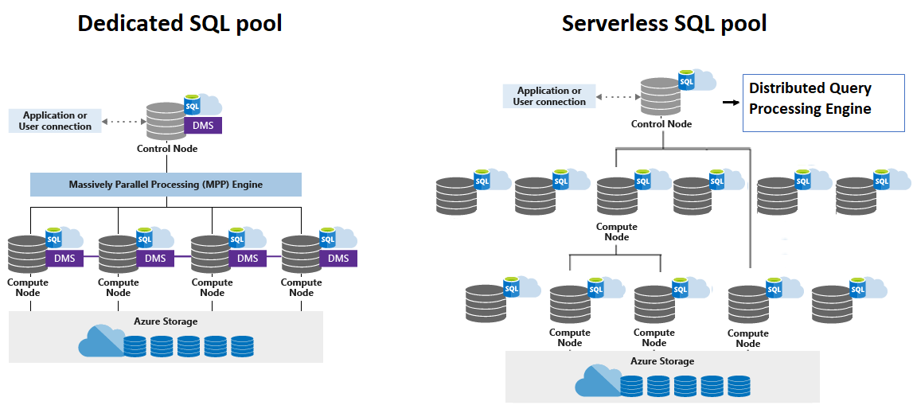

# CS498- Week 10

#cloud_computing

## Data Cube

### Introduction to Cloud Analytics

- Data Analytics
	- Business Intelligence (BI)
		- Set of technologies and processes that use data to understand and analyze business performance
	- Data Analytics
		- Science of examining data to draw conclusions
		- Subset of BI
	- Analytics is the discovery, interpretation and communication of meaningful patterns in data
		- Extensive use of data, statistical and quantitative analysis, explanatory and predictive models & fact based management to drive decisions
- Advanced Analytics
	- **Business Intelligence**
		- *"Dark matter"* of analytics- the necessary, but relatively simple questions that needs to be answered frequently
			- e.g. current inventory, number of customers, incoming/ outgoing payments, average number of purchases per customer
		- Presented via dashboards, simple data plots and reports
	- **Advanced Analytics**
		- Complex statistical techniques and machine learning generate predictions & identify key performance indicators
		- Models of *future* consumer behavior based on *past* data
			- e.g. fraud detection, recommender systems
- OLTP vs. OLAP
	- OLTP (Online Transaction Processing System)
		- Typically involves most or all of the columns in a row for a small number of records
		- Using a database to *run* your business
		- RDBMS
			- Structured Data
			- SQL
			- Each query returns a small number of records
	- OLAP (Online Analytical Processing System)
		- Reading only a few columns for a large number of rows
		- Using a database to *understand* your business
		- Data Warehouse
			- Structured Data
			- SQL
			- Each query covers many or all the records
				- Typical query involves only one column
	- Different access patterns

### Data Cube

- Data Cube Origins
	- OLAP cube was further enhanced from the following concept:
		- "Take multi- dimensional data and put it into a 2- dimensional array (list of lists)"
	- Data cubes are considered a data structure
		- Nested array
		- Compression schemes
		- Data aggregation techniques are used when the cube outstrips the host's memory
	- "What if you have a large dataset and want to run queries?"
		- Real technological constraints lead to the creation of the OLAP cube
		- Cache subsets of data within the nested array
			- Occasionally persist parts of the nested array to disk
	- Today, OLAP cubes refer specifically to contexts in which data structures far outstrip the size of the hosting computer's main memory
		- e.g. multi- terabyte datasets, time series of image data
- Data Cube Schemas
	- OLAP cubes require data teams to manage complicated pipelines to transform data from a SQL database into cubes
		- Such transformation tasks could take a long time to complete, so a common practice is to run all ETL (extract- transform- load) pipelines before starting analytical work
	- Using OLAP cubes in this manner also meant that SQL databases and data warehouses had to be organized in a way that made for easier cube creation
- Data Cube Dimensional Modeling
	- Early practitioners observed that certain access patterns occurred in every business
	- Repeatable methods were developed to turn business reporting requirements into data warehouse designs
		- Designs that allow teams to extract the data they need in the format that they need for their own OLAP cubes
	- If you became a data analyst in the previous two decades, you had to "model" your data according to these best practices:
		- Kimball Dimensional Modeling
		- Inmon- Style Entity Relationship Modeling
		- Data Vault Modeling
	- Methods for organizing data in the data warehouse to match the business' analytical requirements
- Data Cube Operations
	- Slicing
		- Act of picking a rectangular subset of a cube by choosing a single value for one of its dimensions, creating a new cube with one fewer dimension
	- Dicing
		- Produces a sub- cube by allowing the analyst to pick specific values of multiple dimensions
	- Drill Up/ Down
		- Allows the user to navigate among levels of data ranging from the most summarized (up) to the most detailed (down)
	- Roll Up
		- Involves summarizing the data along a dimension
	- Pivot
		- Allows an analyst to rotate the cube in space to see its faces

### Rise & Fall of the Data Cube

- Data Cube vs. Columnar RDBMS
	- OLAP cubes are traditionally known for extreme performance advantages over row- oriented RDBMS
		- These advantages are less important with recent advances in computers and columnar storage
	- OLAP cubes demand that you load a subset of the dimensions you're interested in into the cube
	- Columnar databases allow performing similar OLAP- type workloads at equally good performance levels without the requirement to extract and build new cubes
	- OLAP cubes typically offer richer analysis capabilities than RDBMS, which are still limited by the constraints of SQL
		- This is the main justification that data cubes are still relevant to this day
- Current State
	- Small companies are less likely to consider data cube oriented tools or workloads
		- Strict dimensional modeling has become less important over time
	- Large companies (e.g. Google, Facebook, Amazon) have chosen columnar storage
		- e.g. Big Query, Redshift
	- One of the biggest shifts in data analytics over the past decade (2010 ~ 2020) is the move away from building data cubes to running OLAP workloads directly onto columnar databases
- Data Cubes in the Future
	- OLAP cubes are being pushed upmarket, indicating a possibility that they may return in the future
	- Example
		- Apache Kylin
		- Contributed by eBay in 2015
		- Data cubes built on Hadoop and Spark
		- Utilizes HBase as storage
		- Query billions of rows at sub- second latency
			- Identify a star/ snowflake schema on Hadoop
			- Build cube from identified tables
			- Query using ANSI- SQL & get results in sub- second via ODBC, JDBC or RESTful API
	- Other Examples
		- Druid, Apache Pinot (LinkedIn)
		- Uber is currently building a solution on Pinot & Presto

## Columnar Storage & Modern Data Warehouse

### Columnar Storage

- History
	- Column Stores
		- Column- Oriented Systems
		- Column- Stores
		- Columnar Storage
	- Examples
		- MonetDB
		- VectorWise --> Ingres VectorWise --> Actian Vector
		- C- Store --> Vertica
		- SybaseIQ
- Columnar Storage
	- Traditionally, databases stored records in rows, similar to how a spreadsheet is structured
		- e.g. customer information, retail transaction
	- Retrieving data the traditional way required the system to read the entire row to get a single element
	- With columnar storage, each data element of a record is stored in a *column*
		- User can query just one data element (e.g. gym members who have paid their dues), without having to read everything else in that entire record (e.g. member's ID number, name, age, address, city, state, payment information)
			- Reading the same number of column field values for the same number of row requires only a fraction of the I/O operations
			- Uses a fraction of the memory required for processing row- wise blocks
			- Example
				- Table with 100 columns
				- Query that uses 5 columns will only need to read about 5% of the data contained within the table itself
	- Column- oriented stores are a good fit for analytical workloads that compute aggregates (e.g. finding trends, computing average values)
		- **Read- Optimized**
	- Processing complex aggregates for when records have multiple fields, but some of them have different importance and are often consumed together
	- Column- oriented databases should not be confused with wide column stores such as BigTable or HBase
		- Data is represented as a multidimensional map
		- Columns are grouped into column families (usually storing data of the same type)
		- Inside each column family, data is stored row- wise
		- Layout is best for storing data retrieved by a key or a sequence of keys
- Hardware Optimization: Cache & SIMD
	- **Disk Access Pattern**
		- One SSD page is 4 KB ~ 8 KB
		- Row- Store
			- When reading a page, a small number of similar column fields from different rows are loaded
		- Column Store
			- All the read pages are relevant column fields
	- Reading multiple values for the same column in one run significantly improves cache utilization and computation efficiency
	- On modern CPUs, vectorized instructions (SIMD) can be used to process multiple data points with a single CPU instruction
- Hardware Optimization: Compression
	- Storing values that have the same data type together (e.g. numbers with other numbers, strings with other strings) offers a better compression ratio
		- Lower information entropy results in higher compression
		- Can use different compression algorithms depending on the data type and pick the most effective compression method for each case
	- Compression can be automatically done by the engine
		- Columns can shrink or grow independently
- Updates in Columnar Stores
	- Update performance in a columnar database is poor
		- Going to every column  in order to update one "row" is computationally wasteful
	- Many modern columnar databases limit the ability to update data after it is stored
		- Example
			- Paper on Google Dremel explains the system as append- only structure
			- No longer a limit of BigQuery
			- Performance may be a bit slow
		- Example
			- Redshift
			- Each block is 1 MB and are immutable
			- Clone blocks on write so as to avoid fragmentation
			- Small writes (1 ~ 10 rows) have similar cost to larger writes (~ 100k+ rows)
- Metadata
	- To reconstruct data tuples (which might be useful for joins, filtering and multirow aggregates), we need to preserve some metadata on the column level to identify which data points from other columns it is associated with
	- Example
		- AWS Redshift storage nodes have 2 ~ 3 times more storage attached than advertised, which are used internally for metadata
- Column Store File Format
	- During the last few years, likely due to a rise in demand to run complex analytical queries over growing datasets, we've seen new column- oriented file formats
	- Example (File Formats)
		- Apache Parquet, Apache ORC, RCFile
			- Parquet
				- Open source file format for Hadoop
				- Used in Hive, Pig, Impala, Spark
				- Parquet stores nested data structures in a flat columnar format
			- ORC (Optimized Row Columnar) Format
	- Example (Column Oriented Stores)
		- Apache Kudu, ClickHouse

### The Modern Data Warehouse

- Modern Data Warehouse Architecture
	- **Cloud**
		- Access to near- infinite, low- cost storage
		- Improved scalability
		- Outsourcing of data warehousing management & security to the cloud vendor
		- Pay per use
	- **Massively Parallel Processing (MPP)**
		- Dividing computing operations to execute simultaneously across many separate computer processors, similar to sharding
	- **Columnar Storage**
	- **Vectorized Processing**
- Columnar- Based Data Warehouses
	- Column Store, MPP, Cloud
	- MariaDB with InfiniDB
		- Row based regular engine for OLTP: InnoDB
	- PostgreSQL
		- Citrus `cstore_fdw`
	- Google BigQuery
		- Based on Google Dremel, a paper published in 2010
	- AWS Redshift
		- Based on an older version of PostgreSQL
			- PostgreSQL 8.0.2
			- Originally developed by ParAccel
			- Some PostgreSQL features that are suited to smaller scale OLTP processing (e.g. secondary indexes, efficient single- row data manipulation operations) have been omitted to improve performance
- Redshift Architecture
	- 
- Microsoft Azure Synapse
	- 
	- Azure Synapse Analytics
		- Formerly known as Azure SQL Data Warehouse
		- SQL Analytics
			- Complete T- SQL based analytics
			- SQL pool (pay per DWU provisioned)
			- SQL on- demand (pay per TB processed)
		- Spark
			- Integrated with Apache Spark
		- Integration with Power BI

## Data Lake

### Data Lakes

- Data Lake
	- Data warehouses cannot accommodate unstructured big data projects
		- Petabytes of data in structured, semi- structured and unstructured forms
		- Semi- structured and unstructured data
			- e.g. JSON, XML, log files, natural language, images, video
			- Sources include social media sites, mobile phones, Internet of Things (IoT) devices, shared data sets
		- Structured data is typically collected from enterprise applications
	- Data Lake
		- New type of data repository for storing massive amounts of *raw* data in its *native* form, in a single location
		- "A large body of water, into which new water streams from many channels & from which samples are taken and analyzed"
		- Solution to a growing problem
			- Need for a scalable, low- cost data repository that allows organization to easily store all data types and analyze that data to make evidence- based business decisions
	- Early forms of data lakes were deployed on premises, most using open source tools from the Apache Hadoop ecosystem
	- Modern data lakes combine the power of analytics with the flexibility of big data models, the agility and limitless resources of the cloud
- Components of a Modern Data Lake
	- **Object Storage** (Stores all data types)
		- Big Data: Azure Data Lake Storage
	- **Move Data**
		- AWS Data Pipeline
		- Azure Data Factory
	- **Data Lake Schema Discovery** (Fully managed service that serves as a system of registration and discovery for enterprise data sources)
		- AWS Glue
		- Azure Data Catalog
	- **SQL Exploration & Query**
		- Apache Presto
		- AWS Athena
	- **Lake Formation**
		- AWS Lake Formation
		- Azure Data Share
- Discovery
	- Data Lake Discovery Services
	- Data Crawler
	- Metadata Extraction --> Schema --> Catalog
	- ETL Workloads
	- Apache Atlas
	- AWS Glue
		- Serverless
		- Data Sources
			- Amazon Redshift
			- Amazon S3
			- Amazon RDS
			- Amazon DynamoDB
		- AWS Glue Data Catalog
			- Craws all data sources, identifies data formats & suggests schemas and transformations
		- AWS Glue ETL
			- AWS Glue provides a number of built- in preload transformations that let ETL jobs modify data to match the target schema
			- Automatically generates code to execute data transformations and loading processes for more complex, custom ETL transformations
		- ETL jobs on a fully managed, scale- out Apache Spark environment
	- AWS Data Pipeline
		- Focuses on data transfer
	- Azure Data Catalog
		- Discovery
	- Azure Data Factory
		- ETL
	- Google Cloud Data Catalog
		- Data Flow
- Data Lake Exploration & Query
	- Directly run SQL queries on the data lake
	- No need to setup intermediary databases or data warehouses
	- Apache Presto
		- In- memory distributed SQL query engine
		- Optimized for star schema joins
			- 1 large fact table with many smaller dimension tables
		- Interactive version of Hive that's been enhanced
	- AWS Athena
		- Managed version of serverless Presto
	- Azure Data Lake Analytics
	- Apache Spark SQL
		- IBM Cloud SQL Query
- Cloud- Based Data Lake Automation
	- Automated tools to orchestrate the data transfer, discovery, ETL and analytics steps
	- AWS Lake Formation
		- Glue
		- Athena
		- Redshift Spectrum
		- EMR (Elastic Map Reduce)
			- Apache Zeppelin
			- EMR Notebooks
	- Azure Data Share

## Other Cloud Analytics

### Other Cloud Analytics Services

- Serverless Analytics
	- Azure Analysis Services
		- Built on SQL Server Analysis Services 
		- Tabular models only
		- Partitions, perspectives, row- level security, bi- directional relationships and translations
	- AWS Redshift Spectrum
	- AWS Athena
- Search- Based Analytics
	- Full Text Search
	- Search Analytics
	- ELK Stack
		- ElasticSearch
		- Logstash
		- Kibana 
	- Search
		- AWS CloudSearch
			- Based on Apache Solr's search engine
				- Solr uses MapReduce
				- Hadoop was created from Solr
		- Azure Cognitive Search
- Big Data Analytics
	- Open Source
		- Managed Hadoop, Spark, Hive
			- AWS EMR
			- Azure HDInsight
				- Hadoop, Spark, Kafka, HBase, Storm
			- Azure Databricks
	- Streaming Analytics
		- AWS
			- Kinesis (Data Analytics)
			- Amazon Managed Streaming for Apache Kafka (Amazon MSK)
- Graphical BI Tools
	- Visualization
		- Tableau
		- AWS QuickSight
		- Azure Power BI (Microsoft)