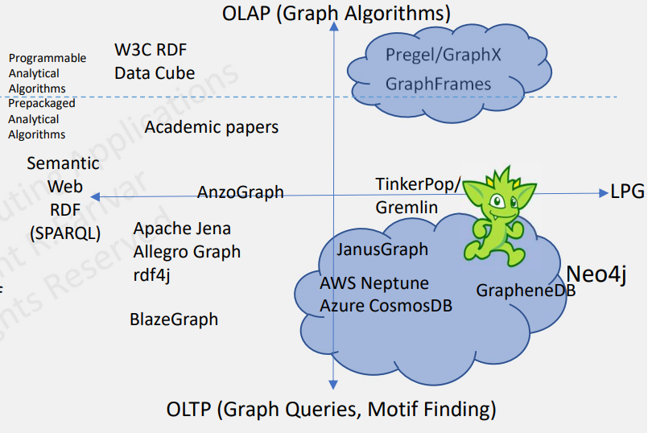

# CS498- Week 11

#cloud_computing

## Graph Databases

### Introduction to Graph Database

- Graph Model
	- Relationships (e.g. `BELONGS TO`) between nodes (e.g. Alice, `A42`) with labels (e.g. `Person`, `Department`)
- Relational Databases
	- 
	- Databases
		- `Persons` (3 FKA from `Dept_Members`)
		- `Dept_Members`
		- `Department` (3 FKA from `Dept_Members`)
	- *Related* to each other via foreign keys and **joins**
- Graph Databases
	- 
	- *Joins* are not a "natural" way of connecting databases from a human perspective, so we need a way for databases to *connect* to one another without having to select the entire database and using foreign keys
- Graph and Relational Databases
	- Relational Database
		- Performs same operations on large numbers of data elements
		- Uses relational model of data
		- Entity type has its own table
			- Rows are instances of the entity
			- Columns represent values attributed to that instance
		- Rows in one table can be *related* to rows in another table via unique key per row
	- Graph Database
		- Associative data sets
		- Structure of object- oriented applications
		- Does not require join operators
- Popularity Trend of Databases
	- Gartner Hype Cycle
- Graph Databases
	- Database with an **explicit** graph structure
		- Each node knows its adjacent nodes
		- As the number of nodes increases, **the cost of a local step (or hop) remains the same**
		- `+` an index for lookups (small & manageable)
	- Can be faster than relational databases, particularly for graph type queries
		- e.g. Who is a friend of a friend?
	- Scales well
	- Does not require joins
	- Less rigid schema permits easier evolution

### Scale of Graph Problems

- Graphs: Overview
	- Graph Data Structure
	- Relations between vertices (nodes) and edges
		- Properties
			- Pertinent information that relate to nodes or edges
	- Nodes represent entities 
		- e.g. people, businesses, accounts
	- Edges interconnect nodes to nodes or nodes to properties and they represent the relationship between the two
	- Many domains are a natural fit for graph data structure
- Scale of Real- World Graphs
	- Web Scale
		- ~ 2 billion vertices (websites), ~ 20 billion edges
			- ~ 10% active
			- Webpages estimated at ~ 60 billion
		- 200 GB adjacency list
	- Social Scale
		- 1 billion vertices, 100 billion edges
		- 2.92 TB adjacency lit
	- Web Scale
		- 50 billion vertices, 1 trillion edges
		- 29.5 TB adjacency list
	- Brain Scale
		- 100 billion vertices, 100 trillion edges
		- 2.84 PB adjacency list

### Graph Databases- Categories

- Graph Databases for Transaction Processing
	- OLTP- based graph systems allow the user to query the graph in real- time
		- e.g. "What type of cereal does Alice buy?"
	- Typically, real- time performance is only possible when a local traversal is enacted
		- Local traversal is one that starts at a particularly vertex (or any small set of vertices) and touches a small set of connected vertices (by any arbitrary path of arbitrary length)
		- OLTP queries interact with a limited set of data and respond on the order of milliseconds or seconds
	- Neo4j
		- Cypher language
			- Graph pattern- match query language 
		- Graph database management system 
	- TinkerPop & Gremlin (OLTP & OLAP)
	- Amazon Neptune
	- Azure CosmosDB
- Graph Analytical Processing Systems
	- With OLAP graph processing, the entire graph is processed
		- e.g. "What is the average price for cereal paid by people like Alice?"
		- Every vertex and edge is analyzed
			- Possible more than once for iterative, recursive algorithms
			- Standard or custom algorithms
		- Results are typically **not** real- time
			- Can take on the order of minutes or hours for large graphs
	- Bulk Synchronous Parallel (BSP) programming model
		- Pregel --> Giraph --> Spark GraphX --> GraphFrames
		- Gremlin `VertexProgram()`
- Four Graph Communities
	- 
	- Famous, yet somewhat disconnected graph communities
		- Semantic Web
			- RDF Data Model
			- SPARQL Query Language
				- Declarative
		- Graph Database (OLTP)
			- Labeled Property Graph Data Model
				- Data is organized as nodes, relationships and properties (data stored on the nodes or relationships)
			- Pattern Matching Graph Traversal/ Motif Finding
				- Imperative: Gremlin
				- Declarative: Cypher
		- Big Data Graph Processing (OLAP)

### Graph Databases- OLTP

- Neo4j
	- Neo4j is an open source, NoSQL, native graph database that provides an ACID- compliant transactional backend
	- Cypher, a declarative query language similar to SQL but optimized for graphs
	- Morpheus, which is Cypher for Apache Spark
- Cypher
	- Nodes are surround by `()` or `{p}`
	- Labels start with `:` and group the nodes by roles or types
		- e.g. `(p:Person:Mammal)`
	- Nodes can have properties
		- e.g. `(p:Person {name: 'Jim'})`
	- Relationships (edges) are wrapped with square brackets and can have properties
		- e.g. `-->` or `-[h:HIRED]->`
	- Direction of relationship specified by `<` or `>`
	- Example
		- `MATCH`
			- `(person:Person)-[:KNOWS]-(friend:Person)-[:KNOWS]-(foaf:Person)`
		- `WHERE`
			- `person.name = "Joe"`
			- `AND NOT (person)-[:KNOWS]-(foaf)`
		- `RETURN`
			- `foaf`
	- OpenCypher is widely used
		- Neo4j, SAP, HANA, AnzoGraph, Cypher for Apache Spark (CAPS), Redisgraph, Cypher for Gremlin
- TinkerPop & Gremlin
	- Supports **both** OLTP queries and OLAP algorithms
	- TinkerPop3 components, altogether known as Gremlin
		- Blueprints
			- Gremlin Structure API
		- Pipes
			- GraphTraversal
		- Frames
			- Traversal
		- Furnace
			- GraphComputer & VertexProgram
		- Rexster
			- GremlinServer
	- A *traversal* in Gremlin is a series of chained steps
		- Starts at a vertex (or edge)
		- Walks the graph by following the outgoing edges of each vertex and then the outgoing edges of those vertices
	- BSP type graph algorithms, similar to Pregel, via `VertexProgram()`
		- Executed at each vertex in a logically parallel manner until some termination condition is met (e.g. a number of iterations have occurred, no more data is changing in the graph)
		- Vertices are able to communicate with one another via messages
			- `MessageScope.Local`
			- `MessageScope.Global`
	- At the core of TinkerPop3 is the Java8 API
		- Implementation of this core API is all that is required of a vendor wishing to provide a TinkerPop3- enabled graph engine
	- Gremlin is widely used
		- Amazon Neptune, Azure CosmosDB, DataStax, JanusGraph, OrientDB
- GraphSON
	- Gremlin standard format for representing vertices, edges and properties (single & multi- valued) using JSON
	- Example
		- Vertex Representation
		- 
- Gremlin Graph Traversal Language (Imperative)
	- **Functional Language**
	- Traversal operators are chained together to form path- like expressions
	- Example
		- "From Hercules, traverse to his father and then his father's father and return the grandfather's name"
			- 
	- Example
		- "Find all relationships from a given actor/ actress to John Doe (6 degrees)"
			- 
- Gremlin Declarative vs. Imperative Traversal
	- 
	- "What are the names of projects created by two friends?"
		- Tasks
			- "... there exists some `a` who knows `b`"
			- "... there exists some `a` who created `c`"
			- "... there exists some `b` who created `c"
			- "... there exists some `c` created by 2 people"
			- "Get the name of all matching `c` projects"
		- Process
			- Places a traverser at the vertex denoting Gremlin
			- That traverse then splits itself across all of Gremlin's collaborators that are not Gremlin himself
			- Traversers walk to the managers of those collaborators to ultimately be grouped into a manager name count distribution
- Cypher vs. Gremlin
	- Gremlin
		- **Both** imperative and declarative
		- At its core, Gremlin is a Groovy wrapper over underlying Java functions
		- In the imperative model, there is less room for abstraction, optimization and remoting since you are effectively sending Groovy or Java code over the wire
		- You *can* write declarative statements
	- Cypher
		- Declarative, non- Turing complete language (prevents infinite loops)
		- Similar to SPARQL and SQL
			- Declarative, higher order description of **WHAT** you want, not **HOW** you want your results to be found
			- Well suited for remoting, standardization and optimization
		- There is now a feature on Cypher to run on Gremlin
- AWS Neptune
	- OLTP
		- Property Graph + TinkerPop Gremlin
		- RDF + SPARQL
		- Each Neptune instance provides both a Gremlin WebSocket server and a SPARQL 1.1. Protocol REST endpoint
	- Highly available, with read replicas, point- in- time recovery, continuous backup to Amazon S3 and replication across AZ's
		- Replicates 6 copies of the data across 3 AZ's
		- Instance failover typically takes less than 30 seconds
	- ACID compliant
	- HTTPS encrypted client connections and encryption at rest
	- Fully managed
- Azure CosmosDB
	- Gremlin API for queries
	- Supports *horizontally* scalable graph databases
		- Graph partitioning
			- Vertices require a partition key
			- Edges will be stored with their source vertex
			- Edges contain references to the vertices that they point to
			- Graph queries need to specify a partition key
				- `g.V("vertex_id").has("partitionKey", "partitionKey_value")`
	- Returns the results in GraphSON format

### Graph Databases- Semantic Web

- Semantic Web
	- Links explicit "data" on the world wide web in a machine readable format
		- Target semantic search
		- Automated agents
		- Fraud detection
	- Technologies
		- Data Model
			- RDF, RDF*
			- Collection of triplets
			- RDF is the model, syntaxes may vary: 
				- RDF/XML
				- Turtle (Terse RDF Language)
					- `Subject --> Predicate --> Object`
				- JSON-LD
		- Query Language
			- SPARQL
			- GQL
		- Ontology Language
			- OWL
				- `<http://example.org/tea.owl> rdf:type owl:Ontology:Tea rdf:type owl:Class`
- SPARQL
	- `PREFIX`
		- `foaf: http://xmlns.com/foaf/0.1/`
	- `SELECT`
		- `?name`
		- `?email`
	- `WHERE`
		- `{`
			- `?person    a          foaf:Person`
			- `?person    foaf:name       ?name`
			- `?person    foaf:mbox     ?email`
		- `}`
- Graph Query Languages
	- RDF
		- SPARQL --> Query
	- Property Graph
		- Cypher --> Query
			- Neo4j
			- Supported by SAP HANA
		- Gremlin --> Traversal
			- Apache TinkerPop
				- DataStax
		- Apache Spark GraphFrames `.find()` --> Query
		- GQL --> Query
			- Rooted in Cypher and Oracle's PGQL
			- Voted as the new standard in 2019
	- Competition for the best graph query language is still fierce

### Graph Databases- Apache Spark GraphFrames

- Spark GraphFrames
	- Spark 1.3+ moves away from RDD and more towards DataFrames
		- DataFrames is more user friendly and simpler
		- GraphX uses lower- level RDD- based API (vs. DataFrames)
	- Simplified API
		- Python Interface
		- DataFrames
			- Which benefits from optimizations made by DataFrames
	- Supports motif finding for structural pattern searches
	- Easier to do optimization under the hood
- Comparison of Spark GraphX and GraphFrames
	- 
- GraphX Compatibility
	- Easy to convert between GraphX and GraphFrame
		- GraphFrame `-->` GraphX
			- `val g: GraphFrame = ...`
			- `val gx: Graph[Row, Row] = g.toGraphX`
		- GraphX `-->` GraphFrame
			- `val g2: GraphFrame = GraphFrame.fromGraphX(gx)`
- Graph Construction
	- To construct GraphFrames, you need **two** DataFrames
		- Vertices (`v`)
			- 1 vertex per row
			- `id`: column with unique id
		- Edges (`e`)
			- 1 edge per row
			- `src`, `dst` columns using ids from vertices.id
		- `val g = GraphFrame(v, e)`
	- Any Spark method to save and load DataFrames can be used
		- `vertices = sqlContext.read.parquet(...)`
		- `vertices.write.parquet(...)`
- Graph Algorithms
	- Finding important vertices
		- PageRank
			- Mostly wrappers around Spark GraphX algorithms
			- `g.pageRank(resetProbability = .15, tol = .01)`
			- `g.pageRank(resetProbability = .15, maxIter = 10)`
	- Finding paths between sets of vertices
		- Breadth- First Search (BFS)
			- Some algorithms are implemented using DataFrames
			- `paths = g.bfs("name = 'Esther'", "age < 32")`
		- Shortest Path
			- `g.shortestPaths(landmarks = ["a", "d"])`
	- Find *groups* of vertices (components, communities)
		- Connected components
		- Strongly connected components
		- Label Propagation Algorithm (LPA)
	- Other
		- Triangle Counting
		- SVDPlusPlus
	- Pregel
- Simple Queries
	- SQL queries on vertices & edges
		- e.g. "What trips are most likely to have significant delays?"
			- `Display(tripGraph.edges.groupBy("src", "dst).avg("delay").sort(desc("avg(delay)")))`
	- Graph Queries
		- Degrees of Vertex
			- Number of edges per vertex (incoming, outgoing, total)
- Motif Finding
	- Search for structural patterns within a graph
		- `motifs = g.find(`
			- `"(a)-[e1]->(b);`
			- `(b)-[e2]->(c);`
			- `!(c)-[]->(a)")`
		- `motifs.filter("e1.delay > 20 and b.id = 'SFO'")`
	- GraphFrames `find()` Syntax
		- `motifs = g.find("(a)-[e]->(b); (b)-[e2]->(a)")`
		- `motifs.filter("b.age > 30").show()`
	- `filter`
		- `g1 = g.filterVertices("age > 30").filterEdges("relationship = 'friend'")`
- Implementing Algorithms
	- Method 1
		- DataFrame & GraphFrame Operations
			- Motif Finding
				- Series of DataFrame joins
			- use other pre- packaged algorithms
	- Method 2
		- Message Passing
			- Send messages between vertices and aggregate messages for each vertex
	- Method 3
		- Pregel
- GraphFrames Aggregate Messages
	- Send messages between vertices and aggregate messages for each vertex
	- `aggregateMessages()`
		- Similar to GraphX
		- Specify messages and aggregation using DataFrame expressions
	- Joins
		- Join message aggregates with the original graph
		- GraphFrames rely on DataFrame joins
	- Example
		- 
- Pregel in GraphFrames
	- When a run starts, it expands the vertices DataFrame using column expressions defined by `[[withVertexColumn]]`
	- Example (PageRank)
		- 
			- Note that the first arrow is pointing at the creation of a column of `literal` value
			- Note that the second arrow is pointing at the return of the first column that is not null

### Spark GraphX

- X

## Graph Processing

### Graph Processing

- X

### Pregel (Part 1)

- X

### Pregel (Part 2)

- X

### Pregel (Part 3)

- X

### Introduction to Giraph 

- X

### Giraph Example

- X

## Machine Learning in the Cloud

### Introduction to Big Data Machine Learning

- X

### Cloud Machine Learning Workflow

- X

### Cloud Machine Learning Offerings

- X

### Human in the Loop AI Cloud Offerings

- X

### Unstructured Machine Learning & AI in the Clouds

- X

## Big Data Machine Learning Algorithms (Apache Spark)

### Spark: ML/ MLLib

- X

### Spark: Naive Bayes

- X

### Spark: fpm

- X

