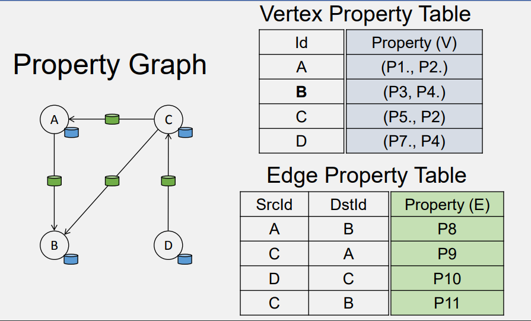
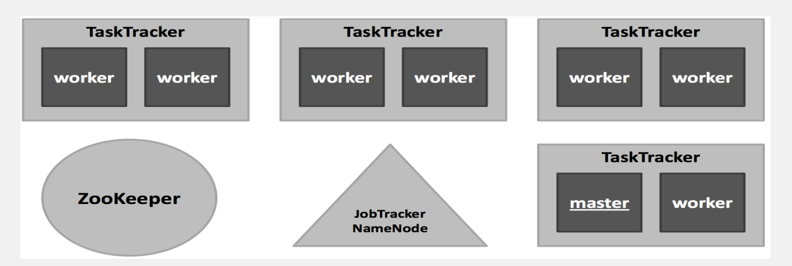

# CS498- Week 11

#cloud_computing

## Graph Databases

### Introduction to Graph Database

- Graph Model
	- Relationships (e.g. `BELONGS TO`) between nodes (e.g. Alice, `A42`) with labels (e.g. `Person`, `Department`)
- Relational Databases
	- 
	- Databases
		- `Persons` (3 FKA from `Dept_Members`)
		- `Dept_Members`
		- `Department` (3 FKA from `Dept_Members`)
	- *Related* to each other via foreign keys and **joins**
- Graph Databases
	- 
	- *Joins* are not a "natural" way of connecting databases from a human perspective, so we need a way for databases to *connect* to one another without having to select the entire database and using foreign keys
- Graph and Relational Databases
	- Relational Database
		- Performs same operations on large numbers of data elements
		- Uses relational model of data
		- Entity type has its own table
			- Rows are instances of the entity
			- Columns represent values attributed to that instance
		- Rows in one table can be *related* to rows in another table via unique key per row
	- Graph Database
		- Associative data sets
		- Structure of object- oriented applications
		- Does not require join operators
- Popularity Trend of Databases
	- Gartner Hype Cycle
- Graph Databases
	- Database with an **explicit** graph structure
		- Each node knows its adjacent nodes
		- As the number of nodes increases, **the cost of a local step (or hop) remains the same**
		- `+` an index for lookups (small & manageable)
	- Can be faster than relational databases, particularly for graph type queries
		- e.g. Who is a friend of a friend?
	- Scales well
	- Does not require joins
	- Less rigid schema permits easier evolution

### Scale of Graph Problems

- Graphs: Overview
	- Graph Data Structure
	- Relations between vertices (nodes) and edges
		- Properties
			- Pertinent information that relate to nodes or edges
	- Nodes represent entities 
		- e.g. people, businesses, accounts
	- Edges interconnect nodes to nodes or nodes to properties and they represent the relationship between the two
	- Many domains are a natural fit for graph data structure
- Scale of Real- World Graphs
	- Web Scale
		- ~ 2 billion vertices (websites), ~ 20 billion edges
			- ~ 10% active
			- Webpages estimated at ~ 60 billion
		- 200 GB adjacency list
	- Social Scale
		- 1 billion vertices, 100 billion edges
		- 2.92 TB adjacency lit
	- Web Scale
		- 50 billion vertices, 1 trillion edges
		- 29.5 TB adjacency list
	- Brain Scale
		- 100 billion vertices, 100 trillion edges
		- 2.84 PB adjacency list

### Graph Databases- Categories

- Graph Databases for Transaction Processing
	- OLTP- based graph systems allow the user to query the graph in real- time
		- e.g. "What type of cereal does Alice buy?"
	- Typically, real- time performance is only possible when a local traversal is enacted
		- Local traversal is one that starts at a particularly vertex (or any small set of vertices) and touches a small set of connected vertices (by any arbitrary path of arbitrary length)
		- OLTP queries interact with a limited set of data and respond on the order of milliseconds or seconds
	- Neo4j
		- Cypher language
			- Graph pattern- match query language 
		- Graph database management system 
	- TinkerPop & Gremlin (OLTP & OLAP)
	- Amazon Neptune
	- Azure CosmosDB
- Graph Analytical Processing Systems
	- With OLAP graph processing, the entire graph is processed
		- e.g. "What is the average price for cereal paid by people like Alice?"
		- Every vertex and edge is analyzed
			- Possible more than once for iterative, recursive algorithms
			- Standard or custom algorithms
		- Results are typically **not** real- time
			- Can take on the order of minutes or hours for large graphs
	- Bulk Synchronous Parallel (BSP) programming model
		- Pregel --> Giraph --> Spark GraphX --> GraphFrames
		- Gremlin `VertexProgram()`
- Four Graph Communities
	- 
	- Famous, yet somewhat disconnected graph communities
		- Semantic Web
			- RDF Data Model
			- SPARQL Query Language
				- Declarative
		- Graph Database (OLTP)
			- Labeled Property Graph Data Model
				- Data is organized as nodes, relationships and properties (data stored on the nodes or relationships)
			- Pattern Matching Graph Traversal/ Motif Finding
				- Imperative: Gremlin
				- Declarative: Cypher
		- Big Data Graph Processing (OLAP)

### Graph Databases- OLTP

- Neo4j
	- Neo4j is an open source, NoSQL, native graph database that provides an ACID- compliant transactional backend
	- Cypher, a declarative query language similar to SQL but optimized for graphs
	- Morpheus, which is Cypher for Apache Spark
- Cypher
	- Nodes are surround by `()` or `{p}`
	- Labels start with `:` and group the nodes by roles or types
		- e.g. `(p:Person:Mammal)`
	- Nodes can have properties
		- e.g. `(p:Person {name: 'Jim'})`
	- Relationships (edges) are wrapped with square brackets and can have properties
		- e.g. `-->` or `-[h:HIRED]->`
	- Direction of relationship specified by `<` or `>`
	- Example
		- `MATCH`
			- `(person:Person)-[:KNOWS]-(friend:Person)-[:KNOWS]-(foaf:Person)`
		- `WHERE`
			- `person.name = "Joe"`
			- `AND NOT (person)-[:KNOWS]-(foaf)`
		- `RETURN`
			- `foaf`
	- OpenCypher is widely used
		- Neo4j, SAP, HANA, AnzoGraph, Cypher for Apache Spark (CAPS), Redisgraph, Cypher for Gremlin
- TinkerPop & Gremlin
	- Supports **both** OLTP queries and OLAP algorithms
	- TinkerPop3 components, altogether known as Gremlin
		- Blueprints
			- Gremlin Structure API
		- Pipes
			- GraphTraversal
		- Frames
			- Traversal
		- Furnace
			- GraphComputer & VertexProgram
		- Rexster
			- GremlinServer
	- A *traversal* in Gremlin is a series of chained steps
		- Starts at a vertex (or edge)
		- Walks the graph by following the outgoing edges of each vertex and then the outgoing edges of those vertices
	- BSP type graph algorithms, similar to Pregel, via `VertexProgram()`
		- Executed at each vertex in a logically parallel manner until some termination condition is met (e.g. a number of iterations have occurred, no more data is changing in the graph)
		- Vertices are able to communicate with one another via messages
			- `MessageScope.Local`
			- `MessageScope.Global`
	- At the core of TinkerPop3 is the Java8 API
		- Implementation of this core API is all that is required of a vendor wishing to provide a TinkerPop3- enabled graph engine
	- Gremlin is widely used
		- Amazon Neptune, Azure CosmosDB, DataStax, JanusGraph, OrientDB
- GraphSON
	- Gremlin standard format for representing vertices, edges and properties (single & multi- valued) using JSON
	- Example
		- Vertex Representation
		- 
- Gremlin Graph Traversal Language (Imperative)
	- **Functional Language**
	- Traversal operators are chained together to form path- like expressions
	- Example
		- "From Hercules, traverse to his father and then his father's father and return the grandfather's name"
			- 
	- Example
		- "Find all relationships from a given actor/ actress to John Doe (6 degrees)"
			- 
- Gremlin Declarative vs. Imperative Traversal
	- 
	- "What are the names of projects created by two friends?"
		- Tasks
			- "... there exists some `a` who knows `b`"
			- "... there exists some `a` who created `c`"
			- "... there exists some `b` who created `c"
			- "... there exists some `c` created by 2 people"
			- "Get the name of all matching `c` projects"
		- Process
			- Places a traverser at the vertex denoting Gremlin
			- That traverse then splits itself across all of Gremlin's collaborators that are not Gremlin himself
			- Traversers walk to the managers of those collaborators to ultimately be grouped into a manager name count distribution
- Cypher vs. Gremlin
	- Gremlin
		- **Both** imperative and declarative
		- At its core, Gremlin is a Groovy wrapper over underlying Java functions
		- In the imperative model, there is less room for abstraction, optimization and remoting since you are effectively sending Groovy or Java code over the wire
		- You *can* write declarative statements
	- Cypher
		- Declarative, non- Turing complete language (prevents infinite loops)
		- Similar to SPARQL and SQL
			- Declarative, higher order description of **WHAT** you want, not **HOW** you want your results to be found
			- Well suited for remoting, standardization and optimization
		- There is now a feature on Cypher to run on Gremlin
- AWS Neptune
	- OLTP
		- Property Graph + TinkerPop Gremlin
		- RDF + SPARQL
		- Each Neptune instance provides both a Gremlin WebSocket server and a SPARQL 1.1. Protocol REST endpoint
	- Highly available, with read replicas, point- in- time recovery, continuous backup to Amazon S3 and replication across AZ's
		- Replicates 6 copies of the data across 3 AZ's
		- Instance failover typically takes less than 30 seconds
	- ACID compliant
	- HTTPS encrypted client connections and encryption at rest
	- Fully managed
- Azure CosmosDB
	- Gremlin API for queries
	- Supports *horizontally* scalable graph databases
		- Graph partitioning
			- Vertices require a partition key
			- Edges will be stored with their source vertex
			- Edges contain references to the vertices that they point to
			- Graph queries need to specify a partition key
				- `g.V("vertex_id").has("partitionKey", "partitionKey_value")`
	- Returns the results in GraphSON format

### Graph Databases- Semantic Web

- Semantic Web
	- Links explicit "data" on the world wide web in a machine readable format
		- Target semantic search
		- Automated agents
		- Fraud detection
	- Technologies
		- Data Model
			- RDF, RDF*
			- Collection of triplets
			- RDF is the model, syntaxes may vary: 
				- RDF/XML
				- Turtle (Terse RDF Language)
					- `Subject --> Predicate --> Object`
				- JSON-LD
		- Query Language
			- SPARQL
			- GQL
		- Ontology Language
			- OWL
				- `<http://example.org/tea.owl> rdf:type owl:Ontology:Tea rdf:type owl:Class`
- SPARQL
	- `PREFIX`
		- `foaf: http://xmlns.com/foaf/0.1/`
	- `SELECT`
		- `?name`
		- `?email`
	- `WHERE`
		- `{`
			- `?person    a          foaf:Person`
			- `?person    foaf:name       ?name`
			- `?person    foaf:mbox     ?email`
		- `}`
- Graph Query Languages
	- RDF
		- SPARQL --> Query
	- Property Graph
		- Cypher --> Query
			- Neo4j
			- Supported by SAP HANA
		- Gremlin --> Traversal
			- Apache TinkerPop
				- DataStax
		- Apache Spark GraphFrames `.find()` --> Query
		- GQL --> Query
			- Rooted in Cypher and Oracle's PGQL
			- Voted as the new standard in 2019
	- Competition for the best graph query language is still fierce

### Graph Databases- Apache Spark GraphFrames

- Spark GraphFrames
	- Spark 1.3+ moves away from RDD and more towards DataFrames
		- DataFrames is more user friendly and simpler
		- GraphX uses lower- level RDD- based API (vs. DataFrames)
	- Simplified API
		- Python Interface
		- DataFrames
			- Which benefits from optimizations made by DataFrames
	- Supports motif finding for structural pattern searches
	- Easier to do optimization under the hood
- Comparison of Spark GraphX and GraphFrames
	- 
- GraphX Compatibility
	- Easy to convert between GraphX and GraphFrame
		- GraphFrame `-->` GraphX
			- `val g: GraphFrame = ...`
			- `val gx: Graph[Row, Row] = g.toGraphX`
		- GraphX `-->` GraphFrame
			- `val g2: GraphFrame = GraphFrame.fromGraphX(gx)`
- Graph Construction
	- To construct GraphFrames, you need **two** DataFrames
		- Vertices (`v`)
			- 1 vertex per row
			- `id`: column with unique id
		- Edges (`e`)
			- 1 edge per row
			- `src`, `dst` columns using ids from vertices.id
		- `val g = GraphFrame(v, e)`
	- Any Spark method to save and load DataFrames can be used
		- `vertices = sqlContext.read.parquet(...)`
		- `vertices.write.parquet(...)`
- Graph Algorithms
	- Finding important vertices
		- PageRank
			- Mostly wrappers around Spark GraphX algorithms
			- `g.pageRank(resetProbability = .15, tol = .01)`
			- `g.pageRank(resetProbability = .15, maxIter = 10)`
	- Finding paths between sets of vertices
		- Breadth- First Search (BFS)
			- Some algorithms are implemented using DataFrames
			- `paths = g.bfs("name = 'Esther'", "age < 32")`
		- Shortest Path
			- `g.shortestPaths(landmarks = ["a", "d"])`
	- Find *groups* of vertices (components, communities)
		- Connected components
		- Strongly connected components
		- Label Propagation Algorithm (LPA)
	- Other
		- Triangle Counting
		- SVDPlusPlus
	- Pregel
- Simple Queries
	- SQL queries on vertices & edges
		- e.g. "What trips are most likely to have significant delays?"
			- `Display(tripGraph.edges.groupBy("src", "dst).avg("delay").sort(desc("avg(delay)")))`
	- Graph Queries
		- Degrees of Vertex
			- Number of edges per vertex (incoming, outgoing, total)
- Motif Finding
	- Search for structural patterns within a graph
		- `motifs = g.find(`
			- `"(a)-[e1]->(b);`
			- `(b)-[e2]->(c);`
			- `!(c)-[]->(a)")`
		- `motifs.filter("e1.delay > 20 and b.id = 'SFO'")`
	- GraphFrames `find()` Syntax
		- `motifs = g.find("(a)-[e]->(b); (b)-[e2]->(a)")`
		- `motifs.filter("b.age > 30").show()`
	- `filter`
		- `g1 = g.filterVertices("age > 30").filterEdges("relationship = 'friend'")`
- Implementing Algorithms
	- Method 1
		- DataFrame & GraphFrame Operations
			- Motif Finding
				- Series of DataFrame joins
			- use other pre- packaged algorithms
	- Method 2
		- Message Passing
			- Send messages between vertices and aggregate messages for each vertex
	- Method 3
		- Pregel
- GraphFrames Aggregate Messages
	- Send messages between vertices and aggregate messages for each vertex
	- `aggregateMessages()`
		- Similar to GraphX
		- Specify messages and aggregation using DataFrame expressions
	- Joins
		- Join message aggregates with the original graph
		- GraphFrames rely on DataFrame joins
	- Example
		- 
- Pregel in GraphFrames
	- When a run starts, it expands the vertices DataFrame using column expressions defined by `[[withVertexColumn]]`
	- Example (PageRank)
		- 
			- Note that the first arrow is pointing at the creation of a column of `literal` value
			- Note that the second arrow is pointing at the return of the first column that is not null

### Spark GraphX

- Graph- Parallel Algorithms
	- Collaborative Filtering
		- Alternating Least Squares
		- Stochastic Gradient Descent
		- Tensor Factorization
	- Structured Prediction
		- Loopy Belief Propagation
		- Max- Product Linear Programs
		- Gibbs Sampling
	- Semi- Supervised ML
		- Graph SSL
		- CoEM
	- Community Detection
		- Triangle Counting
		- K- Core Decomposition
		- K- Truss
	- Graph Analytics
		- PageRank
		- Personalized PageRank
		- Shortest Path
		- Graph Coloring
	- Classification
		- Neural Networks
- View a Graph as a Table
	- 
- Constructing the Graph
	- 
- Graph Operators
	- 

## Graph Processing

### Graph Processing

- Graph Processing
	- Graph database is any storage system that provides *index- free* adjacency
		- Has pointers to adjacent elements
	- Nodes represent entities (e.g. people, businesses, accounts)
	- Properties are pertinent information that relate to nodes
	- Edges interconnect nodes to node or nodes to properties and they represent the relationship between the two
- Graph and Relational Databases (Taken from *Introduction to Graph Database* Lesson)
	- Relational Database
		- Performs same operations on large numbers of data elements
		- Uses relational model of data
		- Entity type has its own table
			- Rows are instances of the entity
			- Columns represent values attributed to that instance
		- Rows in one table can be *related* to rows in another table via unique key per row
	- Graph Database
		- Associative data sets
		- Structure of object- oriented applications
		- Does not require join operators
- Graph
	- 
- Relational Database
	- Table is relation
	- Rows (Tuple)
	- Column (Attribute)
- Graph Computing
	- Think "like" a vertex
	- Basic Operations
		- Fusion
			- *Aggregate* information from neighbors to a set of entities
		- Diffusion
			- *Propagate* information from a vertex to neighbors
- Diffusion
	- 
- Fusion
	- 
- Example: Graph Problem
	- The Problem
		- Return all sets of vertices (triad) with edges `(A, B), (A, C), (C,B)` from a directed graph
	- A Solution
		- Will need specific types of graphs and algorithmic operations to solve this in an efficient manner
- Graph Processing
	- Involve local data (small parts of the graph surrounding a vertex) and the connectivity between vertices is sparse
		- Data may not all fit into one node
		- Makes it difficult to fit always into the map/ reduce model
	- 
- Scale of Graphs in Current MLDM Literature
	- 

### Pregel (Part 1)

- Introduction
	- Infrastructure for graph processing is expensive to design
	- "What about MapReduce?"
		- MapReduce is inefficient because the graph state must be stored at each stage of the graph algorithm and each computational stage will produce much communication between stages
	- Single computer & library approach
		- Not scalable
	- Use existing shared memory parallel graph algorithms approach
		- No fault tolerance
- Vertex- Oriented
	- Based on BSP model
	- Provides directed graph to Pregel
	- Runs your computation at each vertex (processor)
	- Repeats until every computation at each vortex votes to halt
	- Pregel returns the directed graph as a result
- Primitives
	- Vertices- first class
	- Edges- not first class
	- Both vertices can be created **and** destroyed
- Pregel Organized via C++ API
	- Superstep `S`
	- Application code subclasses `Vertex`, writes a `Compute` method
	- Can get/ set `Vertex` value
	- Can get/ set outgoing edges values
	- Can send/ receive messages
	- Reads messages sent to `V` in superstep `S-1`
		- Sends messages to other vertices that will be received at superstep `S+1`
		- Modifies *state* of `V` and its outgoing edges
- C++ API
	- Message passing
	- No guaranteed message delivery order
	- Messages delivered exactly once
	- Can send a message to *any* node
	- If destination doesn't exist, the user's function is called

### Pregel (Part 2)

- Parallel Breadth: First Search for Shortest Path
	- 
		- Accelerated Dijkstra's algorithm to explore all paths and determine the shortest one
			- Propagate values are labelled in red
		- The propagation is done in **parallel**
- Writing a Pregel Program: C++ API
	- Subclassing predefined `Vertex` class
		- 
- Example: Vertex Class for SSSP
	- 

### Pregel (Part 3)

- System Architecture
	- Pregel system uses the **master/ worker** model
		- Master
			- Maintains worker
			- Recovers faults of workers
			- Provides web-UI monitoring tool of job progress
		- Worker
			- Process its task
			- Communicates with the other workers
	- Persistent data is stored as files on a distributed storage system (e.g. GFS, HDFS, BigTable)
	- Temporary data is stored on local disk
- Execution of a Pregel Program
	- Many copies of the program begin executing on a cluster of machines
	- Master assigns a partition of the input to each worker
		- Each worker loads the vertices and marks them as active
	- Master instructs each worker to perform a superstep
		- Each worker loops through its active vertices and computes for each vertex
		- Messages are sent asynchronously, but are delivered before the end of the superstep
		- This step is repeated as long as any vertices are active, or any messages are in transit
	- After the computation halts, the master may instruct each worker to save its portion of the graph
- Fault Tolerance
	- Checkpointing
		- Master periodically instructs the workers to save the state of their partitions to persistent storage
			- e.g. vertex values, edge values, incoming messages
	- Failure Detection
		- Using regular "ping" messages
	- Recovery
		- Master reassigns graph partitions to the currently available workers
		- Workers all reload their partition state from most recent available checkpoint

### Introduction to Giraph 

- Apache Giraph
	- Open source implementation based on Pregel
	- Giraph is currently in Apache Incubator
	- Modifications are continuous
- Giraph Framework
	- 
- Task Assignment
	- ZooKeeper
		- Responsible for **computational state**
		- Partition/ worker mapping
		- Global state: `#superstep`
		- Checkpoint paths, aggregator values, statistics
	- Master
		- Responsible for **coordination**
		- Assigns partitions to workers
		- Coordinates synchronization
		- Requests checkpoints
		- Aggregates aggregator values
		- Collects health statuses
	- Worker
		- Responsible for **vertices**
		- Invokes active vertices `compute()` function
		- Sends, receives and assigns messages
		- Computes local aggregation values
- Anatomy of an Execution
	- Overview
		- `Setup --> Compute <--> Syncrhonize --> Teardown`
	- Setup
		- Load the graph from disk
		- Assign vertices to workers 
		- Validate workers health
	- Compute
		- Assign messages to workers
		- Iterate on active vertices
		- Call vertices `compute()`
	- Synchronize
		- Send messages to workers
		- Compute aggregators
		- Checkpoint
	- Teardown
		- Write back result
		- Write back aggregators

### Giraph Example

- Connected Components of an Undirected Graph
	- Algorithm
		- Propagate smallest vertex label to neighbors until convergence
	- 
		- In the end, all vertices of a component will have the **same** label
- Create a Custom Vertex
	- 

## Machine Learning in the Cloud

### Introduction to Big Data Machine Learning

- Machine Learning
	- Includes machine learning and data mining tools
		- Analyze, mine and summarize large datasets
		- Extract knowledge from past data
		- Predict trends in future data
- Data Mining & Machine Learning
	- Subset of AI
	- Large amounts of related fields and applications
		- Information Retrieval (IR)
		- Statistics
		- Biology
		- Linear Algebra
		- Marketing/ Sales
- Tools & Algorithms
	- Collaborative Filtering
	- Clustering
	- Classification
	- Association
	- Frequent Pattern Mining
	- Statistical Libraries (e.g. Regression, SVM)
- Common Use Cases
	- Recommending friends/ dates/ products
	- Classifying content into predefined groups
	- Finding similar content
	- Finding associations/ patterns in actions/ behaviors
	- Identifying key topics/ summarizing text
		- Documents/ Corpora (Text Corpus)
	- Detecting anomalies/ fraud
	- Ranking search results
- In Our Context
	- "Traditional"/ Conventional Machine Learning
		- Workflows are efficient in analyzing and mining data
		- Does not scale well
	- e.g. Hadoop
		- Efficient in managing big data
		- Does not analyze or mine the data
	- The goal is to integrate these two worlds together
- Machine Learning & AI in the Cloud
	- Many cloud providers offer PaaS and SaaS products targeting machine learning and AI services
	- PaaS for Data Science
		- Structured Data
		- Rows & Columns
	- PaaS/ SaaS for AI
		- Vision/ Images
		- Voice/ Audio
		- Natural Language (for NLP)

### Cloud Machine Learning Workflow

- Machine Learning Workflow
	- AI/ ML Life Cycle Workflow
		- 7 Step Model
			- Gathering Data
			- Data Preparation
			- Data Wrangling
			- Analyze Data
			- Train Model
			- Test Model
			- Deployment
	- OSEMN Data Science Model
		- Obtain
		- Scrub
		- Explore
		- Model
		- Interpret
	- Most providers offer PaaS solutions for the workflow steps
- **O**SEMN: Obtain
	- Data sources on the cloud
		- Amazon
			- AES Open Data Registry
		- Azure
			- Open Datasets
		- Google
			- Cloud Public Datasets
	- Command Line
	- API (e.g. REST)
	- Jupyter Notebooks
	- Spreadsheets
	- Structured Data
		- Rows & Columns
	- Tools
		- Cloud Storage
		- Cloud Databases
			- SQL
			- NoSQL
				- MongoDB
		- Big Data
			- Parquet
			- HDFS
			- HDF
			- Pig
			- Hive
- O**S**EMN: Scrub Data
	- Data Preparation & Data Wrangling
		- Steps 2 & 3 of the AI/ ML Life Cycle Workflow
	- Clean and filter data
	- Consolidate multiple files
	- Extracting and replacing values
	- Split, merge and extract columns
	- Jupyter Notebooks
	- Python, R for data that can fit in one machine
	- Spark, MapReduce for Big Data
- OS**E**MN: Explore Data
	- Inspect data, data wrangling, analyze data
		- Steps 3 & 4 of the AI/ ML Life Cycle Workflow
	- Descriptive statistics
	- Test significant variables
		- Correlation
	- Feature selection
	- Data visualization
	- Jupyter Notebooks
	- Small Data
		- Python, R
		- `numpy, Matplotlib, Pandas, Scipy`
	- Big Data
		- Spark
		- EMR
- OSE**M**N: Model Data (Part 1)
	- Heavy Lifting
		- Steps 5 & 6 of the AI/ ML Life Cycle Workflow
	- Feature Engineering
		- Dimensionality Reduction
	- Model Training
		- Regression
		- Classification
		- Clustering
		- Frequent Pattern Mining
		- Decision Trees, Random Forest
		- XGBoost
		- Deep Learning
- OSE**M**N: Model Data (Part 2)
	- Evaluation
		- Precision
		- Recall
		- F1 Score
		- Regression
			- MAE (Mean Average Error)
			- RMSE (Root Mean Square Error)
	- Small Data
		- Python, R
		- `scikit-learn, H2O`
	- Big Data
		- Spark MLLib
		- Mahout
		- Google Cloud Dataproc
			- Managed Apache Spark & Hadoop clusters
- Hyperparameter Optimization & AutoML
	- Hyperparameters
		- Parameters about the training of the model
			- Number of iterations
			- Topology & size of a neural network
			- Learning rate
	- Time consuming to adjust manually
	- Search space can be huge
	- AutoML Strategies
		- Grid Search
		- Random Search
		- Gradient Descent
	- AutoML vs. Hyperparameter Optimization
	- Notable Competitors
		- Azure ML
		- Google AutoML
		- AWS SageMaker Autopilot
		- H2O Driverless AI
		- DataRobot
- OSEM**N**: Interpreting Data
	- Presentation of the model to a non- technical layman
	- Visualizations
		- `Matplotlib`
		- Tableau
		- D3.js
		- `Seaborn`
- Model Deployment
	- Model Artifacts
		- Program
		- Parameters
	- Keeping the model up to data
		- Data drift detection
		- Model drift detection
		- Version management
	- Example
		- Google AI Platform Prediction

### Cloud Machine Learning Offerings

- Cloud Based Machine Learning
	- ML frameworks built on VMs
		- Pre- built images
		- TensorFlow
		- MXNet
		- Mahout
	- Cloud managed platforms
- Google Cloud AI Platform
	- AI Platform Notebooks
		- Managed notebooks
	- AI Platform Training
		- Training with hyperparameter optimizations
	- Continuous Evaluation
		- Model optimization
	- AI Platform Predictions
		- Server model hosting deployment
	- Kubeflow
		- Deployment of machine learning workflows on Kubernetes
	- AutoML Tables
- Microsoft Azure Machine Learning
	- 
	- Managed Platform
	- Visual workflow designed for no- code ML tasks (designing)
	- Managed Jupyter notebooks
		- Platform can launch the backend VM for you
- Azure Machine Learning Algorithm Cheat Sheet
	- 
	- [Original Link](https://learn.microsoft.com/en-us/azure/machine-learning/algorithm-cheat-sheet?view=azureml-api-1)
- Big Data Deployment on the Cloud
	- Azure Databricks
		- Managed Spark deployment
		- Spark MLLib
			- RDD based API
				- Older, will most likely be deprecated
			- DataFrame based API
				- Also called Spark ML
	- Azure HDInsight
		- Hadoop `-->` Mahout
		- Spark
		- ML Services
			- Python & R based analytics
- AWS SageMaker
	- 
- Case Study: Cloud Machine Learning Artifacts
	- SageMaker training algorithms are packaged as Docker images
	- Training
		- Any training algorithm can be utilized, as long as it is properly packages
		- SageMaker Training Job
			- Launched a ML compute instance
			- Runs the `train` Docker image
				- Creates the docker container in the ML compute instance
			- Injects the training data from an S3 location into the container
			- Uses the training code and training dataset to train the model
			- Saves the resulting model artifacts and other output in the output S3 bucket
	- Model Deployment
		- Creates the model resource
			- S3 path where the model artifacts are stored
			- Docker registry path for the image that contains the interference code
		- Creates an HTTPS endpoint
		- ML compute instances to deploy the model resource
	- Model Usage
		- Client application sends request to the SageMaker HTTPS endpoint to obtain inferences from a deployed model

### Human in the Loop AI Cloud Offerings

- Human in the Loop
	- Instead of excising human involvement, use selective inclusion of human participation in ML
	- Harness the efficiency of computers while utilizing human intelligence through interaction and curation
	- Reframe a problem previously seen as pure automation as a **Human- Computer Interaction** (HCI) design problem
	- Benefits
		- Gain in transparency
		- Human judgement (흠)
		- No need to built the "perfect" AI system
- Human in the Loop ML
	- AWS SageMaker Ground Truth
		- Build accurate datasets
			- Your own data labelers
			- Cloud- Provided
				- Amazon Mechanical Turk
	- AWS SageMaker Augmented AI
		- Human review of ML predictions
			- Your own reviewers
			- Cloud- Provided
				- Amazon Mechanical Turk

### Unstructured Machine Learning & AI in the Clouds

- Cloud Machine Learning for Unstructured Data
	- Vision
	- Voice
	- Language
- Vision- Based ML Services
	- AWS
		- Rekognition
		- Textractor
	- Azure
		- Form Recognizer
		- Computer Vision
		- Face
		- Ink Recognizer
		- Video Indexer
		- Bing Visual Search
		- Bing Image Search
		- Bing Video Search
		- Kinect SDK
	- Google 
		- Vision AI
		- Video AI
	- IBM
		- Watson Visual Recognition
- Voice- Based Services
	- Amazon
		- Polly
		- Transcribe
		- Translate
		- Lex
	- Google
		- Cloud Speech to Text API
		- Cloud Text to Speech API
	- Microsoft Azure
		- Speech to Text
		- Text to Speech
		- Speech Translation
	- IBM
		- Watson Speech to Text
		- Watson Text to Speech
- Natural Language Services
	- Amazon Azure
		- Comprehend
		- Polly
		- Lex
	- Microsoft
		- Language Understanding
		- QnA Maker
		- Translator Text
		- Immersive Reader
	- Google
		- Natural Language
		- Translation
	- IBM
		- Watson Natural Language Classifier
		- Watson Language Translator
		- Watson Knowledge Studio

## Big Data Machine Learning Algorithms (Apache Spark)

### Spark: ML/ MLLib

- Spark MLLib
	- Spark's machine learning library
		- Ease of use
		- Scalable
- Collection of ML Libraries: Classification & Regression
	- Linear Models
		- SVMs
		- Logistic Regression
		- Linear Regression
	- Naive Bayes
	- Decision Trees
	- Ensembles of Trees
		- Random Forest
		- Gradient Boosted Trees
- Collection of ML Libraries: Clustering
	- k- Means
	- Gaussian Mixture
	- Power Iteration Clustering (PIC)
	- Latent Dirichlet Allocation (LDA)
	- Streaming k- Means
- Collection of ML Libraries: Dimensionality Reduction
	- Singular Value Decomposition (SVD)
	- Principal Component Analysis (PCA)
- k- Means in MapReduce
	- Input
		- Dataset (set of points in 2D)-- `large`
		- Initial Centroids (k- Points)-- `small`
	- Map Side
		- Each map reads the k- centroids & one block from dataset
		- Assign each point to the closest centroid
		- Output `<centroid, point>`
	- Reduce Side
		- Gets all points for a given centroid
		- Recompute a new centroid for this cluster
		- Output: `<new centroid>`
	- Iteration Control
		- Compare the old and new set of k- centroids
			- `If` 
				- Similar `-->` Stop
			- `Else`
				- If max iterations has been reached `-->` Stop
				- `Else` `-->` Start another MapReduce Iteration
- k- Means Clustering in Spark
	- 

### Spark: Naive Bayes

- Definition
	- Naive Bayes is a simple multiclass *classification* algorithm with the assumption of **independence** between every pair of features
- In Practice
	- 
		- `NaiveBayes` implements multinomial Naive Bayes
		- Input is an RDD of `LabeledPoint` and an optionally smoothing parameter lambda
		- Output is a `NaiveBayesModel`

### Spark: fpm

- Spark MLLib & fpm
	- `spark.mllib` provides a parallel implementation of `FP- growth`, an algorithm that is frequently used to mine frequent item sets
	- `FP- growth` 
		- Given a dataset of transactions:
			- Calculate item frequencies and identify frequent items
			- Use a suffix tree (FP- tree) structure to encode transactions
			- Extract frequent item sets from the FP- tree
- Frequent Pattern Mining (`FP- growth`)
	- 
	- `FPGrowth` takes an RDD of transactions, where each transaction is an array of items of a generic type
	- Calling `FPGrowth.run` with transactions returns an `FPGrowthModel` that stores the frequent item sets with their frequencies

