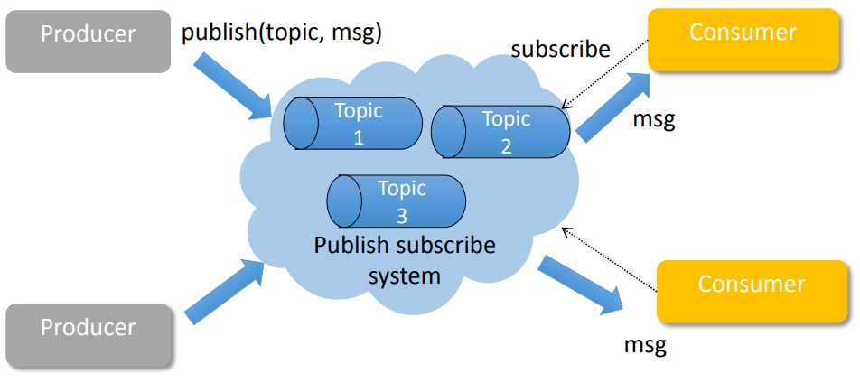

# CS498- Week 12

#cloud_computing

## Introduction to Streaming Systems

### Introduction to Stream Processing

- What is Stream Processing?
	- If you see an ad on a page, there will be an `AdViewEvent`
		- `{UserId, AdId, Timestamp}`
		- If you clicked the ad, there will be another `AdClickEvent`
			- `{UserId, AdId, Timestamp}`
		- The goal now, is to determine which ad is the most effective during this browsing session
	- Input
		- Potentially infinite sequence of events
			- e.g. `AdViewEvent, AdClickEvent`
	- Latency
		- Near real- time
			- From milliseconds to minutes instead of hours to days
	- Output
		- An infinite sequence of changes to the derived dataset
			- Interim stream for further processing
			- Final result to store in the data store
	- 
- Stream Processing Requirements
	- Low latency
	- Tolerate out of order and late arrival
	- User friendly interface- (streaming SQL)
	- Scalability
	- Data safety & availability
- Stream Processing
	- "What are the application requirements?"
		- Scalable, fast, stateful stream processing
	- "What scale should we operate at?"
		- Traffic Volume: 1.4 trillion events/ day
		- Intermediate State Size: multi TB 
	- "Why is it expensive to run stream processing at scale?"
		- Intermediate datasets need to be stored to allow low latency processing
		- large volumes of data need to be pulled and pushed via network

### Introduction to Streaming

- Why Real- Time Stream Processing?
	- MapReduce, Hadoop etc. store and process data at scale, but not for real- time systems
	- There's no hack that will turn Hadoop into a real- time stream system
		- Fundamentally different set of requirements than batch processing
	- Lack of a real- time version of Hadoop has become the biggest flaw in the data processing ecosystem
- Cloud Streaming Engines
	- Cloud Systems
		- Apache Storm
		- [Twitter Heron](https://blog.x.com/engineering/en_us/a/2015/flying-faster-with-twitter-heron#:~:text=At%20Twitter%2C%20Heron%20is%20used,of%20development%20and%20production%20topologies), surprisingly still used even after Elon's takeover
		- Apache Flink
	- Older Non- Cloud Systems
		- IBM System S
		- Borealis
			- Descendant of Aurora from Brown University, deprecated

### Big Data Pipelines: The Rise of Real- Time

- The Rise of Real- Time
	- As Hadoop ramped up to offer batch data availability, a growing need arose to provide data in real- time for analytic and instant feedback use cases
	- Storm became stable for production scale in 2012
- The Storm Fire Hose
	- Topologies
		- Graph of sprouts and bolts that are connected with stream groupings
		- Runs indefinitely (no time/ batch boundaries)
	- Streams
		- Unbounded sequence of tuples that is processed and created in parallel in a distributed fashion
	- Spouts
		- Input source of streams in topology
	- Bolts
		- Processing container, which can perform transformation, filter, aggregation, join etc
		- Sinks
			- Special type of bolts that have an output interface
- How Did We Get Here?
	- People always want data faster
	- Hardware costs were finally in line with doing in- memory streaming for billions of events/ day
	- 
- Lambda Architecture: Real- Time + Batch
	- 
- Present Architecture
	- 
- The Next Frontier: Real- Time as Source of Truth
	- 

## Apache Storm

### Introduction to Storm

- Apache Storm
	- Guaranteed data processing
	- Horizontal scalability
	- Fault tolerance
	- No intermediate message brokers
	- Higher- level abstraction than message passing
	- "Just works"
		- Hadoop of real- time streaming jobs
	- Built by Backtype, then by Twitter and eventually Apache open source
- Storm
	- 
- Storm Concepts
	- Streams
		- Unbounded sequences of tuples
	- Spout
		- Sources of streams
			- e.g. Read from Twitter's streaming API
	- Bolts
		- Processes input streams and produces new streams
			- e.g. Functions, filters, aggregation, joins
	- Topologies
		- Network of sprouts and bolts
- Storm Tasks
	- Spouts and bolts execute as many tasks as it can across the cluster
	- "When a tuple is emitted, which task does it go to?" `-->` Can be programmed by the user
		- Shuffle Grouping
			- Pick a random task
		- Fields Grouping
			- Consistent hashing on a subset of tuple fields
		- All Grouping
			- Send to all tasks
		- Global Grouping
			- Pick task with lowest id

### Example: Storm Word Count

- Streaming Word Count Example
	- 

### Example: Programming Storm Word Count

- Word Count in Storm (Java)
	- 
	- 
	- 

### Scaling Storm to 4000 Nodes

- Open Source Big Data at Yahoo
	- What We Do
		- Yahoo Scale
		- Make it secure
		- Make it easy
	- Yahoo Scale
		- [Network Topology Aware Scheduling](https://en.wikipedia.org/wiki/Network_topology)
	- Understanding Software and Hardware
		- State Storage (ZooKeeper)
			- Limited to disk write speed
			- Scheduling
				- `O(num_execs * resched_rate)`
			- Supervisor
				- `O(num_supervisors * hb_rate)`
			- Topology Metrics (Worst Case)
				- `O(num_execs * num_comps * num_streams * hb_rate)`
		- Example
			- 240- node Yahoo Storm cluster, ZooKeeper writes 16 MB/ second
			- Theoretical Limit
				- `80 MB/ sec / 16 MB/ sec * 240 nodes = 1,200 nodes`
	- Application to Work Around Bottlenecks
		- Fix

## Advanced Storm Topics & Storm Internals

### Anchoring and Spout Replay 

- Guaranteeing Message Processing in 3 Flavors
	- None
		-  Similar to old S4
	- At Least Once
		- Tuple trees, anchoring and spout replay
	- Exactly Once
		- Similar to Hadoop or Puma
- Tuple Tree
	- 
	- Spout tuple is not fully processed until all tuples in the tree have been completed
	- If the tuple tree is not completed within a specified timeout, the spout tuple is replayed
	- Users [`acker`](https://storm.apache.org/releases/current/Guaranteeing-message-processing.html) tasks to keep track of tuple progress
- Anchoring
	- 
- At Least Once
	- "What happens if there is a failure?"
		- You can double process events
		- Not critical if you have something like Hadoop to back you up and correct the issue later
		- If you are looking at statistical trends and replay, failures don't happen that often
	- This requires you to have a spout that supports replay, though not all messaging infrastructure does
- Example
	- 
	- 

### Trident: Exactly One Processing

- What About State?
	- For most of Storm, state storage is left up to the user
		- If your bolt goes down with 3 weeks of aggregated data that you have not stored anywhere, you're screwed
- Enter Trident
	- Provides *exactly once* semantics
	- In Trident, state is a first- class citizen, but the exact implementation of state is up to you
		- Many prebuilt connectors to various NoSQL stores like HBase exist for state storage
	- Provides a high level API (similar to cascading for Hadoop)
- Example
	- 
	- 

### Inside Apache Storm

- Inside Apache Storm
	- Open Source, Git
	- IntelliJ
- Demo

### The Structure of a Storm Cluster

- Structure
	- Clojure
		- Functional programming language
		- Dialect of LISP
		- Runs on JVM
			- Complete Java interop
		- Fast
	- Java
		- Lots of code is in Java, including the scheduler

### Using Thrift in Storm

- Thrift
	- `Storm.thrift`
	- Thrift Compiler
- Demo

### How Storm Schedulers Work

- Scheduler
	- [IScheduler](https://storm.apache.org/releases/current/javadocs/org/apache/storm/scheduler/IScheduler.html)
	- Multitenant Scheduler
- Demo

## Spark Streaming

### Spark Streaming

- Stateful Stream Processing
	- 
	- Traditional streaming systems have a record- at- a- time processing model
	- Each node has a mutable state
	- For each record, update state and send new records
	- State is lost if the node dies
		- Lambda Architecture
	- Making stateful stream processing be fault- tolerant is challenging
- Existing Stream Systems
	- Storm
		- Replays record if not processed by a node
		- Processes each record at least once
		- May update mutable state twice
		- Mutable state can be lost due to failure
	- Trident
		- Use transactions to update state
		- Processes each record *exactly once*
		- Per state transaction to external database is slow
- Spark
	- Berkeley project in 2010
	- Most contributed open source project in big- data domain in the world
	- RDD
		- Resilient Distributed Dataset
- Spark Streaming
	- Basics
		- Window a bit of data
		- Run a batch
		- Repeat
	- 
- Discretized Stream Processing
	- Overview
		- 
		- Divide live stream into batches of $X$ seconds
		- Spark treats each batch of data as RDDs and processes them using RDD operations
		- Finally, the processed results of the RDD operations are returned in batches
	- Batch sizes can be as low as .5 second, latency of about 1 second
	- Potential for combining batch processing and streaming processing in the same system
- Example: Spark Streaming
	- 
- DStream Input Sources
	- Out of the Box
		- Kafka
		- HDFS
		- Flume
		- Akka Actors
		- Raw TCP Sockets
	- Very easy to write a *receiver* for your own data source
- Arbitrary Stateful Computations
	- 
	- `updateStateByKey`
		- Maintain arbitrary state while continuously updating it with new information
	- Use
		- Define the state
			- State can be an arbitrary data type
		- Define the state update function
			- Specify with a function that knows how to update the state using the previous state and the new values from an input stream
	- State update function is applied in every batch for all existing keys
- Spark ML & Graph
	- Advantages of Spark Streaming
		- Rich ecosystem of big data tools
		- Spark SQL
		- Spark ML
		- Spark GraphX
		- SparkR
	- Disadvantages of Spark Streaming
		- Can be argued that it's not *really* streaming

### Lambda & Kappa Architecture

- Lambda Architecture
	- 
		- Why Lambda?
			- Things have a tendency of failing
			- Batch handles failures well
		- A *true* streaming system has to guarantee idempotency
			- Idempotency: operation that outputs the same result no matter how many times it's applied
- Kappa Architecture
	- 
		- Only the streaming path
		- State?
			- Microbatch may address issues with state

### Streaming Ecosystem & Druid

- Components of a Streaming Ecosystem
	- Gather the data
		- Funnel
	- Distributed Queue
	- Real- Time Processing
	- Semi- Real- Time Processing
	- Real- Time OLAP
- Step 1: Gather the Data
	- NiFi Components
		- Apache NiFi is a good distributed funnel
		- Was made by NSA
		- Open sourced in 2014 and picked up by HortonWorks
		- Great visual UI to design data flow
		- Has many processor types in the box
		- Not very good for heavyweight distributed processing
			- Same graph is executed on all the nodes
	- NiFi Components
		- FlowFile
			- Unit of data moving through the system
			- Content + Attributes (key/ value pairs)
		- Processor
			- Performs the work, can access FlowFiles
		- Connection
			- Links between processors
			- Queues that can be dynamically prioritized
		- Process Group
			- Set of processors and their connections
			- Receive data via input ports, send data via output ports
	- NiFi GUI
		- 
		- Drag and drop processors to build flow
		- Start, stop and configure components in real time
		- View errors and corresponding error messages
		- View statistics and health of data flow
		- Create templates of common processors & connections
	- NiFi Site- to- Site
		- Allows for easy pushing of data from one data center to another
		- Makes it a great choice for distributed funnel
- Step 2: Distributed Queue
	- Publish Subscribe (Pub- Sub) Model
		- Kafka
		- 
	- Kafka Architecture
		- Distributed, high- throughput, pub- sub messaging system
			- Fast, Scalable, Durablw
		- Main Use Cases
			- Log aggregation, real- time processing, monitoring, queueing
		- Originally developed by LinkedIn
		- Implemented in Scala/ Java
		- 
	- Kafka Manager
		- Accessible through CLI
		- Many new open source projects for monitoring Kafka are available
- Step 3: Distributed Processing
	- Once data is in the Kafka message broker, we need to process it
	- Tasks
		- Filter
		- Join
		- Windowing
		- Business Logic
		- Real- Time Requirements
			- < 10ms
- Step 4: Microbatch Processing/ SQL/ ML
	- Alternative to real- time event- by- event processing
	- Reduce overheads
	- Fault tolerance `-->` Kappa Architecture
	- Three- Way Comparison
		- Flink and Storm have similar linear performance profiles
			- Processes an incoming event as soon as it becomes available
		- Spark Streaming has much higher latency, but is expected to handle higher throughputs
			- System behaves in a stepwise function, a direct result from its microbatch nature
	- Side Note: In- Memory Key- Value Store
		- Redis
		- Cassandra
- Step 5: OLAP (Online Analytical Processing)
	- Business Intelligence
	- Multidimensional Data Analytics
	- Analyze multidimensional data interactively
	- Basic Operations
		- Consolidation (roll- up, aggregation in dimensions)
		- Drill- down (filter)
		- Slicing & dicing (looking at the data from different viewpoints)
	- Druid
		- Developed by Metamarkets in 2011
			- RDMS is too slow
			- NoSQL Key Value Store is fast, but exponential memory space makes precomputing slow
		- Open Source (Apache Template) in 2012
		- OLAP Queries
		- Column Oriented
		- Sub- Second Query Times 
		- Real- Time Streaming Ingestion
		- Scalable
	- Druid Architecture
		- 
	- Druid Bitmap Index
		- One of the key reasons why Druid is so fast
		- Dictionary encoding
		- Bitmap index
		- Compression Ratio: 1 bit/ record
		- Logical `AND/ OR` of a few thousand numbers for a query `-->` Quick queries
- Step 6: BI
	- Pivot
		- Web- based exploratory visualization UI for Druid
		- Easily filter, split, visualize
	- Druid & Spark
		- Tableau and SQL are not natively supported by Pivot
		- Druid's native API is JSON
		- `SparklineData` allows you to connect Druid to Tableau through Spark
	- Why Druid and Spark Together?
		- Spark is an all- purpose general engine
		- Queries can take a long time
			- Faster than Hive on YARN
		- Druid is optimized for column- based time- series queries