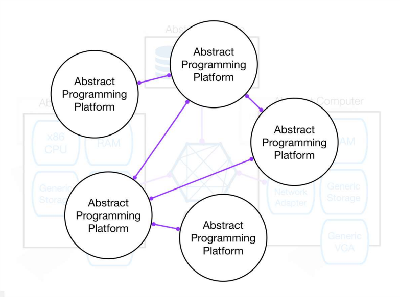
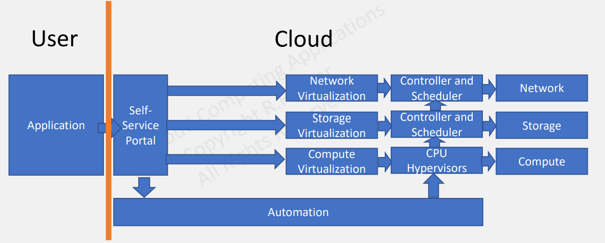
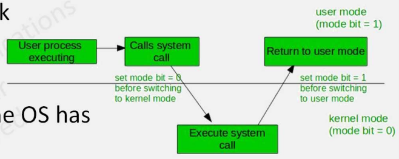
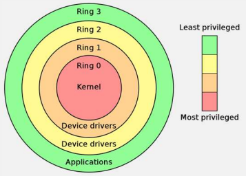
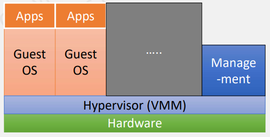

# CS498- Week 13

#cloud_computing

## Virtualization

### Virtualization: Introduction

- Sharing Resources
	- Cloud economics requires the sharing of resources
	- "How do we share a physical computer amongst multiple users?"
		- Answer: Abstraction
			- Introduce an abstract model of what a generic computing resource should look like
			- Physical computer resource then provides this abstract model to many users
- Layers of Abstraction
	- 
	- Virtualization avoids creating dependencies on physical resources
- Virtualization: Foundation of Cloud Computing
	- Virtualization allows for the creation of distributed computing models without creating dependencies on physical resources
	- Clouds are based on virtualization
		- Offer services based mainly on virtual machines, remote procedure calls and client/ servers
		- Provide lots of servers to lots of clients (e.g. phones)
	- Simplicity of use and ease of programming require allowing client server paradigms to be used to construct services from lots of resources
- Software Defined Data Center
	- 

### Virtualization: Types of Virtualization

- Types of Virtualization
	- Emulation
	- Full
		- Software
			- Binary Translation
			- Paravirtualization
		- Hardware Assisted
	- MicroVMs
	- OS
		- Containers

### Virtualization: System Background

- Brief History Lesson
	- Single program computers
		- **Very** early mainframes (1950's)
		- MS-DOS
			- Single user program gets access to **everything** the hardware has
			- OS is a thin wrapper around BIOS
			- No real notion of process
	- Multi- User/ Multi- Tasking
		- Need to isolate programs
		- Need to isolate users
		- Notion of process
			- "Executing the program and its context"
- World- View from a Process
	- Image of the program's executable machine code
	- Memory
		- Virtual Address Space `-->` Paging `-->` VM page is brough into memory when the process attempts to use it `-->` Managed by the OS
		- Process- specific data (input and output)
		- Stack
			- Temporary data (e.g. function parameters, local variables, return addresses, function call stack and saved variables)
		- Heap holds intermediate data during the runtime
	- OS Resource Descriptors
		- e.g. file descriptors, data sources and sinks
	- Security Attributes
		- e.g. process owner and the process' set of permissions (allowable operations)
	- Processor State (In Context)
		- Program counter
		- Content of registers and physical memory addressing
- Process Isolation
	- Isolating processes from each other is necessary
		- Virtualized, idealized machine
		- Process is not capable of interacting with another process except through secure, kernel managed mechanisms
	- User processes should not be allowed to issue sensitive instructions
		- Tasks like loading memory mapping tables and accessing I/O devices
	- Normal applications should not use any of these instructions
		- If a normal application like a word processer is suddenly able to write to arbitrary memory locations or get raw access to your hard drive, it would be disastrous
- Dual Mode Operations in OS
	- CPU and OS work together to ensure process isolation
		- 
	- To isolate processes from each other, the OS has two modes:
		- User Mode
		- Kernel Mode
- User & Kernel Modes
	- User Mode
		- User processed operation in user mode
		- When the user application requests a service from the operating system, or an interrupt occurs, or a system call is made, there will be a transition from user to kernel mode to fulfill the requests
	- Kernel Mode
		- When the system boots, hardware starts in kernel mode
		- Privileged instructions which execute **only** in kernel mode
			- If user attempts to run privileged instruction in user mode, it will treat instruction as an **illegal** operation and traps it to the OS
		- An example of privileged instruction includes I/O management
		- Interrupt handling
- CPU Privilege Protection
	- When a privileged instruction is executed (or a safe instruction accesses a privileged resource), the CPU checks whether the process is allowed or not
		- Different mechanisms
		- x86 Example:
			- Ring Levels
			- 
		- Kernel mode code (e.g. OS, device drivers) run in ring **0**
		- User processes run in ring **3**
	- CPU issues **General Protection Fault (GPF)** if a privileged instruction is executed in the wrong ring level
- CPU + OS
	- Certain operations are not allowed in user mode code
		- Read and write from a hardware device
		- Enabling/ disabling system interrupts
	- Such operations only allowed in Kernel mode
	- The task of enforcing this requirement is performed by the CPU
	- Examples of privileged operations include:
		- `HLT`
			- Halt CPU till next interrupt
		- `INVLPG`
			- Invalidate a page entry in the translation look- aside buffer (TLB)
		- `LIDT`
			- Load Interrupt Descriptor Table
		- `MOV CR Registers`
			- Load or store control registers
			- In this case, the MOV instruction (a non- privileged instruction on its own) is accessing a privileged register

### Virtualization: Full Virtualization

- Full Virtualization
	- 
	- VM simulates enough hardware to allow an unmodified "guest" OS (one designed for the same CPU) to be run in isolation
	- VM looks and feels exactly like a real computer, up to the point where a guest operating system cannot tell the difference
	- Examples
		- VirtualBox
		- Virtual PC
		- VMWare
		- QEMU
- Virtualization: Privileged & Non- Privileged Instructions
	- 1974 paper by Goldberg and Popek describes the criteria to make a system virtualizable
		- "Trap and Emulate"
	- Executable code from the guest can execute directly onto the host CPU by the hypervisor
		- Hypervisor configures the CPU in such a way that all potentially unsafe instructions will cause a "trap"
		- Unsafe instructions are instructions that tries to access or modify the memory of another guest
		- Traps are an exceptional condition that transfer control back to the hypervisor
	- Once the hypervisor receives a trap, it will inspect the offending instruction, emulate it in a safe way and continue execution after the instruction
		- Safe Instructions
		- Unsafe (Sensitive) Instructions
			- Privileged instructions are a subset of unsafe
			- Privileged instructions should cause a trap
	- The original x86 architecture was not virtualizable according to the paper
		- 17 unsafe instructions that were not given privilege
			- Intel VT-x and AMD-V later made these instructions privileged
- Trap & Emulate
	- Classic way to implement a hypervisor is by using the "trap and emulate" method
		- Approach was used by the very first hypervisor developed by IBM in the late 60's
			- IBM System 370
			- Used to this day on 64- bit Intel and AMD systems
	- The approach *usually* has good performance because the majority of the instructions will not cause a trap and will execute straight onto the CPU with no overhead
	
### Virtualization: Paravirtualization

- Software- Only Virtualization
	- The Problem
		- x86 processors were not virtualizable until the mid 2000s
	- Software- only virtualization is a technique to go around the "trap and emulate" design of Popek and Goldberg
	- Does not require special hardware support e.g. Intel VT-x or AMD-V features
- Paravirtualization
	- First approach to software- only virtualization
	- VM does not necessarily simulate hardware, but instead (or in addition), offers a special API that can only be used by modifying the "guest" OS
		- Paravirtualization is a technique in which a modified guest OS kernel communicates to the hypervisor in its intent to perform privileged CPU and memory operations
	- Guest OS is specifically modified to run on a hypervisor
		- Windows 7+
		- Linux Kernel v3+
	- Example
		- Xen
- Xen & the Linux Kernel
	- Originally a university research project
	- Invasive changes to the kernel to run Linux as a paravirtualized guest
	- Maintenance effort required on distributions
		- Support was added in mainstream Linux Kernel 3 (2012)
	- Usually very fast
		- Trap and Emulate has overhead, paravirtualization eliminates traps
	- Risk of distributions dropping Xen support is low
- Xen Concepts
	- Control Domain (`Dom0`)
		- `Dom0` kernel with drivers
		- Xen management tool stack
		- Trusted computing base
	- Guest Domains
		- Your apps (e.g. Cloud Management Stack)
	- Driver/ Stub/ Service Domain(s)
		- "Driver, device" model or "control service in a box" model
		- De- privileged and isolated
		- Lifetime
			- Start, stop, kill

### Virtualization: Binary Translation

- Binary Translation
	- First described in a 1992 paper by Digital Equipment Corporation (DEC)
		- Original VMWare Workstation 1.0 in 1999
			- BT support has been deprecated since 2016
		- Somewhat similar to Just in Time compilation for Java Virtual Machine (JVM), JavaScript (v8 in Chrome), PHP 8 (since November 2020)
	- Modifies sensitive instructions on the fly to virtualizable instructions
		- Only need to translate kernel code that is running in ring **0**
			- Depending on the workload, this is small fraction of the total code
		- Examining the executable code of the virtual guest for "unsafe" instructions
		- Translate these instructions into "safe" equivalents
		- Execute the translated code
	- Direct Execution
		- Most code is executed directly onto the CPU and only the code that needs to be translated is actually translated
	- Binary translation is performed on the binary code that gets executed on the processor, it does not require changes to the guest operating system kernel

### Virtualization: 1st Generation Hardware

- X

### Virtualization: 2nd & 3rd Generation Hardware

- X

### Virtualization: MicroVMs & Unikernels

- X

## Containers

### Containers: Introduction

- X

### Containers: Pillars of Linux Containers

- X

### Containers: Control Groups

- X

### Containers: Namespaces

- X

### Containers: Union File System

- X

### Containers: Docker Architecture

- X

### Containers: Networking

- X