# CS498- Week 13

#cloud_computing

## Virtualization

### Virtualization: Introduction

- Sharing Resources
	- Cloud economics requires the sharing of resources
	- "How do we share a physical computer amongst multiple users?"
		- Answer: Abstraction
			- Introduce an abstract model of what a generic computing resource should look like
			- Physical computer resource then provides this abstract model to many users
- Layers of Abstraction
	- 
	- Virtualization avoids creating dependencies on physical resources
- Virtualization: Foundation of Cloud Computing
	- Virtualization allows for the creation of distributed computing models without creating dependencies on physical resources
	- Clouds are based on virtualization
		- Offer services based mainly on virtual machines, remote procedure calls and client/ servers
		- Provide lots of servers to lots of clients (e.g. phones)
	- Simplicity of use and ease of programming require allowing client server paradigms to be used to construct services from lots of resources
- Software Defined Data Center
	- 

### Virtualization: Types of Virtualization

- Types of Virtualization
	- Emulation
	- Full
		- Software
			- Binary Translation
			- Paravirtualization
		- Hardware Assisted
	- MicroVMs
	- OS
		- Containers

### Virtualization: System Background

- Brief History Lesson
	- Single program computers
		- **Very** early mainframes (1950's)
		- MS-DOS
			- Single user program gets access to **everything** the hardware has
			- OS is a thin wrapper around BIOS
			- No real notion of process
	- Multi- User/ Multi- Tasking
		- Need to isolate programs
		- Need to isolate users
		- Notion of process
			- "Executing the program and its context"
- World- View from a Process
	- Image of the program's executable machine code
	- Memory
		- Virtual Address Space `-->` Paging `-->` VM page is brough into memory when the process attempts to use it `-->` Managed by the OS
		- Process- specific data (input and output)
		- Stack
			- Temporary data (e.g. function parameters, local variables, return addresses, function call stack and saved variables)
		- Heap holds intermediate data during the runtime
	- OS Resource Descriptors
		- e.g. file descriptors, data sources and sinks
	- Security Attributes
		- e.g. process owner and the process' set of permissions (allowable operations)
	- Processor State (In Context)
		- Program counter
		- Content of registers and physical memory addressing
- Process Isolation
	- Isolating processes from each other is necessary
		- Virtualized, idealized machine
		- Process is not capable of interacting with another process except through secure, kernel managed mechanisms
	- User processes should not be allowed to issue sensitive instructions
		- Tasks like loading memory mapping tables and accessing I/O devices
	- Normal applications should not use any of these instructions
		- If a normal application like a word processer is suddenly able to write to arbitrary memory locations or get raw access to your hard drive, it would be disastrous
- Dual Mode Operations in OS
	- CPU and OS work together to ensure process isolation
		- 
	- To isolate processes from each other, the OS has two modes:
		- User Mode
		- Kernel Mode
- User & Kernel Modes
	- User Mode
		- User processed operation in user mode
		- When the user application requests a service from the operating system, or an interrupt occurs, or a system call is made, there will be a transition from user to kernel mode to fulfill the requests
	- Kernel Mode
		- When the system boots, hardware starts in kernel mode
		- Privileged instructions which execute **only** in kernel mode
			- If user attempts to run privileged instruction in user mode, it will treat instruction as an **illegal** operation and traps it to the OS
		- An example of privileged instruction includes I/O management
		- Interrupt handling
- CPU Privilege Protection
	- When a privileged instruction is executed (or a safe instruction accesses a privileged resource), the CPU checks whether the process is allowed or not
		- Different mechanisms
		- x86 Example:
			- Ring Levels
			- 
		- Kernel mode code (e.g. OS, device drivers) run in ring **0**
		- User processes run in ring **3**
	- CPU issues **General Protection Fault (GPF)** if a privileged instruction is executed in the wrong ring level
- CPU + OS
	- Certain operations are not allowed in user mode code
		- Read and write from a hardware device
		- Enabling/ disabling system interrupts
	- Such operations only allowed in Kernel mode
	- The task of enforcing this requirement is performed by the CPU
	- Examples of privileged operations include:
		- `HLT`
			- Halt CPU till next interrupt
		- `INVLPG`
			- Invalidate a page entry in the translation look- aside buffer (TLB)
		- `LIDT`
			- Load Interrupt Descriptor Table
		- `MOV CR Registers`
			- Load or store control registers
			- In this case, the MOV instruction (a non- privileged instruction on its own) is accessing a privileged register

### Virtualization: Full Virtualization

- Full Virtualization
	- 
	- VM simulates enough hardware to allow an unmodified "guest" OS (one designed for the same CPU) to be run in isolation
	- VM looks and feels exactly like a real computer, up to the point where a guest operating system cannot tell the difference
	- Examples
		- VirtualBox
		- Virtual PC
		- VMWare
		- QEMU
- Virtualization: Privileged & Non- Privileged Instructions
	- 1974 paper by Goldberg and Popek describes the criteria to make a system virtualizable
		- "Trap and Emulate"
	- Executable code from the guest can execute directly onto the host CPU by the hypervisor
		- Hypervisor configures the CPU in such a way that all potentially unsafe instructions will cause a "trap"
		- Unsafe instructions are instructions that tries to access or modify the memory of another guest
		- Traps are an exceptional condition that transfer control back to the hypervisor
	- Once the hypervisor receives a trap, it will inspect the offending instruction, emulate it in a safe way and continue execution after the instruction
		- Safe Instructions
		- Unsafe (Sensitive) Instructions
			- Privileged instructions are a subset of unsafe
			- Privileged instructions should cause a trap
	- The original x86 architecture was not virtualizable according to the paper
		- 17 unsafe instructions that were not given privilege
			- Intel VT-x and AMD-V later made these instructions privileged
- Trap & Emulate
	- Classic way to implement a hypervisor is by using the "trap and emulate" method
		- Approach was used by the very first hypervisor developed by IBM in the late 60's
			- IBM System 370
			- Used to this day on 64- bit Intel and AMD systems
	- The approach *usually* has good performance because the majority of the instructions will not cause a trap and will execute straight onto the CPU with no overhead
	
### Virtualization: Paravirtualization

- Software- Only Virtualization
	- The Problem
		- x86 processors were not virtualizable until the mid 2000s
	- Software- only virtualization is a technique to go around the "trap and emulate" design of Popek and Goldberg
	- Does not require special hardware support e.g. Intel VT-x or AMD-V features
- Paravirtualization
	- First approach to software- only virtualization
	- VM does not necessarily simulate hardware, but instead (or in addition), offers a special API that can only be used by modifying the "guest" OS
		- Paravirtualization is a technique in which a modified guest OS kernel communicates to the hypervisor in its intent to perform privileged CPU and memory operations
	- Guest OS is specifically modified to run on a hypervisor
		- Windows 7+
		- Linux Kernel v3+
	- Example
		- Xen
- Xen & the Linux Kernel
	- Originally a university research project
	- Invasive changes to the kernel to run Linux as a paravirtualized guest
	- Maintenance effort required on distributions
		- Support was added in mainstream Linux Kernel 3 (2012)
	- Usually very fast
		- Trap and Emulate has overhead, paravirtualization eliminates traps
	- Risk of distributions dropping Xen support is low
- Xen Concepts
	- Control Domain (`Dom0`)
		- `Dom0` kernel with drivers
		- Xen management tool stack
		- Trusted computing base
	- Guest Domains
		- Your apps (e.g. Cloud Management Stack)
	- Driver/ Stub/ Service Domain(s)
		- "Driver, device" model or "control service in a box" model
		- De- privileged and isolated
		- Lifetime
			- Start, stop, kill

### Virtualization: Binary Translation

- Binary Translation
	- First described in a 1992 paper by Digital Equipment Corporation (DEC)
		- Original VMWare Workstation 1.0 in 1999
			- BT support has been deprecated since 2016
		- Somewhat similar to Just in Time compilation for Java Virtual Machine (JVM), JavaScript (v8 in Chrome), PHP 8 (since November 2020)
	- Modifies sensitive instructions on the fly to virtualizable instructions
		- Only need to translate kernel code that is running in ring **0**
			- Depending on the workload, this is small fraction of the total code
		- Examining the executable code of the virtual guest for "unsafe" instructions
		- Translate these instructions into "safe" equivalents
		- Execute the translated code
	- Direct Execution
		- Most code is executed directly onto the CPU and only the code that needs to be translated is actually translated
	- Binary translation is performed on the binary code that gets executed on the processor, it does not require changes to the guest operating system kernel

### Virtualization: 1st Generation Hardware

- Hardware- Enabled Virtualization
	- Intel VT (IVT)
	- AMD Virtualization (AMD-V)
	- Allow "trapping" of sensitive instructions
		- Popek & Goldberg `-->` Trap and Emulate
	- Examples
		- VMWare Fusion
			- Virtual user session software built to run Windows applications on Mac to run Windows apps
		- VMWare ESXi
			- Bare- metal hypervisor that installs directly onto a physical server
			- Partitions hardware to consolidate applications and optimize costs using its direct access to and control of underlying resources
		- Parallels Desktop for Mac
		- Parallels Workstation
- 1st Generation Hardware Virtualization
	- First introduced in mid 2000s in x86
	- Intel VT-x, AMD-V
		- Virtual Machine Control Block (VMCB)
			- In- memory data structure
		- VMCB combines control state with a subset of the guest VCPU state
	- New, less privileged execution mode, guest mode, supports direct execution of guest code, including privileged kernel code
	- New instruction, `vmrun`, transfers from host to guest mode
		- Upon its execution, hardware loads guest state from VMCB and continues execution in guest mode
		- Guest execution proceeds until some condition that has been set by VMM is reached
			- Hardware performs an `exit` operation
			- `exit` is the inverse of `vmrun`
		- Guest state is saved to the VMCB, the VMM state is loaded and execution resumes in host mode, which is now in the VMM
	- 1st generation hardware support lacks *explicit support* for memory virtualization
		- VMM must implement a software MMU using shadow page tables
			- Context switch on each `vmrun` and `exit`
			- Examples
				- `VMPTRLD, VMPTRST, VMCLEAR, VMREAD, VMWRITE, VMCALL, VMLAUNCH, VMRESUME, VMXOFF, VMXON, INVEPT, INVVPID & VMFUNC`
	- With hardware- assist, the guest runs at full speed unless an exit is triggered
		- Virtualization overheads are determined as the product of the exit frequency and the average cost of handling an exit
- MMU in 1st Generation Hardware Virtualization
	- 1st generation hardware virtualization **does not** virtualize MMU
	- VMM has to get involved on MMU
		- VMM write- protects primary page tables to trigger `exits` when the guest updates primary page tables so that the VMM can propagate the change into the shadow page tables (e.g. invalidate)
		- VMM must request `exits` on page faults to distinguish between hidden faults, which the VMM consumes to populate shadow page tables and true faults, which the guest consumes to populate primary page tables
		- VMM must request `exits` on guest context switches so that it can activate the shadow page tables corresponding to the new context
	- 1st generation hardware support often did not outperform a BT- based VMM is often slower

### Virtualization: 2nd & 3rd Generation Hardware

- 2nd Generation Hardware Virtualization
	- AMD's RVI (Rapid Virtualization Indexing) and Intel's EPT (Extended Page Tables) are examples of 2nd generation hardware virtualization
	- VMM maintains a hardware- walked "nest page table" that translates gPAs to hPAs, eliminating the need for VMM interposition
		- 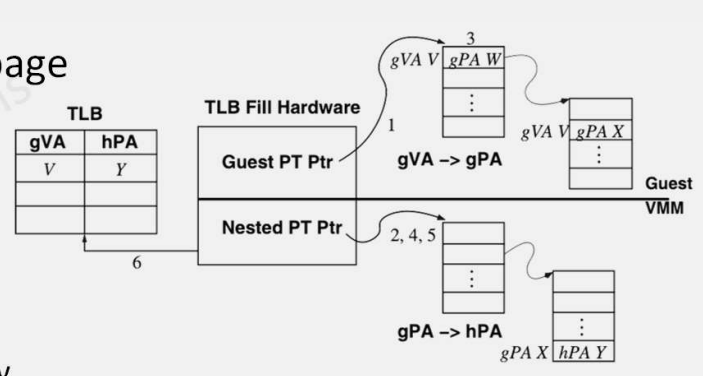
	- Many flaws of the 1st generation were resolved:
		- No trace- induced `exits`
		- No context- switch `exits`
		- No hidden/ true fault `exits`
		- VMM does not have to allocate memory for shadow page tables, reducing memory usage
	- Cost to service a TLB miss will be higher with nested paging than without
		- TLB caching is immensely helpful in this context
		- Large memory pages (1 GB vs 2 MB)
- I/O Virtualization
	- Most hypervisors "emulate" I/O devices
		- Generic display
		- Generic network
		- Generic storage
	- Trap and Emulate is emulated to a certain degree, as well as paravirtualization
	- Cloud Data Center requirements necessitate optimal performance
		- Hardware- based I/O virtualization
- 3rd Generation Hardware Virtualization
	- Intel started to include VMCS shadowing as a feature that accelerates **nested virtualization of VMMs** ever since the announcement of Haswell microarchitecture in 2013
	- Interrupt Virtualization
		- AMD AVIC & Intel APICv (2012)
	- I/O MMU Virtualization
		- AMD-VI & Intel VT-D
		- I/O memory management unit (IOMMU) that allows guest VMs to directly use peripheral devices (e.g. Ethernet, accelerated graphics cards and hard- drive controllers) through DMA and interrupt remapping
			- Sometimes referred to as a PCI passthrough
	- PCI-SIG Single Root I/O Virtualization (SR-IOV)

### Virtualization: MicroVMs & Unikernels

- MicroVMs
	- A typical VM usually has many virtual I/O devices to make it useful
		- Example
			- EC2 Instance
				- Virtual Storage
				- Virtual Network
				- Virtual Display
				- USB 
				- Audio
		- Guest OS supports device drivers, kernel modules etc. for all I/O devices
		- Typical load time in tens of seconds, if not a few minutes
	- MicroVMs are designed for native cloud use
		- Serverless computing use cases
		- Serverless containers
			- Fargate
		- FaaS
			- AWS Lambda
- Firecracker
	- 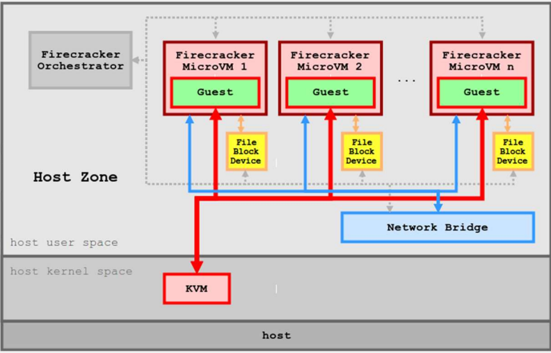
	- Open source project by Amazon
		- Based on Linux KVM
		- Similar to QEMU (VMM Driver)
		- The idea is to be as lightweight as possible
			- VMM
			- Guest OS
		- No support for graphic drivers
		- Only available virtual devices:
			- Paravirtualized virtio net
			- Paravirtualized virtio block
			- 1- button keyboard
				- Resets the VM
			- Interrupt controller
			- Timer
			- Clock
	- Function
		- VMM starts in ~ 8 ms
		- VM start time is < 125 ms
			- Firecracker's InstanceStart API call to the start of the Linux guest `user-space /sbin/init process`
			- Lightweight Linux guest (e.g. Alpine Linux)
		- Memory overhead < 5 MiB
	- OSv on Firecracker
		- Specialized OS
		- Boot time of  < 5ms
- Unikernels
	- Software is directly integrated with the kernel it is running on
	- Compiling source code, along with only the required system calls and drivers into one executable program using a single address space
	- Unikernels can only run a single process, which means forking is not available
	- Build process results in a complete (virtual) machine image of minimal size that only contains and executes what it absolutely needs
	- Example
		- OSv can run on Firecracker in 5ms, compared to 125ms on Linux
		- Has 18 MiB memory overhead which can run any Linux executable
- Operating System- Level Virtualization
	- Virtualizing a physical server at the *operating system* level, enabling multiple isolated and secure virtualized servers to run on a single physical server
	- Examples
		- Linux Vserver
		- Solaris Containers
		- FreeBSD Jails
		- Chroot
		- CGroups

## Containers

### Containers: Introduction

- Isolation
	- Hypervisors act as a stopgap measure for certain deficiencies in operating systems and are often seen as band- aids trying to cover an operating system's incompetence
		- Containers are an attempt to better address these deficiencies
- Operating System- Level Virtualization
	- Virtualizing a physical server at the OS level, enabling *multiple* isolated and secure virtualized servers to run on a *single* server
	- Examples
		- Solaris Containers
		- FreeBSD Jails
		- Linux Containers
			- Linux Vserver
			- OpenVZ
			- Process Container `-->` cgroups
			- LXC
			- Docker
- OS- Virtualization/ Containers
	- OS virtualization is how we generally refer to this type of lightweight virtualization
	- Processes "think" that they see a virtual kernel, but are all sharing the same real kernel under the hood
	- Kernel acts as a sort of hypervisor in ensuring that container/ virtualization boundaries are not crossed
	- Goal of containers is to support all of the resource isolation use cases, without the overhead and complexity of running multiple kernel instances
- OS- Level Virtualization
	- Hypervisor (VM)
		- One real HW, many virtual HWs, many OSs
		- High versatility, can run different OSs
		- Lower density, performance, scalability
		- Performance overhead is mitigated by new hardware features (e.g. VT-D)
	- Containers (CT)
		- One real HW, no virtual HW, one kernel, many user space instances
		- Higher density, natural page sharing
		- Dynamic resource allocation
		- Native performance with almost no overhead

### Containers: Pillars of Linux Containers

- 3 Pillars of Linux Containers
	- cgroups
	- Namespaces
	- Unionfs
- `chroot`
	- **Not** include in the pillars of Linux containers
	- In a Unix- like OS, root directory (`/`) is the top directory
		- All file system entries branch out of this root 
		- Created in 1979, Unix v7
	- Each process has its own idea of what the root directory is
		- By default, it is *actual* system root
			- This can be modified with the `chroot()` system call
	- `chroot` changes **apparent** root directory for current running processes and its children
		- `chroot()` simply modifies the pathname lookups for a process and its children
		- Prepends the new root path to any name starting with `/`
		- Current directory is **not** modified and relative paths can refer any locations out of the new root
	- `chroot()` **does NOT** provide secure isolation
		- Docker uses `mount namespace` instead

### Containers: Control Groups

- cgroups
	- Control Groups
	- Linux kernel feature that limits, isolates and measures resource usage of a group of processes
		- Since Linux Kernel v2.6.24
	- Resource quotas for memory, CPU, network and I/O
	- Example
		- Create a control group and assign resource limits on it
			- e.g. 3 GB of memory limit & 70% CPU
		- Add a process id to the group
	- Process resource usage will be throttled
		- Application may exceed the limits in normal scenarios
		- It will be throttled back to predetermined limits in case the system is facing a resource crunch
- cgroup Controllers (v2)
	- 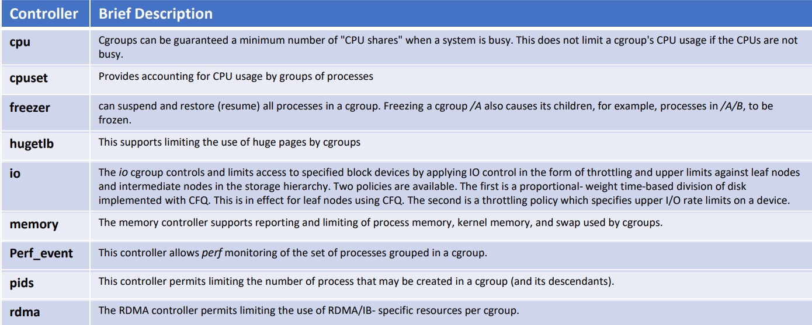
- cgroup Example
	- Controllers mounted in the cgroups file system
		- `/cgroup` directory
			- `/sys/fs/cgroup/memory`
			- `/sys/fs/cgroup/cpu`
	- Making a control group
		- `/cgroup/memory/mytestcgroup`
	- Setting limits
		- `echo 2097152 > /sys/fs/cgroup/memory/mytestcgroup/memory.limit_in_bytes`
		- `echo 2097152 > /sys/fs/cgroup/memory/mytestcgroup/memory.memsw.limit_in_bytes`
			- Setting both memory and swap space limit to 2 MB
	- Running a process
		- `cgexec -g memory:mytestcgroup ./`
- cgroup Scheduling
	- When we think of containers as lightweight VMs, it is natural to think of resource in terms of discrete resources such as the number of processors
		- However, the Linux kernel schedules processes dynamically, just as the hypervisor schedules requests onto discrete hardware
		- CPU subsystem schedules CPU access to each cgroup using either the **Completely Fair Scheduler (CFS)**, which is the default on Linux and Docker or the **Real- Time Scheduler (RT)**
	- Scheduler groups in CFS requires us to think in terms of time slices instead of processor counts
	- CPU shares provide tasks in a cgroup with a relative amount of CPU time, providing an opportunity for those tasks to run
	- The file `cpu.shares` defines the number of shares allocated to the cgroup

### Containers: Namespaces

- Namespaces
	- Wraps a global system resource in an abstraction that makes it appear to the processes within the namespace that they have their own isolate instance of the global resource
	- Linux processes form a single hierarchy, with all processes rooting at `init`
		- Usually privileged processes in this tree can trace or kill other processes
		- Linux namespace enables us to have many hierarchies of processes with their own "subtrees" such that processes in one subtree **cannot** access or even know of those in another
	- 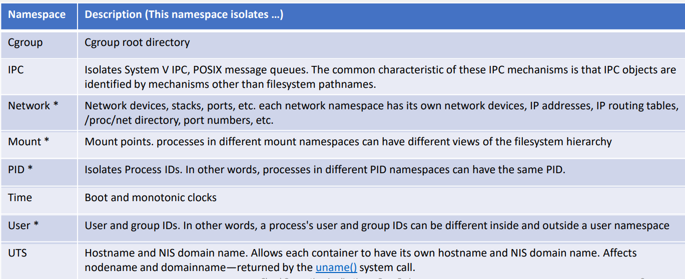
- PID (Process ID) Namespace Example
	- 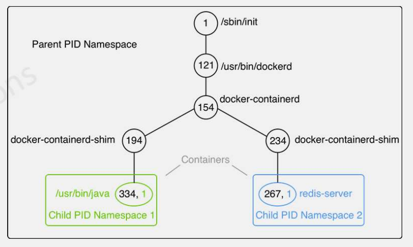
	- Without namespace, all processes descend hierarchically from `PID 1(init)`
	- If we create a PID namespace and run a process in it, that first process becomes `PID 1` in that namespace
	- The process that creates the namespace still remains in the parent namespace, but makes its child the **root of new process tree**
	- The processes within the new namespace cannot see the parent process, but the parent process namespace *can see* the child namespace
	- The processes within new namespace have 2 PIDs: one for the new namespace and one for the global namespace
	- PID namespaces also allow each container to have its own `init (PID 1)`, the "ancestor of all processes" that manages various system initialization tasks and reaps orphaned child processes when they terminate
- Network Namespace
	- Provide isolation of the system resources associated with networking
	- Each network namespace has its own network devices, IP addresses, IP routing tables, `/proc/net` directory and port numbers
	- Network namespaces make containers useful from a networking perspective
		- Each container can have its own (virtual) network device and its own applications that bind to the per- namespace port number space
		- Suitable routing rules in the host system can direct network packets to the network device associated with a specific container
			- e.g. You can have multiple containerized web servers on the same host system, with each server bound to port 80 in its (per- container) network namespace
- User Namespace
	- Process's user and group IDs can be different inside and outside a user namespace
	- A process can have a normal unprivileged user ID *outside* a user namespace while at the same time have a user ID of `0` *inside* the namespace
		- This means that the process has **full** root privileges for operations **inside** the user namespace, but is **unprivileged** for operations **outside** the user namespace
	- This is a great feature from a security perspective because it allows containers to continue running with root privileges, but without actually having any root privileges on the host itself
- Mount Namespace
	- Was the first type of namespace to be implemented on Linux (2002)
		- Compared with the use of the `chroot()` system call, mount namespaces are more secure and are more flexible for this task
	- Isolates the set of filesystem mount points seen by a group of processes
	- Processes in different mount namespaces can have different views of the filesystem hierarchy

### Containers: Union File System

- Union File System (Unionfs)
	- Backbone of container images
	- Stackable unification file system which can appear to merge the contents of several directories (branches), while keeping their physical content separate
	- Overlays several directory into one single mount point
		- Contents of directories that have the same path within the merged branches will be seen together in a single merged directory, within the new virtual filesystem
	- 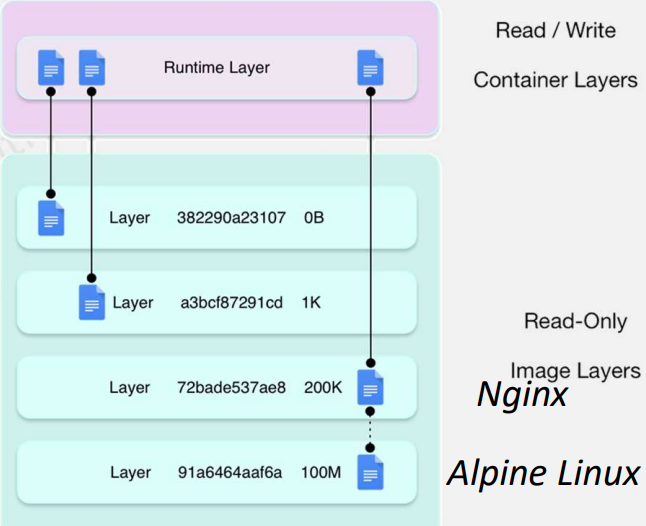
	- With union mount, the directories in the file system from the underlying layer are getting merged with those from the upper layer file systems
	- To access a file:
		- Unionfs tries to access the file on the top branch and if the file does not exist there, it continues on the lower level branches
	- Copy on Write (CoW)
		- If the user tries to *modify* a file on a lower level read- only branch, the file is *copied* to a higher level read- write branch
	- Program running inside the container doesn't care which layer the files and directories come from 
- Docker Images
	- A container image is made of a stack of immutable or read- only layers
	- In runtime, the Docker engine adds a R/W layer on top of the stack of immutable layers
		- 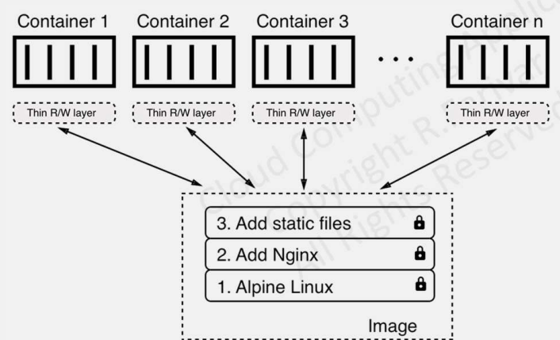
			- 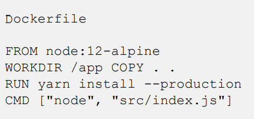
- Graph Driver
	- Local instance of a Docker engine that has a cache of the Docker image layer
	- This cache of layers is built up as explicit `docker pull` commands are executed alongside `docker build`
	- The drivers that handles these layers are called `graphdrivers`
- [Graph Driver Options](https://docs.docker.com/engine/extend/plugins_graphdriver/)
	- Options
		- `vfs, aufs, overlay, overlay2, btrfs, zfs, devicemapper and windows`
	- `vfs`
		- Naive implementation that does **not** use a union filesystem or copy on write (CoW) technique
	- `overlay, overlay2, aufs`
		- `unionfs` on top of a real filesystem
			- `ext4, xfs`
	- `btrfs, zfs, devicemapper, windows`
		- Underlying real filesystem that performs the tasks of union

### Containers: Docker Architecture

- Docker Architecture
	- 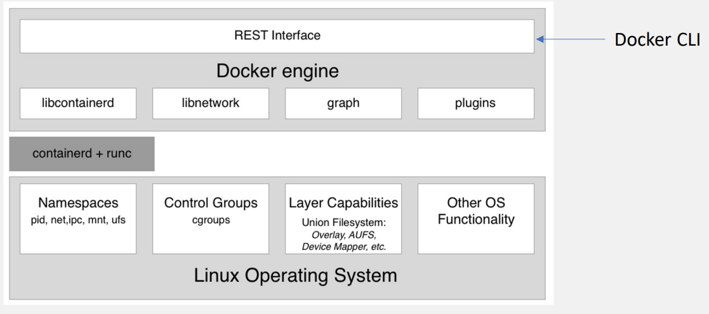
- Container Runtime
	- Docker was originally monolithic and the runtime was later separated
		- Responsible for the whole lifecycle of a container
		- Pulls a container image (template for a container) from a registry
		- Creates a container from that image
		- Initializes and runs the container
		- Eventually stops and removes the container from the system
	- Container runtime on a Docker host consists of `containerd` and `runc`
		- Both are open source and have been donated by Docker to the CNCF (Cloud Native Computing Foundation), a Linux Foundation project
- Container Runtime: `containerd`
	- `containerd` is based on `runc` and provides higher- level functionality
		- Image push & pull
		- Storage management
		- Execution of containers by calling `runc` with the right parameters to run containers
		- Managing of network primitives for interfaces
		- Management of network namespaces for containers to join existing namespaces
	- References implementation of the OCI specifications
		- OCI: Open Container Initiative, a Linux Foundation project
	- Was donated in 2017 to the CNCF
- Container Runtime: `runc`
	- `runc` is the low- level functionality of the container runtime
		- Full support for Linux namespaces
		- Native support for all security features available on Linux
			- `SELinux, AppArmor, Seccomp, cgroups`
	- Spawns and runs containers according to the OCI specification
		- Containers are configured using bundles
		- A bundle for a container is a directory that includes a specification file named `config.json` and a root filesystem
		- The root filesystem contains the contents of the container
- Docker Engine
	- Provides additional functionality on top of the container runtime
		- e.g. network libraries or support for plugins
	- Provides a REST interface over which all container operations can be automated
		- Docker CLI is one of the consumers of this REST interface
- Docker Overview
	- 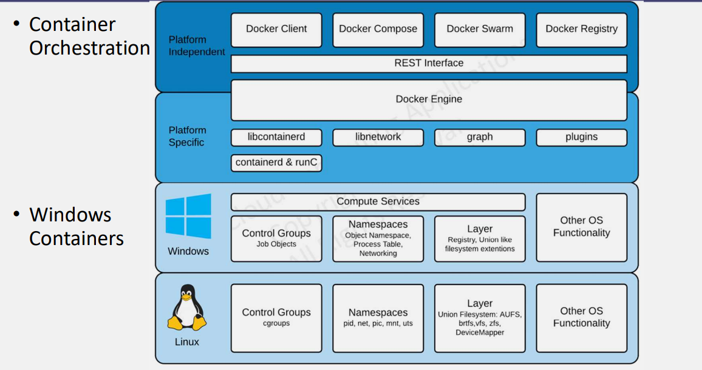

### Containers: Networking

- Container Network Model
	- LibNetwork implements the Container Network Model (CNM)
		- 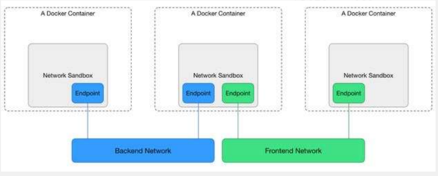
	- Formalizes the steps required to provide networking for containers while providing an abstraction that can be used to support multiple network drivers
- Container Network Model: Sandbox
	- Contains the configuration of a container's network stack, which includes the management of the container's interfaces, routing table and DNS settings
		- May contain *many* endpoints from *multiple* networks
	- An implementation of a sandbox could be a Linux Network Namespace, a FreeBSD Jail or any other equivalent concepts
	- LibNetwork implements sandbox in Linux through network namespaces
		- Creates a network namespace for each sandbox, which is uniquely identified by a path on the host filesystem
- Container Network Model: Endpoint
	- Joins a sandbox to a network
	- Implementation of an endpoint could be a `veth pair`, an Open vSwitch internal port of similar
		- `Veth` devices are virtual Ethernet devices
		- Can act as tunnels between network namespaces to create a bridge to a physical network device in another namespace
		- Can also be used as standalone network devices
		- `veth` devices are always created in interconnected pairs
			- One end is placed in one network namespace and the other end in another namespace
	- An endpoint can belong to only one network and it can belong to only sandbox, if connected
	- LibNetwork delegates the *actual* implementation to the drivers, which realize the functionality
- Container Network Model: Network
	- Group of endpoints that are able to communicate with each other directly
	- Implementation of a network could be a Linux bridge, a VLAN etc.
	- Networks consist of *many* endpoints
	- LibNetwork delegates the *actual* implementation to the drivers, which realize the functionality
- Driver Packages
	- Extension of LibNetwork and provides the actual implementation of the API
		- `driver.Config`
		- `driver.CreateNetwork`
		- `driver.DeleteNetwork`
		- `driver.CreateEndpoint`
		- `driver.DeleteEndpoint`
		- `driver.Join`
		- `driver.Leave`
- Default Drivers in Docker LibNetwork
	- Bridge
		- Uses Linux bridging and `iptables` to provide connectivity for containers
		- Creates a single bridge called `docker0` by default and attaches a `veth pair` between the bridge and every endpoint
	- Host
		- For standalone containers, remove network isolation between the container and the Docker host and use the host's networking directly
	- Overlay
		- Networking that can span multiple hosts using overlay network encapsulations such as VXLAN
			- Enable swarm services to communicate with each other
	- `macvlan`
		- Macvlan networks allow you to assign a MAC address to a container, making it appear as a physical device on your network
			- Docker daemon routes traffic to containers by their MAC addresses
	- Note
		- The type of network a container uses is transparent from within the container itself
- Bridge Networks
	- 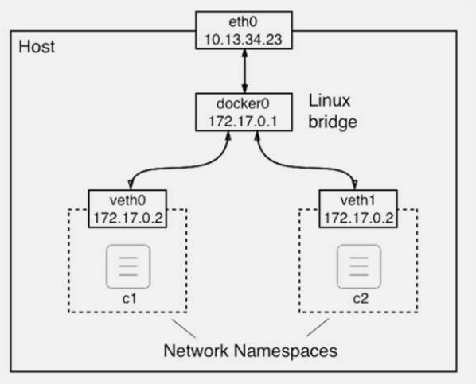
	- Bridge networks are usually link layer devices that forward traffic between networks
	- In Docker, bridge networks uses a software bridge allowing containers connected to the same bridge network on the same host
		- Isolating containers from other containers not connected to the bridge
		- For communicating with containers in other hosts, use an overlay network
	- The Docker bridge driver automatically installs rules in the host machine so that the containers on different bridge networks cannot communicate directly with each other
		- `iptables` rules on Linux
- Default Bridge Network
	- When you start Docker, a default bridge network (`bridge`) is created automatically and newly started containers connect to it unless otherwise specified
	- Containers on the default bridge network can only access each other by IP addresses
		- User- defined bridges provide automatic DNS resolution between containers
	- Default bridge network is connected a legacy detail of Docker and **IS NOT RECOMMENDED** for production use
- User- Defined Networks
	- Use `--network` to attach a container to a specific network
		- Better isolation
		- DNS resolution
			- On a user- defined bridge network, containers can resolve each other by the *container name* or alias
			- Much better than messing around with `/etc/hosts`
	- Containers can be attached and detached from user- defined networks on the fly
	- Containers connected to the same user- defined bridge network effectively expose all ports to each other
- Publishing Ports
	- From the container's point of view, it has a network interface with an IP address, a gateway, a routing table, DNS service and other networking details
	- For a port to be accessible containers or non- Docker hosts on different networks, that port must be *published* using the `-p` or `--publish` flag
		- 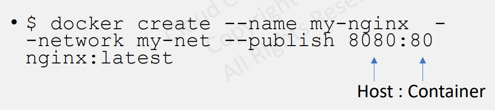
- IPAM: IP Address Management
	- 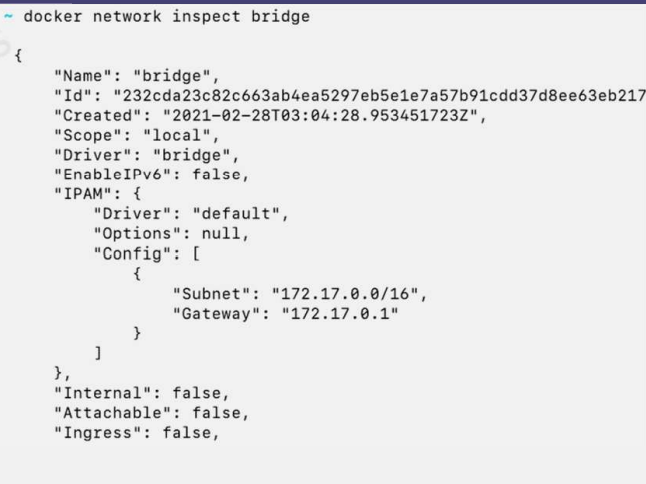
	- IPAM tracks and manages IP addresses for each network
		- Subnet
			- e.g. `172.17.0.0/16`
			- All containers attaches to this network will get an IP address taken from this CIDR range
		- Gateway
			- e.g. `172.17.0.1`
			- Router for this network
	- By default, only egress traffic is allowed
		- Containerized applications can reach the internet but they cannot be reached by any outside traffic
- Containers in the Same Namespace
	- We can have multiple containers in the same namespace
	- Processes in two containers in the same namespace can communicate through the localhost
		- Similar to bridge networking, with two containers connected to the same network, where each host gets its own IP address
	- Note that a sandbox (Linux namespace) is connected to a network
		- We typically run each container in its own sandbox, but multiple containers *can* run in the same sandbox