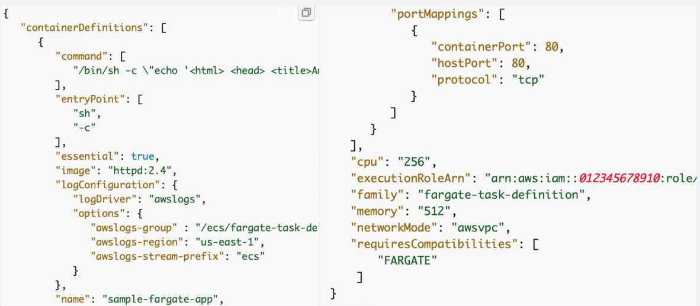
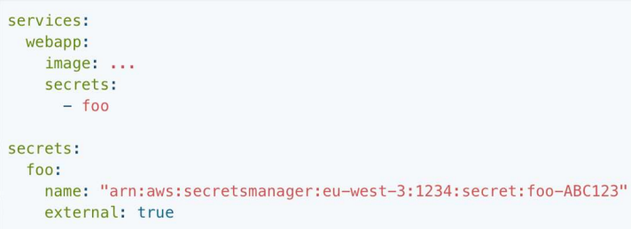

# CS498- Week 14

#cloud_computing

## Container Orchestration in Docker, Docker Swarm, ECS & ACI

### Docker Foundations

- Dockerfile
	- Are an *imperative* method to create a Docker image
	- 
- Running Docker Containers
	- `docker container run alpine echo "Hello World"`
	- First Execution
		- Will load the alpine image from Docker Hub
		- 
	- Following Execution (2+)
		- Just runs
- Daemon Mode: `exec`
	- 
		- Executes command in a running Docker container
			- [Documentation](https://docs.docker.com/reference/cli/docker/container/exec/)
- Ubuntu in Docker
	- 
- CentOS in Docker
	- 
- Kernel Versions
	- Note
		- Groovy Gorilla version of Ubuntu is supposed to come with Linux Kernel v5.8
	- CentOS v8.3 is supposed to run Kernel 4.18.240
		- However, it runs with 4.19.121 in Docker Desktop 3.2.3
			- Engine 20.10.5
			- This is the host Linux kernel, shared with all the images
				- `bzImage`
				- `initramfs`
- Multi Stage Dockerfile
	- Multi stage allows us to not include unnecessary intermediate layers
		- 
		- Resulting image will be 4 MB instead of ~ 200 MB
- Image Registries
	- Docker Hub
	- Google
	- AWS Amazon Elastic Container Registry (ECR)
	- Microsoft Azure
	- Red Hat
	- Artifactory
- Full Namespace of Images
	- `<registry URL>/<User or Organization>/<name>:<tag>`
		- `public.ecr.aws/nginx/nginx:latest`
		- `public.ecr.aws/datadog/agent:latest`
		- `myregistry.azurecr.io/marketing/campaign10- 18/email-sender:v2`

### Docker Swarm Orchestration

- Container Orchestration
	- Many applications consist of multiple components that need to be distributed on more than one machine
		- Using containers, we can have each component running in its own container
	- Thousands of prebuilt components are available on public registries
- Docker vs. Swarm
	- 
- Swarm Services
	- Swarm services use a *declarative* model, which means that you define the desired state of the service and use Docker to maintain the state
	- State
		- Image name and tag
		- How many containers (tasks) are in the service
		- Ports exposed to clients outside the swarm
- Nodes on Docker Swarm
	- 
- Services on Docker Swarm
	- 
- Swarm Task States
	- Docker lets you create services which can start tasks
		- A service is a *description* of a desired state and a task does the work
		- Work is scheduled on swarm nodes in this sequence:
			- Create a service by using `docker service create`
			- Request goes to a Docker manager node
			- Docker manager node schedules the service to run on particular nodes
			- Each service can start multiple tasks
			- Each task has a lifecycle, with states like `NEW, PENDING` and `COMPLETE`
- Replicated & Global Tasks
	- 
- Example: Run a 3- Task Nginx Service on 10- Node Swarm
	- 
		- 3 tasks run on up to 3 nodes
		- You don't need to know which nodes are running the tasks
		- Connecting to `port 8080` on **any** of the 10 nodes connects you to **one** of the **three** Nginx tasks
			- Routing mesh
- Tasks & Scheduling
	- 

### Docker Networks, Bridge & Overlay

- Docker Networking
	- Docker networks are pluggable using drivers
		- Bridge
		- Host
		- Overlay
		- `macvlan`
		- None
- Docker Bridge Networking
	- 
		- Connect Nginx container to the `my-net` network
		- Any other container connected to the `my-net` network has access to all ports on the `my-nginx` container
		- **Also** publishes `port 80` in the container to `port 8080` on the Docker host, so external clients can access that port
			- User- defined bridge networks provide DNS resolution
- Docker Overlay Network Driver
	- Creates a distributed network among multiple Docker daemon hosts
		- Sits on top of (overlays) the host- specific networks
	- Docker transparently handles routing of each pack to and from the correct Docker daemon host and the correct destination container
	- In a swarm, two overlay networks play a role:
		- `ingress`, which handles control and data traffic related tasks to swarm services
		- User- defined overlay networks
			- `docker network create -d overlay my-overlay`
- User- Defined Overlay Networks
	- Swarm services connected to the same overlay network effectively expose all ports to each other
	- Encryption
		- All swarm service management traffic is encrypted by default using the AES algorithm in GCM mode
		- To encrypt the application data, use `--opt encrypted`
	- Subnet CIDR
		- 

### Internal Load Balancing

- Service Discovery
	- User defined networks provide DNS service
		- User defined bridge networks
		- User defined overlay networks
	- For most situations, you should connect to the service name directly, which is load- balanced and handled by all containers ("tasks") backing the service itself
	- To get a list of all tasks backing the service, do a DNS lookup for `tasks.<service-name>`
- DNS
	- 
- Internal Load Balancing in Swarm Services
	- From one service to another
		- Feature is automatically enabled once a service is created
	- When a service is created, it gets a virtual IP address immediately on the service's network
		- When a service is requested, the resulting DNS query is forwarded to the Docker engine, which in turn returns the IP of the service (**virtual IP**)
		- Traffic sent to that virtual IP is load balanced to all of the healthy containers of that service on the network
		- All the load balancing is done by Docker since only 1 entry- point is given to the client (1 IP)

### Routing Mesh & External Load Balancing

- Swarm Overlay Networks
	- Recall bridge networks on one host:
		- Containers connected to the same user defined bridge network effectively expose *all* ports to each other
		- For a port to be accessible to containers or non- Docker hosts on different networks, that port must be *published* using the `-p` or `--publish` flag
	- On a multi- host Docker Swarm:
		- Swarm services connected to the same overlay network effectively expose all ports to each other
		- For a port to be accessible outside of the service, that port must be *published* using the `-p` or `--publish` flag
	- By default, swarm services which publish ports do so using the **routing mesh**
- Docker Swarm Routing Mesh
	- By default, swarm service which publish ports do so using the routing mesh
	- When you connect to a published port on any swarm node (**whether it is running a given service or not**), you are redirected to a worker which is running that service, transparently
		- Effectively, Docker acts as a *load balancer* for your swarm services
	- Services using the routing mesh are running in *virtual IP (VIP)* mode
- Published Ports
	- When you create a swarm service, you can publish that service's ports to hosts *outside* the swarm
	- Routing Mesh
		- 
- Ingress Overlay Network
	- The **ingress** network plays an important role in enabling published ports over the swarm
		- When you create a swarm service and do not connect it to a user defined overlay network, it connects to the ingress network by default
	- For a port to be accessible **outside** of the swarm service, it must be *published* using the `-p` or `--publish` flag on `docker service create` or `docker service update`
	- Map TCP `port 80` on the service to TCP `port 8080` on the routing mesh and map UDP `port 80` on the service to UDP `port 8080` on the routing mesh
		- `-p 8080:80/tcp -p 8080:80/udp`
		- `-p published=8080, target=80, protocol=tcp`
		- `-p published=8080, target=80, protocol=udp`
- External Load Balancing in Swarm Services
	- 
- External Load Balancer
	- 
- Example: HAProxy Configuration
	- 
- External Load Balancing w/o Routing Mesh
	- Set `--endpoint-mode` to `dnsrr`
		- Default Value: `vip`
	- No longer a single virtual IP (VIP)
	- Docker sets up DNS entries for the service such that a DNS query for the service name returns a list of IP addresses
		- Client connects directly to one of these
	- You are responsible for providing the list of IP addresses and ports to your load balancer
- Routing Mesh
	- When you publish a service port, the swarm makes the service accessible at the target port on every node
		- Regardless of whether there is a task for the service running on that node or not
	- This is less complex and is the right choice for many types of services
- Host Mode
	- You can publish a service task's port directly on the swarm node where that service is running
		- Bypasses the routing mesh
		- Provides the maximum flexibility, including the ability to develop custom routing framework
	- However, you are responsible for keeping track of where each task is running and routing requests to the tasks & load balancing across the nodes
		- Use the `mode=host` option to the `--publish` flag

### Volumes

- Data Volumes
	- Docker containers are based on Unionfs
		- Multiple immutable (read- only) base layers
		- One read- write container- specific layer
	- When a container is removed, the top layer is also removed
	- To persist changes and to access data outside the container, we need to mount an external storage location
	- Types of host to container mapping:
		- Bind Mount
		- Volume
		- `tmpfs`
- `tmpfs`
	- `tempfs` mounts are best used for cases when you do not want the data to persist either on the host machine or within the container for security reasons or to protect the performance of the container when your application needs to write a large volume of non- persistent state data
- Persistent Data Storage: Bind Mount
	- When you use a bind mount, a file or directly on the *host machine* is mounted into a container
		- 
	- The file or directly is referenced by its absolute path on the host machine
- Docker Volume
	- Persistent storage **abstraction**
	- Managed by Docker
	- Will last after the container is removed
	- Different drivers
		- Volume drivers let you store volumes on remote hosts or cloud providers, to encrypt the contents of volumes or to add other functionality
		- For local deployments, use `local` driver
	- For distributed applications (Swarm)
		- Use an NFS and `local` driver
		- Some drivers support writing files to an external storage system like NFS or S3
			- REX-Ray, CloudStor
			- `vieux/sshfs` volume drive
- Example: Mount Volumes
	- 

### Secrets & Configs

- Docker Secrets (Part 1)
	- A secret is a "blob" of data
		- e.g. passwords, SSH private keys, SSL certificate
	- Should not be transmitted over a network or stored unencrypted in a Dockerfile or in your application's source code
	- Use Docker *secrets* to centrally manage
	- Docker secrets are only available to Swarm services, not to standalone containers
- Docker Secrets CLI
	- `docker secret create`
	- `docker secret inspect`
	- `docker secret ls`
	- `docker secret rm`
	- `--secret` is a flag for `docker service create`
	- `--secret-add` and `--secret-rmn` are flags for `docker service update`
- Docker Secrets (Part 2)
	- When you grant a newly- created or running service access to a secret, the ***decrypted*** secret is mounted into the container in an in- memory filesystem
	- Location of the mount point *within* the container defaults to:
		- Linux Containers
			- `/run/secrets/<secret_name>`
		- Windows Containers
			- `C:\ProgramData\Docker\secrets`
- Docker Configs
	- Docker secrets are only available to Swarm services, not to standalone containers
	- Docker configs are only available to Swarm services, not to standalone containers
	- Configs operate in a similar way to secrets, except that they are not encrypted at rest and are mounted directly into the container's filesystem without the use of RAM disks
- Docker Config CLI
	- `docker config create`
	- `docker config inspect`
	- `docker config ls`
	- `docker config rm`

### Compose & Stacks

- Infrastructure as Code
	- Imperative
		- Tells the system exactly how to do things
			- `$ docker network create -d overlay my-network`
			- `$ docker container create --name web-service --publish 80:80 -network my-network nginx:latex`
	- Declarative
		- Describes to the system what you want accomplished
- Docker Compose
	- Main tool by Docker for container orchestration
	- Uses YAML by default
	- Default file name is `docker-compose.yml`
	- Declarative
		- You tell `docker-compose` what your implementation looks like and it figures out the operations needed to make it happen
- Imperative vs. Declarative
	- 
- Compose Specification
	- Compose Application Model
		- Formalizes many of the concepts we've covered in this course
			- Service
			- Network
			- Volume
			- Config
	- [Compose](https://github.com/compose-spec/compose-spec/blob/master/spec.md)
- Compose
	- The most basic deployment model is `docker-compose`, running in one machine and deploying multiple containers
	- Docker Swarm is the distributed multi- host extension
		- Same compose specifications
- Compose Versions
	- Version 1
		- Only for single host deployment
		- No volumes, networks and build arguments
	- Version 2
		- Support for volumes, networks and build arguments added
		- `depends-on` to indicate startup order
	- Version 3
		- Targets both single host (`docker-compose`) and Swarm mode stacks
		- Added `docker secrets`
	- [Compose Documentation](https://docs.docker.com/compose/compose-file/compose-versioning)

### Example: 3- Tier Architecture in Swarm

- Example: HAProxy Config
	- 
	- 
- Front- End Web App Service
	- 
	- 
- Application Service
	- 
	- 
- Cache Service
	- 
	- 
- Back- End Database Service
	- 
	- 
- Volumes
	- 
	- 
- Configs & Secrets
	- 
	- 
- Networks
	- 
	- 

### Compose Stacks on AWS ECS & Azure ACI

- AWS Elastic Container Service (ECS)
	- Fully managed container orchestration service
	- Containers either run on customer- managed EC2 instances or on AWS Fargate
	- Fargate
		- Serverless backend for container deployment
		- AWS manages resource provisioning for container instances
	- Services such as Amazon SageMaker and Lex internally run ECS
- ECS Task Definition
	- The Docker image to use with each container in your task
	- How much CPU and memory to use with each task or each container within a task
	- Launch type to use, which determines the infrastructure on which your tasks are hosted
	- Docker networking mode to use for the containers in your task
	- Logging configuration to use for your tasks
	- Whether the task should continue to run if the container finishes or fails
	- Command the container should run when it is started
	- Any data volumes that should be used with the containers in the task
	- The IAM role that your tasks should use
- Example: AWS ECS Task Definition
	- 
- Service Discover: AWS Cloud Map
	- 
- User Docker Compose File Syntax in ECS
	- `ecs-cli compose` and `ecs-cli compose service` allows you to create task definitions & manage your AWS ECS tasks using Docker Compose files
	- Additional ECS parameters specified for the container size parameters in a separate YAML file
- Example: File Syntax
	- 
- Docker AWS ECS Context
	- Directly use Docker
		- Set up an AWS context in one Docker command
			- `$ docker context create ecs myecscontext`
		- Use Compose files
			- `--context myecscontext`
			- `docker compose up --context myecscontext`
	- Docker translates the Compose application to the CloudFormation template
- Native AWS Services
	- ECS cluster for the `compose` application
		- 
	- Uses the default VPC
		- A security group per network in the Compose file on the AWS account's default VPC
		- Load balancer routes traffic to the services
	- Service Discovery
		- Service- to- service load balancing is handled by AWS Cloud Map
	- Volumes are handled by instantiating EFS filesystems
	- Secrets are handled by AWS Secrets Manager
- Docker Integration with Azure
	- Docker is also integrated with Azure Container Instances
		- `$ docker login azure`
		- `$ docker context create aci myacicontext`
		- `$ docker --context myacicontext run -p 80:80 nginx`
	- Volumes `-->` Azure File Share
	- Port Mapping `-->` Only symmetrical mapping of `80:80`
	- Networks are not supported (as of 2021)
		- Communication between services is implemented by defining mapping for each service in the shared `/etc/hosts` file of the container group