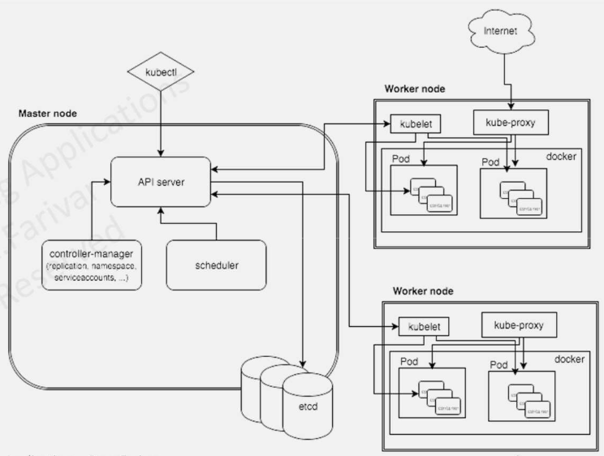
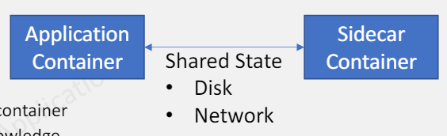
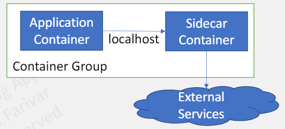
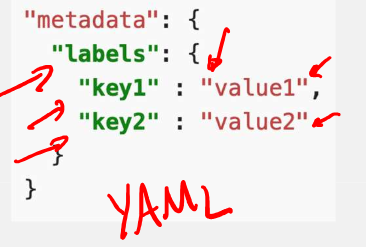
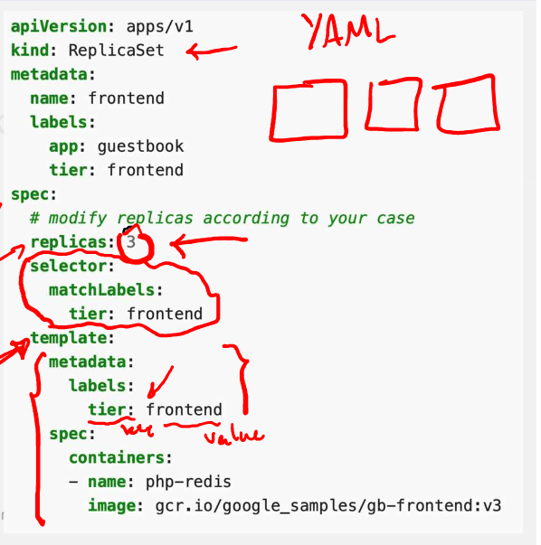
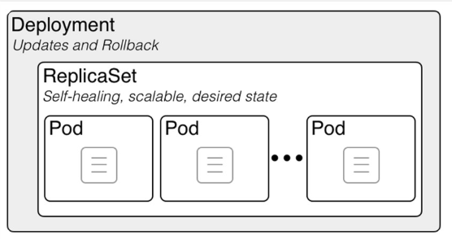
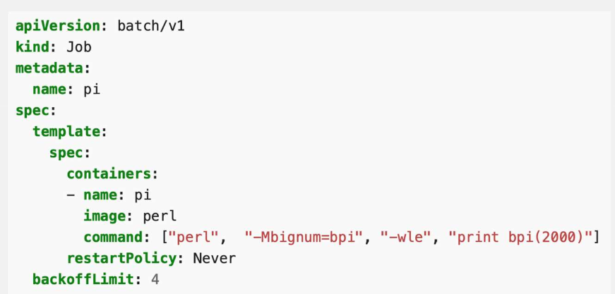
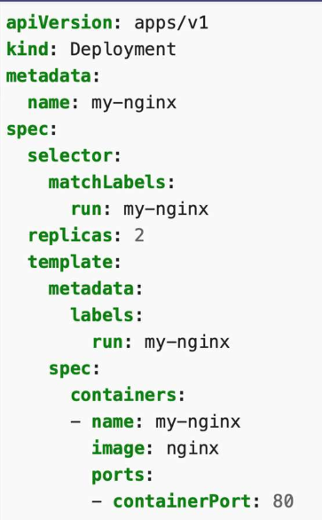
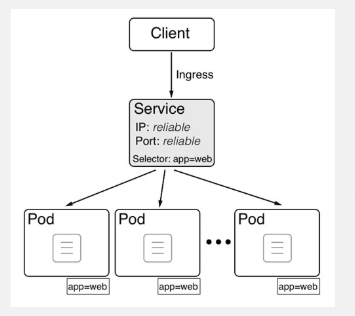
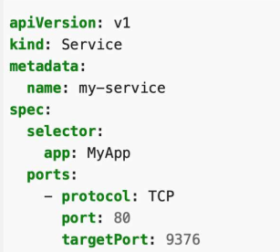

# CS498- Week 15

#cloud_computing

## Kubernetes Container Orchestration

### Kubernetes- Introduction

- Kubernetes
	- Platform to orchestrate the deployment, scaling and management of container- based applications
		- **Primary responsibility of Kubernetes is container orchestration**
		- All the containers that execute workloads are scheduled to run on physical or virtual machines
		- Containers must be packed efficiently
		- Replace dead, unresponsive or unhealthy containers
	- Kubernetes is **not PaaS**
		- It doesn't dictate many important aspects that are left to you or to other systems built on top of Kubernetes, such as Deis, OpenShift and Eldario
- Local Kubernetes for Development
	- `minikube` is local Kubernetes, focusing on making it easy to learn and develop for Kubernetes
	- Docker Desktop comes with a pre- installed Kubernetes local installation
	- Other Options
		- Kind
		- K3s
		- MicroK8s
- Cloud Kubernetes Offerings
	- GCP Google Kubernetes Engine (GKE)
	- AWS Elastic Kubernetes Engines (EKS)
		- `Eksktl` is created by Weaveworks and endorsed by AWS
	- Azure Kubernetes Service (AKS)
	- IBM Cloud Kubernetes Service
	- Oracle Container Engine for Kubernetes
	- Digital Ocean
	- Alibaba
	- Rackspace
	- Tencent

### Kubernetes- Architecture

- Kubernetes Architecture
	- [Kubernetes in 100 Seconds](https://www.youtube.com/watch?v=PziYflu8cB8)
	- 
	- Master Node
		- API Server
		- Controller
		- Scheduler
		- `etcd`
	- Worker Node
		- Kubelet
		- Kube Proxy
		- Container Runtime
- Clusters & Nodes
	- A cluster is a collection of hosts (nodes) that provide compute, memory, storage and networking resources
	- Kubernetes runs workloads by placing containers into pods to run on nodes
		-  A node may be a virtual or a physical machine, depending on the cluster
	- Each node is managed by the control plane and contains the services necessary to run pods
- Control Plane
	- Master is the control plane of Kubernetes
		- Consists of several components, such as an API server, a scheduler and controller manager
	- Kubernetes has a a "hub- and- spoke" API pattern
		- All API usage from nodes (or the pods they run) terminates at the API server
	- Master is responsible for the global state of the cluster, cluster- level scheduling of pods and handling of events
	- Designed to *horizontally* scale, which means that you can keep adding more instances of it to make your cluster **highly available**
- `etcd`
	- Highly available consistent key- value store
	- Used to store the *state* of the cluster
- Kubelet
	- An agent that runs on each node within the cluster
		- The means by which the managers interact with the nodes
		- Responsible for managing the pods
- `kube-proxy`
	- Manages routing of requests and traffic for both the node and the pods
- `container-runtime`
	- Can be Docker, CRI-O or any other OCI- compliant runtime
	- As of Kubernetes v1.0, `containerd` is the default
- Namespace
	- Kubernetes supports the multiple visual clusters backed by the same physical cluster
		- These virtual clusters are called namespaces
	- Names of resources need to be *unique within a namespace*, but **not** across a namespace
- Resource Quota
	- Defined by a `ResourceQuota` object, provides constraints that limit aggregate resource consumption per namespace
	- Can limit the quantity of objects that can be created in a namespace by type, as well as the total amount of compute resources that may be consumed by resources in that namespace
- Workload Model
	- Workload is an application that is running on Kubernetes
	- Pods
	- `ReplicaSets`
	- Deployment
	- `StatefulSet`
	- `DaemonSet`
	- Job
	- `CronJob`
	- Service

### Kubernetes- Pods

- Pods
	- Pod is a special Kubernetes construct
	- Grouping of one or more containers that share some namespaces
		- e.g. Network
		- Containers in a pod can communicate with each other through the `localhost`
	- The pod abstraction allows certain innovative design patterns
		- Still, in practice we see a single- container pod
- Pod Container Design Patterns
	- The pod design in Kubernetes allows us to explore some interesting container- based design patterns
	- Containers in a pod share some namespaces, including network namespace
	- Single Node Patterns:
		- Sidecar
		- Ambassador
		- Adapter
- Sidecar Design Pattern
	- 
	- Made up of two containers:
		- Application Container
		- Sidecar Container
			- Augment and improve the application container without the application container's knowledge
	- Example Use Cases:
		- Adding HTTPS to a legacy service
		- Dynamic configuration with sidecars
- Ambassador Design Pattern
	- 
	- Ambassador container brokers interactions between the application container and the rest of the world
	- Example Use Cases:
		- Shard a service
		- Service Discovery
		- Experiments or Request Splitting

### Kubernetes- Higher Level Resource Abstractions

- Labels & Label Selectors
	- Labels are key/ value pairs that are attached to objects, such as pods
		- Labels can be used to organize and to select subsets of objects
		- Labels enable users to map their own organizational structures onto system objects in a loosely coupled fashion
	- 
	- Label selectors are used to select objects based on their labels
		- Client/ user can identify a set of objects
		- Label selector is the core grouping primitive in Kubernetes
- `ReplicaSet`
	- A `ReplicaSet's` purpose is to maintain a stable set of replica pods running at any given time
		- Used to guarantee the availability of a specified number of identical pods
	- Fields
		- 
			- Selector that specifies how to identify pods it can acquire
			- Number of replicas indicating how many pods it should be maintaining
			- A pod template specifying the data of new pods it should create
- Deployment
	- 
	- Higher level concept that manages `ReplicaSets` and provides declarative updates to pods along with a lot of other useful features
		- Can define deployments to create new `ReplicaSets`
	- You can describe a desired state in a deployment
		- The deployment controller changes the actual state to the desired state at a controlled rate
	- Manages the rollout for a `ReplicaSet`
- `StatefulSet`
	- Manages the deployment and scaling of a set of pods **and** provides guarantees about the ordering and uniqueness of these pods
	- Unlike a deployment, a `StatefulSet` maintains a sticky identity for each of their pods
	- These pods are created from the same spec, but are **not** interchangeable
		- Each has a persistent identifier that it maintains across *any* rescheduling
	- Although individual pods in a `StatefulSet` are susceptible to failure, the persistent pod identifiers make it easier to match existing volumes to the new pods that replace any that have failed
	- The storage for a given pod must either be provisioned by a `PersistentVolume` provisioner based on the requested storage class or be pre- provisioned by an admin
- Jobs
	- A job creates one or more pods and will continue to retry execution of the pods until a specified number of them successfully terminate
		- As pods successfully complete, the job tracks the successful completions
		- When a specified number of successful completions is reached, the task (e.g. Job) is complete
	- A simple example is to create one job object in order to reliably run one pod to completion
		- The job object will start a new pod if the first pod fails or is deleted
	- 

### Kubernetes- Services

- Exposing Pods
	- 
		- Create an Nginx pod and note that it has a container port specification
		- This makes it accessible from any node in your cluster
			- Should be able to `ssh` into any node in your cluster and `curl` both IPs
- Service (Part 1)
	- Cattle vs. Pets
		- In the past, when systems were small, each server had a name
			- You knew exactly what software was running on each machine
		- Pods run in a flat, cluster wide address space
			- In theory, you could talk to these pods directly using `<IP:port>`
	- In Kubernetes, when a node dies:
		- The pods die with it and the deployment will create new ones with different IPs
		- This is the problem a service solves
	- 
	- Kubernetes service is an abstraction which defines a logical set of pods running somewhere in your cluster, that all provide the *same* functionality
		- A group of pods, as determined by a label selector, which all offer a common port name/ number that serves a single purpose
		- A pool of HTTP servers that all have the same content available
		- A policy by which the access them
	- This pattern is sometimes referred to as a "micro- service"
- Example: Service in YAML
	- 
		- Suppose you have a set of pods where each pod listens on TCP `port 9376` and contains a label `app=MyApp`
		- This specification creates a new service object named `"my-service"`, which targets the TCP `port 9376` on any pod with the `app=MyApp` label
- Service (Part 2)
	- When created, each service is assigned a unique IP address known as `clusterIP`
		- Used by service proxies
	- This address is tied to the lifespan of the service and will not change while the service is alive
	- Pods can be configured to talk to the service and know that communication to the service will be automatically load- balanced out to some pod that is a member of the service
- Cloud Native Service Discovery
	- If you're able to use Kubernetes APIs for service discovery in your application, you can query the API server for endpoints, which gets updated whenever the set of pods in a service changes
	- For non- native applications, Kubernetes offers ways to place a network port or load balancer in between your application and the backend pods

### Kubernetes- Networking Model

- X

### Kubernetes- Service Discovery & Ingress

- X

### Kubernetes- Final Thoughts

- X