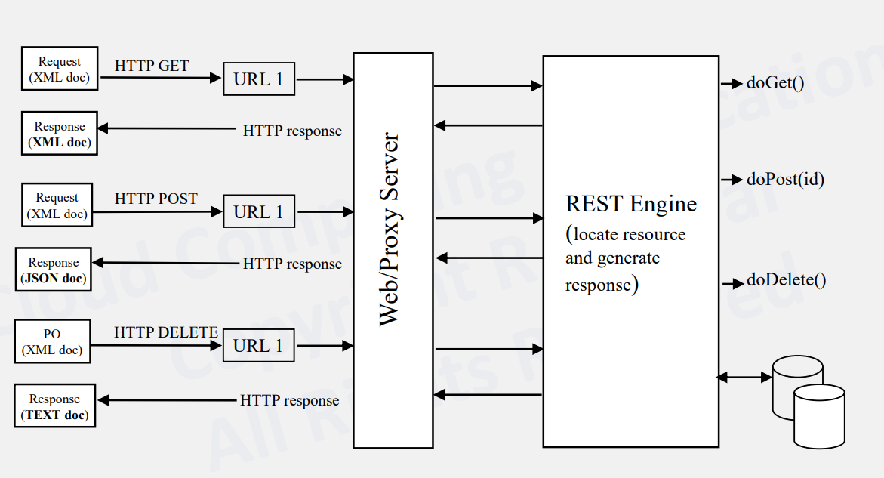
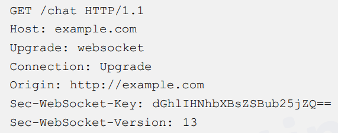
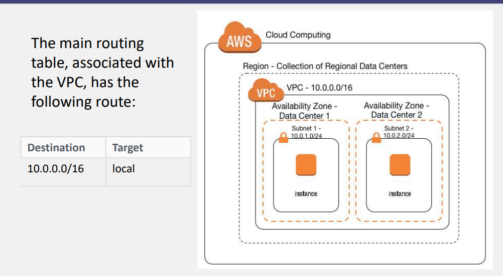
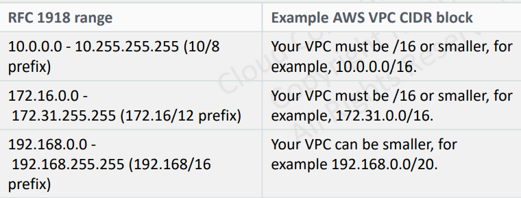
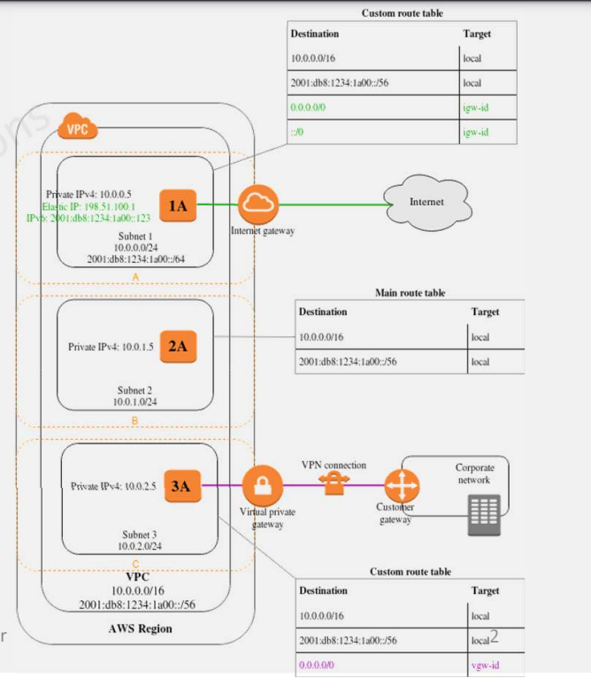
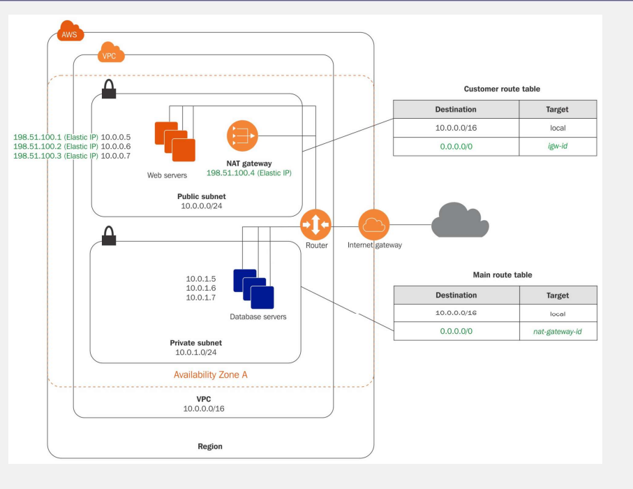
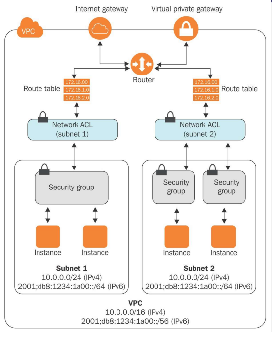

# CS498- Week 2

#cloud_computing

## Cloud Computing Glue: Introduction

- Cloud Computing Glue
	- The goal of cloud computing is to run your computing tasks and storing your data on other computers.
	- At its core, it is communication between computing sources (e.g. your client & some server on the cloud).

## Communication, Internet Protocol, HTTP, REST

### Internet Protocol, HTTP & RPC on HTTP

- Communication in a Single Machine
	- Communication channels are provided by the operating system.
		- Shared memory blocks/ pages
		- Shared file system
		- Signal
		- POSIX Socket (a.k.a. Berkeley Socket)
			- Port Numbers
			- SOCK_STREAM (Comparable to TCP)
			- SOCK_DGRAM (Comparable to UDP)
		- Remote Method Invocation (RMI)
			- Method invocations between objects in different processes.
			- Processes may be on the same or different host.
			- From one Java virtual machine (JVM) to another.
		- Message Queue
		- Message Passing
			- Unix Pipe
			- Actor Model
			- Pi Calculus
- Middleware Layers
	- Middleware: software that provides services to applications *beyond* those generally available at the operating system.
	- Implements functionalities that are common across many different applications through a communication channel.
	- Middleware layers can provide the same abstractions to distributed applications.
		- Building distributed systems while maintaining the original code is not very different from a single- node program.
	- Conceptual Layers
		- Applications
		- Put/ Get Data, RPCs & RMIs (*Middleware*)
			- e.g. HTML & SOAP
		- Request reply protocol (*Middleware*)
			- External data representation 
			- Provide support to the application
			- Runs at all servers at the user level
		- Operating System
- Communication in a Local Network
	- Scientific Computing
		- Message Passing Interface (MPI)
			- Simple Model: Send() & Receive()
			- No native support for fault tolerance
			- Programming interface is complicated
			- e.g. Race, Deadlock
	- Business Sector
		- Remote Procedure Calls (RPC)
			- RPC Semantics
				- e.g. Behavior in presence of network failures
			- RPC Implementation
		- Remote Method Invocation (RMI)
			- Between two JVMs on a network
- Communication in Big Data Deployments
	- Requires scaling from the start
		- May require thousands of nodes on the network itself
		- Ad hoc solutions do *not* work
	- RPC Frameworks
		- Google Protocol Buffer
			- User defines the functions that will be called remotely
			- User compiles the functions
			- System automatically generates interfaces functioning as communication stubs in chosen programming language
			- User imports the generated header/ code into a project
			- At runtime, the program calls the function locally
				- Generated code takes care of serialization and marshalling of the function parameters
				- Code makes the network calls (handling any errors) and transfers the function call in the target system.
		- Apache Thrift
			- Apache HDFS, Hadoop, Spark, Storm utilizes Apache Thrift
	- Consistency
		- Paxos
		- Apache ZooKeeper

### Communication: Single- Node & Networked

- Internet Protocol Stack: Link & Internet Layers
	-  The 2nd level (a.k.a. "internet level") is where internet switches and routers operate.
		- Gets your message from one machine to another
		- Responsible for addressing *host interfaces*
		- Encapsulating data into diagrams (including fragmentation and reassembly)
		- Routing datagrams across one or more IP networks
			- IP Address, IPv4, IPv6
	- EE and network engineers live at the bottom level (a.k.a. "link" level).
- Internet Protocol Stack: Transport Layer
	- The transport level handles packetizing of data.
	- Gets message from a process in one machine to another process in another machine.
	- Typically implemented in the operating system.
	- Provide port numbers (similar to Unix sockets).
	- Transmission Control Protocol (TCP)
		- Keeps track of data segments, retransmissions and acknowledgement.
		- Handles...
			- Network congestion
			- Traffic load balancing
			- Unpredictable network behavior
			- Lost, duplicated or delivered out of order IP packets
	- User Datagram Protocol
		- a.k.a. Unreliable Datagram Protocol
		- Simple and usually chosen for time sensitive applications (e.g. streaming videos, video games, DNS lookups)
- Internet Protocol Stack: Application Layer
	- The application level handles "what to send".
	- HTTP, HTTPS
		- RESTful APIs
	- FTP
	- WebSocket
	- SMTP
	- IMAP
	- SSH
	- DHCP
	- DNS
	- BitTorrent
- HTTP Protocol
	- Originally targeted at static web pages.
		- e.g. Client Requests, Server Response, "Connection is Closed"
	- Works on top of TCP for *reliable* transport.
	- Client (user) can be a web browser or any other software.
	- HTTP resources are identified and located on the network by Uniform Resource Locators (URLs), using the Uniform Resource Identifiers (URI's) schemes (e.g. http and https).
	- 
	- In HTTP/1.0, a separate connection to the same server is made for every resource request.
		- Establishment of TCP connections has overhead.
	- HTTP/1.1 can reuse a connection multiple times to download images, scripts, stylesheets and more after the page has been delivered.
		- Persistent Sessions
		- Lower Latency
- HTTP Message Format
	- Request "Verbs"
		- GET: retrieve data
		- POST: server should accept the call parameter as a new value for the resource specified in the URL
		- PUT: server should stores the enclosed entity under the supplied URL
		- DELETE: server should delete the specified resource by the URL
		- PATCH: server should apply partial modification to the resource
	- Request Message
		- Request line (e.g. GET/data/inventory.htm HTTP/1.1), which requests "/dataset/inventory.htm" resources from the server.
		- Request header fields
		- An empty line
		- An optional message body
	- Response Message
		- Status line which includes the status code and reason (e.g. HTTP/1.1 200 OK), which indicates that the client's request has succeeded.
			- Informational
				- 1XX
			- Successful
				- 2XX
			- Redirection
				- 3XX
			- Client Error
				- 4XX
			- Server Error
				- 5XX
		- Response header fields (e.g. Content-Type: text/html)
		- An empty line
		- An optional message body
- RPC on HTTP
	- For many types of RPC, the client/ server conversation model of HTTP is sufficient.
	- You can replace the HTML markup with an XML or JSON representation of the data.
		- XML-RPC
		- JSON-RPC
	- Common Example:
		- Bitcoin Servers
		- Commands are encoded as JSON, sent over HTTP
### RESTful Architecture

- Representational State Transfer (REST)
	- Software architecture style for distributed hypermedia systems such as the World Wide Web.
	- Introduced in the doctoral dissertation of [Roy Fielding](https://en.wikipedia.org/wiki/Roy_Fielding), one of the principal authors of the HTTP specification.
	- The motivation for REST was to capture those characteristics of the Web that made the Web successful in the first place.
		- URI- addressable resources
		- HTTP
		- Make a request --> Receive response --> Display response
	- A collection of network architecture principles that outline how resources are defined and addressed.
		- Based on HTTP methods to access resources via URL encoded parameters and the use of JSON or XML to transmit the data.
		- Request/ response between the client and the server (like a conversation).
		- Something is requested --> Something is done --> Something is sent in return.
- RESTful API
	- Uses HTTP verbs: GET, POST, PUT, PATCH, DELETE
		- Exploits use of HTTP beyond HTTP POST and HTTP GET.
			- HTTP PUT and HTTP DELETE are not supported in HTML.
		- GET is "safe" (does *not* change state).
		- GET, PUT and DELETE are idempotent (can execute more than once and get the same state change result).
	- Example:
		- Request:
			- curl -X POST https://api.github.com/user/repos
		- Response:
			- 
- REST- Not a Standard
	- REST is just an architectural style, it is not a standard.
		- Instead, it incorporates other standards:
			- HTTP
			- URL
			- XML/ HTML/ GIF/ JPEG (resource representations)
			- TEXT/xml, text/html, image/gif, image/jpeg (resource types, MIME types)
	- REST has been widely adopted by web "mashup" applications and operations on When entities.
		- Many SaaS and PaaS services utilize REST as well.
			- e.g. LinkedIn, Twitter
	- Concept Overview
		- Nouns (resources)
			- *Unconstrained*
			- e.g. http://example.com/employees/12345
		- Verbs
			- *Constrained*
			- e.g. GET
		- Representations
			- *Constrained*
			- e.g. XML
- Resources
	- The key abstraction of information in REST is a resource.
	- A resource is a conceptual mapping to a set of entities.
		- Any information that can be named can be a resource (e.g. document, image, a temporal service, a collection of other resources, a non- virtual object).
	- Represented with a global identifier (e.g. URI in HTTP).
		- e.g. http://www.boeing.com/aircraft/747
- Naming Resources
	- REST uses URI to identify resources.
		- e.g. http://localhost/books/
	- As you traverse the path from more generic to more specific, you are "navigating" the data.
- Verbs
	- Represents the actions to be performed on resources.
		- GET, POST, PUT, DELETE, PATCH
- HTTP GET
	- How the clients ask for the information they seek.
	- Issuing a GET request transfers the data from the server to the client in some representation.
		- e.g. GET http://localhost/books/ --> Retrieves all books
		- e.g. GET http://localhost/books/ISBN-0011021 --> Retrieves book with ISBN-0011021
- HTTP POST & HTTP PUT
	- HTTP POST *creates* a resource.
		- e.g. POST http://localhost/books/
			- Content: {title, authors...}
			- Creates a new book with given properties
	- HTTP POST *updates* a resource.
		- e.g. PUT http://localhost/books/isbn-123
			- Content: {ISBN, title, authors...}
			- Updates book with ISBN-123 with submitted properties
- HTTP DELETE
	- Removes the resource identified by the URI.
		- e.g. DELETE http://localhost/books/ISBN-123
			- Deletes book with ISBN-123
- Representations
	- How the data is represented or returned to the client for presentation.
	- Formats
		- JavaScript Object Notation (JSON)
			- 
		- XML
			- 
	- It is common to have multiple representations of the same data.
- Architecture Style
	- 
		- Client issues a GET, POST and DELETE requests
		- Requests are sent to a web/ proxy server
		- REST engine generates appropriate responses to the requests

### Service Oriented Architecture & SOAP

- Service Oriented Architecture (SOA)
	- Architectural pattern that structures software as a collection of services. 
		- Loosely coupled, reusable components that perform specific business tasks and can be combined to create more complex applications.
	- Addresses the needs of the business sector, enterprise and business to business (B2B) applications.
		- "SOA is the philosophy of encapsulating application logic in services with a uniformly defined interface and making these publicly available via discovery mechanisms."
	- Benefits
		- Reusable Code
		- Interaction (Interoperability)
		- Scalability (Loose Coupling)
		- Cost Reduction
	- "Web services" typically relates to this type of communication.
		- Web services are one option to implement SOA.
		- Other options include: Java Business Integration (JBI), Windows Communication Foundation (WCF) and Data Distribution Service (DDS).
- Simple Object Access Protocol (SOAP)
	- Protocol for exchanging structured information in web services. 
		- Allows programs running on different operating systems to communicate with one another. 
	- SOAP based web APIs use XML validation to ensure structural message integrity.
		- XML schema documents (XSD) are provisioned with Web Services Definition Language (WSDL) documents.
		- Evolved as the successor to XML-RPC.
	- Characteristics
		- Extensible
		- Protocol Neutrality (From the Transport Layer)
			- Can run on HTTP, WebSocket and SMTP, which allows it to run in different network environments. 
		- Independence
			- SOAP is designed to be *stateless*, meaning each request from a client to a server is independent. 
	- Popularity has somewhat declined, but is still relevant in enterprise applications.
		- In the enterprise world, communication between different services needs to conform to a set of rules and contracts.
		- Due to the fact that it follows objects, rules and constraints, SOAP is a stricter protocol than REST, which may be why people deemed it too rigid for its own good.
- SOA & Microservice
	- Microservice Architecture is a modern reincarnation of SOA.
		- SOA: 2000 ~ 2010
		- Microservices: 2015 ~
	- Microservices are independently deployable, whereas SOA services are often implemented in deployment monoliths.
		- Adoption of...
			- Containerization
			- Asynchronous Programming
			- Distributed Computing Mindset
			- Continuous Integration/ Continuous Delivery (CI/ CD)
			- Agile Workflows

### Asynchronous RPC & WebSocket

- Asynchronous RPC (a.k.a. Streaming API)
	- The remote server may take a long time if you're using old HTTP/0.9 and HTTP/1.0.
		- The client can wait, block or keep the HTTP connection open (long polling).
		- HTTP/1.1 in its currents state is not ready for real- time web.
	- Web 2.0: Bidirectional client/ server communication
		- Ajax
		- Comet
			- Umbrella term for Ajax Push, Reverse Ajax, Two way web, HTTP streaming and HTTP server push.
		- Push Notifications
		- XMLHttpRequest
			- XMLHttpRequest (XHR) is an API in the form of an object whose methods transfer data between a web browser and a web server.
			- Object is provided by the browser's JavaScript environment.
			- jQuery provides a wrapper, which also encapsulates WebSockets and server pushes.
- WebSocket
	- RPC libraries can issue asynchronous methods to the server and the server can inform them of the response aftewards.
	- Streaming architecture focuses on minimizing latency.
	- WebSocket
		- Part of the HTML5 standard
		- Can handle interactive sessions better than RESTful architecture models
	- Use Cases:
		- Chat
		- Stock price update
		- Collaborative document editing
		- Real time location updates
		- Multiplayer games
	- Once you allow asynchronous communication in a networked environment, you *should* handle faults.
		- Wrapper packages that encapsulate WebSocket's functionality with additional features exist.
			- e.g. Node.js supports WebSockets through plugins.
		- Java 11 supports both HTTP and WebSocket protocols.
- WebSocket Protocol
	- WebSocket is an application protocol running on top of TCP.
		- Uses URIs, but not http://
		- Uses ws://
		- Uses an initial HTTP session and HTTP port numbers to process the handshake phase
	- Protocol
		- Opening Handshake
		- Data Transfer
		- Closing Handshake
	- The protocol is purely event driven.
		- The application code listens for events on WebSocket objects to handle incoming data and changes in the connection status.
	- Asynchronous Programming
		- Client does not need to do anything (e.g. polling) to receive data.
- WebSocket Phases
	- Opening Handshake
		- HTTP request/ response to open WebSocket connection.
		- Example
			- Client Request
				- 
			- Server Response
				- 
		- HTTP protocol is switched/ upgraded to WebSocket.
	- Data Transfer
		- Bidirectional communication
		- WebSocket frame
		- Field Description
			- Opcode: Continuation, Text, Binary, Close, Ping, Pong
	- Closing Handshake
		- WebSocket frame with opcode 0x8 is sent.
- WebSocket API
	- Simple JavaScript W3C WebSocket API
	- Events
		- Open: fires to establish a connection
		- Message: contains the data from the server
		- Error: first in response to an unexpected event (e.g. failure)
		- Close: fires when the WebSocket is closed
	- Primary Methods & Events
		- 
- WebSocket in Cloud Computing
	- Many cloud providers support WebSocket as the API of choice for interactive sessions with the cloud service and the client.
		- Examples
			- Amazon AWS API Gateway
			- Salesforce
			- Slack ("Real Time Messaging API")
				- Slack also has a simple Event API based on HTTP/2 Push but only the RTM guarantees real time delivery of messages.
			- Google App Engine Channel API
				- Deprecated and has been replaced by Firebase, a MBaaS solution.
				- You can run a Socket.io instance on a computer engine or an EC2 instance.
				- AWS API Gateway to handle the deployment of WebSocket servers is also a viable solution.

### HTTP/2 Push & Streaming Videos

- HTTP/2
	- Published in 2015 and most browsers supported it by the end of 2015.
		- By 2020, ~ 42% of the top 10 million websites supported HTTP/2.
	- One of the main features of HTTP/2 is server push.
		- Closely related to another feature of HTTP/2: data streaming.
		- HTTP/2 server push is being progressively implemented.
			- e.g. Nginx web server implemented it in 2018.
	- It "proposed" new data in a new stream to the *browser*, to be stored in a cache.
	- It does not send the pushed data directly into the client application itself.
	- To make the application *aware*, HTTP/2 utilizes server side events (SSE).
- Amazon AWS API Gateway
	- REST API
	- WebSocket API
	- HTTP API
		- Based on HTTP/2 push and notification
- Video Streaming over the Internet
	- Streaming Video Content
		- RTMP
			- Still prevalent but being phased out
		- RTP (over UDP)
		- HLS (over HTTP)
		- MPEG-DASH
		- WebRTC

## Virtual Private Clouds

### VPC- Virtual Private Clouds

- Virtual Private Clouds
	- Many cloud providers have a network virtualization solution.
		- Amazon Virtual Private Cloud (VPC)
		- Microsoft Azure Virtual Network
		- Google Virtual Private Cloud (VPC)
		- Oracle Virtual Cloud Network
- Solving a Fundamental Problem
	- The Problem
		- Allow many different users to have their own private network in the cloud.
		- Isolate different customers' network packets from each other.
	- The Solution
		- VPC
- VPCs & Subnets
	- Allows you to have your "own" network in the cloud.
		- In AWS, a VPC is associated with a region (e.g. us-east-1).
		- You can have more than one VPC, even in the same region.
			- Default 5 quota
		- The IP address range of all the nodes in this VPC can be defined with a CIDR.
	- Your VPC is subdivided into logically separate segments.
		- Subnet
		- Each subnet gets a smaller CIDR range
		- Each subnet is associated with one Availability Zone (AZ)
	- You can then launch instances (e.g. EC2, RDS) in a subnet.
- VPCs, Subnets & Availability Zones
	- Main Routing Table
		- 
- Background Knowledge: CIDR
	- Classless Inter- Domain Routing (CIDR)
	- Method for allocating IP address ranges.
	- In IPv4, each address is a 32 bit value.
		- 4 bytes
		- e.g. 192.168.0.1
	- CIDR Notation:
		- e.g. 100.101.102.103/24
		- Take the mask (24 bits)
		- Keep the upper 24 bits the same
		- The lower bits can change --> range
		- 100.101.102.0... turns into 100.101.102.255
	- In IPv6, each address is 128 bits.
		- The IPv6 block 2001:db8::/48 represents the block of IPv6 addresses from 2001:db8:0:0:0:0:0:0 to 2001:db8:0:ffff:ffff:ffff:ffff:ffff.
		- In IPv6 notation, each segment is written in *hex*.
- RFC 1918: Address Allocation for Private Internets
	- The Internet Assigned Numbers Authority (IANA) has reserved the following three blocks of the IP address space for private internets.
	- 10.0.0.0/8
		- 10.0.0.0 - 10.255.255.255
		- Number of Addresses: 16,777,216
	- 172.16.0.0/12
		- 172.16.0.0 - 172.31.255.255
		- Number of Addresses: 1,048,576
	- 192.168.0.0/16
		- 192.168.0.0 - 192.168.255.255
		- Number of Addresses: 16,777,216
	- Rationale
		- It is guaranteed that no other server on the public internet has an IP address in these ranges, which means that routing rules will not conflict.
- RFC 1918 & AWS VPC
	- You must specify an IPv4 CIDR block for the VPC when you create one.
	- The allowed block size is between a /16 netmask (65,536 IP addresses) and /28 netmask (16 IP addresses).
		- RFC 1918 would allow for 16 million distinct IP addresses in the 10.0.0.0/8, but Amazon only accepts at most a /16 netmask in a VPC or subset.
		- 
- Reserved IP Addresses
	- The first 4 IP addresses and the last IP address in each subnet CIDR block are not available for you to use and cannot be assigned to an instance (e.g. 10.0.0.0/24).
		- 10.0.0.0: Network Address
		- 10.0.0.1: VPC Router
		- 10.0.0.2: The IP address of the DNS server is the base of the VPC network range + two
		- 10.0.0.3: Reserved for future use
		- 10.0.0.255: Network Broadcast Address
			- AWS does *not* support broadcast in a VPC, which is why this address is reserved.

### VPC Subnets

- Subnets
	- Creates subnets to isolate resources per the project requirements.
		- DMZ/ Proxy
		- Load Balancer
		- Web Applications
		- Mail Servers
		- Databases
	- An example of this is having a public subnet to host internet facing resources and a private subnet for databases that accept web requests.
	- Create multiple subnets (public or private) in multiple AZs to host a high availability multi- AZ infrastructure, which avoids a single point of failure.
		- Each subnet can communicate with every other subnet in the same VPC.
- Private Subnets
	- Any incoming traffic from the internet cannot directly access the resources within a private subnet.
	- Outgoing traffic from a private subnet cannot directly access the internet.
		- Restricted
		- Routed through a Network Address Translation (NAT)
			- NAT gateways allow instances in a private subnet to connect to services outside your VPC but external services cannot initiate a connection with those instances.
	- Each resource (instance) gets a private IP.
		- From the CIDR range associated with the subnet.
	- Technically, a subnet is private if there is no route in the routing table to an internet gateway.
- Public Subnets
	- A subnet that has access to an internet gateway defined in the routing table.
	- Each resource in a public subnet gets a private IP within the CIDR range *and* a public IP accessible from the internet.
		- The public IP can be dynamic (only remains valid while the instance in alive and then AWS will reclaim it).
		- It can be an elastic IP where the user pays for it and the ownership will still lie with the user even if the instance shuts down.
	- Outgoing traffic can directly access the internet.
		- Unlike private subnets, public subnets do not require a NAT to access the internet.
- Route Tables
	- Each VPC has an associated "main route table" (MRT).
		- The default VPC has a route in its MRT to an internet gateway.
		- Custom VPCs usually only have the local route in the MRT.
	- Subnets can have their own custom route table.
		- If no custom route table is explicitly associate with a subnet, it is associated with the VPC's main route table.
	- Possible route table targets:
		- Local, IGW, NAT, VGW, a peering connection or a VPC endpoint (e.g. Amazon S3)
	- Selection of optimal route for network traffic is done based on the longest prefix match.
		- The most specific routes that match the network traffic are selected.

### VPC Gateways

- Internet Gateways
	- Internet gateways are a logical construct, not a specific instance or resource.
		- They are attached to a VPC.
	- AWS does a lot of work to allow highly available internet to all the required AZs in the VPC.
		- Highly available
		- Redundant
		- Horizontally scaled
	- In the route tables, it is referred to by its name (e.g. igw-05ae7f551a8154d1a), not an IP address.
- NAT Gateways
	- Network Address Translation
		- Similar to your home wireless router.
	- Virtual router or a gateway in a public subnet that enables instances in a private subnet to interact with the internet.
		- Exclusive to IPv4
	- Modifies the network address information in the IP header.
		- It receives traffic from an EC2 instance residing in a private subnet.
		- Before forwarding the traffic to the internet, it replaces the reply to IPv4 address with its own public or elastic IP address.
		- When a reply is received from the internet, it changes the reply to address from its IP address to the EC2 instance's private IP address.
	- Types
		- NAT Instance: Runs as an EC2 instance
		- NAT Gateway: Fully managed by AWS, requires elastic IP.
			- Better availability and higher bandwidth
- Bastion Host
	- A server whose purpose is to provide access to a private network from an external network (e.g. the internet).
		- Due to potential exposure to an external attack, a bastion host must minimize the chances of penetration.
	- Use a bastion host to access private machines hosted in a private network in a VPC.

### Advanced VPC Gateways

- Virtual Private Gateway
	- If a subnet doesn't have a route to the internet gateway, built has its traffic routed to a virtual private gateway for a site to site VPN connection, the subnet is known as a VPN only subnet.
	- Subnet 3 is a VPC only subnet in the following diagram:
		- 
	- Concepts
		- VPN Connection
			- A secure connection between your on premise equipment and your VPCs.
		- VPN Tunnel
			- Encrypted link where your data can pass from the customer network to or from AWS.
				- Each VPN connection includes two VPN tunnels, which you can simultaneously use for high availability.
		- Customer Gateway
			- AWS resource which provides information to AWS about your customer gateway device.
		- Customer Gateway Device
			- Physical device or software application on your side of the site to site VPN connection.
		- Virtual Private Gateway
			- VPN concentrator on the Amazon side of the site to site VPN connection. 
			- Users use a virtual private gateway or a transit gateway as the gateway for the Amazon side of the site to site VPN connection.
		- Transit Gateway
			- Transit hub that can be used to interconnect VPCs and on premise networks.
			- Users use a transit gateway or a virtual private gateway as the gateway for the Amazon side of the site to site VPN connection.
	- As of 2020, VPN connections into AWS are exclusive to IPv4.
	- It is recommended that you use non- overlapping CIDR blocks for your networks.
- VPC Peering
	- Can be used to make communication between VPCs within the same account, different AWS accounts or any two VPCs within the same region or different regions.
	- Initially, it was supported only within the same region but AWS later added support for VPC peering across regions.
	- Two VPCs cannot have CIDR blocks that overlap with each other. 
- VPC Endpoints
	- Generally, AWS services are different entities and do not allow direct communication with each other without going through either an IGW, NAT, a VPN connection or AWS Direct Connect.
	- VPC endpoints enable private connections between your VPC, supported AWS services and VPC endpoint services.
		- S3
		- DynamoDB
	- AWS PrivateLink
		- Private IP addresses
		- Traffic does not leave the Amazon network
		- Does not require an internet gateway, virtual private gateway, NAT, VPN or AWS Direct Connect connection
- VPC with Private & Public Subnets
	- 
- Routing in VPC vs. Physical Networks
	- VPC Network
		- Amazon's backend intercepts any MAC ARP request.
		- Looks up routing tables and returns the destination without implementing ARP.
	- Physical Network (e.g. Ethernet)
		- Link Layer
			- Lowest layer in the Internet Protocol
			- Layer 2 in Open Systems Interconnection (OSI) Model
		- In a traditional network, this layer uses MAC address and ARP messaging to discover unknown MAC addresses.

### VPC Security and Firewalls

- Security & Firewalls
	- Security
		- Security Groups
			- EC2 Instance- Level Firewall
		- Network Access Control Lists (NACL)
			- Subnet Firewall
	- Monitoring
		- Flow Logs
		- Enable VPC flow logs for auditing purposes
		- Studying flow logs from time to time highlights unauthorized attempts to access resources
	- 
- Security
	- Make sure that only required ports and protocols from trusted sources can access AWS resources using security groups and NACLs.
	- Make sure that unwanted outgoing ports are not open in security groups.
		- e.g. A security group for a web application does not need to open incoming mail server ports.
- Network Access Control List
	- NACLs acts as a virtual firewall at the subnet level.
	- Each VPC has a default NACL.
	- Every subnet (public or private) must be associated to one NACL.
	- One NACL *can* be associated with one or more subnets, but each subnet can have *one* NACL associated with it.
	- NACL rules are evaluated based on its rule numbers.
		- Evaluates the rule starting from the lowest number to the highest number.
	- NACL is stateless.
		- Separate rules to allow or deny objects can be created for both inbound and outbound traffic.
		- If a port is open for allowing inbound traffic,  it does not automatically allow outbound traffic.
	- Default NACL for any VPC contains a rule number as "\*" in both inbound and outbound rules.
		- This rule appears and executes *last*.
- Anatomy of a VPC with Route Table, Network ACL & Security Group
	- 
- Security Group
	- Firewall at the instance level.
	- One or more security groups can be associated with each EC2 instance.
	- A security group can be attached to many EC2 instances.
	- Each security group contains rules allowing inbound and outbound traffic.
	- Using CIDR notation, a source IP can be fixed to a particular IP, such as 10.108.20.107/32.
	- Any source IP can be allowed by a 0.0.0.0/0.
- Security Group as Source IP
	- A security group ID can be specified as a source IP to allow communication from all the instances that are attached to that security group.
	- For example, in the case of autoscaling, the number of EC2 instances and their IP addresses will keep changing.
		- In such situations, it is best practice to *attach a security group to such EC2 instances* with the help of an autoscaling template and *place a security group ID as a source IP in another security group*.