# CS498- Week 3

#cloud_computing

## Identity and Access Management

### IAM Concepts

- Topics
	- Authentication vs. Authorization
	- Shared Responsibility Model
	- Principle of Least Privilege
	- Higher- Level Structures
	- Account
	- Identities: Users & Groups
	- Policies
	- Roles
	- Federated User Access
	- Role- Based Access Control
- Shared Responsibility Model
	- Customer
		- Management of the guest OS (including updates & security patches)
		- Application software or utilities installed by the customer on the instances
		- Configuration of firewalls
		- Use of IAM tools to apply appropriate permissions
	- Cloud Provider
		- Operates, manages & controls the components from the host OS and virtualization layer
		- Controls the physical security of the facilities in which the service operates
- Principle of Least Privilege
	- Users across an organization should be given the lowest level of access they need to perform their required tasks across a cloud environment.
	- Benefits
		- Reduced potential for cyberattacks
		- Compliance
- Authentication
	- Identifying users in an environment
	- A principal must be authenticated (signed into AWS) using their credentials to send a request to AWS.
		- Console
			- Sign in with username, password and MFA
		- CLI
			- Authenticate with access key and secret key
		- Federation
			- Get authenticated by another identity provider
			- Get access to AWS resources by assuming a *role*.
- Authorization
	- Determining what someone is allowed to do
	- Determining if someone is allowed to do something
		- Policies
			- Identity- Based (ABC role can do XYZ actions)
			- Resource- Based (Only ABC role can perform XYZ actions)
				- Popular for granting cross account access
			- Permissions Boundaries
				- Set the maximum permissions that an identity- based policy can grant to an IAM entity
			- Organization Service Control Policy (SCP)

### IAM Accounts & Organizations

- Account
	- In AWS, an account is a container
		- Contains a set of cloud resources
		- Contains identities (e.g. users or applications taking roles) that can access the aforementioned resources
	- It is common practice to have one account for development, an account for staging and another account for production.
	- Equivalent concepts in other clouds:
		- GCP- Project
		- Azure- Resource Group
- Higher Level Structures
	- 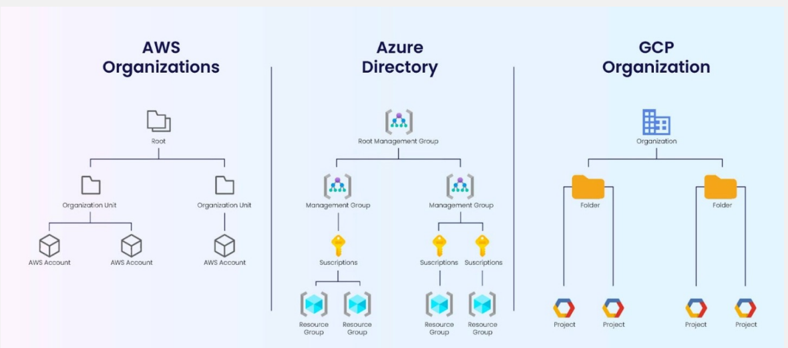

### IAM Identities Users & Groups

- Identities
	- IAM Users
	- IAM User Groups
	- IAM Roles
- IAM Users
	- Identity within your AWS account that has specific permissions for a single person or application
	- IAM users have **long- term** credentials
		- Passwords
		- Access Keys
	- Example
		- Company with 5 employees (A, B, C, D, E)
			- A is the founder
			- B and C are developers
			- D is a system admin (operations)
		- A creates a root account, creates an IAM user for herself and IAM users for the rest
- IAM User Groups
	- Collection of IAM users
		- Allows specification of permissions for multiple users
	- Can contain many users and a user can belong to multiple user groups
	- Can't be nested; can contain only users not other user groups

### IAM Policies

- Policies
	- Identity- Based
		- AWS Managed
		- Customer Managed
		- Inline Policies
	- Resource- Based
		- S3 Bucket Policy
		- SQS Queue Policy
	- Administrator Access
	- Power User Access
	- JSON Document
		- Version Number (Language)
		- "Has" Statements
			- Permissions
		- Components
			- Statement ID
			- Effect
			- Action/ NotAction
			- Resource
			- Conditions
			- Policy Variables
			- Principal
				- Not usually present for identity- based policies because the policy is attached to an entity and is implied from it
- Conditions
	- When a principal makes a request to AWS, AWS gathers the request information into a request context.
		- Actions or operations
		- Resources- AWS resource object upon which the actions or operations are performed
		- Principal- Person or application that used an entity (user or role) to send the request
			- Includes policies associated with the entity the principal used to sign in with
		- Environment Data- e.g. IP address, user agent, SSL enabled status or time of day
		- Resource Data- e.g. DynamoDB table name or a tag on an Amazon EC2 instance
	- You can use the condition element of a JSON policy to compare keys in the request context with key values that you specify in your policy.
- Conditions in IAM Policies
	- Condition Operator
		- String
			- StringEquals
			- StringNotEquals
			- StringLike
		- Numeric
			- NumericEquals
		- Date
		- Boolean
	- If- Exist
		- Can add to the end of any condition operator name
		- If the policy key is present in the context of the request, process the key as specified in the policy
		- If the key is not present, evaluate the condition element as true
- IAM Policies
	- Explicit DENY will have precedence over any ALLOW
	- Best Practice
		- Use least privilege for maximum security
	- IAM Access Advisor
		- See all the permissions granted to an IAM policy and the last time each permission was last accessed
	- IAM Access Analyzer
		- Analyze resource that are shared with external entity

### IAM Roles

- IAM Roles
	- Identity within the account with some permission
	- Similar to a user but *NOT* associated with a specific person
	- A trusted user (identity)  can *TEMPORARILY* assume a role
		- Short term credentials can last anywhere from 1 to 12 hours
	- An entity can assume one role at a time
	- Role Chaining- using the credentials for one role to assume a different role
	- AWS relies on Security Token Service (STS) for some scenarios
		- Not all role access requires STS
		- AWS usually automatically  manages role session credentials without needing an explicit STS call
- Components of a Role
	- Types of policies attached to roles:
		- Trust
			- "Which principals/ entities can assume this role?"
			- A role can only have one trust policy
			- AN identity, such as a user or service
		- Permissions
			- "What resources can a role access?"
			- What actions it can perform on them
			- Can be AWS managed policies, customer managed policies or inline policies attached directly to the role
			- A role can have multiple permission policies
- Role- based Access Control (RBAC)
	- User identities in a RBAC do not, by default, have access or authorization for a given resource.
		- By some authentication mechanism, user accounts will "assume" a role and with that assumption comes all of the access & authorization policies that are tied to the role.
	- The IAM model in AWS is not a pure RBAC, since user identities have permanent authorizations.
	- GCP and Azure integrate more RBAC than AWS.

### IAM Types of Roles

- Service Roles
	- Some AWS services perform actions on your behalf in your own account
		- To perform these actions, they need permissions as well
		- We can assign the permissions to an IAM role
	- Common services that require roles include:
		- EC2
		- Lambda Functions
		- Cloud Formation
		- API Gateway
		- EMR
		- DynamoDB
		- Step Functions
- EC2 Instance Profiles
	- Special type of role
	- Can be attached to EC2 compute instances
		- Eliminates the need for hard coded credentials for any application that runs on the instance itself
	- Applications running on that instance can retrieve temporary security credentials and perform actions that the role allows
	- Uses EC2 metadata service
	- One role at a time per instance
- Cross Account Access Roles
	- If any user or service needs to access resources in another AWS account, they would require a cross account access role.
	- Can be configured to issue fine grained permissions to only the resources and services needed in the second account.
	- After you create the trust relationship, an IAM user or an application from the trusted account can use the AWS STS AssumeRole API operation.

### [IAM Temporary Credentials and Federation](https://docs.aws.amazon.com/IAM/latest/UserGuide/id_roles_create_for-user.html#)

- Temporary Security Credentials
	- You can use the AWS STS to create and provide trusted users with temporary security credentials that can control access to your AWS resources.
	- Temporary security credentials are not stored with the user but are generated dynamically and provided to the user when requested.
- AssumeRole API & STS
	- This operation provides temporary security credentials that enable access to AWS resources in your account.
	- The administrator of the specified account can grant permission to assume a role to any IAM user in that account.
		- Attach a policy to the user or a group, granting permission for the *sts:AssumeRole* action.
		- The policy must specify the role's ARN as the resource.
	- STS verifies the entity's authorization against the  role's trust policy, then provides temporary credentials for the assume role session.
- Federated User Access through Roles
	- Federated Identity- use identity providers (e.g. Google, Microsoft) instead of creating IAM users in AWS.
		- Manage user identities outside of AWS, but give them permissions to access AWS resources in the account.
			- Outsourcing security to a third party
		- SAML 2.0, OIDC, Active Directory, OAuth 2.0
		- Create a role and define permissions  for the role.
		- When a federated identity authenticates:
			- The identity is associated with the role.
			- The identity is granted the permissions that are defined by the role.

### [IAM Recap](https://docs.aws.amazon.com/IAM/latest/User)

- 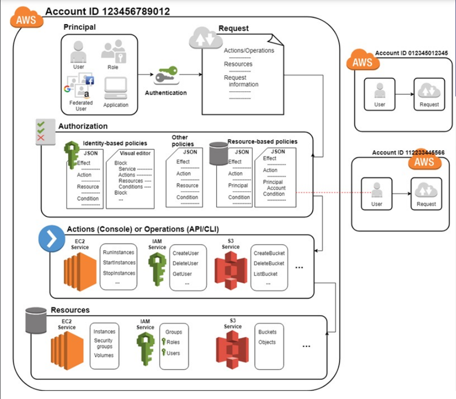

## Serverless Landscape and Compute

### Serverless Landscape

- Serverless Cloud Computing Landscape
	- Categories of Serverless Computing
		- Compute
			- Platform as a Service (Apps)
			- Function as a Service (Functions)
			- Container as a Service (Containers)
		- Storage
			- Blobs (Binary Large Objects)
			- Key/ Value Datastores
		- Analytics
		- AI & ML
- Compute: PaaS
	- Unit of compute is a full app
	- User selects which server/ platform they need, but do not need to manage it anymore.
		- Amazon Elastic Beanstalk
		- Google App Engine
		- Microsoft Azure App Service
		- IBM CloudFoundry
			- Based on open source CloudFoundry
				- Originally developed by VMware, transferred to Pivotal Software (a joint venture by EMC, VMware and General Electric), brought back into VMware by the end of 2019.
		- Oracle Java Cloud Service
- Function as a Service
	- What most people think of as "serverless"
	- Unit of compute is a function
		- Functions run when "events" are triggered
	- Amazon AWS Lambda
	- Microsoft Azure Functions
	- Google Cloud Functions
	- IBM Cloud Functions
		- Based on Apache Open Whisk
	- Oracle Functions
		- Apache Fn Project
	- Open Lambda
- Container as a Service
	- Beefed up version of Function as a Service
		- Containers have to be stateless
		- Unit of compute is a whole container
		- Container runs when "events" are triggered
	- Examples
		- Amazon Elastic Container Service (ECS)
		- Elastic Kubernetes Service (EKS)
		- Fargate
		- Microsoft Azure Kubernetes Service (AKS)
			- Build on top of open source KEDA
		- Google Cloud Run & Anthos
			- Build on top of open source Knative
				- Kubernetes- based platform to deploy and manage modern serverless workloads
		- IBM Cloud Kubernetes Service
		- Oracle Container Engine for Kubernetes
		- Open Source Kubernetes
			- Google Borg
- Serverless Storage: Blobs
	- Binary Large Object (BLOB)
	- Blob Storage
		-  Cloud storage for unstructured data
	- Examples
		- Amazon Simple Storage Service (S3)
		- Microsoft Azure Blob Storage
		- IBM Object Storage
		- Google Cloud Storage
		- Oracle Object Storage
- Serverless Storage: Key/ Value Database
	- Distributed NoSQL Key/ Value Storage Service
	- Examples
		- Amazon DynamoDB
		- Microsoft Azure Cosmos DB
		- Google Cloud Database/ Firestore/ Cloud BigTable
		- IBM Cloudant
		- Open Source: Kassandra

### Serverless Compute & AWS Lambda

- Introduction to Serverless Architecture
	- Applications where some amount of server- side logic is still written by the application developer but unlike traditional architectures, it is run in *stateless compute* containers that are event- triggered, ephemeral (lasts for ~ 1 invocation) and are fully managed by a 3rd party.
	- Function as a Service (FaaS)
		- AWS Lambda is one of the most popular implementations of FaaS at present
	- 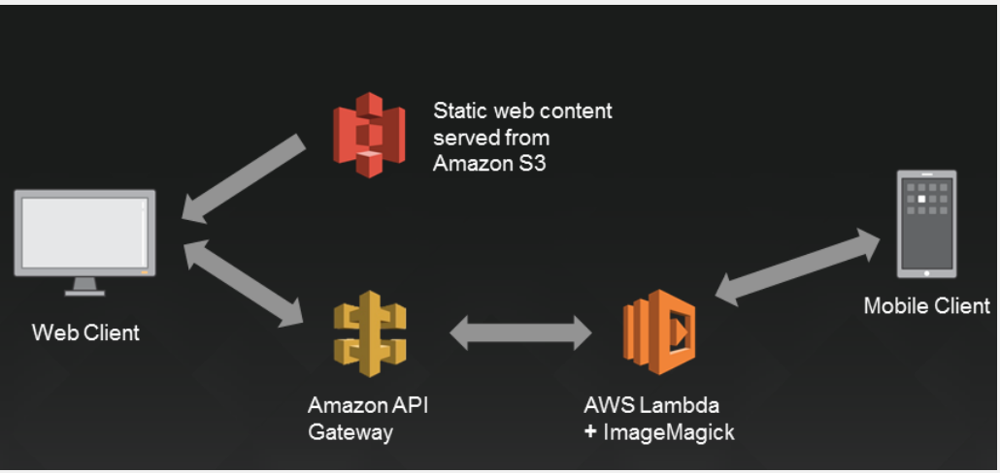
- Desktop Platform
	- 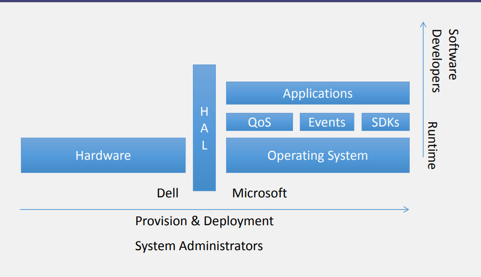
- AWS Cloud Platform (2010)
	- 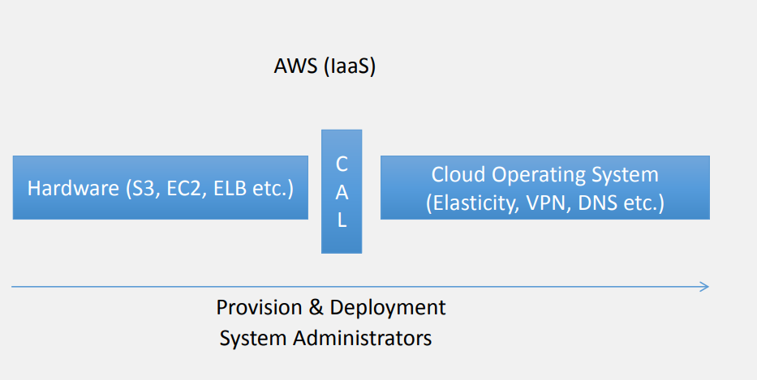
- AWS Cloud Platform (2014)
	- 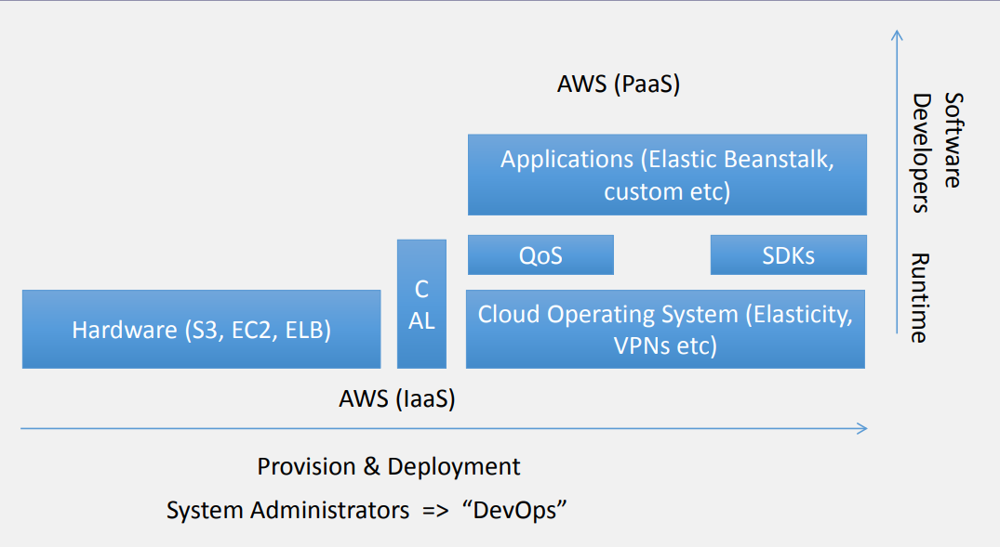
- AWS Cloud Platform (2016)
	- 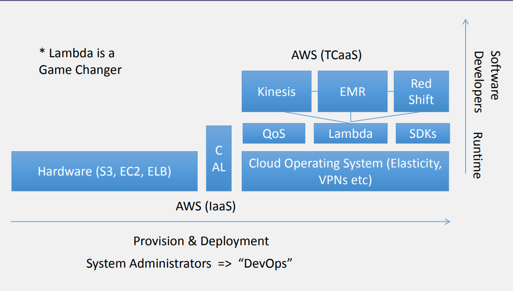
- AWS Elastic Beanstalk 
	- Deploy and scale web applications efficiently
	- Languages
		- Java, .NET, PHP, Node.js, Python, Ruby, Docker
	- Servers
		- Apache, Nginx, Phusion Passenger, IIS
	- By uploading your code, AWS handles:
		- Deployment
		- Auto Scaling
		- Capacity Provisioning
		- Health Monitoring
		- Load Balancing
- AWS Lambda Event- Driven Compute
	- Runs stateless, request- driven code called *Lambda functions* in Java, Node.js and Python
	- Triggered by events (state transitions) in other AWS services
	- Pay only for the requests served and the compute time
	- Focusing on business logic, not infrastructure
	- By uploading your code, AWS Lambda handles:
		- Capacity
		- Monitoring
		- Fault Tolerance
		- Scaling
		- Logging
		- Security Patching
		- Deployment
		- Web Service Front- End
- AWS Lambda Event Sources
	- 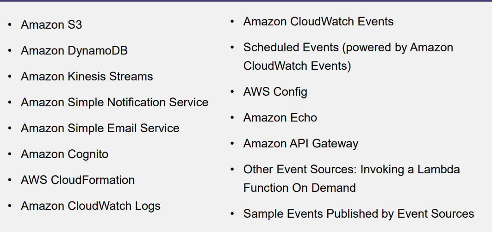
- AWS Lambda Execution Environment
	- Stateless functions
	- Multi- threading is possible
	- 500 MB of temporary storage space
	- Memory can be adjusted manually
		- 128 MB to 1.5 GB
		- 64 GB increments
		- CPU scales accordingly
	- Function should finish in a set timeline
		- Default of 3 seconds, up to 300 seconds
- AWS Lambda Pricing
	- Pay per use of Lambda function
	- Approximately $.20 per 1 million function call
	- Approximately $.00001667 for every GB- second used

## Serverless Storage

### Amazon S3 BLOB Storage

- Definition
	- Online file storage web service offered by AWS
	- Amazon S3 provides storage through web service interfaces REST, SOAP & BitTorrent
- Use Case
	- Scalability, high availability, low latency (~ 99 % availability)
	- Files up to 5 terabytes
	- Objects stored in buckets are owned by users
	- User assigned keys refer to objects
	- Amazon Machine Images (AMI) are exported as a bundle of objects
	- Examples
		- SmugMug, Hadoop file store, Netflix, Reddit, Dropbox
- Simple Storage Service (S3)
	- A **bucket** is a container for objects and describes location, logging, accounting and access control.
		- Has a name that must be **globally unique**
		- Example
			- http://bucket.s3.amazonaws.com/
			- http://bucket.s3-aws-region.amazonaws.com/
	- A bucket can hold any number of objects, which are files that can be up to 5 terabytes
		- Example
			- http://bucket.s3.amazonaws.com/object
			- http://johnsmith.s3.amazonaws.com/photos/puppy.jpg
- Fundamental Operations Corresponding to HTTP Actions
	- http://bucket.s3.amazonaws.com/object
		- POST- a new object or update an existing object
		- GET- an existing object from a bucket
		- DELETE- an object from the bucket
		- LIST- keys present in a bucket with a filter
	- Buckets have a *flat directory structure*
- S3 Weak Consistency Model
	- Updates to a single key are *atomic*
	- S3 achieves high availability by replicating data across multiple Amazon servers.
		- If a PUT request is successful, data is safely stored
		- However:
			- A process writes a new object to Amazon S3 and immediately attempts to read it. Until the change is fully propagated, Amazon S3 might report "key does not exist".
			- A process writes a new object to Amazon S3 and immediately lists keys within its bucket. Until the change is fully propagated, the object might not appear in the list.
			- A process replaces an existing object and immediately attempts to read it. Until the change is fully propagated, Amazon S3 might return the prior data.
			- A process deletes an existing object and immediately attempts to read it. Until the deletion is fully propagated, Amazon S3 might return the deleted data”.
- S3 Command Line Interface
	- 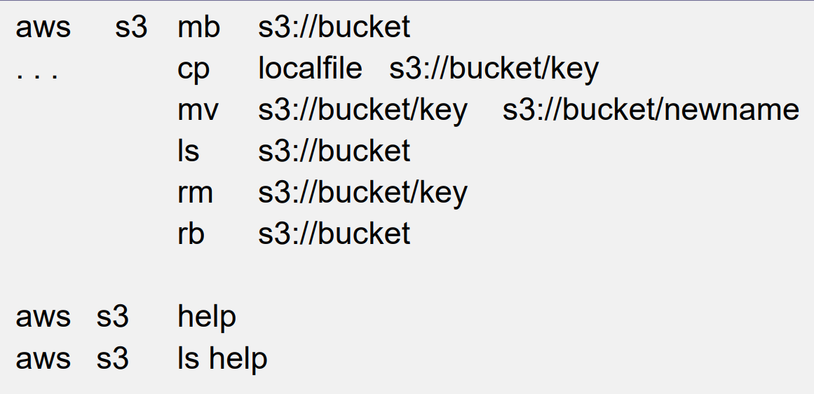

### DynamoDB- NoSQL

- DynamoDB
	- DynamoDB is a fully managed NoSQL database provided by AWS
	- Its structure is similar to a massive distributed B- Tree data structure in the cloud
	- Distributed System
		- Using the consistent hashing algorithm in a ring
		- 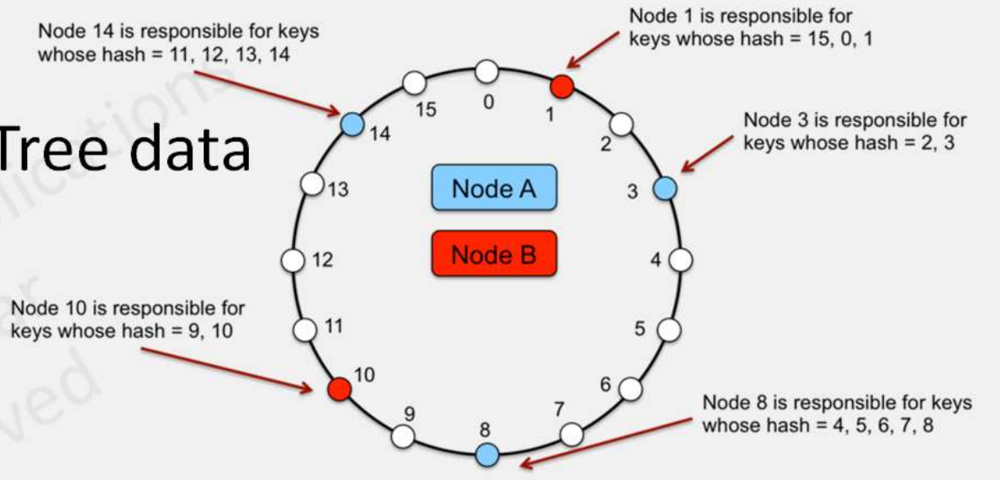
- Usage Model
	- Create a table
		- Since it's a managed service, create a table using the console (or CLI, API)
			- Python Boto3 will be used in our lesson
	- While creating the table, define the primary key
		- This key will be used by DynamoDB to distribute key/ values in different partitions
	- Optionally, you can identify a sort key
		- This key is used to keep the items in a partition sorted
		- Will be useful for query and scanning purposes
- Using the Table: Put
	- Once the table has been defined, you can input values into it
		- DynamoDB items are limited to 400 KB
	- 
- Using the Table: Get
	- Retrieving an item from the table
	- 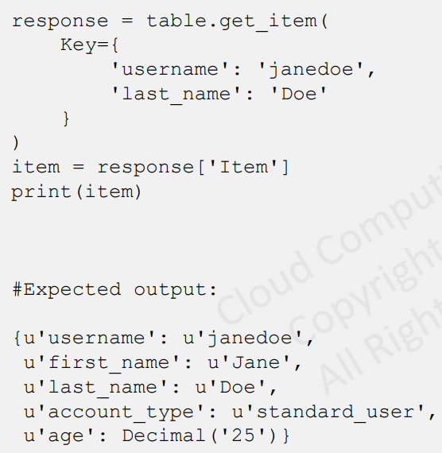
- Query & Scanning
	- In the Relational Database Management System (RDBMS) software world, **query** is usually defined as an operation where there is a usable index available and we can quickly retrieve the item in *$\log(n)$ time.
	- In comparison, **scan** happens where there is no usable index, the engine has to read every record and test for a condition.
	- An RDBMS engine parses a SELECT statement and performs query optimization behind the curtains.
	- DynamoDB allows you to be your own database engine.
- Query
	- Query only works on the **primary** key already defined for the table or any attribute that we have explicitly made a secondary index for.
	- If a composite primary key was used (e.g. hash key + sort key), we can ask query to return a conditional range of value.
	- 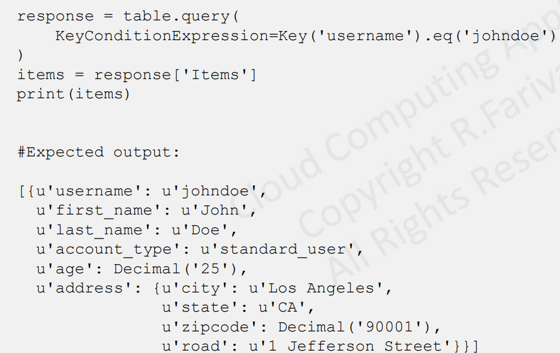
- Scan
	- In the event that we want to perform a query conditioned on attributes and there is no index for them, scan will return everything.
		- It allows you to filter based on any arbitrary condition.
	- 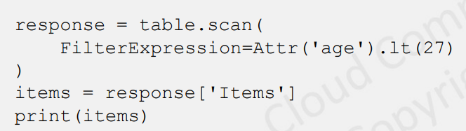
- Secondary Index
	- Similar to the main index, requires a partition key and a sort key
	- Local (LSI)
		- Released by AWS in 2013
		- Immediately consistence
		- Once created, the size of the table cannot grow
			- All the records that share the same partition key need to fit in 10 GB
			- Once the allocation is full, writes to the table will fail
	- Global (GSI)
		- Released a few months after local indexes
		- Eventual consistency model
		- Does not constrain the size of the table

### Dropbox API

- Cloud Storage
	- Dropbox offers cloud file storage
		- Synced across multiple devices
		- Accessible through web interface, mobile apps and directly integrated with file systems on PCs
	- Dropbox itself uses clouds
		- Metadata stored in Dropbox servers
		- Actual files stored in Amazon S3
		- Amazon EC2 instances run the logic
- Dropbox Architecture
	- 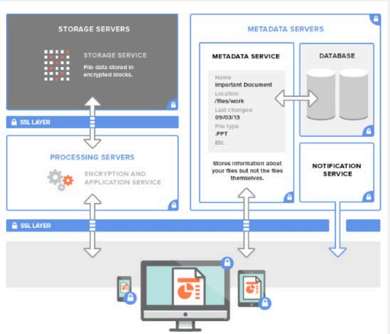
- Dropbox API
	- Drop- Ins
		- Cross- platform UI components that can be integrated in minutes
		- *Chooser* allows instant access to file in Dropbox
		- *Saver* makes saving files to Dropbox easy
	- Core API
		- Support for advanced functionality like search, revisions and restoring files
		- Better fit for deeper integrations
- Drop- In API
	- Simple objects
		- *Chooser* available for JavaScript, Android and iOS
		- *Saver* on web and mobile web
	- Handles all the authentication (OAuth) & file browsing
	- Chooser object returns the following:
		- Link- URL to access the file
		- File Name
		- File Size
		- Icon
		- Thumbnails
	- Saver
		- Passes in the URL, file name and options
- Core API
	- Many languages and environments
		- e.g. Python, Ruby, PHP, iOS, Android, OS X, HTTP
	- Based on HTTP and OAuth
		- OAuth v1, OAuth v2
	- Low level calls to access and manipulate a user's Dropbox account
		- Create URL schemes
		- Upload & download files
		- List files and folders
		- Delta
		- Metadata access
		- Create & manage file sharing