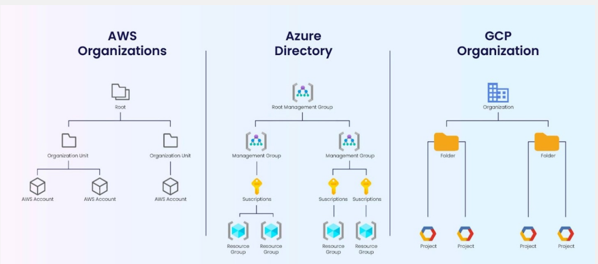

# CS498- Week 3

#cloud_computing

## Identity and Access Management

### IAM Concepts

- Topics
	- Authentication vs. Authorization
	- Shared Responsibility Model
	- Principle of Least Privilege
	- Higher- Level Structures
	- Account
	- Identities: Users & Groups
	- Policies
	- Roles
	- Federated User Access
	- Role- Based Access Control
- Shared Responsibility Model
	- Customer
		- Management of the guest OS (including updates & security patches)
		- Application software or utilities installed by the customer on the instances
		- Configuration of firewalls
		- Use of IAM tools to apply appropriate permissions
	- Cloud Provider
		- Operates, manages & controls the components from the host OS and virtualization layer
		- Controls the physical security of the facilities in which the service operates
- Principle of Least Privilege
	- Users across an organization should be given the lowest level of access they need to perform their required tasks across a cloud environment.
	- Benefits
		- Reduced potential for cyberattacks
		- Compliance
- Authentication
	- Identifying users in an environment
	- A principal must be authenticated (signed into AWS) using their credentials to send a request to AWS.
		- Console
			- Sign in with username, password and MFA
		- CLI
			- Authenticate with access key and secret key
		- Federation
			- Get authenticated by another identity provider
			- Get access to AWS resources by assuming a *role*.
- Authorization
	- Determining what someone is allowed to do
	- Determining if someone is allowed to do something
		- Policies
			- Identity- Based (ABC role can do XYZ actions)
			- Resource- Based (Only ABC role can perform XYZ actions)
				- Popular for granting cross account access
			- Permissions Boundaries
				- Set the maximum permissions that an identity- based policy can grant to an IAM entity
			- Organization Service Control Policy (SCP)

### IAM Accounts & Organizations

- Account
	- In AWS, an account is a container
		- Contains a set of cloud resources
		- Contains identities (e.g. users or applications taking roles) that can access the aforementioned resources
	- It is common practice to have one account for development, an account for staging and another account for production.
	- Equivalent concepts in other clouds:
		- GCP- Project
		- Azure- Resource Group
- Higher Level Structures
	- 

### IAM Identities Users & Groups

- Identities
	- IAM Users
	- IAM User Groups
	- IAM Roles
- IAM Users
	- Identity within your AWS account that has specific permissions for a single person or application
	- IAM users have **long- term** credentials
		- Passwords
		- Access Keys
	- Example
		- Company with 5 employees (A, B, C, D, E)
			- A is the founder
			- B and C are developers
			- D is a system admin (operations)
		- A creates a root account, creates an IAM user for herself and IAM users for the rest
- IAM User Groups
	- Collection of IAM users
		- Allows specification of permissions for multiple users
	- Can contain many users and a user can belong to multiple user groups
	- Can't be nested; can contain only users not other user groups

### IAM Policies

- Policies
	- Identity- Based
		- AWS Managed
		- Customer Managed
		- Inline Policies
	- Resource- Based
		- S3 Bucket Policy
		- SQS Queue Policy
	- Administrator Access
	- Power User Access
	- JSON Document
		- Version Number (Language)
		- "Has" Statements
			- Permissions
		- Components
			- Statement ID
			- Effect
			- Action/ NotAction
			- Resource
			- Conditions
			- Policy Variables
			- Principal
				- Not usually present for identity- based policies because the policy is attached to an entity and is implied from it
- Conditions
	- When a principal makes a request to AWS, AWS gathers the request information into a request context.
		- Actions or operations
		- Resources- AWS resource object upon which the actions or operations are performed
		- Principal- Person or application that used an entity (user or role) to send the request
			- Includes policies associated with the entity the principal used to sign in with
		- Environment Data- e.g. IP address, user agent, SSL enabled status or time of day
		- Resource Data- e.g. DynamoDB table name or a tag on an Amazon EC2 instance
	- You can use the condition element of a JSON policy to compare keys in the request context with key values that you specify in your policy.
- Conditions in IAM Policies
	- Condition Operator
		- String
			- StringEquals
			- StringNotEquals
			- StringLike
		- Numeric
			- NumericEquals
		- Date
		- Boolean
	- If- Exist
		- Can add to the end of any condition operator name
		- If the policy key is present in the context of the request, process the key as specified in the policy
		- If the key is not present, evaluate the condition element as true
- IAM Policies
	- Explicit DENY will have precedence over any ALLOW
	- Best Practice
		- Use least privilege for maximum security
	- IAM Access Advisor
		- See all the permissions granted to an IAM policy and the last time each permission was last accessed
	- IAM Access Analyzer
		- Analyze resource that are shared with external entity

### IAM Roles

- X

### IAM Types of Roles

- X

### IAM Temporary Credentials and Federation

- X

### IAM Recap

- X

## Serverless Landscape and Compute

### Serverless Landscape

- X

### Serverless Compute & AWS Lambda

- X

## Serverless Storage

### Amazon S3 BLOB Storage

- X

### DynamoDB- NoSQL

- X

### Dropbox API

- X