# CS498- Week 4

#cloud_computing

## MapReduce Programming Model

### Introduction to MapReduce

- Motivation: Large Scale Data Processing
	- Many tasks composed of processing lots of data to produce lots of other data
	- Large Scale Data Processing
		- We want to use 1000+ CPUs, but don't want the hassle of managing 1000+ CPUs
	- MapReduce provides:
		- User defined functions
		- Automatic parallelization & distribution
			- Parallelization-  technique of dividing a large computational task into smaller sub- tasks that can be executed concurrently on multiple processors or cores, reducing overall computation time
		- Fault tolerance
		- I/O scheduling
		- Status information
		- Cluster monitoring
		
### MapReduce: Motivation

- Challenges with Traditional Programming Methods (MPI)
	- "Predecessor" of MapReduce
	- Message Passing Interface (MPI)
	- MPI has two blocks: MPI_Send and MPI_Receive
	- This abstraction is too simple- deadlock *is* possible
		- Blocking the communication can cause a deadlock
			- "Crossed" calls when trading information
			- Example:
				- Process 1: MPI_Receive(Process 2, A); MPI_Send(Process 2, B)
				- Process 2: MPI_Receive(Process 1, B); MPI_Send(Process 1, A)
			- A potential workaround to this problem is MPI_SendRecv(), which polices the traffic
	- Large overhead from communication mismanagement
		- Time spent blocking is time wasted on cycles
		- Can overlap communication with non- blocking communication channels
	- Load imbalance is possible and machines may die unexpectedly
		- Things get exponentially difficult too quickly, which means we need to find a better way
- Commodity Clusters
	- Web datasets can be extremely large
		- 100+ TB
		- It is usually not possible to mine on a single server
	- Standard Architecture:
		- Cluster of commodity Linux nodes
		- Gigabit Ethernet interconnect
	- "How should we organize computations on this architecture?"
		- "How do we mask issues such as hardware failure?"
- Solution
	- Use distributed storage
		- 6 ~ 24 disks attached to a blade
		- 32 ~ 64 blades in a rack connected by Ethernet
	- Push computations down to storage
		- Computations process contents of disks
		- Data on disks read sequentially from beginning to end
		- Rate limited by speed of disks (speed can get at data)
- Cluster Architecture
	- 
- Stable Storage
	- First Order Problem:
		- "If nodes can fail, how do we store persistently?"
	- Answer: Distributed File System
		- Provides global file namespace
		- e.g. Google GFS/ Hadoop HDFS
	- Typical usage pattern
		- Large files (100+ GB to 100+ TB)
		- Data is rarely updated in place
		- Reads and appends are commonplace

### MapReduce Programming Model

- What is MapReduce?
	- MapReduce
		- Programming model from LISP
			- *Map* and *reduce* are high order functions in LISP
		- Programming model/ pattern within the Hadoop framework that is used to access large data stored in the Hadoop File System (HDFS)
			- Generating large datasets with a parallel, distributed algorithm on a cluster
	- Easy to distribute
		- Hides difficulty of writing parallel code
		- System takes care of load balancing, dead machines etc.
		- Easy to use retry & failure semantics
- Programming Concept
	- Map
		- **Perform** a function on **individual values** in a dataset to create a **new list** of values
	- Reduce
		- **Combine** values in a dataset to create a **new value**
	- 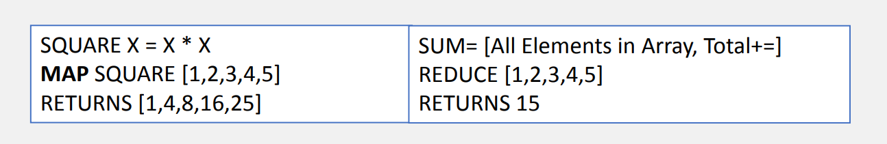
- MapReduce Programming Model
	- **Input & Output**: Each a set of key/ value pairs
	- Example 1:
		- The programmer specifies two functions:
			- MAP(IN_KEY, IN_VALUE)
				- LIST(OUT_KEY, INTERMEDIATE_VALUE)
		- Processes input key/ value pair
		- Produces intermediate pairs
	- Example 2
		- The programmer specifies two functions:
			- REDUCE(IN_KEY, IN_VALUE)
				- LIST(OUT_KEY, INTERMEDIATE_VALUE)
		- Combines all intermediate values for a particular key
		- Produces a set of merged output values (usually just one)

### MapReduce Example: Word Count

- Word Count
	- Assume that you have a large file of words with many words in each line
	- Assume that you need to count the number of times each distinct word appears in the file
- Word Count Program
	- 
		- Note that you can opt not to use the input key (in this case, LINE)
		- When you map, your key can be any object that is serializable (in this case, word "w")
		- REDUCE uses a grouping function that tallies up all the created intermediate key value pairs created by MAP
- Word Count Illustrated
	- 

### MapReduce Example: Pi Estimation & Image Smoothing

- Pi Estimation
	- Estimating the value of $\pi$ using Monte Carlo
		- Throw darts
		- Compute ratio of darts landed within square vs darts landed within the circle
		- Evaluate whether a particular dart landing within the circle is easy
	- **Mapper**
		- Generate points in a unit square and count points inside/ outside of the inscribed circle of the square
	- **Reducer**
		- Accumulate points inside/ outside results from the mappers
	- After the MapReduce job, estimate $\pi$
		- The approximation looks like $\frac{Inside Number}{Outside Number}$ , which is equivalent to $\frac{Area of the Circle}{Area of the Square}$
- Image Smoothing
	- To smooth an image, we need to use a sliding mask to replace the value of each pixel
	- **Mapper**
		- Input Key: x, y
		- Input Value = RGB
		- Emit 9 Points (Coordinates + RGB Values)
			- (x - 1, y - 1, R, G, B)
			- (x, y - 1, R, G, B)
			- etc.
	- **Reducer**
		- Input Key: x, y
		- Input Value: List of RGB
		- Compute the average RGB
		- Emit key = (x, y) and value = (avg RGB)

### MapReduce Example: Page Rank

- PageRank Algorithm
	- History
		- Implemented by Google to rank any type of recursive "documents" using MapReduce
		- Developed at Stanford by Google founders, Larry Page and Sergey Brin in 1995
		- Led to a functional prototype named Google in 1998
	- PageRank value for a page $u$ is dependent on the PageRank values for each page $v$ out of the set $B_u$ (all pages linking to page $u$), divided by the number $L(v)$ of links from page $v$
		- $PR(u) = \sum\limits_{v\in B_u}\frac{PR(v)}{L(v)}$ 
- PageRank
	- Phases
		- Propagation
		- Aggregation
	- Input
		- Pool of objects, including vertices and edges
- PageRank: Propagation
	- **Map**: for each object
		- If object is vertex, emit key = URL, value = object
		- If object is edge, emit key = **source URL**, value = object
	- **Reduce**: input is a web page and all the *outgoing* links
		- Find the number of edge objects --> outgoing links
		- Read the PageRank from the vertex object
		- Assign $PR(edges) = \frac{PR(vertex)}{num \; outgoing}$ 
- PageRank: Aggregation
	- **Map**: for each object
		- If object is vertex, emit key = URL, value = object
		- If object is edge, emit key = **destination URL**, value = object
	- **Reduce**: input is a web page and all the *incoming* links
		- Add the PR of all incoming links
		- Assign $PR(edges) = \sum PR(incoming \; links)$ 

### MapReduce Summary

- MapReduce Advantages/ Disadvantages
	- It's easy to program for many CPUs
		- Communication management is effectively obsolete since I/O scheduling is automatically done for us
		- Fault Tolerance & Monitoring
			- Machine failures, sudden hardware issues etc. are handled quickly
		- It's easier to design and program
		- Can scale/ cascade several MapReduce tasks
	- This comes at the cost of restricting solvable problems
		- Expressing or representing a problem in MapReduce may be challenging
		- Data parallelism is key
			- Ability to break down a problem into palatable data chunks
- MapReduce Conclusions
	- MapReduce has proven to be a useful abstraction
	- Greatly simplifies large- scale computations
	- Functional programming paradigm can be applied to large- scale applications
	- Allows us to focus on problem, let the middleware deal with the messy details

## Hadoop

### Introduction to Hadoop

-  Execution
	- 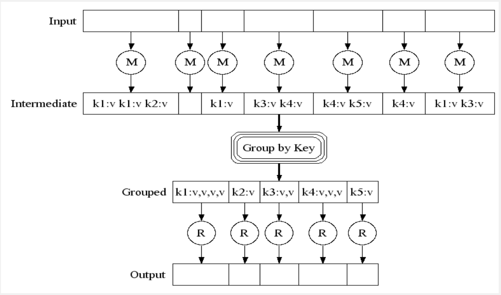
		- Input file is divided into arbitrary sized pieces
		- Pieces are stored (e.g. via HDFS)
		- Map is run on input data chunks
		- Intermediate key- value pairs are created
		- Key- value pairs are integrated into the framework
		- Framework groups by key
		- Framework then passes them into Reduce invocations, which will create the output
- Hadoop
	- Task Workflow
		- 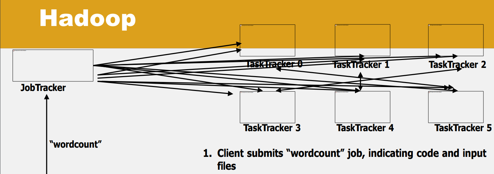
			- Client submits "wordcount" job, indicating code and input files
				- Code is typically stored in a Java archive (JAR) file format
				- Code comes with metadata that tells the location of its file, typically stored on HDFS
			- JobTracker breaks input file into $k$ chunks, (in this case 6) and assigns work to TaskTrackers
			- After map(), TaskTrackers exchange map- output to build reduce() keyspace
			- JobTracker breaks reduce() keyspace into $m$ chunks, (in this case 6) and assigns work
			- reduce() output may go to HDFS
		- JobTracker is the "Master" node in the cluster that coordinates everything
		- TaskTracker is the daemon that listens to the instructions of the JobTracker
- Execution Initialization
	- Split input file into 64 MB sections (Google File System- GFS)
		- Read in parallel by multiple machines
	- Fork off program onto multiple machines
	- One machine is designated as "Master"
	- Master assigns idle machines to either Map or Reduce tasks
	- Master coordinates data communication between map and reduce machines
		- Akin to test- train- validation split in ML
- Partition Function
	- Inputs to map tasks are created by contiguous splits of input files
	- For reduce, we need to ensure that records with the same intermediate key ends up at the same worker
	- System uses a default partition function 
		- e.g. hash(key) mod R (hash based key- value mapping)
	- It may be useful to override
		- e.g. hash(hostname(URL)) mod R
		- Ensures URLS from a host ends up in the same output file
- Map- Machine
	- Reads contents of assigned portion of input file
	- Parses & prepares data for input to Map
		- e.g. read <a /> from HTML
		- Classes implementing InputFormat
	- Passes data into map function and saves result in memory 
		- e.g. <target, source>
	- Periodically writes completed work to local disk
	- Notifies Master of this partially completed work (intermediate data)
- Reduce- Machine
	- Receives notification from Master of partially completed work
	- Retrieves intermediate data from Map- Machine via remote- read
	- Sorts intermediate data by key
		- e.g. target page
	- Iterates over intermediate data
		- For each unique key, send corresponding set through reduce function
	- Appends result of reduce function to final output file (via GFS)
- Data Flow
	- Input & final output are stored on a distributed file system
		- Scheduler tries to schedule map tasks "close" to the physical storage location of input data
	- Intermediate results are stored on local FS of map and reduce workers
	- Output is often input to another map reduce task


### Big Data Pipelines- The Move to Hadoop

- Why Pipelines Are Behind Everything
	- The rise of large datasets begets the need for a system that can reliably and quickly organize the data
	- "Big data" may be a trend, but *how* to get it reliably is the big question
	- Use Cases
		- Relevant content tailored to users
		- Programmatic digital advertising
		- Data analytics for research
	- Data keeps growing exponentially
		- Google has spent bullions on infrastructure spending
- What is a Data Pipeline?
	- System that transforms events into a usable format
		- Input
			- Raw logs, interactions, activities
		- Output
			- Datasets for specific users (filtered, aggregated, joined etc.)
	- Scale
		- Billions of transactions per day (millions per minute)
		- TBs of data per day (GBs per minute)
- Where We Came From
	- Customized mini- clusters of hardware
		- Tailored to specific types of jobs
			- Transformation, Joins, Aggregations
		- Pro
			- Mix of memory/ CPU configuration specifications for job types
		- Con
			- Scaling issues, overhead of HW setup & maintenance
	- Lack of well- defined interfaces & API
		- No standard schema format or data model
	- Data access limitations
		- Access was limited to core developers with advanced data and programming knowledge
- Past Architecture
	- 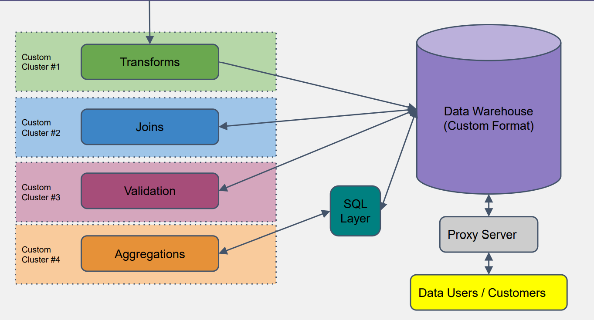
- Why Move to Hadoop?
	- Legacy systems were not performing well (< 1 TB per day)
	- Customers wanted access to raw feeds (> 1 TB per day per customer)
	- Advertising roadmap called for a 3 ~ 5x increase in traffic (new features, new customers onboarding)
	- Cost of physical storage grew exponentially cheaper
- The Promise of Hadoop
	- PB+ storage capabilities
		- Multi- tenant internal clusters made up of 1000's of nodes can handle TBs of data easily
		- Storage was fault- tolerant with default 3x replication
		- Easy to scale up as new growth occurred
	- Hosted service for job execution and data storage
		- No more need for separate clusters as Map/ Reduce could handle all types of jobs
		- ETL operations easily handled using Pig Latin interface
		- New innovative frameworks were starting up (HBase, Hive, Oozie), promising more platform adoption
- Architecture on Hadoop
	- 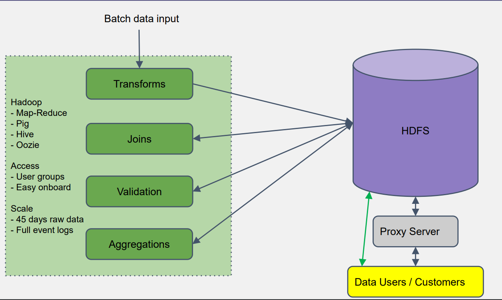
- Life on Hadoop
	- Platform hardening has its own consequences
		- Migrating data users and customers to the new system took longer than expected
		- Running large- scale data pipelines on multi- tenant clusters caused customer issues
	- Data for everyone (for those who are permitted)
		- Number of data users increased dramatically on Hadoop
	- Scaled better than expected (over the past 5 years of its inception)
		- As data size continues to grow, job runtime and data latency has continued to shrink

### Introduction to YARN

- Hadoop 1.X
	- 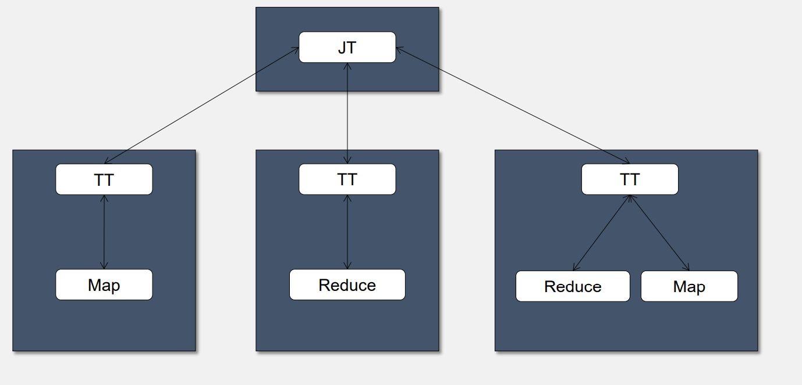
- Issues with Hadoop
	- Hadoop JobTracker was a barrier for scaling
		- Primary reason why Hadoop 1.X is recommended for clusters <= 4000 nodes
		- Thousands of applications each running tens of thousands of tasks
		- JobTracker was not able to schedule resources as fast as they became available
		- Distinct map and reduce slots led to artificial bottlenecks and low cluster utilization
	- MapReduce was being abused by other application frameworks
		- Frameworks trying to work around sort and shuffle methods
		- Iterative algorithms were suboptimal
	- YARN strives to be application framework agnostic
		- Different application types can share the same cluster
		- Runs MapReduce "out of the box" as part of Apache Hadoop
- What is YARN?
	- Yet Another Resource Negotiator (YARN)
	- Provides resource management services
		- Scheduling
		- Monitoring
		- Control
	- Replaces the resource management services of the JobTracker
	- Bundled with Hadoop 0.23 and Hadoop 2.X
- YARN High- Level Architecture
	- ResourceManager
		- Single, centralized daemon for scheduling containers
		- Monitor nodes and applications
	- NodeManager
		- Daemon running on each worker node in the cluster
		- Launches, monitors and controls containers
	- ApplicationMaster
		- Provides scheduling, monitoring and controlling capabilities for an application instance
		- RM launches an AM for each application submitted to the cluster
		- AM requests containers via RM & launches containers via NM
	- Containers
		- Unit of allocation and control for YARN
		- AM and application- specific tasks run within containers
	- 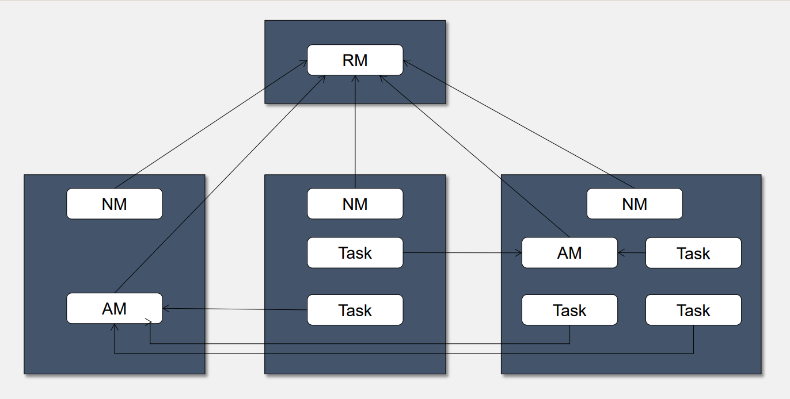

### MapReduce on YARN

- MapReduce
	- 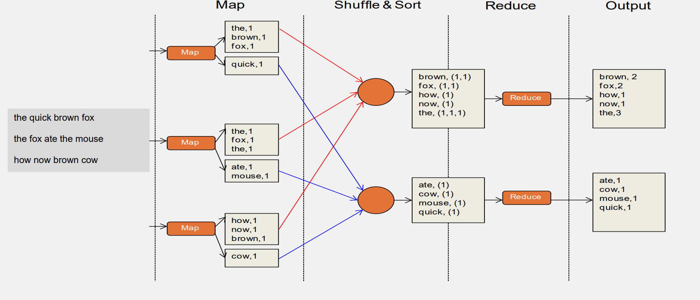
- MapReduce on YARN
	- MapReduce AM determines the number of map and reduce tasks
		- Split meta- info file indicates the number of map tasks based on number of splits
		- Job config determines number of reducers
	- AM schedules when to request containers for map and reduce tasks
		- Split meta- info file has data locality for each map task
		- Reducers have no locality
		- Users headroom provided by RM to avoid livelocks where reducers consume all available resources but need more maps to run
	- Tasks connect back to AM upon startup via TaskUmbilicalProtocol
		- Report progress, liveliness
		- AM kills tasks that do not report progress in a timely manner
		- AM provides reducers with shuffle data locations
		- Reducers notify AM of shuffle fetch failures; AM relaunches map tasks if necessary
	- Shuffle provides as a plugin service to NodeManagers
		- Shuffle port configurable, passed to reducers via AM
	- AM responsible for job history
		- Job history events written to a file as job progresses
		- Copied to a drop location in HDFS when job completes
		- Used to provide recovery when AM crashes and is retried by RM
	- MapReduce AM provides client interface
		- Report job and tasks status
		- Kill job or task attempts
		- Web app and services
		- Client can redirect to job history server if application has completed

### MapReduce on YARN in Diagram

- MapReduce on YARN
	- 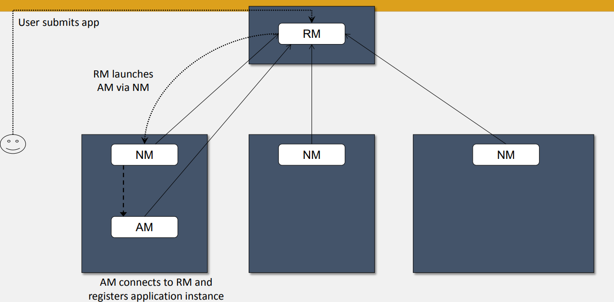
	- 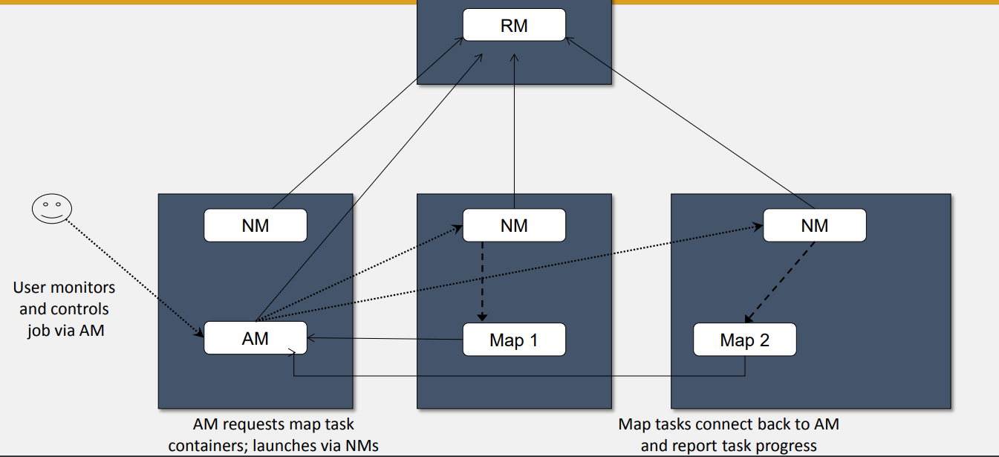
	- 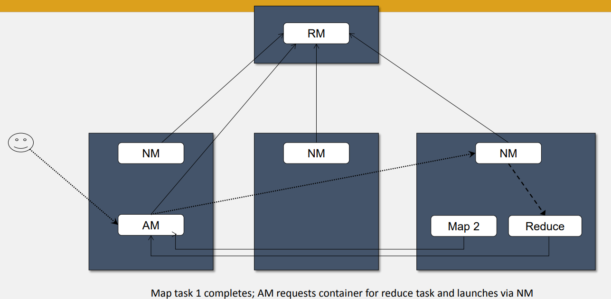
	- 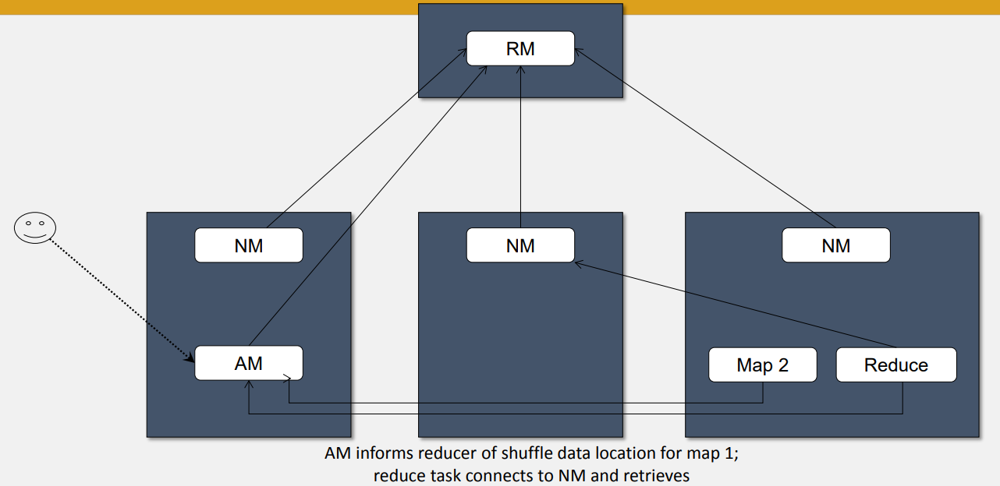
	- 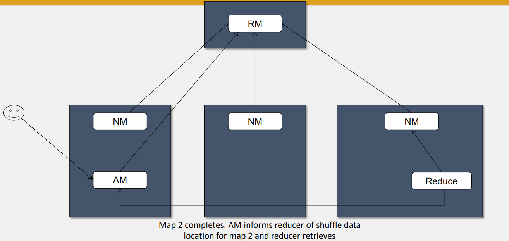
	- 

## Apache Spark

### Motivation for Spark

- Motivation
	- Iterative algorithms and interactive data exploration are commonly used in many domains
	- Traditional MapReduce & classical parallel runtimes cannot solve iterative algorithms efficiently
		- Hadoop- repeated data access to HDFS, no optimization to data caching & transfers
		- MPI- no natural support of fault tolerance & programming interface is complicated
- Retrofitting Iterations on MapReduce
	- MapReduce does not support iteration out of the box
		- However, we still need PageRank and clustering capabilities of MapReduce
			- Apache Mahout
			- Apache Nutch
	- "Obvious" Solution
		- Split iterations into multiple MapReduce jobs
		- Write driver for orchestration
- MapReduce Implementation of Iterative Algorithms
	- 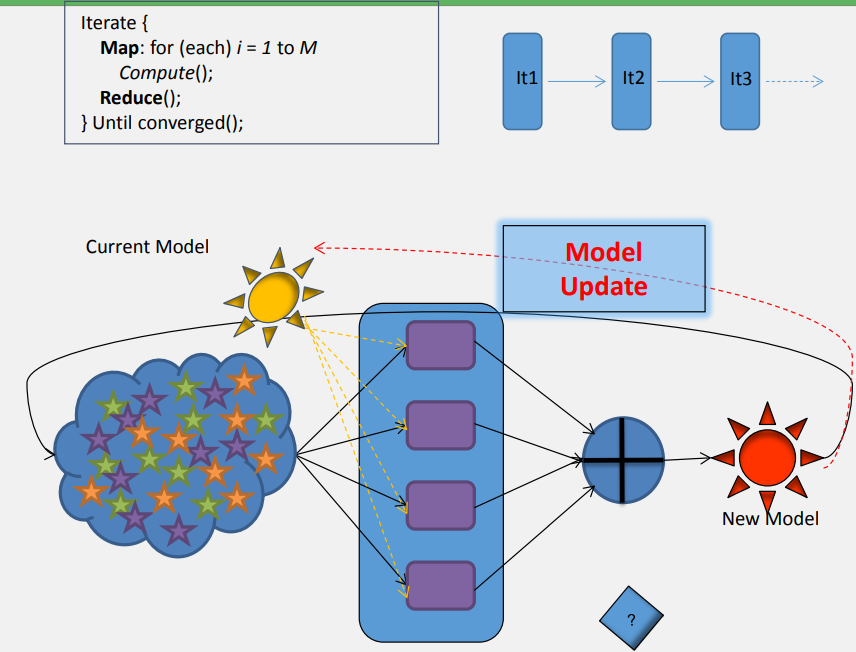
		- Issues
			- Repeated reads of constant (input) data in each iteration
				- Must continue until convergence has been achieved
			- Runtime overheads in each iteration (for each MapReduce job)
			- Intermediate communication resulting from model updates
			- Model Update Traffic
			- Granularity of parallelism limited by iteration

### Apache Spark

- Apache Spark
	- Extending the MapReduce model to better support two common classes of analytics apps:
		- **Iterative** algorithms (ML, graphs)
		- **Interactive** data mining
	- Enhance programmability
		- Integrate into Scala
		- Allow interactive use from Scala interpreter
- Motivation
	- 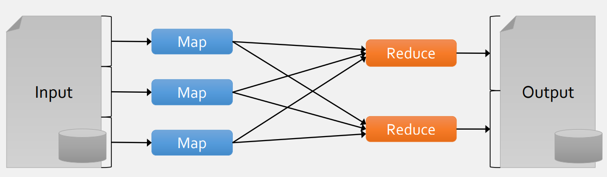
	- Most current cluster programming models are based on acyclic data flow, from stable storage to stable storage
	- With data flow, runtime can decide where to run tasks and can automatically recover from failures
	- Acyclic data flow is inefficient for applications that repeatedly reuse a *working* set of data:
		- **Iterative** algorithms (ML, graphs)
		- **Interactive** data mining tools (R, Excel, Python)
	- With current frameworks, apps reload data from stable storage on each query
- Solution: Resilient Distributed Datasets (RDDs)
	- Allow apps to keep working sets in memory for efficient reuse
	- Retain the attractive properties of MapReduce & address the shortcomings of fault tolerance, data locality and scalability
	- RDDs support a wide range of applications
- Programming Model
	- Resilient Distributed Datasets (RDDs)
		- Immutable, partiioned collections of objects
		- Created through parallel transformations (map, filter, groupBy, join...) on data in stable storage
		- Can be *cached* for efficient reuse
	- Actions on RDDs
		- Count, Reduce, Collect, Save

### Spark Example: Log Mining

- Example
	- 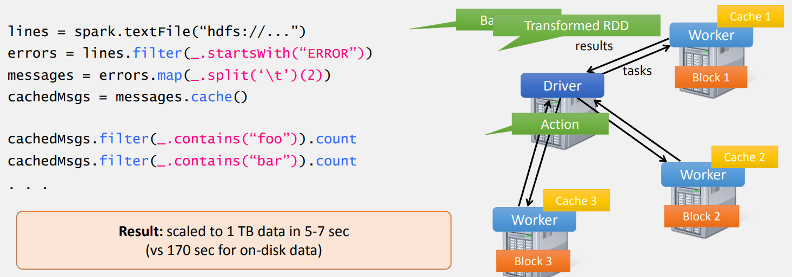
	- Load error messages from a log into memory, then interactively search for various patterns

### Spark Example: Logistic Regression

- Example
	- 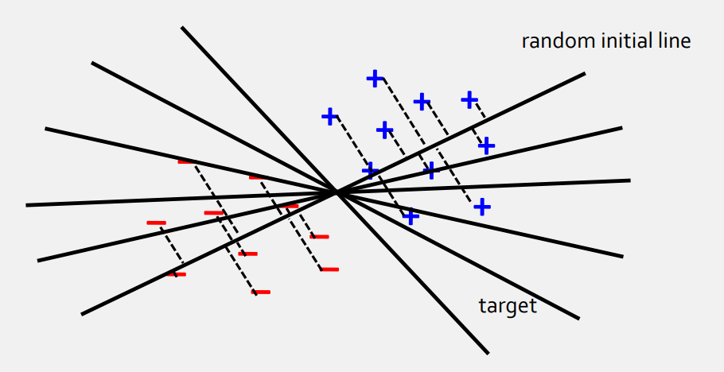
	- Goal: Find the best line separating two sets of points
	- Scala
		- 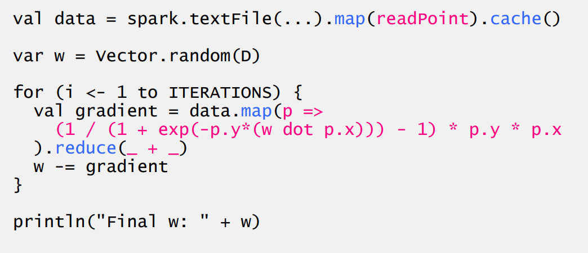
	- Performance
		- You'll find that as the number of iterations increase, the runtime of Hadoop becomes exponentially greater than the runtime of Spark

### RDD Fault Tolerance

- RDD Fault Tolerance
	- RDDS maintain **lineage** information that can be used to reconstruct *lost* partitions
	- 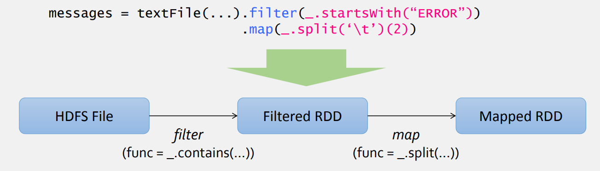

### Interactive Spark

- Interactive Spark
	- Modified Spark interpreter that allows Spark to be used interactively from the command line
	- Required two changes:
		- Modified wrapper code generation so that each line typed has references to objects for its dependencies
		- Distribute generated classes over the network
- Frameworks Built on Spark
	- Pregel on Spark (GraphX)
		- Google message passing model for graph computation
	- Hive on Spark (SparkSQL)
		- Compatible with Apache Hive
		- ML operators in Scala
	- MLLib
		- Scalable Machine Learning Library

### Spark Implementation

- Implementation
	- Runs on Apache Mesos or YARN to share resources with Hadoop & other apps
	- Can read any Hadoop input source (e.g. HDFS)
- Spark Scheduler
	- 
	- Dryad- like (distributed data parallel program) DAGs (Directed Acyclic Graphs)
	- Pipelines functions within a stage
	- Cache- aware work reuse & locality
	- Partitioning- aware to avoid shuffles

## HDFS

### HDFS Introduction

- Large- Scale Data Processing
	- Numerous tasks
		- Processing massive amounts of data in parallel to produce other data
	- Large- Scale Data Processing
		- We want to use 1000+ CPUs
		- We **do not** want overhead of **managing** storage
		- Storage devices fail ~1.7% in Year 1, ~8.6% in Year 3 (Google, 2007)
		- 10,000 nodes, 7 disks per node results in ~1190 failures per year or ~3.3 failures per day
	- MapReduce provides:
		- User defined functions
		- Automatic parallelization & distribution
		- Fault tolerance
		- I/O scheduling
		- Status & monitoring
- HDFS
	- Synergistic with Hadoop
		- Apache Project inspired by Google MapReduce & GFS
	- Throughput scales with attached HDs
	- Large production clusters are built in many companies
	- Doesn't try to be POSIX (Portable Operating System Interface) compliant
	- Optimized for reads, sequential writes & appends
- References
	- Google File System 
		- SOSP 2003
	- Hadoop Distributed File System
		- 2010 IEEE 26th Symposium on Mass Storage Systems and Technologies (MSST)
- Stable Storage
	- Question:
		- "If node failure is the norm and not the exception, how can we store data persistently?"
	- Answer:
		- Distributed File System replicates files
			- Provides global file namespace
			- e.g. Google GFS, Hadoop HDFS, Kosmix KFS
	- Typical usage pattern
		- Large files (100+ GB ~ TBs)
		- Data is rarely updated in place
		- Multiple copies improves availability
		- Read & appends are common 
			- Truly living up to its name of "stable storage"
- Distributed File System
	- DataNode Server
		- File is split into contiguous chunks
		- Each chunk is 16 ~ 64 MB
		- Each chunk replicated usually twice or thrice
		- Sends heartbeat and BlockReport to NameNode
	- Replicas are placed: one on a node in a local rack, one on a different node in the local rack and one on a node in a different rack 
- HDFS Architecture
	- 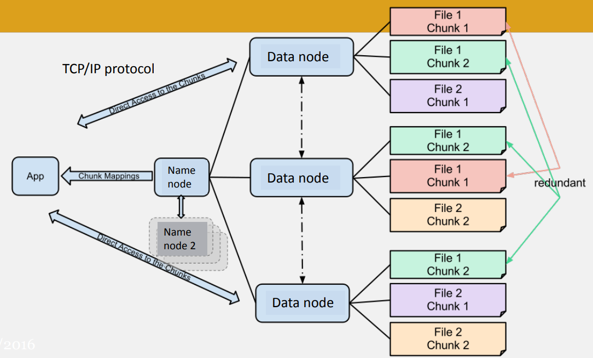
- Distributed File System
	- Master Node
		- Equivalent to NameNode in HDFS
		- Stores metadata
		- Might be replicated
	- Client library for file access
		- Talks to master to find data node chunk
		- Connects directly to data node servers to access data
- Replication Pipelining
	- When the client receives response from NameNode, it flushes its block in small pieces (4K) to the first replica, that in turn copies it to the next replica and so on
		- Data is pipelined from data node to the next
- Staging
	- Client request to create a file that does not reach NameNode immediately
		- Think "Git Add"
	- HDFS client caches the data into a temporary file.
		- When the data reaches an HDFS block size, the client contacts the NameNode
	- NameNode inserts the filename into its hierarchy and allocates a data block for it
	- NameNode responds to the client with the identity of the data node and the destination of the replicas (data nodes) for the block
	- Client flushes it from its local memory
- Application Programming Interface
	- HDFS provides Java API for applications to use
	- Python access is also used in many applications
	- C language wrapper for Java API available
	- CLI provided in Hadoop
	- Command syntax similar to bash
		- Example
			- ```/bin/hadoop dfs -mkdir /foodir```- creates a directory called ```/foodir```
	- HTTP browser can be used to browse the files of an HDFS instance