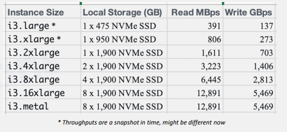
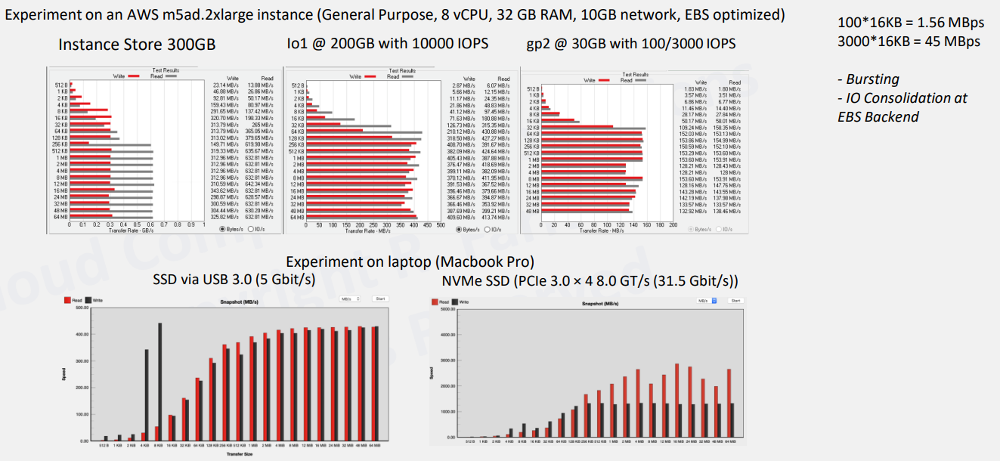
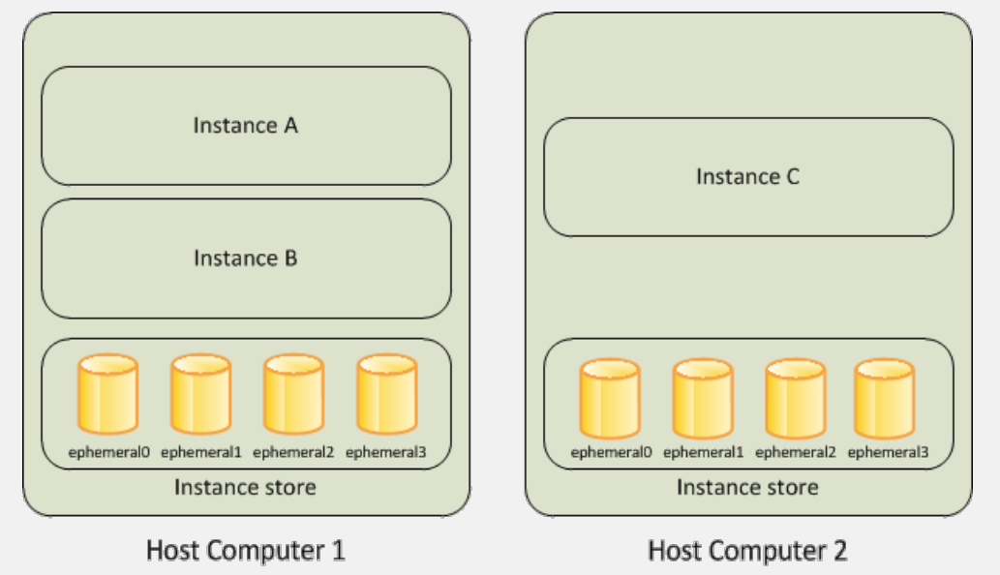
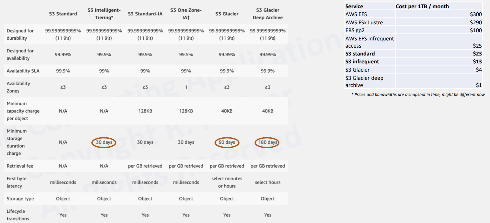
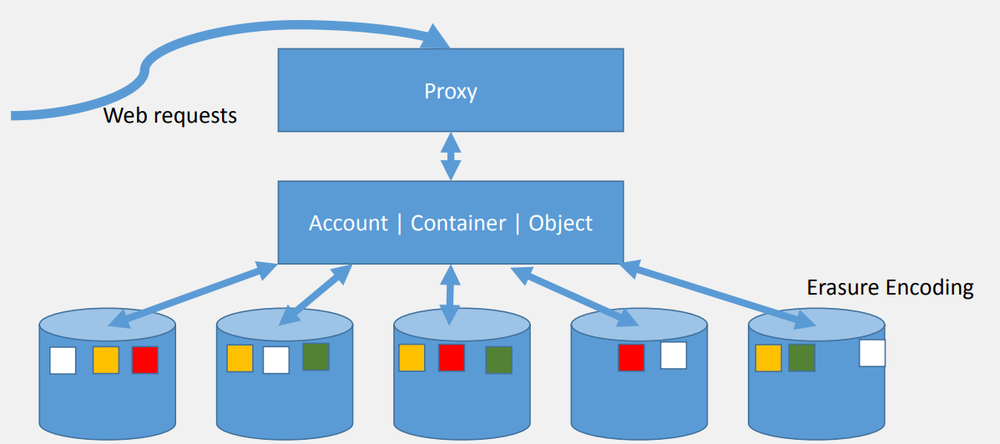
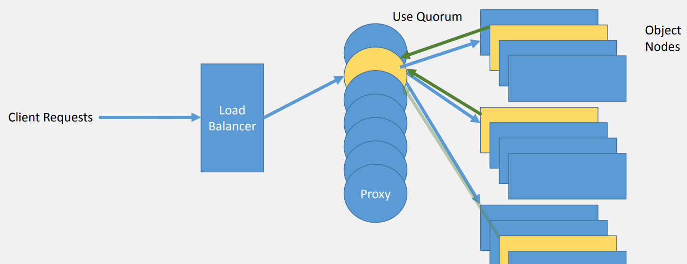
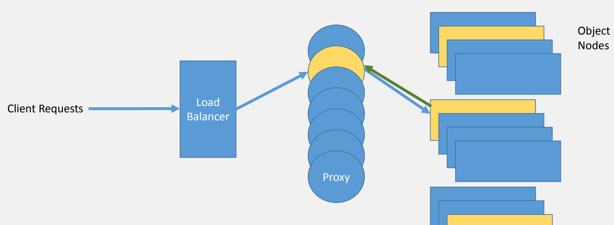
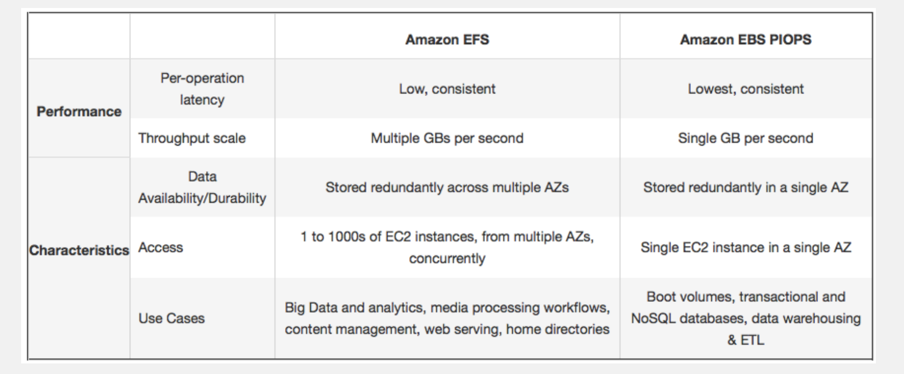

# CS498- Week 5

#cloud_computing

## Block Storage on the Cloud

###  Cloud Storage: Basics

- Cloud- Based Storage
	- Data storage as one of the first use cases for cloud computing
	- Cloud storage models have converged into a few main categories
- File System
	- Middleware between physical storage device and programs running on top of the OS
		- Block Storage
		- Typically 3 layers
			- Physical File System
				- Processes physical blocks being read or written
				- Handles buffering and memory management
				- Physical placement of blocks in specific locations on the storage medium
				- Interacts with the device drivers
			- Virtual File System
				- Support for the multiple concurrent instances of physical file systems, each of which is called a file system implementation
			- Logical File System
				- File access, directory operations, security & protection
				- Consistency is guaranteed
	- File systems contain metadata
		- An inode (index node) is present for each file or directory and provides:
			- Locations of the data blocks for the file
				- Data content of a file is stored as a sequence of file system blocks internally
			- Attributes about the file (e.g. "time last accessed" or "owner of file")
			- The inode table records where each inode is located, indexed by number
			- Directories are special files listing the names and inode numbers of files under the folder
- Block Storage
	- Internally, the data content of a file is stored as a sequent of file system *blocks*
		- Each block is a fixed number of bytes
			- The last block might not always be full
		- Within a block, all bytes are sequential
			- However, within a file, the blocks might not reside sequentially on the disk
		- Underlying storage systems are usually organized as blocks
			- Ideally, file system blocks are aligned with the storage system's blocks
- POSIX File System ([IEEE 1003.1-2017](https://standards.ieee.org/ieee/1003.1/7101/))
	- Set of operations that the file system has to support
	- POSIX file systems are organized as directories (folders) containing files (documents)
	- POSIX file systems are **logically** treated as a sequence of bytes
	- POSIX API
		- `mount`, `unmount` file system
		- `open`, `close` file descriptor
		- `seek`, `iseek`, `fseek` to a position in the byte stream
		- `write`, `read` to & from file descriptor
		- `mkdir`, `rmdir`, `create`, `unlink`, `link`, `symlink`
		- `fnctl` (e.g. byte range locks)
		- `stat`, `utimes`, `chmod`, `chown`, `chgrp`
		- Path names are case sensitive, components are separated with a `/`
- POSIX Semantics
	- Semantics
		- Defines what is and is not guaranteed to happen when a POSIX I/O API call is made
	- Example
		- After a write() to a regular file has successfully returned:
			- Any successful read() from each byte position in the file that was modified by that write() shall return the data specified by the write() for that position until such byte positions are again modified
			- Any subsequent successful write() to the same byte position in the file shall overwrite that file data
		- Write() is strongly consistent
			- A write() is required to block application execution until the system can guarantee that any other read() call will see the data that was just written
- Summary
	- Block Storage Model Overview
	- File System Layers
		- Physical
		- Virtual
		- Logical
	- POSIX File System
		- API
		- Semantics

### Cloud Block Storage Overview

- Cloud Storage: Block Storage- Instance Stores
	- Physical machine running the VM is physically connected to the storage device
		- Virtual devices whose underlying hardware is physically attached to the host computer for the instance
		- Data transfer is limited by SAT/ NVMe bandwidth
	- 
	- Since the machine may be rented to someone else in the next minute, the data stored on the drive must not persist, it is **ephemeral**
		- Example
			- AWS Instance Store
			- Google: Local SSD
- Storage Virtualization
	- Process of presenting a logical view of the physical storage resources to a host computer system
		- Block Virtualization
		- File Virtualization
- Cloud Block Storage- Virtual Block Stores
	- Simulate a hard drive of SSD
	- Physical machine running the VM is separate from the physical machine hosting the data
		- NVMe over Fabric
			- NVMf or NVMe-oF
		- Data transfer is limited by network bandwidth
	- **Hypervisor** on the host machine has middleware that intercepts the network communication and presents the network stream of bytes to the VM as a "block storage device"
		- Example
			- AWS EBS as an NVMe device
			- Google Cloud: Persistent Disk
	- Typically less storage bandwidth than the previous option of EBS
		- Can select how much bandwidth you are willing to pay for
	- gp2 types are preselected & fixed
		- Input/ Output Operations per Second (IOPS)
		- e.g. 3 IOPS per GB, 16 KB per second per IOPS, min 100, max 16,000
		- Bursting Support
		- Note: A single EC2 instance can be attached to more than 1 EBS volume
	- Some instance types are EBS optimized
		- Bandwidth for EBS access is separate from network bandwidth
		- Other (micro, small, older generation) share network bandwidth
- AWS Elastic Block Storage
	- Depending on IO requirements, different offerings & prices are available
		- Example
			- gp2: up to 250MB per second @ $.10 per GB- month
			- io1: up to 1,000MB per second @ $.125 per GB- month & $.065 per IOPS- month
- Instance Store vs. EBS Throughput
	- 

### Amazon AWS EBS Storage

- Amazon AWS Instance Store
	- Another form of cloud- hosted **temporary** block- level storage
		- Provided as part of an instance (e.g. Amazon EC2)
	- Contents will be lost if the cloud instance is stopped
		- However, it offers higher performance and bandwidth to the instance
		- Contents are located on disks that are physically attached to the host computer
	- Best used for temporary storage such as caching or temporary files, with persistent storage held on a different type of server
	- 
- Instance Store Lifetime
	- Data persists only during the lifetime of its associated instance
		- It persists a reboot
	- Data is lost if:
		- Underlying disk drive fails
		- Instance is stopped
		- Instance is terminated
	- Reliability can be assured by:
		- Using a distributed file system (e.g. HDFS)
		- Backing up to S3 or EBS
- Instance Store Size
	- A typical instance store is small
		- SSD: 80 GB ~ 320 GB, up to 3,840 GB on x1.32xlarge
		- HDD: when available on older generation instances, up to 1,680 GB
- Amazon AWS EBS
	- EBS volumes are highly available and reliable
	- Can be attached to running instances in the same AZ
		- Persists independently of the life of an instance
	- Use when data must be quickly accessible and requires long- term persistence
	- Supports encryption
	- Up to 16 TB in size
	- Types
		- General Purpose SSD (gp2)
			- 100 IOPS per GiB, burst up to 10,000, 160 MB per second throughput
		- Provisioned IOPS SSD (io1)
			- Provision a specific level of performance
			- Up to 20,000 IOPS and 320 MB per second throughput
		- Throughput Optimized HDD (st1)
			- Low cost magnetic storage
			- Throughput of up to 500 MB per second
			- Large, sequential workloads such as Amazon EMR, ETL, data warehouses and log processing
		- Cold HDD (sc1)
			- Inexpensive magnetic
			- Throughput of up to 250 MB per second

## Object Storage on the Cloud

### Cloud Object Storage

- Cloud Object Storage
	- Distributed file systems are not easy to achieve
		- Considerable overhead, complexity & cost
		- Maintaining consistency while providing transparency is challenging
	- CAP: Consistency, Availability, Partition Tolerance
	- Transparency
		- "Invisible" to client programs, which "see" a system which is similar to a local file system
			- Behind the scenes, the distributed file system handles locating files, transporting data and potentially providing other features listed below
			- While transparency may seem trivial, these semantics can incur a significant performance penalty at scale despite not being strictly necessary
- Internet Scale Storage: Breaking the Chains of Transparency & Consistency
	- "What if we want to scale to unlimited storage?"
		- We would need to sacrifice a component of CAP
			- Availability: Important to keep, otherwise customer data may be unavailable
			- Partition Tolerance: Networks do fail, cloud providers need to be resilient
			- Consistency: Can be sacrificed
	- Typical BLOB storage by a cloud provider can scale "infinitely", by being "eventually consistent"
		- Typically not POSIX compliant
	- Access Model
		- REST APIs: GET, PUT, DELETE
	- Examples
		- AWS S3
		- OpenStack Swift
- AWS S3 Consistency Model
	- Objects have a URI and are accessible by REST API calls.
	- If you PUT to an existing key, a subsequent read might return the old data *or* the updated data, but it never returns corrupted or partial data.
	- Availability wise, data will be replicated across AWS datacenters (AZ).
		- If a PUT request is successful, data is safely stored. However, temporarily:
			- A process writes a new object to Amazon S3 and immediately lists keys within its bucket. **Until the change is fully propagated, the object might not appear in the list.**
			- A process replaces an existing object and immediately tries to read it. **Until the change is fully propagated, Amazon S3 might return the previous data.**
			- A process deletes an existing object and immediately tries to read it. **Until the deletion is fully propagated, Amazon S3 might return the deleted data.**
			- A process deletes an existing object and immediately lists keys within its bucket. **Until the deletion is fully propagated, Amazon S3 might list the delete object.**
		- Amazon S3 does not currently support object locking. If two PUT requests are simultaneously made to the same key, the request with the latest timestamp wins.
		- Updates are key- based, there is no way to make atomic updates across keys.
- Cloud Object Storage
	- By relaxing the consistency model, building the distributed storage system becomes simpler
		- Storage costs are significantly cheaper
		- Bandwidth can be higher
			- Up to ~ 25 GB per second
		- Unlike previous models (e.g. Block Storage, Managed File System), data can be accessible from outside the cloud
			- Examples
				- Mobile app customers from around the world
				- Personal computers
- AWS S3 Tiers
	- 
- Summary
	- Cloud Object Storage
	- Consistency Model
	- API
	- Tiers

### OpenStack SWIFT

- Definition
	- Binary Large Object (BLOB) is a collection of binary data  stored as a single entity in a  database management system
- Use Case
	- Store unstructured object data like  text or binary data
	- Images
	- Movies
	- Audio, Signal Data
	- Large queue of messages
- Examples
	- Windows- Azure Blob Storage
	- LinkedIn- Ambry
	- Facebook- Warm BLOB Storage
	- Amazon- AWS Simple Storage Services (S3)
	- Apache- Open Stack Blob Service (SWIFT)
- Goals
	- 50% ~ 70% of data is unstructured or archival
	- RESTful API (HTTP)
	- High Availability (no single point of failure)
	- Agile Data Centers
	- Open Source
	- Multi- Region, Geographic Distribution of Data
	- Storage Policies
	- Erasure Coding
- Swift API
	- Example
		- `PUT /version2/roy/myblobs/classvideo1`
		- `GET/version2/reza/hisblobs/yesterdaysdataforhadoop`
- Swift Components
	- 
- Write Requests: Load Balancer & Proxy
	- 
- Read Requests: Load Balancer & Proxy
	- 
- Details
	- MD5 checksums with each object
	- Auditing and active replication
	- Any sized disks
- Swift Partitions
	- 1 node, 8 disks, 16 partitions per disk- 8 \* 16 = 128 partitions
	- 2 nodes, 8 disks each, 8 partitions per disk- 8 \* 16 = 128 partitions
	- Use a hashing ring to map objects into storage partitions

## File System on the Cloud

### Cloud Managed File Systems

- Clustered File Systems
	- Allows files to be accessed using the same interfaces and semantics as local files
	- Functionalities
		- Mounting/ Unmounting
		- Listing Directories
		- Read/ Write at Byte Boundaries
		- System's Native Permission Model
		- Fencing
		- Concurrency
		- Consistency
	- Examples
		- NFS
			- Unix
			- v4, v4.1 (pNFS extension)
		- SMB
			- Windows
		- Lustre
			- HPC
		- Ceph
			- Many OpenStack implementations use Ceph as the storage substrate
		- Gluster
			- Classic file serving, second- tier storage & deep archiving
- Clustered File System Consistency
	- Ideally, a parallel file system would completely hide the complexity of distributed storage and exhibit a behavior as it is specified by POSIX
		- Fencing
	- Easy to accomplish on a single machine, much harder to achieve on a cluster of servers as maintaining CAP is harder
		- Consistency: Every read receives the most recent write or an error
		- Availability: Every request receives a non- error response, without the guarantee that it contains the most recent write
		- Partition Tolerance: The system continues to operate despite an arbitrary number of messages being dropped (or delayed) by the network between the nodes
- Cloud- Based File Systems
	- Rolling your own clustered distributed file system
		- Grab a number of "storage optimized" VMs or metal machines
			- Each machine has a large & fast instance block store
				- e.g. SSDs/ HDDs attached to the instance
			- Instances are maintained 24/7
			- Distributed file system is installed onto the instance
				- e.g. Lustre, MS DFS, NFS, Ceph, Hadoop 
	- The managed file system is deployed by the cloud provider
- Cloud- Managed File Systems
	- Amazon
		- AWS FSx for Lustre
		- AWS FSx for Windows File Server
		- AWS EFS
	- Azure
		- Azure Files
			- SMB access protocol
			- REST API
		- Azure Data Lake Storage
			- Hadoop compatible file system
	- Google
		- Cloud Filestore
			- NFS v3
			- Up to 64 TB
- Google Filestore, IBM Cloud File Storage & AWS EFS
	- Google Filestore
		- Simple commands to create a Filestore instance with Google cloud
	- IBM Cloud File Storage
		- Up to 12 TB
		- Up to 48,000 IOPS
- Are Managed File Systems Distributed?
	- FSx for Windows File Server
		- Max: 64 TB
		- Can utilize Microsoft DFS to unify data from many file servers for hundreds of petabytes
			- Shared Namespace (Location Transparency)
			- Replication (Redundancy)
	- FSx for Lustre
		- Max: 100 TB
		- Throughput: Read 50 ~ 200 MB per second per TB, can burst to 3,000 MB per second per TB
			- e.g. 50.4 TB runs on 22 file servers
	- AWS EFS
		- Max: Petabytes
		- Throughput is available to a file system that scales as a file system grows
			- 50 MB per second per TB, can burst up to 100 MB per second per TB
		- Supports NFS v4.1
	- Azure
		- Azure Files
		- Max: 100 TB
		- Data Lake Storage (Generation 2)
			- HDFS Semantics
			- Built on top of Azure Blob Storage
			- Distributed File System
				- Can serve exabytes
				- Throughput is measured in gigabits per second (Gbps)
- Distributed File Systems Design Goals
	- **Access Transparency**
		- Clients are unaware that files are distributed and can access them in the same way as local files are accessed
	- **Location Transparency**
		- A consistent namespace exists encompassing local as well as remote files
		- The name of a file does not give its location
	- **Concurrency Transparency**
		- All clients have the same view of the state of the file system
		- If one process is modifying a file, any other processes on the same system or remote systems that are accessing the files will see the modifications in a coherent manner
	- **Failure Transparency**
		- Client and client programs should operate correctly after a server failure
	- **Heterogeneity**
		- File service should be provided across different hardware and operating system platforms
	- **Scalability**
	- File system should work well in small environments (1 machine ~ a dozen machines) and also scale gracefully to bigger ones (hundreds ~ tens of thousands of systems)
	- **Replication Transparency**
		- Clients should be unaware of the file replication performed across multiple servers to support scalability
	- **Migration Transparency**
		- File should be able to move between different servers without the client's knowledge
- Summary
	- Clustered File Systems
	- File Systems in the Cloud

### Amazon AWS Elastic File System

- Amazon AWS EFS
	- Elastic File System (EFS)
	- Motivation
		- Enterprise customers need a large distributed file system
		- S3 is large and distributed, but it is an object store without performance guarantees and eventual consistency models
		- Block storage (e.g. EBS, instance store) are small
			- Enterprise can build a distributed file system on top of these, but it requires additional operation expenses
		- Glacier is only good for archival storage
	- EFS provides a fully NFSv4 compliant network file system
	- SSD backed
		- Highly available and durable
			- Files, directories and links are stored redundantly across multiple AZs within an AWS region
	- Can grow or shrink as needed
		- No need to pre- provision capacities
	- 

### Ceph: Case Study

- 

## Archive Storage, Backups, Storage Gateways & Massive Data Transfers

### Cloud Archive Storage & Backup

- 

### AWS Glacier

- 

###  Storage Gateway & Mass Data Transfer

- 

## Internet- Level Personal File Systems

### Internet Level Personal File System

- 
