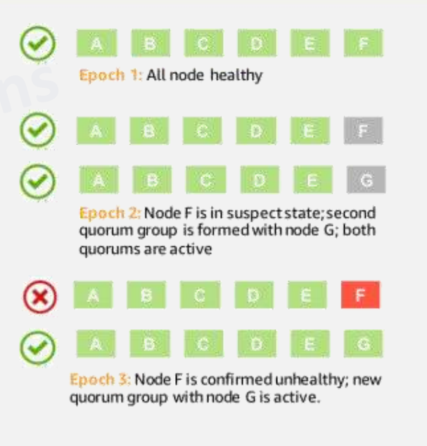
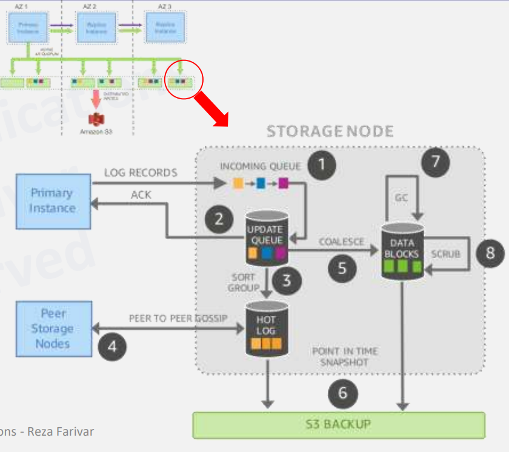

# CS498- Week 6

#cloud_computing

## Relational Databases on the Cloud

### Cloud Databases Introduction

- Overview
	- OLTP, SQL
		- Traditional SQL RDBMS
		- Cloud Optimized
	- NewSQL
		- Spanner
		- CosmosDB
	- NoSQL
		- Key/ Value
		- Wide- Column
		- Document
		- Graph
		- In- Memory
- NewSQL
	- Class of relational database management systems
		- Scalability of *NoSQL* systems for online transaction processing (OLTP) workloads
		- ACID guarantees of a traditional database system
	- SQL as primary interface
	- Components
		- Distributed Concurrency Control
		- Flow Control
		- Distributed Query Processing
	- Automatically splits databases across multiple nodes using Raft or [Paxos consensus algorithm](https://en.wikipedia.org/wiki/Paxos_(computer_science))
	- Consistency over availability (CP from CAP)
		- Strong consistency
		- Sacrificing some availability
- NoSQL Categories
	- Key- Value
	- Graph DB
	- BigTable
	- Document

### RDBMS in the Cloud

- Relational Cloud Databases
	- Managing a relational database has been a high- skill, labor- intensive task
	- Relational databases store data with predefined schemas and relationships between them
	- These databases are designed to support ACID transactions, maintain referential integrity and strong data consistency
		- ACID
			- Atomicity
			- Consistency
			- Isolation
			- Durability
	- OLTP Workloads
		- On- Line Transactional Processing (OLTP)
- Relational Databases
	- In large systems, failures are commonplace, not an exception
	- Users want to start with a small footprint and then grow larger without infrastructure limiting their velocity
	- Replication
		- Storage (SAS, NAS, Aurora)
		- Database
		- Application
	- 
- Sharding
	- Split dataset by certain criteria and store the *"shards"* on separate *"clusters"*
		- Sharding can be considered an embodiment of the "share- nothing" architecture and essentially involves breaking a large database into several smaller databases
	- One common way to split a database is splitting tables that are not joined in the same query onto different hosts
	- Another method is duplicating a table across multiple hosts and then using a hashing algorithm to determine which host receives a given update
- Managed Relational Databases
	- Traditional single server databases running on a VM
		- AWS RDS: MySQL, PostgreSQL, MariaDB, Oracle, MS SQL Server
		- Azure SQL Database, Database for MySQL, PostgreSQL, MariaDB
		- Google Cloud SQL
		- IBM Cloud Databases for PostgreSQL, DB2 on Cloud
	- Instances are fully managed, relational MySQL, PostgreSQL and SQL Server databases
	- Cloud provider handles replication, patch management and database management to ensure availability and performance
	- Availability through failover
	- Horizontal scalability through read replicas
		- Vertical scalability by using larger machines (e.g. 64 processors, 400 GB RAM)
	- Typically the database instance is accessible by most compute resources in the cloud provider's network
		- VM (AWS EC2, Azure VM, Google Compute Engine)
		- PaaS (AWS Elastic Beanstalk, Google App Engine)
		- Serverless (AWS Lambda, Google Cloud Functions, Azure Functions)
	- Over the Internet
		- SQL Proxy
		- Google Cloud SQL Proxy for Public Interfacing
	- Encryption at rest and in transport

### Multinode RDBMS

- Beyond a Single Node
	- Replication Options in MySQL
		- Classical MySQL Replication
			- One master, multiple slaves
			- Support for many masters to many slaves
			- Asynchronous
			- No conflict resolution or *"protection"*
		- MySQL Group Replication
			- Distributed state machine replication with strong coordination between servers
			- Build on Paxos
				- Majority vote for transaction commit
				- Network partition can stop the system
		- Galera
			- Multi- Master
		- MySQL (NDB) Cluster
			- Synchronous
- Replication in Databases
	- Replication is a feature allowing the contents of one or more servers (masters) to be mirrored on one or more servers (slaves)
	- **Scalability**: By having one or more slave servers, reads can be spread over multiple servers, reducing the load on the master
		- Most common scenario for a high- read, low- write environment is to have one master, where all the writes occur, replicating to multiple slaves, which handles most of the reads
	- **Backup Assistance**: Backups can run more easily if a server is not actively changing the data
		- Most common scenario is to replace the data to a slave, which is then disconnected from the master with the data in a stable state
			- Backup is performed from this server
			- Idea of a state- preserving quarantine operation
- Replication and Binary Log
	- Main mechanism for replication is the binary log
		- All updates to the database (data manipulation & data definition) are written into the binary log as `binlog` events
		- Binary log contains a record of all changes to the database, both data & structure, as well as how long each statement took to execute
			- Consists of a set of binary log files and an index
		- Statements such as `CREATE`, `ALTER`, `INSERT`, `UPDATE` and `DELETE` will be logged, but statements that have no effect on the data such as `SELECT` and `SHOW` will not be logged
	- Slaves read binary log from each master in order to access the data to replicate
- Database Replication
	- Relay log is created on the slave server, using the same format as the binary log and is used to perform the replication
		- Old relay log files are removed when no longer needed
	- Slave server keeps tracks of the position in the master's binlog if the last event applied on the slave
		- Allows the slave server to reconnect and resume from where it left off after replication has been temporarily stopped
		- Allows a slave to disconnect, be cloned and then have the new slave resume replication from the same master
		- There will be a delay between the master and the replica.
			- Data on the replica eventually becomes consistent with the data on the master
			- Feature is recommended for workloads that can accommodate this delay
- Replication Steps
	- Steps
		- Replication events are read from the master by the IO thread and queued in the relay log
		- Replication events are fetched one at a time by the SQL thread from the relay log
		- Each event is applied on the slave to replicate all changes done on the master
	- Replication is essentially asynchronous
		- The 3rd step can optionally be performed by a pool of separate replication worker threads
			- **In- order** executes transactions in parallel, but orders the commit step of the transactions **to happen in the exact same order as on the master**
				- Transactions are only executed in parallel to the extent that this can be automatically verified
			- **Out of order** can execute and commit transactions **in parallel**
				- Application must be tolerant to seeing updates occur in different times
				- Only when explicitly enabled by the application
- Asynchronous Replication
	- 
	- Standard Replication
	- Provides infinite read scale out
		- Most websites fit into this category, where users are browsing the website, reading articles or viewing products
		- Updates only occur during the session management, when making a purchase or adding a comment/ message to a forum
	- Provides high availability by upgrading slave to master
	- [`slaves read-only`](https://mariadb.com/kb/en/server-system-variables/#read_only) to ensure no one accidently updates them
	- Eventual consistency
- Semi- Synchronous Replication
	- 
	- Better than eventual consistency
	- Master waits for at least one acknowledgement (ACK)
		- Slower commits
	- If no ACK is received and timeout occurs, master reverts to asynchronous state
	- When at least one ACK is received, master goes back to semi- synchronous
- GTIDs- Based Replication
	- MySQL method based on GTIDs
		- Global Transaction Identifiers (GTIDs)
	- Transactional
		- Does not require working with log files or positions within these files
		- May simplify common replication tasks
	- Replication using GTIDs guarantees consistency between master and slave as long as all transactions committed on the master have also been applied on the slave
- Multi- Source Replication
	- 
	- One server has many masters from which it replicates
	- Allows you to combine data from different sources
	- Different domains executed independently in parallel on all slaves
- AWS RDS Horizontal Scaling
	- Scaling beyond the compute or I/O capacity of a single DB instance for read- heavy database workloads
	- Amazon RDS uses the MariaDB, MySQL, Oracle, PostgreSQL and Microsoft SQL Server DB engines' built- in replication functionality to create a special type of DB instance called a "read replica" from a source DB instance
		- Up to 5 read replicas from one DB instance for MariaDB & MySQL
			- Similar limit of 5 replicas in Azure as well
			- Aurora allows 15 read replicas
		- Specify an existing DB instance as the source
		- Amazon RDS takes a "snapshot" of the source instance and creates a read- only instance from the snapshot
		- Amazon RDS then uses the asynchronous replication method for the DB engine to update the read replica whenever there is a change to the source DB instance
	- Updates to the source DB instance are **asynchronously** copied to the read replica
	- If the read replica resides in a different region than its source DB instance, Amazon RDS sets up a secure communications channel between the source and the read replica
		- Amazon RDS establishes any AWS security configurations needed to enable the secure channel, such as adding security group entries
	- Replicas can be "promoted" to full databases
		- Will require a reboot first
- Load Balancing Between RDS Replicas
	- Application- Level Load Balancing
		- Different DNS record sets using port route 53
	- MySQL Connectors
		- If using the native MySQL driver, there are MySQL connectors that allow read/ write splitting and read- only endpoint load balancing without a major change in the application
	- ELB does not support multiple RDS instances
	- Level 4 Proxy Solutions
		- HAProxy: configured to listen on one port for read queries and another port for write queries
	- Level 7 Proxy Solutions
		- More sophisticated capability of understanding how to properly perform the read/ write splits on multi- statements than a MySQL connector
		- Solution handles the scaling issues in a distributed database environment, so you don't have to handle scaling on the application layer
			- Results in little or no change to the application itself
		- Several open source solutions (e.g. MaxScale, ProxySQL, MySQL Proxy) and commercial solutions are available in AWS Marketplace
- High Availability (Multi- AZ) for Amazon RDS
	- Amazon RDS uses several different technologies to provide failover support
		- Multi- AZ deployments for MariaDB, MySQL, Oracle and PostgreSQL DB instances use Amazon's failover technology
		- SQL Server DB instances use SLQ Server Database Mirroring (DBM) or Always On Availability Groups (AGs)
	- High availability feature is **not** a scaling solution for read- only scenarios
- Read Replicas, Multi- AZ Deployments & Multi- Region Deployments (AWS)
	- 
- Multi- Master Cluster
	- Galera (MySQL, MariaDB)
	- Synchronous replication
	- Active- active multi- master topology
	- Read and write to any cluster node
	- Automatic membership control, failed nodes drop from the cluster
	- Automatic node joining
	- True parallel replication at the row level
	- Direct client connections, native MariaDB look & feel
- Galera Transaction Commit Flow
	- 
	- Certification based replication
	- Virtually synchronous
- MySQL NDB Cluster
	- Network Database Engine (NDB)
		- Replaces InnoDB
		- Separation of compute and data
			- SQL Nodes --> Compute
			- Data Nodes --> Data
		- **Shared Nothing Architecture**

### Amazon AWS Aurora

- Relational Database on the Cloud
	- Traditional RDBMS rely on concepts such as B+ Trees and replication to optimize usage on one or a few servers
	- Cloud brings many new things to the table:
		- Backend storage
		- Network
		- Worldwide scalability
	- "How can we optimize RDBMS for the cloud?"
		- Separate storage layer from transactional logic
			- Decoupling storage from compute
	- [Deuteronomy](https://www.cidrdb.org/cidr2015/Papers/CIDR15_Paper15.pdf)
		- Repeated law
		- Transaction Component (TC) provides concurrency control and recovery
		- Data Component (DC) provides access methods on top of LLAMA, a latch- free log- structured cache and storage manager
		- Aurora and CosmosDB are both inspired by Deuteronomy
- Amazon AWS Aurora
	- Optimized DB engine build from MySQL (later PostgreSQL) with a **distributed storage layer**
		- API compatible with MySQL or PostgreSQL (existing application)
	- Separate storage and compute
		- Query processing, transactions, concurrency, buffer cache and access
		- Logging, storage and recovery that are implemented as a scale out service
			- Scale Out (Horizontal) --> Adding more replica units
			- Scale Up (Vertical) --> Adding more compute resources
	- Moving caching and logging layers into a purpose- build, scale- out, self- healing, multitenant, database- optimized storage service
	- Each instance still includes most of the components of a traditional kernel (query processor, transactions, locking, buffer cache, access methods and undo management)
	- Several functions (redo logging, durable storage, crash recovery and backup/ restore) are off- loaded to the storage service
- Redo Logging
	- Traditional relation databases organize data in pages (e.g. 16 KB) and as pages are modified, they must be periodically flushed to disk
		- B+ Tree
	- For resilience against failures and maintenance of ACID semantics, page modifications are also records in ***do- redo- undo*** log records, which are written to disk in a continuous stream
		- Redo Log Records- Difference between the after and the before- image of a page
	- This method is very inefficient
		- e.g. A single logical DB write turns into multiple (up to 5) physical disk writes, resulting in performance issues
		- Write amplification
			- Can be combated by reducing the frequency of page flushes
			- However, this comes at the cost of increasing crash recovery duration
- Burden of Amplified Writes
	- Systems like MySQL write data pages to objects that they expose (e.g. heap files, B Trees) as well as redo log records to a write- ahead log (WAL)
	- The writes made to the primary EBS volume are synchronized with the standby EBS volume using software mirroring
	- Data that needs to be written:
		- Redo logs are typically a few bytes, transaction commit requires the log to be written
		- Binary (statement) log that is archived to Amazon S3 to support point- in- time restores
		- Modified data pages (the data page write may be deferred e.g. 16 KB)
		- A secondary temporary write of the data page (double- write) to prevent torn pages (e.g. 16 KB)
		- Metadata (FRM) files
	- Stages 1, 3 and 5 are sequential and synchronous
		- Latency is key as many writes are sequential
		- 4/4 write quorum requirements exist and are vulnerable to failures & outlier performance
- Log is the Database
	- Logs serve as the DB in Aurora
	- Database instances write redo log records to the distributed storage layer and the storage takes care of constructing page images from log records on demand from the database
		- Write performance is improved due to elimination of write amplification and the use of a scale- out storage fleet
		- 5x write IOPS on SysBench benchmark compared to Amazon RDS for MySQL running on similar hardware
		- Database crash recovery time is reduced since a database instance is no longer needed to perform a redo log stream replay
- Aurora Replication & Quorum
	- Dealing with Failure
		- Traditional approaches of blocking I/O processing until a failover can be carried out and operating in a "degraded" mode until recovery are problematic when scaled
			- In a large system, the probability of operating in the degraded mode approaches infinitely close to 1
	- Aurora uses quorums to combat the problems of component failures and performance degradation
		- Writes to as many replicas as appropriate to ensure that a quorum read always finds the latest data
	- Ideal goal is "AZ + 1"
		- Tolerates a loss of a zone + 1 more failure without any data durability loss and with a minimal impact on data availability
			- 4/6 quorum
			- For each logical write, issue 6 physical replica writes
				- Write operation is successful when 4 of those writes are completed
				- Instance only write redo log records to storage
				- Typically 10's to 100's of bytes, makes a 4/6 write quorum possible without overloading the network
	- If a zone goes down and an additional failure occurs, can still achieve read quorum (3/6) and quickly regain the ability to write by doing a *fast repair*
- Offloading Redo Processing to Storage
	- The only writes that cross the network in Aurora are redo log records
		- No pages are written from the DB tier, not for background writes, not for checkpointing and not for cache eviction
	- Log applicator is pushed to the storage tier to generate database pages in background or on demand
		- Generating each page from the complete chain of its modifications from the beginning of time is prohibitively expensive
		- Continually materialize database pages in the background to avoid regenerating them from scratch on demand every time
	- The storage service can scale out I/O in an embarrassingly parallel fashion without impacting write throughput of the DB engine
	- Primarily, only writes log records to the storage service and streams those log records & metadata updates to the replica instances
	- DB engine waits for acknowledgements from 4 out of 6 replicas in order to satisfy the write quorum
- Aurora Fast Repair
	- 
	- Amazon Aurora's approach to replication, which is based on sharding and scale out architecture
	- Aurora DB volume is logically divided into 10 GiB logical units (*protection groups*) and each protection group is replicated 6 ways into physical units (*segments*)
		- When a failure takes out a segment, the repair of a single protection group only requires moving ~ 10 GiB of data, which is done in seconds
		- When multiple protection groups must be repaired, the entire storage fleet participates in the repair process
			- Massive bandwidth to complete the entire batch of repairs
		- A zone loss followed by another component failure may result in Aurora losing the write quorum for a few seconds for a given protection group
			- Fortunately, recovery is quickly done
- Quorum Reads
	- Expensive and is best avoided
	- Do not need to perform a quorum read on routine page reads
		- Always knows where to obtain an up- to- date copy of a page
		- Client- side Aurora storage driver tracks which writes were successful for which segments
		- Driver tracks read latencies and always tries to read from the storage node that has demonstrated the lowest latency in the past
	- Only scenario where one might employ the use of a quorum read is during the recovery on a DB instance restart
- Amazon Aurora Storage Nodes
	- 
		- Receive log records and add to in- memory queue
			- Foreground path potentially impacting latency
		- Persist record on disk and ACK + ACK to DB
			- Foreground path potentially impacting latency
		- Organize records & identify gaps in log since some batches may have been lost
		- "Gossip" with peers to fill in holes
		- Coalesce log records into new page versions
		- Periodically stage log and new page versions to S3
		- Periodically garbage- collect old versions
		- Periodically validate CRC codes on blocks
	- All steps are asynchronous
- Database Engine Implementation
	- Database engine is a fork of "community" MySQL/ InnoDB and diverges primarily in how InnoDB reads & writes data to disk
		- In community InnoDB, a write operation results in data being modified in buffer pages and the associated redo log records written to buffers of the WAL (Write- ahead logging) in LSN (Log sequence) order
		- On transaction commit, the WAL protocol requires only that the redo log records of the transaction are durably written to the disk
		- The actual modified buffer pages are also written to disk eventually through a double- write technique to avoid partial page writes
		- These page writes take place in the background, during eviction from the cache or while taking a checkpoint
	- In addition to IO subsystem, InnoDB also includes the transaction subsystem, the lock manager, a B+- Tree implementation and the associated notion of a "mini transaction" (MTR)
		- MTR is a **construct only used inside InnoDB** and models groups of operations that must be executed atomically (e.g. split/ merge of B+- Tree pages)
	- Concurrency control is implemented entirely in the database engine without impacting the storage service
- Aurora & Consensus
	- Aurora leverages only quorum I/O, locally observable states and monotonically increasing log ordering provide high performance, non- blocking, fault- tolerant I/O, commits and membership changes
	- Aurora is able to avoid much of the work of consensus by recognizing that, during normal forward processing of a system, there are local oases of consistency
	- Using backward chaining of redo records, a storage node can tell if it is missing data and "gossip" with its peers to fill in gaps
	- Using the advancement of segment chains, a database instance can determine whether it can advance durable points and reply to clients requesting commits
	- Use of monotonically increasing consistency points (SCL, PGCL, PGMRPL, VCL and VDL) ensures the representation of consistency points is compact and comparable
		- Extension of familiar DB notions of LSN and SCN (System Change Number @ Oracle)
- Aurora Multi- Master
	- For high availability and ACID transactions across a cluster of database nodes with configurable read after write consistency
	- With single- master Aurora, a failure of the single writer node requires the promotion of a read replica to be the **new** writer
		- For Aurora Multi- Master, the failure of a writer node merely requires the application using the writer to open connections to **another** writer
	- When designing for high availability, ensure that you are not overloading writers
	- Conflicts arise when concurrent transactions or writes executing on different writer nodes attempt to modify the same set of pages
- Aurora Multi- Master Replication & Quorum
	- Steps
		- Application layer starts a write transaction
		- For cross- clutter consistency, the writer node proposes the change to all 6 storage nodes
		- Each storage node checks if the proposed change conflicts with a change in flight or a previously committed change and either confirms the change or rejects it
			- Each storage node compares the LSN (alike to a page version) of the page submitted by the writer node with the LSN of the page on the node itself
			- Approves the change if they are the same and rejects the change with a conflict if the storage node contains a more recent version of the page
			- System is conceptually similar to GitHub's VCS structure
		- If the writer node that proposed the change receives a positive confirmation from a quorum of storage nodes:
			- It commits the change in the storage layer, causing each storage node to commit the change
			- It replicates the change records to every other writer node in the cluster using a low latency, P2P replication protocol
		- After peer writer nodes receive the change, they apply the change to their in- memory cache (buffer pool)
		- If the writer node that proposed the change does **NOT** receive a positive confirmation from a quorum of storage nodes, it cancels the entire transaction and raises an error to the application layer
		- Upon successfully committing changes to the storage layer, writer nodes replicate the redo change records to peer writer nodes for buffer pool refresh in the peer node
- Aurora vs RDS
	- Aurora
		- Offers superior performance due to unique storage subsystem
		- Offers superior scalability due to unique storage subsystem
		- Offers higher availability due to unique storage subsystem
		- Offers 5x throughput of standard MySQL
			- Performance on- par with commercial DB at $\frac{1}{10}$ the cost
			- According to AWS marketing
			- 3rd party sources confirm that cost claims are roughly correct, but performance of Aurora in real world applications is closer to 30%
	- RDS
		- Offers greater range of DB engines and versions
		- Generally cheaper to implement for the same DB workload

## NewSQL Cloud Databases

### Google Cloud Spanner

- X

### Cloud Databases- Azure CosmosDB

- X

## NoSQL Databases on the Cloud

### Cloud NoSQL Databases

- X