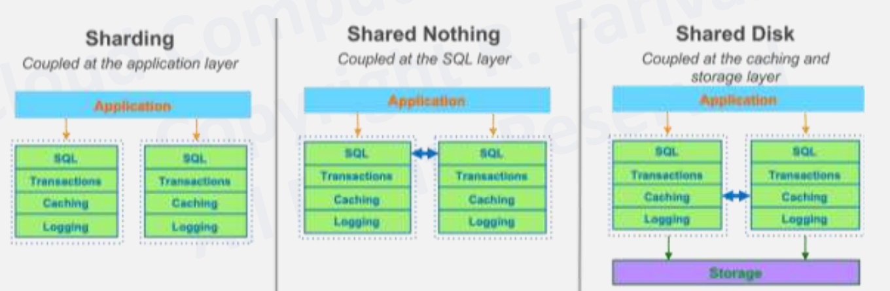
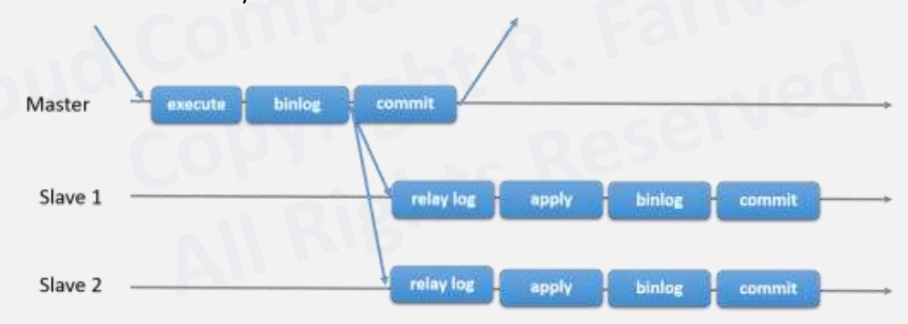
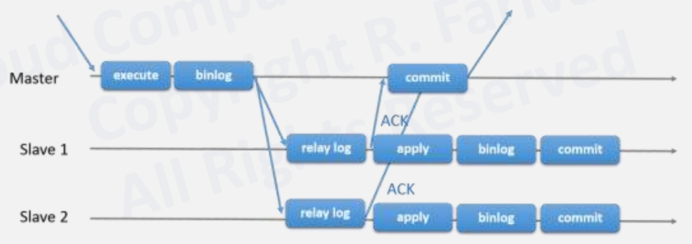
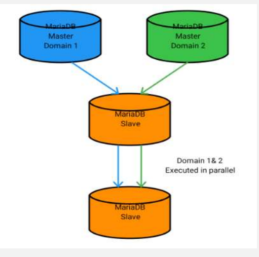
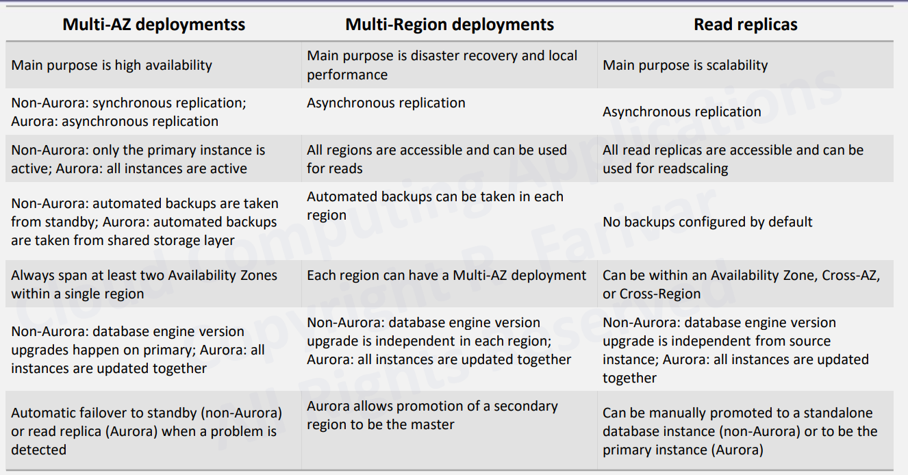
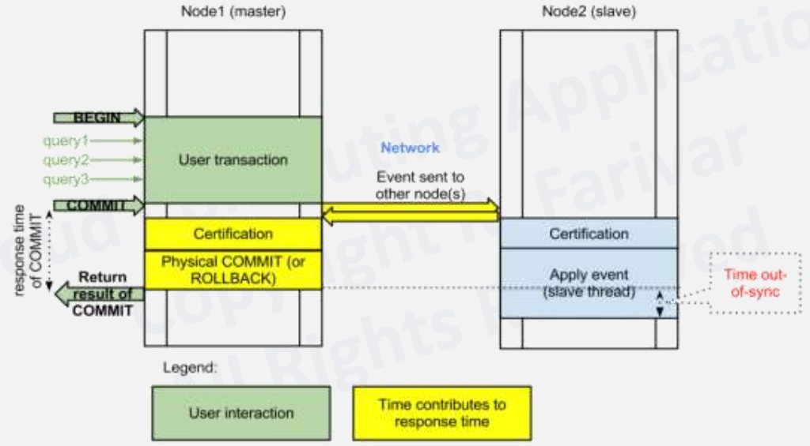

# CS498- Week 6

#cloud_computing

## Relational Databases on the Cloud

### Cloud Databases Introduction

- Overview
	- OLTP, SQL
		- Traditional SQL RDBMS
		- Cloud Optimized
	- NewSQL
		- Spanner
		- CosmosDB
	- NoSQL
		- Key/ Value
		- Wide- Column
		- Document
		- Graph
		- In- Memory
- NewSQL
	- Class of relational database management systems
		- Scalability of *NoSQL* systems for online transaction processing (OLTP) workloads
		- ACID guarantees of a traditional database system
	- SQL as primary interface
	- Components
		- Distributed Concurrency Control
		- Flow Control
		- Distributed Query Processing
	- Automatically splits databases across multiple nodes using Raft or [Paxos consensus algorithm](https://en.wikipedia.org/wiki/Paxos_(computer_science))
	- Consistency over availability (CP from CAP)
		- Strong consistency
		- Sacrificing some availability
- NoSQL Categories
	- Key- Value
	- Graph DB
	- BigTable
	- Document

### RDBMS in the Cloud

- Relational Cloud Databases
	- Managing a relational database has been a high- skill, labor- intensive task
	- Relational databases store data with predefined schemas and relationships between them
	- These databases are designed to support ACID transactions, maintain referential integrity and strong data consistency
		- ACID
			- Atomicity
			- Consistency
			- Isolation
			- Durability
	- OLTP Workloads
		- On- Line Transactional Processing (OLTP)
- Relational Databases
	- In large systems, failures are commonplace, not an exception
	- Users want to start with a small footprint and then grow larger without infrastructure limiting their velocity
	- Replication
		- Storage (SAS, NAS, Aurora)
		- Database
		- Application
	- 
- Sharding
	- Split dataset by certain criteria and store the *"shards"* on separate *"clusters"*
		- Sharding can be considered an embodiment of the "share- nothing" architecture and essentially involves breaking a large database into several smaller databases
	- One common way to split a database is splitting tables that are not joined in the same query onto different hosts
	- Another method is duplicating a table across multiple hosts and then using a hashing algorithm to determine which host receives a given update
- Managed Relational Databases
	- Traditional single server databases running on a VM
		- AWS RDS: MySQL, PostgreSQL, MariaDB, Oracle, MS SQL Server
		- Azure SQL Database, Database for MySQL, PostgreSQL, MariaDB
		- Google Cloud SQL
		- IBM Cloud Databases for PostgreSQL, DB2 on Cloud
	- Instances are fully managed, relational MySQL, PostgreSQL and SQL Server databases
	- Cloud provider handles replication, patch management and database management to ensure availability and performance
	- Availability through failover
	- Horizontal scalability through read replicas
		- Vertical scalability by using larger machines (e.g. 64 processors, 400 GB RAM)
	- Typically the database instance is accessible by most compute resources in the cloud provider's network
		- VM (AWS EC2, Azure VM, Google Compute Engine)
		- PaaS (AWS Elastic Beanstalk, Google App Engine)
		- Serverless (AWS Lambda, Google Cloud Functions, Azure Functions)
	- Over the Internet
		- SQL Proxy
		- Google Cloud SQL Proxy for Public Interfacing
	- Encryption at rest and in transport

### Multinode RDBMS

- Beyond a Single Node
	- Replication Options in MySQL
		- Classical MySQL Replication
			- One master, multiple slaves
			- Support for many masters to many slaves
			- Asynchronous
			- No conflict resolution or *"protection"*
		- MySQL Group Replication
			- Distributed state machine replication with strong coordination between servers
			- Build on Paxos
				- Majority vote for transaction commit
				- Network partition can stop the system
		- Galera
			- Multi- Master
		- MySQL (NDB) Cluster
			- Synchronous
- Replication in Databases
	- Replication is a feature allowing the contents of one or more servers (masters) to be mirrored on one or more servers (slaves)
	- **Scalability**: By having one or more slave servers, reads can be spread over multiple servers, reducing the load on the master
		- Most common scenario for a high- read, low- write environment is to have one master, where all the writes occur, replicating to multiple slaves, which handles most of the reads
	- **Backup Assistance**: Backups can run more easily if a server is not actively changing the data
		- Most common scenario is to replace the data to a slave, which is then disconnected from the master with the data in a stable state
			- Backup is performed from this server
			- Idea of a state- preserving quarantine operation
- Replication and Binary Log
	- Main mechanism for replication is the binary log
		- All updates to the database (data manipulation & data definition) are written into the binary log as `binlog` events
		- Binary log contains a record of all changes to the database, both data & structure, as well as how long each statement took to execute
			- Consists of a set of binary log files and an index
		- Statements such as `CREATE`, `ALTER`, `INSERT`, `UPDATE` and `DELETE` will be logged, but statements that have no effect on the data such as `SELECT` and `SHOW` will not be logged
	- Slaves read binary log from each master in order to access the data to replicate
- Database Replication
	- Relay log is created on the slave server, using the same format as the binary log and is used to perform the replication
		- Old relay log files are removed when no longer needed
	- Slave server keeps tracks of the position in the master's binlog if the last event applied on the slave
		- Allows the slave server to reconnect and resume from where it left off after replication has been temporarily stopped
		- Allows a slave to disconnect, be cloned and then have the new slave resume replication from the same master
		- There will be a delay between the master and the replica.
			- Data on the replica eventually becomes consistent with the data on the master
			- Feature is recommended for workloads that can accommodate this delay
- Replication Steps
	- Steps
		- Replication events are read from the master by the IO thread and queued in the relay log
		- Replication events are fetched one at a time by the SQL thread from the relay log
		- Each event is applied on the slave to replicate all changes done on the master
	- Replication is essentially asynchronous
		- The 3rd step can optionally be performed by a pool of separate replication worker threads
			- **In- order** executes transactions in parallel, but orders the commit step of the transactions **to happen in the exact same order as on the master**
				- Transactions are only executed in parallel to the extent that this can be automatically verified
			- **Out of order** can execute and commit transactions **in parallel**
				- Application must be tolerant to seeing updates occur in different times
				- Only when explicitly enabled by the application
- Asynchronous Replication
	- 
	- Standard Replication
	- Provides infinite read scale out
		- Most websites fit into this category, where users are browsing the website, reading articles or viewing products
		- Updates only occur during the session management, when making a purchase or adding a comment/ message to a forum
	- Provides high availability by upgrading slave to master
	- [`slaves read-only`](https://mariadb.com/kb/en/server-system-variables/#read_only) to ensure no one accidently updates them
	- Eventual consistency
- Semi- Synchronous Replication
	- 
	- Better than eventual consistency
	- Master waits for at least one acknowledgement (ACK)
		- Slower commits
	- If no ACK is received and timeout occurs, master reverts to asynchronous state
	- When at least one ACK is received, master goes back to semi- synchronous
- GTIDs- Based Replication
	- MySQL method based on GTIDs
		- Global Transaction Identifiers (GTIDs)
	- Transactional
		- Does not require working with log files or positions within these files
		- May simplify common replication tasks
	- Replication using GTIDs guarantees consistency between master and slave as long as all transactions committed on the master have also been applied on the slave
- Multi- Source Replication
	- 
	- One server has many masters from which it replicates
	- Allows you to combine data from different sources
	- Different domains executed independently in parallel on all slaves
- AWS RDS Horizontal Scaling
	- Scaling beyond the compute or I/O capacity of a single DB instance for read- heavy database workloads
	- Amazon RDS uses the MariaDB, MySQL, Oracle, PostgreSQL and Microsoft SQL Server DB engines' built- in replication functionality to create a special type of DB instance called a "read replica" from a source DB instance
		- Up to 5 read replicas from one DB instance for MariaDB & MySQL
			- Similar limit of 5 replicas in Azure as well
			- Aurora allows 15 read replicas
		- Specify an existing DB instance as the source
		- Amazon RDS takes a "snapshot" of the source instance and creates a read- only instance from the snapshot
		- Amazon RDS then uses the asynchronous replication method for the DB engine to update the read replica whenever there is a change to the source DB instance
	- Updates to the source DB instance are **asynchronously** copied to the read replica
	- If the read replica resides in a different region than its source DB instance, Amazon RDS sets up a secure communications channel between the source and the read replica
		- Amazon RDS establishes any AWS security configurations needed to enable the secure channel, such as adding security group entries
	- Replicas can be "promoted" to full databases
		- Will require a reboot first
- Load Balancing Between RDS Replicas
	- Application- Level Load Balancing
		- Different DNS record sets using port route 53
	- MySQL Connectors
		- If using the native MySQL driver, there are MySQL connectors that allow read/ write splitting and read- only endpoint load balancing without a major change in the application
	- ELB does not support multiple RDS instances
	- Level 4 Proxy Solutions
		- HAProxy: configured to listen on one port for read queries and another port for write queries
	- Level 7 Proxy Solutions
		- More sophisticated capability of understanding how to properly perform the read/ write splits on multi- statements than a MySQL connector
		- Solution handles the scaling issues in a distributed database environment, so you don't have to handle scaling on the application layer
			- Results in little or no change to the application itself
		- Several open source solutions (e.g. MaxScale, ProxySQL, MySQL Proxy) and commercial solutions are available in AWS Marketplace
- High Availability (Multi- AZ) for Amazon RDS
	- Amazon RDS uses several different technologies to provide failover support
		- Multi- AZ deployments for MariaDB, MySQL, Oracle and PostgreSQL DB instances use Amazon's failover technology
		- SQL Server DB instances use SLQ Server Database Mirroring (DBM) or Always On Availability Groups (AGs)
	- High availability feature is **not** a scaling solution for read- only scenarios
- Read Replicas, Multi- AZ Deployments & Multi- Region Deployments (AWS)
	- 
- Multi- Master Cluster
	- Galera (MySQL, MariaDB)
	- Synchronous replication
	- Active- active multi- master topology
	- Read and write to any cluster node
	- Automatic membership control, failed nodes drop from the cluster
	- Automatic node joining
	- True parallel replication at the row level
	- Direct client connections, native MariaDB look & feel
- Galera Transaction Commit Flow
	- 
	- Certification based replication
	- Virtually synchronous
- MySQL NDB Cluster
	- Network Database Engine (NDB)
		- Replaces InnoDB
		- Separation of compute and data
			- SQL Nodes --> Compute
			- Data Nodes --> Data
		- **Shared Nothing Architecture**

### Amazon AWS Aurora

- X

## NewSQL Cloud Databases

### Google Cloud Spanner

- X

### Cloud Databases- Azure CosmosDB

- X

## NoSQL Databases on the Cloud

### Cloud NoSQL Databases

- X