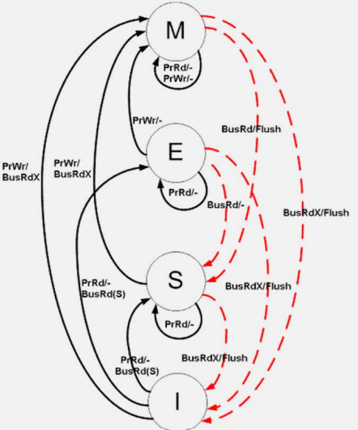
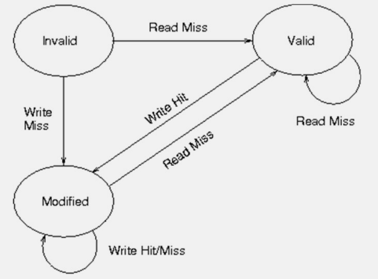
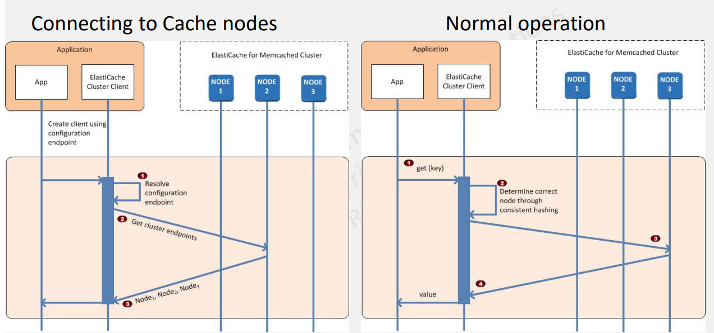
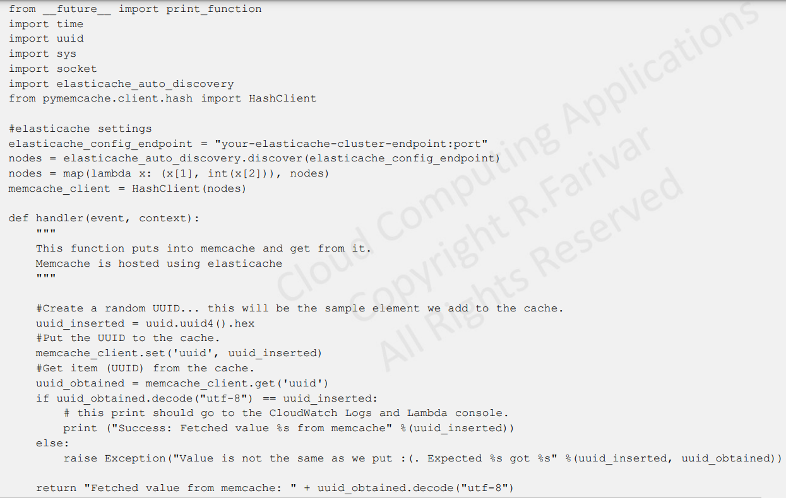

# CS498- Week 7

#cloud_computing

## Caching & Key- Value Stores

### Caching as a Universal Concept

- Need for Caching
	- Success for many websites and web applications can be attributed to speed
		- Users can register a 250 `ms` difference between competing sites
		- For every 100 `ms` increase in load time, sales can decrease by 1%
		- Data that is cached can be delivered much faster
	- In- memory, key- value stores can provide sub- millisecond latency
		- Querying a database is **always slower** and more expensive than locating a key in a key- value pair cache
- Caching
	- Caching is a universal concept
	- Based on the principle of locality (a.k.a. locality of reference)
		- Tendency of the "processor" to access the same set of memory locations repetitively over a short period of time
		- Temporal Locality vs Spatial Locality
	- Whenever you have "large + slow" source of information and "small + fast" storage technology, you can use the latter to *cache* the former
		- Can see this concept being put to use anywhere from CPUs, processors, to OS and to large web applications on the cloud
- Caching in Processors: Data & Instructions
	- Big/ slow RAM memory
	- Multiple layers of caching
	- Access to data exhibits temporal and spatial locality
		- L1 data cache
		- L2 + L3 cache
	- Program instructions have both spatial and temporal locality
		- Sequential feeding of instructions
		- Loops
		- Branch Locality
			- If- Else Statements
- Caching in Processors: Virtual Memory
	- Virtual memory address translation
	- Every memory access needs a translation
		- Needs a page walk
		- Slow/ big source of data
	- Translation Lookaside Buffer (TLB)
		- Memory cache that stores recent translations of **virtual** memory to **physical** memory
- Virtual Memory & OS- Level Page Caching
	- Virtual Memory
		- Each process "thinks" that is has $2^48$ = 256 TB of memory
	- Paging
		- Computer stores and retrieves data from secondary storage (HDD/ SDD) for use in main memory
		- RAM "acts" as the cache for the SSD
		- When a process tries to reference a page not currently present in RAM, the processor treats this invalid memory references as a **page fault** and transfers control from the program to the OS
	- OS
		- Determines the location of the data on disk
		- Obtains an empty page frame in RAM to use as a container for the data
		- Load the requested data into the available page frame
		- Update the page table to refer to the new page frame
		- Return control to the program, transparently retrying the instruction that caused the page fault
- Linux Page Cache
	- Linux kernels up to v2.2 had page caches as well as buffer caches
		- As of v2.4, these caches have been combined into a one cache, the page cache
	- The page cache also caches files
		- Usually, all physical memory not directly allocated to applications is used by the OS for the page cache
		- OS keeps other pages that it may think may be needed in the page cache
		- If Linux needs more memory for normal applications than is currently available, areas of the page cache that are no longer in use will be automatically deleted
- Linux VFS Cache
	- Dentry Cache
		- Dentry in Linux is in- memory representation of a directory entry
		- It is a way of remembering the resolution of a given file or directory name without having to search through the file system to find it
		- It speeds lookups considerably, keeping dentries for frequently accessed names such as `/tmp`, `/dev`, `null` or `/usr/bin/tetris` saves a lot of file system I/O
	- Inode Cache
		- As the mounted file systems are navigated, their VFS inodes are being continually read and in some cases, written
		- The Virtual File System (VFS) maintains an inode cache to speed up access to all of the mounted file systems
		- Every time a VFS inode is read from the inode cache, the system saves an access to a physical device
- Caching in Distributed Systems
	- CDN Caching
	- Web Server Caching
		- Reverse Proxies
		- Varnish
		- Web servers can also cache requests, returning responses without having to contact application servers
			- NGINX
	- Database Caching
	- Application Caching
		- In- memory caches such as Memcached and Redis are key- value stores between your application and your data storage
- What to Cache
	- Database Queries & Objects
		- Row Level
		- Query Level
		- Fully- Formed Serializable Objects
		- Fully- Rendered HTML
- Caching at the Database Query Level
	- Whenever you query the database, hash the query as a key and store the results to the cache
	- Suffers from expiration issues:
		- Hard to delete a cached result with complex queries
		- If a single piece of data changes, such as a table cell, you need to delete all cached queries potentially associated with the changed data
- Caching at the Object Level
	- See your data as an object, similar to what you do with your application code 
	- Have your application assemble the dataset from the DB into a class instance or a data structure
		- Remove the object from cache if its underlying data has changed
		- Allows for asynchronous processing, where the workers assemble objects by consuming the latest cached object
	- Things to cache at the object level:
		- User sessions
		- Fully- rendered web pages
		- Activity streams
		- User graph data

### Cache Technical Concepts

- Reading from Cache
	- Client first checks to see if a data piece is available in a cache
		- Cache Hit
			- Desired data is in the cache
		- Cache Miss
			- Desired data is not in the cache
	- In the event of a cache miss, the client will need to go to the "slow/ big" source of data and retrieve it themselves
		- Once data is retrieved, it is also copied in the cache, ready for the next access (adhering to the principle of locality)
			- Need to determine **where** in the cache we need to put this new data
- Cache Replacement Policy
	- A.K.A.
		- Cache Eviction Policy
		- Cache Invalidation Algorithm
	- Least Recently Used (LRU)
		- Replaces the oldest entry in the cache
		- Memcached uses segmented RLU
	- Time- Aware Least Recently Used (TLRU)
		- TTU: Time to Use
	- Least Frequently Used (LFU)
	- First In First Out (FIFO)
	- Miscellaneous
		- LIFO, FILO, MRU, PLRU
- Cache Replacement
	- Maintain consistency between caches and the source of truth (e.g. DB) through cache invalidation
	- Cache invalidation is a difficult problem, there is additional complexity associated with the timing of **when** to update the cache
	- Time to Live (TTL): Expiration time for records in the cache
		- Eventual consistency for coherence problem
- Cache Writing/ Updating Policies
	- Whenever a new piece of data is created and needs to be stored, we need to address the issue of updating the caches
	- Types
		- Cache Aside
			- Lazy Loading
		- Write- Through
			- Write is done synchronously both to the cache and to the backing store
		- Write- Back
			- Write- Behind
			- Lazy Writing
- Cache Aside (Lazy Loading)
	- **Application** is responsible for reading and writing from storage
		- Cache does not interact with storage directly
	- **Application** does the following
		- Look for entry in cache, resulting in a cache miss
		- Load entry from the database
		- Add entry to cache
		- Return entry
	- Memcached follows this process
- Disadvantages of Cache Aside
	- Each cache miss results in 3 trips, which may cause a noticeable delay
	- Data can become stale if it is updated in the DB
		- This issue can be mitigated by setting a TTL (Time to Live), which forces an update of the cache entry or by using write- through
	- When a node fails, it is replaced by a new empty node, which increases latency
- Write- Through: Writing/ Updating Policy
	- Application uses the cache as the main data store, reading and writing to it
		- Cache is responsible for reading and writing to the DB
			- Application adds/ updates entry in cache
			- Cache synchronously writes entry to data store
			- Return
- Disadvantages of Write- Through
	- Overall, it is too slow due to the write operation
		- Subsequent reads of just written data are fast however
		- Users are generally more tolerant of latency when updating data than reading data
	- Data in the cache is never stale
	- When a new node is created due to failure or scaling, the new node will not cache entries until the entry is updated in the database
		- Cache- aside in conjunction with write- through can mitigate this issue
	- **Cache Churn**
		- Most of the data that is written might never be read, which is a waste of resource
			- Can be minimized with TTL
- Write- Back (Write- Behind): Writing/ Updating Policy
	- Initially, writing is done only to the cache
	- Write to the backing store is postponed until the modified content is about to be replaced by another cache block
		- Asynchronously write entry to the data store, improving write performance
	- Write- back cache is more complex to implement, since it needs to track which of its locations have been written over and mark them as *dirty* for later writing to the backing store
		- **Lazy Write**
			- Data in these dirty locations are written back to the backing store only when they are evicted from the cache
	- A read miss in a write- back cache (which requires a block to be replaced by another) will often require two memory accesses to service: one to write the replace data from the cache back to the store and one to retrieve the necessary data
- Write- Around
	- Writing is only done to the underlying data source
	- **Advantage**
		- Good for not flooding the cache with data that may not subsequently be re- read
	- **Disadvantage**
		- Reading recently written data will result in a cache miss (higher latency) because the data can only be read from the slower backing store
	- Write- around policy is good for applications that don't frequently re- read recently written data
		- Results in lower write latency but higher read latency, which is an acceptable trade- off for these scenarios
- Write Allocation Policies
	- Since no data is returned to the requester on write operations, a decision needs to be made on write misses (whether or not data would be loaded into the cache)
	- Approaches
		- **Write Allocate** (Fetch on Write)
			- Data at the missed- write location is loaded to cache, followed by a write- hit operation
			- Write misses are similar to read misses
		- **No- Write Allocate** (Write- No- Allocate & Write Around)
			- Data at the missed- write location is *not* loaded to cache and is written directly to the backing store
			- Data is loaded into the cache on read misses only
	- Write- back cache uses write allocation, hoping for subsequent writes (or even reads) to the same location, which is now cached
	- Write- through cache uses no- write allocation
		- Subsequent writes have no advantage, since they still need to be written directly to the backing store
- Cache Coherency
	- Whenever cache is distributed **with the same data in more than one place**, there is a coherency problem
		- Write Propagation
			- Changes to the data in any cache must be propagated to other copies (of that value) in the peer caches
		- Transaction Serialization
			- Reads/ writes to a single memory location must be seen by all processors in the same order
	- Coherence Protocols
		- **Write- Invalidate**
			- When a write operation is observed to a location that a cache has a copy of, the cache controller **invalidates** its own copy
				- e.g. MESI Protocol
		- **Write- Update**
			- When a write operation is observed to a location that a cache has a copy of, the cache controller **updates** its own copy
- MESI Protocol
	- 
	- A.K.A. Illinois Protocol (**Developed by UIUC!**)
	- Supports "write- back- caches"
	- Uses cache- to- cache transfer
	- States
		- Modified
		- Exclusive
		- Shared
		- Invalid
- Coherency Mechanisms
	- 
	- Snooping
		- Sends all requests for data to all processors
		- Processors "snoop" to see if they have a local copy
		- Requires broadcast
		- Works well with a "bus" (CPUs)
		- Usually implemented with state machines
	- Directory- Based
		- Keep track of what is being shared in a centralized location
			- In reality, every block in every cache is being monitored
		- Send point- to- point requests
		- Scales better than snooping
		- Examples
			- `Lcache`, `WP-Lcache`
	- TTL (Eventually Consistent Caches)
		- Main mechanism for DNS caching records

### ElastiCache for Memcached

- Memcached
	- Key/ value storage model
		- e.g. in a Lambda Python function, importing `pymemcache` will allow you to set/ get data afterwards
		- Other libraries include `python-Memcached`, `pylibmc`, `twisted-Memcached`
	- Simple data model
		- Strings, Objects
		- From the results of DB calls, API calls, even HTML page renderings (e.g. PHP to HTML)
	- No data storage
		- If a node goes down, you lose all the data in that node's memory
	- Multi- threaded engine
	- Multi- cluster using consistent hashing
		- Default limit of 20 nodes
	- Auto discovery
- ElastiCache for Memcached Auto Discovery
	- 
	- Configuration Endpoint
		- When you increase the number of nodes in a cache cluster, the new nodes register themselves with the configuration endpoint and with all of the other nodes
	- When you remove nodes from the cache cluster, the departing nodes will deregister themselves
	- All the nodes in the cluster are updated with the latest cache node metadata
	- Cache node failures are automatically detected; failed nodes are automatically replaced
	- Client program only needs to connect to the configuration endpoint
	- Auto Discovery library connects to all of the other nodes in the cluster
	- Client programs poll the cluster once per minute (can be modified)
		- If there are changes to the cluster configuration, such as new or deleted nodes, the client receives an updated list of metadata
			- Client connects to, or disconnects from, these nodes as needed
- Example Use
	- 

### ElastiCache for Redis

- ElastiCache for Redis
	- Up to 250 shards
	- Each shard can be on a node group
	- Each node group can have one master (write + read) and 5 other read replicas
		- If any primary has no replicas and the primary fails, you lose all that primary's data
	- Node or shard limit of 500 in Redis v5.0.6+
		- 83 shards (1 primary and 5 replicas per shard)
		- 500 shards (1 primary and no replicas)
- Designing the Right Cache
	- At the highest level, Memcached is generally used to store small and static data such as HTML code pieces
		- Memory management is efficient and simple
		- no data persistence
		- If any node/ cluster fails, the Memcached data is lost
			- Use Memcached data with easily recoverable data
	- Redis supports more complex data structures
		- Fast performance
		- Persistent storage
		- Read replicas
- Comparing Memcached & Redis
	- Memcached
		- Simple Model
		- Large Nodes
		- Multithreading
		- Ability to Scale Out & Scale In
	- Redis
		- Complex Data Types
			- Strings, Hashes, Lists, Sets, Sorted Sets, Bitmaps
			- Sort- In Memory Datasets
		- Persistence of key store
		- Replicate data from read- access to up to 5 read replicas per shard
			- Automatic failover if the primary node fails
		- Authenticate users with role- based access control
		- Redis Streams
			- Log data structure, producers append new data, consumers consume messages
		- Encryption
			- HIPAA Eligible
			- PCI, DSS, FedRAMP compliant
		- Dynamically adding/ removing shards from cluster mode is possible
			- Online re- sharding is possible

### Caching Strategies

- Caching Strategies
	- Strategies to implement for populating and maintaining your cache depend upon what data you cache as well as access patterns to the data
		- Cache Aside (Lazy Loading)
		- Write- Through
		- Adding TTL
	- Deploying nodes to multiple AZ (ElastiCache supports this) can avoid single point of failure and provides high availability
- The Right Caching Strategy
	- Cache- Aside (Lazy Loading)
		- Applicating data is written only into the source
		- Only loads data to the cache when it is required on a "read"
			- Typically, most of the data is never requested
		- Suitable for read- heavy applications
		- Allows stale data
		- In case of cache node failure, just read from the source directly
	- Write- Through
		- Applicating data is written into the cache and source at the same time
		- Suitable for write- heavy applications, where data loss is not acceptable
			- Instead, every write becomes extremely expensive
		- Cache never gets stale
		- Incase of cache node failure, just read from the source directly
	- Write- Back (Lazy Writing)
		- Applicating dat is written only to the cache
		- More complex to implement
- Cache Sharding
	- Only one machine contains each piece of data
	- Memcached
		- Consistent hashing ring algorithm
	- Redis
		- ElastiCache for Redis can have up to 250 shards
		- Each shard can consist of a master Redis node and up to 5 Redis read replicas
	- Sharding is useful, but not without its problems
		- Re- sharding data when adding/ removing nodes
		- Celebrity problem
		- Join & de- normalization:
			- Not as big of a problem in caches, but can be serious for databases
			- Once data is sharded, it is hard to perform join operations across all shards
- Time to Live (TTL)
	- Lazy loading allows for stale data but doesn't fail with empty nodes
	- Write- through ensures that data is always fresh, but can fail with empty nodes & can populate the cache with superfluous data
	- By adding a TTL value to each write, you can have the advantages of each strategy
		- At the same time, you can largely avoid cluttering up the cache with extra data
	- TTL is an integer value that specifies the number of seconds until the key expires
		- Redis can specify seconds and milliseconds for this value
		- For Memcached, it is seconds
	- When an application attempts to read an expired key, it is treated as though the key is not found
		- The database is queried for the key and the cache is updated
	- This approach doesn't guarantee that a value isn't stale
		- However, it keeps data from getting too stale and requires that values in the cache are occasionally refreshed from the database

### Redis

- X

### Redis Demonstration

- X

## Scalable Data Storage

### HBase Usage API

- X

### HBase Internals (Part 1)

### HBase Internals (Part 2)

### Spark SQL

### Spark SQL Demo

### HIVE

- X

## Message/ Publish/ Subscribe Queues

### Decoupling in Cloud Architectures

- X

### AWS Simple Queue Service (SQS)

### AWS Simple Notification Service (SNS)

### Kafka

- X