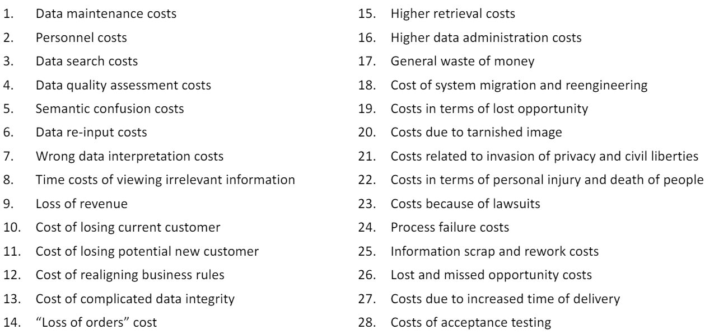
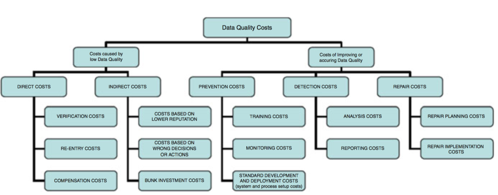

# CS513- Week 1

#data_science 

## Introduction to Data Cleaning

### Course Overview

- Data Wrangling vs. Analytics
	- Data Wrangling
		- Data processing that allows meaningful analysis to begin
			- e.g. Extract Transform Load (ETL), Integrate, Clean, Query, Repair
	- Database
		- People who work with databases aren't always the best at public relations, but do most of the work (80%), even though most of the attention goes to analytics (20%)
- Skills in Demand
	- A study on 3,5000 relevant data scientist job postings on LinkedIn reveals that database skills (notably, SQL) are in high demand for these postings
	- The key focus of this course is to "think like a database person"
- Costs Resulting from Low- Quality Data
	- [Handbook of Data Quality](https://link.springer.com/book/10.1007/978-3-642-36257-6)
	- Reports indicate cost due to low- quality data to be in the billions
	- 
- Taxonomy of Cost Types
	- 
- Data Cleaning: The Big Idea
	- Understanding, assessing and improving data quality (3 Q's)
	- Quality Dimensions
		- Data should be accurate, timely, relevant, complete, understood and trusted
	- Questions
		- **Fitness for Use/ Fitness for Purpose:** Is the quality sufficient to answer my questions?
	- Queries
		- We want to execute:
			- Data profiling
			- Checking Integrity Constraints (ICs)
			- Answering questions using Datalog and SQL queries
- Data Cleaning in Context
	- Data from various sources is gathered and selected
	- Data Profiling
		- Identity, detect, quantify data quality problems
	- Data Cleanning (Wrangling)
		- Standardize, normalize data
			- Controlled, reference vocabularies
	- Data Integration & Data Warehousing
		- ETL `-->` Warehouse
		- On demand integration (database mediators)
- Taxonomy of Error Types
	- Quantitative Errors
		- Outliers
			- Deviates significantly from the distribution of values
			- Methods from statistics, data mining, machine learning
	- Qualitative Errors
		- Syntactic Violations
			- Pattern Violations: Variant data formats, issues with spelling
		- Schema/ Integrity Constraint (IC) Violations
			- IC Rule Violations: Function or inclusion dependencies
		- Duplicates & Other Errors
			- Distinct records refer to same real- world entity
- Course Themes, Topics, Tools
	- Syntax
		- Regular Expressions
			- Define patterns that can be used to match, extract and transform data (e.g. deal with syntactic variations)
		- OpenRefine
			- Open source tool for data wrangling
	- Schema & Semantics
		- Using database technologies for data profiling (queries), integrity constraints (ICs) and repair
		- Datalog
		- SQL
	- Synthesis
		- Workflow Automation (ETL, Scripts)
		- Provenance (Data Lineage & Processing History)
		- `YesWorkflow` 
			- Modeling scripts as workflows, provenance
- How to Clean Data
	- We will be using OpenRefine in this course and on the first assignment
	- OpenRefine is open source and was formerly known as Google Refine
- Workflows & Provenance
	- `YesWorkflow` will allow us to put annotations inside of scripts, which reveals and recreates a workflow

### Data Quality Defined

- Data Quality (DQ) & Data Cleaning in Context
	- Data Cleaning/ Wrangling
		- Underappreciated phase before data analysis can begin
		- Low- quality data causes significant costs (regardless of whether or not we clean the data or not)
		- Needs to be applied early in the data lifecycle and needs to be applied often as needed
	- Data Errors
		- Quantitative (Outliers) vs. Qualitative
			- Syntax/ format errors (pattern violations)
			- Semantic/ schema errors (integrity constraints)
	- Data Quality
- Data Quality: Defined
	- Data Quality (Fitness for Use/ Fitness for Purpose)
		- Data are of high- quality if they are fit to use in their uses (by customers) in operations, decision making and planning
		- They are fit to use when they are free of defects and possess the features needed to complete the operations, make the decision or complete the plan 
- Data Quality: Fitness for Use
	- Where this comes from:
		- What do you want to do with the data?
		- What are the questions you are trying to answer?
		- Do you need a certain table/ column/ field?
			- e.g. analyzing census data per region, state, county
	- Where this gets tricky:
		- If you don't know (yet) what you want to ask of the data
		- Challenges for:
			- Digital archivists (e.g. digital librarians) and research data librarians
			- Data curators (e.g. at a museum)
- Pillars of Data Quality
	- Organizational
		- Data quality objectives for the organization; strategies to establish roles, processes, policies, standards required to manage and ensure DQ objectives are met
	- Architectural
		- Technology landscape to deploy DQ management processes, standards, policies
	- Computational
		- IT tools and computational techniques required to meet DQ objectives
			- Syntax and format normalization
			- Integrity Constraints
			- Provenance
			- Duplicate Detection
- Common Phases & Steps in DQ Management
	- Context Reconstruction
		- Collect context information on organizational processes, services, data management procedures, quality issues, costs
	- Assessment/ Measurement
		- Measures DQ along relevant dimensions
		- Assess DQ by comparing with reference values
		- Enable diagnosis of DQ and find causes of poor DQ
	- Improvement
		- Concerns the selection of the steps, strategies and techniques for reaching new data quality targets
- Dimensions of Data Quality
	- Accuracy
		- Extent to which data are correct, reliable and correspond to ground truth
		- Often focuses on syntax and patterns (e.g. regex matching for dates)
	- Completeness 
		- Degree to which a dataset includes necessary information about relevant objects
	- Consistency
		- Satisfaction or violation of schema or semantic rules
		- In relational databases, integrity constraints (ICs) are often show in the form of *denials*
	- Timeliness (Currency, Volatility)
		- Data may change overtime
		- Answers questions such as:
			- What is the delay between change in the real world and in the database?
			- How long until the data is valid in the real world?
			- Is the data still appropriate?
- Summary
	- Data Quality
		- Fitness for Use
	- Pillars of Data Quality
		- Organizational
		- Architectural
		- Computational
	- Data Quality Management Phases:
		- Context Reconstruction
		- Assessment (Measurement)
		- Improvement
	- Data Quality Dimensions
		- Accuracy
		- Completeness 
		- Consistency
		- Timeliness