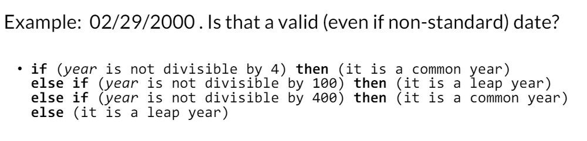

# CS513- Week 2

#data_science 

## Validation & Transformation (Regular Expressions)

### Regular Expressions in Theory

- Introduction to Regular Expressions (Regex)
	- **Theory of Regular Expressions**
		- Brief introduction of where regular expressions come from
	- Practice of Regular Expressions
		- Everything you need to know to get started with regex in practice
	- Demonstration of Regular Expressions
- Why study regular expressions?
	- Widely used in practice
		- e.g. "find all csv files" `-->` `*.csv`
		- Extremely powerful
	- Used to *match, extract, find and replace data*
		- Text Editors
		- Scripting & Programming
		- Screen Scraping (Data Extraction Applications)
- Why study regular expressions for data cleaning?
	- Uses to **match** (assess) and **transform** (clean) data
		- OpenRefine Expression Language (GREL)
		- Use in scripting languages for data cleaning and workflow automation
	- Example
		- ISO 8601 Date Format
			- `YYYY-MM-DD`
		- Other Date Formats
			- `MM/DD/YY`
			- `DD.MM.YYYY`
- Theory of Regular Expressions
	- Regular expressions (regex) in **theoretical** computer science (e.g. formal language theory) is a formal expression that defines a **search pattern**
		- Used to **match** (*recognize*) strings
	- Formal Definition
		- Base Elements
			- $\emptyset$ : empty set
			- $\epsilon$ : empty string
			- $\Sigma$ : alphabet of characters
		- Given regular expressions $R$ and $S$, the following are also regular expressions:
			- $R | S$ : alternation
			- $RS$ : concatenation
			- $R^*$ : Kleene star/ operator/ closure
				- Kleene star means "zero or more of the *preceding* item"
				- $R^*$ denotes the smallest superset of set described by $R$ that contains $\epsilon$ and is closed under string concatenation
			- $(R)$ : parentheses (can be omitted with *precedence rules*)
- Regular Expressions in the Chomsky Hierarchy
	- 
		- Regular expressions reside in Type 3 of the Chomsky Hierarchy (Automata Theory)
- Regular Grammars
	- Example
		- Floating point numbers (e.g. `-.314159265e+1`) can be *generated* by a **right regular grammar** $G$ with $N = \{S, A, B, C, D, E, F, G\}$ and $\Sigma = \{0, 1, 2, 3, 4, 5, 6, 7, 8, 9, \text{+}, \text{-}, \text{.}, \text{e} \}$
		- 
	- Notes
		- This isn't very useful in practice, which is why instead of regular *grammars*, we utilize regular *expressions*
			- e.g. `[-+]?[0-9]*\.?[0-9]+([eE][-+]?[0-9]+)?`

### Regular Expressions in Practice

- Theory of Regular Expressions
	- Regular **Languages**
		- *Generated* by regular (Type 3) grammars
		- *Recognized* (accepted) by a finite automaton
		- *Expressed* by regular expressions
- Introduction to Regular Expressions (Regex)
	- Theory of Regular Expressions
		- Brief introduction of where regular expressions come from
	- **Practice of Regular Expressions**
		- Everything you need to know to get started with regex in practice
	- Demonstration of Regular Expressions
- Practice of Regular Expressions
	- Use Case
		- Extract and transform data from text
			- `pi = -0.314159265e+1`
			- `e = 0.2718281828E+1`
		- The following regex will work:
			- `[-+]?[0-9]*\.?[0-9]+([eE][-+]?[0-9]+)?`
		- Breakdown
			- Character Set 
				- `[...]`
				- Matches any single character
			- Optional Element 
				- `...?`
				- Matches 0 or 1 occurrence
			- Range
				- `[0-9]`
				- Matches any single character in this range
			- Kleene Star
				- `...*` 
				- Matches 0 or more occurrences
			- Dot
				- `.`
				- Matches any character (except line breaks)
			- Escape Character
				- `\...`
				- Takes next character literally
					- Any special meaning attached to the character is stripped
			- Capturing Group
				- `(...)`
				- Groups multiple tokens
				- Captures group for backreference
- Beware of False Negatives & False Positives
	- False Negative
		- Your pattern *does* **not** match, even though it **should**
		- You will notice this problem first (missing match results)
		- To address this issue, you need to "relax" the regex such that it matches the desired string
	- False Positive
		- Your pattern *does* match, even though it **shouldn't**
		- You might not notice this problem at first (false matches may occur sporadically)
		- To address this issue, you need to "tighten" the regex such that it matches fewer strings (avoiding the false matches)
- Division of Labor: Regex for Syntax, Code for Semantics
	- Getting the "right" regex can be a balancing act
	- Even if there is a (near) exact regex solution, it might be difficult to match exactly, debug it and maintain it
	- In Practice
		- It's better to allow for some false positives and to use *code* to check the semantics
			- Use regex for what they're best at: **syntactic patterns**
			- Use code to check the **semantics** of the match
		- Sometimes, this option may be the only option available to you in theory
	- Example
		- 
- Character Classes
	- 
- Anchors
	- 
- Escaped Characters
	- 
- Groups
	- 
- Using Groups for Transformations
	- Groups and backreferences are often used in **transformations**
	- Example
		- `(\d{2})/(d{2})/(d{4})`
			- Three capture groups for `MM/DD/YYYY`
		- `$3-$1-$2`
			- Insert captured results as: `YYYY-MM-DD`
	- Used in Python, OpenRefine etc.
- Summary 
	- Regex is a power language for pattern matching, extraction, transformation
	- Roots in computer science theory (formal languages)
	- Widely used in practice and may still come in handy for other tasks
		- Data extraction, Data transformation `-->` Data quality assessment & cleaning

### Regular Expressions: [RegExr](https://regexr.com/)

- Demo (IP Addresses)