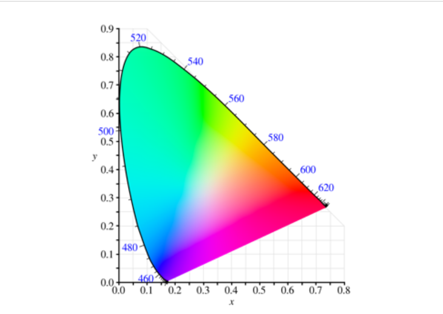
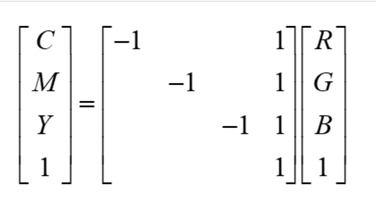
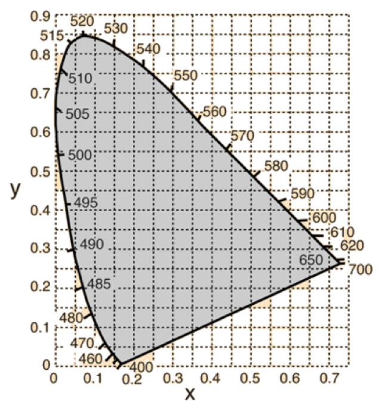

#data_visualization #data_science 

Corresponds to [CS519W1Notes](../../W1/CS519W1Notes.md)

# CS519- Week 1 Quiz

## Question 1

- Which of the following statements about the chromaticity diagram are true?
	- 

### Answer

- The set of colors that can be made by mixing together of three different frequencies of light would form a triangle in the diagram.
	- X
- Mono- spectral lights (i.e. lights emitting a single frequency) would correspond to colors around the boundary of the horseshoe shape.
	- X
- At least some of the colors shown inside horseshoe shape incorrectly represent the color at those `xyY` coordinates, since they are generated from an image using the sRGB color space.
	- X

### Incorrect Answer

- The non- spectral purples along the bottom of the horseshoe can only be generated by mixing together more than 3 primary colors.
	- X
## Question 2

- Which of the following facts is **true** about human perception of color?

### Answer

- It is possible that two lights that have completely different power spectral distributions will be perceived as the same color.
	- X

### Incorrect Answer

- The HSV color space, because it uses a wheel of hues, can represent all the colors humans can perceive.
	- X
- Human color perception is most sensitive to light in the blue portion of the spectrum (i.e. light with a short wavelength).
	- X
- There are three kinds of cone cells in the human eye that each respond to a different single frequency of light.
	- X

## Question 3.1

- Suppose we use unsigned 8- bit integers to represent the value of each color channel in an RGB value, so the range is between 0 and 255.
	- How many unique colors can be represented?

### Answer

- 16,777,216 unique colors
	- X

## Question 3.2

- The human eye can distinguish approximately 10 million different colors. 
- Consider your answer above and what you know about the relationship between RGB space and the CIE XYZ space. 
	- What is the relationship between the colors in RGB space and the set of colors perceivable by humans?

### Answer

- The RGB color space can represent a greater number of colors than humans can perceive, but not all colors people can perceive.

## Question 4

- 
	- The CMY color space (Cyan, Magenta and Yellow) is a subtractive color space designed for reflective displays such as printed material.
	- CMY is a complementary color space to RGB space. 
	- You can convert from an RGB representation of a color to a CMY representation using the matrix shown above. 
		- In this case, the colors are assumed to include an alpha channel as a fourth component.
	- How many colors have the same numeric representation both RGB and CMY? 
		- In other words, for how many colors is it true that the color $(c_1,c_2,c_3)_{RGB}$ and the color $(c_1,c_2,c_3)_{CMY}$ are the same color?

### Answer

- 1
	- X

## Question 5

- The illuminant D65 has XYZ coordinates of $(.9505, 1.0000, 1.0891)$.
	- Convert these to `xyY` and report the x and y coordinates.
	- 

### Answer

- $x = .31, y = .33$
	- X

## Question 6

- Consider the following RGB color $x = (.2, .5, .8)$
- Suppose the color will be shown on a display with a gamma of $\gamma = 2.1$.
- If $x_{corrected}$ is the gamma corrected version of $x$, enter the components of $x_{corrected}$.
	- Note that this is **not** an sRGB color, so use the standard formula, not the one specific to the sRGB standard.

### Answer

- $x_{corrected} = (.46468338121, .71887334872, .89919187655)$
	- X