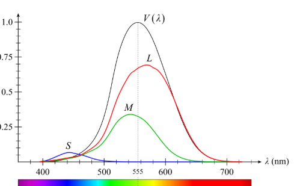
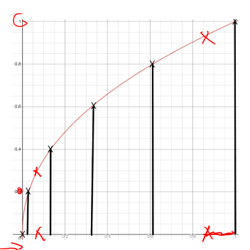

# CS519- Week 1

#data_science 

## What is Scientific Visualization?

### What is Scientific Visualization?

- A Visualization Lexicon
	- Many different activities and domains use the terms "visual" or "visualization"
	- We must be able to distinguish data visualization from information visualization, visual analytics and scientific visualization
- Data Visualization
	- Refers to the techniques used to communicate data or information by *encoding* it as visual objects
- Information Visualization
	- Process of transforming data and information that are not inherently spatial into a visual form, allowing the user to observe and understand the information
- Scientific Visualization
	- Focuses on spatial data generated by scientific process
- Scientific Visualization vs. Information Visualization
	- Both fields are more similar than different
	- Scientific visualization uses data from a physical or metric space
	- Information visualization uses more abstract data with no natural location
- Visual Analytics
	- Science of analytical reasoning facilitated by interactive visual interfaces
		- Visual analytics focuses on how to create computational tools for data analysis that use visualization
		- These tools often include other capabilities such as data mining to assist the analyst
- Sampling of Topics
	- Terrain Visualization
		- Visualization of global surface water temperature 
	- Volume Visualization
		- Simulation of a supernova
	- Isosurfaces
		- MRI data of a human knee
	- Flow Visualization
		- NASA Mars lander visualization, which consists of 6 billion cells, making it the world's largest interactive fluid visualization at the time
	- Tensor Field Visualization
		- Tensor field generated from Diffusion- Tensor MRI
		- Tensor glyphs
	- Bioinformatic Visualization
		- `HiGlass`, a web- based tool for visually exploring and comparing 2D genomic contact matrices

### Purposes of Visualization

- What is Visualization?
	- Computer- based visualization systems provide visual representations of datasets designed to help people carry out tasks more effectively
	- We need to understand which tools are best suited for which visualization tasks
- Geography of COVID-19
	- 
		- This display is a dashboard, which shows case incidence in geographic regions
		- Change over time can be observed
	- What is the task?
		- Revealing patterns
		- Exploring data and making decisions
			- e.g. resource allocation to different geographic areas
			- e.g. adapting policies to different regions
- Understanding Exponential Growth
	- 
		- Simulation of disease spread
	- These visualizations can be used to:
		- Explore data and answer questions
		- Communicate ideas
		- Generate hypotheses
		- Persuade or inspire
- COVID-19 Protein Structure
	- 
		- D614G mutation in the SARS-CoV-2 spike protein
	- Visualization is used to communicate ideas
- Mask Usage & Fluid Dynamics
	- 
	- Visualization of the effectiveness of face masks in obstructing respiratory jets
		- Answering Questions
			- Which if any masks, effectively contain respiratory jets?
		- Communicate & Persuade
			- Homemade masks can significantly reduce the spread of a respiratory jet
- CT Scans
	- Computerized tomography (CT) scan uses x- rays to generate a series of 2D images that record the observed tissue density
	- These images are then combined to create a 3D dataset detailing the observed internal structures
	- Usage
		- Used to generate hypotheses
			- How does COVID-19 affect the respiratory system?
		- Used to answer questions
			- To develop a diagnosis
- Visualization: Purpose
	- Visualization Tasks
		- Explore data and answer questions
		- Communicate ideas
		- Find/ reveal patterns & generate hypotheses
		- Persuade or inspire
	- Ubiquity of visualizations during the COVID-19 pandemic shows their value
- Misleading Visualizations
	- Visualizations are notorious in their ability to mislead
		- Misleading audiences is sometimes intentionally a subcategory of the "persuade" task
	- 
		- Using percentages and unordered arcs gives the impression that only a few people are at risk- which may not be true
		- Great care must be taken to ensure the information that is being conveyed is accurate
- Insight, Numbers & Pictures
	- "The purpose of computation is insight, not numbers"
	- "The purpose of visualization is insight, not pictures"
	- Note
		- Do **not** use visualization to accomplish a task better done without
			- e.g. finding if the number 519 occurs in a list of numbers

## Representing Color

### Digital Images: Display- Derived Color Spaces

- Digital Images
	- The fundamental task in visualization is creating a digital image
	- Most modern digital displays rely on a *raster* of *pixels* (rasterization)
		- A raster is a grid of addressable image elements called pixels
		- A pixel is the smallest controllable element of a digital image
- Digital Display Technology
	- Most modern digital displays are either LCD or OLED
		- LCD
			- Liquid Crystal Display
			- Transmissive using a light emitting diode (LED) backlight
		- OLED
			- Organic Light Emitting Diode
			- Uses emissive organic film to generate light
- LCD-LED Displays
	- 
		- Backing array of LEDs generates blue light
		- Light is transmitted through a photo- emissive film to generate desired wavelengths of light
		- Each pixel can be thought of as having red, green and blue (RGB) subpixels
- OLED Displays
	- 
		- Uses a mix of blue and orange- yellow OLED emitters to create white light
		- Light passes through the filters to create red, green and blue (RGB) subpixels
		- A fourth subpixel lets white light through
- OLED vs. LCD-LED 
	- OLED Advantages
		- Deep black levels
		- Excellent viewing angle
		- Fast refresh
		- Can potentially be manufactured on flexible substrates
	- LCD-LED Advantages
		- Cheaper
		- More energy efficient
- The Future?
	- 
		- Electro- Emissive Quantum Dot Display
			- No viewing angle issue
			- Perfect black level
			- Low cost
			- Flexible substrate
			- Fast refresh rate
- Subpixels
	- We can generalize that each pixel consists of red, green and blue subpixels
	- In practice, different subpixel geometries are used by different displays
		- e.g. `PenTile` displays mimic the sensitivity of the human eye
		- `PenTile` was invented by Candice H. Brown Elliot
- RGB Color Space
	- Emissive displays typically use an RGB space to specify colors
		- R, G and B are **primaries**
		- Each corresponds to a specific wavelength of light
	- A pixel color is usually specified by a tuple of 3 numbers (R, G, B)
	- Each of the R, G and B values are called a **color channel**
	- The value of a channel is referred to as the **intensity**
	- Typically, each channel value will be a floating point number in $[0.0, 1.0]$
		- $0.0$ means no light
		- $1.0$ means full intensity
- Alpha Channel
	- Some color representations include a fourth channel: $\alpha$
		- RGBA Representation
	- Alpha represents *opacity*
		- $0.0$ is transparent
		- $1.0$ is opaque
	- RGBA is useful for simulating semi- transparent surfaces and compositing
		- e.g. visualizing MRI data
- Operations on Colors
	- We can add and subtract RGB tuples component- wise
		- These operations are similar to turning on multiple lights and turning off multiple lights
		- Values add/ subtract linearly, results are clamped to $[0, 1]$
	- The set of all linear combinations forms the space of all colors we can create
	- To simulate *reflection*, we can multiply the two RGB tuples
		- e.g. reflecting white light off a blue surface
			- $(1, 1, 1) \times (0, 0, 1) = (0, 0, 1)$
		- The surface absorbs non- blue wavelengths

### Digital Images: Representing Intensity

- Intensity
	- Intensity values are typically in 8- bit representations
		- 8 bits per color channel, 24- bit color
	- 
		- Each channel is an 8- bit unsigned integer
		- You may sometimes see hexadecimal expressions for the color range
			- e.g. `[0x00, 0xFF]`
		- Intensity ranges from $[0, 255]$ and can be converted to float by dividing by 255
	- Some high- dynamic range (HDR) displays use a different representation
		- HDR TV has 10 ~ 12 bits per color channel
		- `OpenEXR` file format can use 16- bit floating point for each channel
	- In application level code, keep color values as at least 32- bit floats
		- Reduces the impact of quantization on the colors
		- Reduction of precision will happen on the graphics processing unit (GPU)
- Luminance & Human Perception
	- Many technologies do not record/ display the full range of luminance perceivable by humans
	- HDR technologies offer high contrast capabilities
	- 256 gray levels is insufficient to look continuous
- PNG Image File Format
	- Portable Network Graphics (PNG)
	- Raster- graphics file format that supports *lossless data compression*
	- Supports palette- based images, grayscale and full- color non- palette- based RGB or RGBA images
- Implications for Visualization
	- You cannot be sure that viewers will see the same colors that you compute, since you cannot display differences
		- Quantization in storage and/ or transmission to display
	- If you map values to color, it allows users to query for the original numerical value

### Digital Images: The HSV Color Space

- HSV Color Space
	- Color picking in RGB is not always easy
	- Hue, Saturation and Value (HSV) is an alternative color space
		- Equivalent to RGB in the colors it can represent
		- Easier to design color picking interfaces
	- 
		- Hue $[0, 360]$ is an angle about the color wheel
			- $0 \degree = red$
			- $60 \degree = yellow$ 
			- $240 \degree = blue$
		- Saturation $[0, 1]$ is the distance from gray
		- Value $[0, 1]$ is the distance from black
- RGB to HSV Conversion
	- Let $maxRGB = max(R, G, B)$
	- Let $minGB = min(R, G, B)$
	- $S = (maxRGB - minRGB) / maxRGB$
	- $V = maxRGB$ 
	- Compute $H$
		- 
	- Example
		- Values
			- $H: [0, 360]$
			- $S: [0, 1]$
			- $V: [0, 1]$
		- Calculation
			- $f(n) = V - VS * max(0, min(k, 4 - k, 1))$
			- $k = (n + \frac{H}{60 \degree}) mod 6$
			- $(R, G, B) = (f(5), f(3), f(1))$
- Color Spaces
	- Red, yellow and blue are **not** *the primary colors*
		- Cyan, magenta and yellow color space is used for reflective displays
	- Any set of wavelengths c
	- an serve as primaries
		- Defines a set of colors you can create by mixing
		- Some lets you generate more colors, some lets you generate fewer
	- A 3 wavelength color space **cannot** produce all the colors a person can see
		- To understand why, we need to look at perceptually- defined color spaces

## Perceptually- Defined Color Spaces

### Perceptual Color Spaces

- Important Note About Color
	- Color is a perceptual phenomenon
	- It is **not** a physical property of a material or of light
- Light
	- Human vision senses energy in a portion of the electromagnetic spectrum
	- Energy is carried by photons
	- The energy of each photon is proportional to its **frequency** (inverse of wavelength)
	- Intensity of light is related to the number of photons received
- Human Visual System: Rod & Cone Cells
	- 
	- Rods
		- Measures intensity
		- 80 million
		- Denser away from fovea
		- Sensitive, shuts down in daylight
		- Astronomers learn to glance off to the side of what they are studying
	- L, M & S Cones
		- 5 million
		- 100,000 ~ 325,000 cones/ $mm^2$ in fovea
		- 150 hues
	- Combined
		- 7 million shades
- Cone Cell Response
	- 
	- $V(\lambda)$ is the luminosity function
		- Indicates ***perceived*** brightness
	- Cone Distribution
		- 63% Long
		- 31% Medium
		- 6% Short
	- Luminosity peaks at 555nm
		- Green- yellows are perceived as brightest
		- Blues are perceived as dark
- The Human Visual System
	- Color corresponds to some amount of stimulus of the cones
	- Light is usually a mix of wavelengths
		- A spectral power distribution
		- The distribution shown below is for a "white" light
		- 
	- Two different distributions can produce the *same* stimulus
		- They produce the same *perceived* color
		- Different distributions that produce the same color are called **metamers**
- Color Spaces
	- To create a color image, we need a way to specify colors
	- A color corresponds to some level of L, M, S cones
		- The set of possible tri- stimulus values forms a 3D vector space
	- The basis vectors for the space are **not** physical, since no wavelength of light can simulate only one kind of cone
	- To create a color space with a physical meaning, we choose 3 discrete wavelengths called *primaries*
	- The wavelengths can be mixed at different intensities
		- The spectral distributions shown below correspond to colors defined for some average viewer
		- 
- CIE RGB Color Space
	- CI RGB Color Space
		- Defined in 1931 by the International Commission on Illumination
		- CIE is from the French name "`Commision Internationale de L'eclairage`"
	- Used primary wavelengths
		- 435.8nm (blue)
		- 546.1nm (green)
		- 700nm (red)
		- 
- Color Matching Experiments
	- 
	- The Experiment
		- A set of viewers were shown a mono- spectral light
		- Viewers tried to match the color by mixing the 3 primitives
		- This was impossible, but a match *could* be made by mixing one of the primaries with the mono- spectral light
			- Shown in the graph as negative values
	- Plot
		- Created by repeating the experiment for different wavelengths of mono- spectral light
		- The values from the repeated experiments were then averaged/ filtered from the test subjects
- CIE RGB Color Space
	- Intensity of the primaries for the CIE RGB color space are computed as follows:
		- $R = \int_{\lambda} \bar{r}(\lambda)P(\lambda)d \lambda$ 
		- $G = \int_{\lambda} \bar{g}(\lambda)P(\lambda)d \lambda$
		- $B = \int_{\lambda} \bar{b}(\lambda)P(\lambda)d \lambda$
	- This is the *basis* for the RGB color space, not the color space itself
- CIE XYZ Color Space
	- CIE RGB had two problems
		- Negative values made interpreting the data tricky
		- No separation between perceived luminance and chromaticity
			- Chromaticity: *Objective* specification of the quality of a color regardless of its luminance
			- e.g. separate "brightness" and "hue"
	- CIE XYZ addresses these issues
		- Convert RGB to XYZ
			- 
	- CIE XYZ
		- Primaries only take on positive values
		- $\bar{y}(\lambda)$ corresponds closely to the values of the luminosity function
			- Therefore, $Y$ corresponds to perceived brightness
- `xyY` Color Space
	- Sometimes it is useful to have normalized chromaticity values
		- Range from $[0, 1]$
		- Does not change with luminance
	- Normalization
		- 
			- Convention is to use $x$ and $y$ to indicate chromaticity
			- Combining them with the original $Y$ value gives a color in the `xyY` color space
- CIE `xy` Chromaticity Diagram
	- 
		- Depicts all colors visible to an average human
		- The curved boundary is the spectral locus
			- Consists of all the colors associated with a single wavelength
			- Bottom "line of purples" are not single wavelength colors
		- Points not on the curved boundary are a mixture of multiple wavelengths
		- Standard sRGB color space is defined by 3 points labeled R, G and B
			- All the colors possible in that space lie in the RGB triangle
			- Set of producible colors in a space is called a **gamut**
- Three Primary Colors Cannot Produce All Possible Colors
	- CIE RGB color space includes all possible colors visible to most people
	- No space defined by 3 primary colors can include all colors
		- In the context of the diagram, no triangle can cover the horseshoe entirely
	- What about the CIE RGB space?
		- CIE RGB primaries are **not** colors
		- CIE RGB are not physical lights
		- CIE RGB primaries are a function of the color- matching curves
- Standard Illuminants
	- What point on the diagram corresponds to white light?
		- Perfectly white light occurs at $(\frac{1}{3}, \frac{1}{3})$
		- This point is referred to as the **standard illuminant** $E$
	- Most light sources are not perfectly white
		- Illuminant D65 is at $(.3127, .2390)$
			- Approximates average daylight in most geographical locations
			- Defines white light for the sRGB color space

### The sRGB Color Space

- sRGB Color Space
	- The standard RGB color space is defined in terms of the CIE XYZ space
	- The primaries are:
		- 
	- The $Y$ coordinates can be computed by:
		- Requiring that the primaries sum to D65 with $Y_{65} = 1$
		- Converting to XYZ space and solving for luminance
			- $Y_R = .212639$
			- $Y_G =.715169$
			- $Y_B = .072192$
- Conversion from XYZ to sRGB
	- We want to find a matrix $M_{sRGB}$ that converts a XYZ color to sRGB
	- Each sRGB primary should be converted to its defined XYZ coordinate
		- 
	- The columns of the RHS matrix are the sRGB coordinates of the primaries
	- We can substitute in the known `xyY` values for variables in the middle matrix
		- e.g. $(x_g, y_g, Y_g) = (.3, .6, .715169)$ 
	- Solving for it gets us the following:
		- 
- Conversion from sRGB to XYZ
	- The conversion from sRGB to XYZ is simply the inverse of $M_{sRGB}$
		- 
- sRGB: The Big Picture
	- sRGB is the standard color space used in modern computing
		- Given an RGB tuple to display, a web browser will assume it is an sRGB value
		- Gives displays the opportunity to exhibit color uniformity
		- In practice, this is still difficult to do
			- e.g. LCD-LED black isn't the same as OLED black

### Gamma Correction

- Gamma Correction
	- In the days of CRT displays:
		- Color channels had intensity values in the range $[0, 1]$
		- The brightness of a subpixel was a non- linear function of the input brightness
		- $V_{display} = V_{signal}^{\gamma}$ 
			- $\gamma$ varied by display, but 2.2 was a typical value
	- This meant that displayed colors were darker than the input color
		- 
		- This was later adjusted by **gamma correction**, using the inputs of $V_{signal}^{\frac{1}{\gamma}}$ 
	- It's not clear if the CRT gamma was an unavoidable feature
		- It may have been a design choice
		- Human vision is more sensitive to lower intensity light
		- Human vision is better at differentiating darker shades
	- LCD-LEDs do not have to use gamma
		- Most do and use $\gamma = 2.2$, but not all
		- Gamma values for different displays will vary
	- The sRGB standard uses gamma
		- Pixels in a sRGB image file have had gamma correction applied
	- Gamma Correction Overview
		- When we create an image using software, the pixels will start as *linear* values
		- Before pixels are stored in a file or displayed, we can gamma correct them
			- Inputs are stored at $V_{signal}^{\frac{1}{\gamma}}$
		- When displayed on a screen, the pixels appear linear again
- Gamma Correction in sRGB
	- 
	- An image stored in the sRGB format has gamma corrected pixels
		- 
	- To decode an sRGB color, you need to apply $f_{linear}$
		- 
- Working with Gamma
	- Usually, you do not need to gamma correct an image you create
	- The library code will usually apply gamma correction to the image you save
		- e.g. `libpng` will encode the image data according to sRGB standard
		- You *can* specify an alternate gamma for the correction itself
	- When displaying an image you create in a browser, what you should do is not always clear
		- e.g. `WebGL` standard does not specify that colors should be gamma- corrected
		- Gamma behavior can vary by browser, OS and GPU
		- One way to address this dilemma is to create a control panel on your app to enable/ adjust the gamma value manually
- Gamma & Visualization
	- If you are using stored images that you will process computationally:
		- Need to remove the gamma correction before working with the pixerls
		- Most image processing operations work with linear colors
		- Library code can probably be used to read images and linearize colors
	- If your visualization requires precise understanding of pixel intensities, you need to be careful
		- Make sure your color production is compatible with the intended display gamma
		- Allow display of actual numerical values or underlying data that the color represents
- Gamma Compression
	- Why is gamma still used by modern displays?
		- Legacy images may be encoded with gamma correction
		- Gamma is also useful when downsampling images from higher to lower bit- depth (gamma compression)
			- Human vision has trouble differentiating bright intensities
			- Implies that we should allocate more precision to lower intensities when downsampling
- Gamma Compression: Example
	- Suppose we are downsampling
		- Target space can only represent 6 values:
			- $0, 0.2, 0.4, 0.6, 0.8, 1.0$
	- 
		- Procedure
			- Gamma correct raw value $x$
			- Round to closest value of the 6 we *can* represent
		- Raw values are on the x- axis
		- Gamma corrected values are on the y- axis
			- Gamma corrected values get rounded to a representative
		- We can drop lines from the representatives down to the x- axis and see that we are more densely sampling darker values