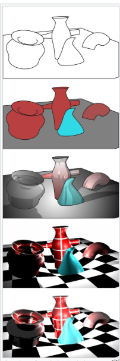
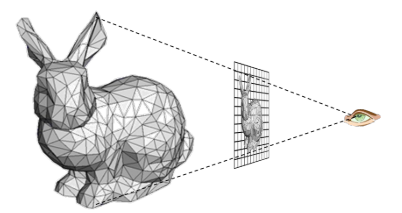
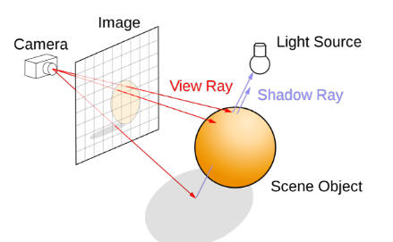
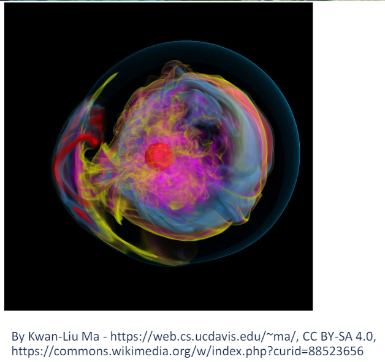

# CS519- Week 2

#data_visualization #data_science 

## 3D Computer Graphics

### Rendering

- Visualization & Computer Graphics
	- Visualization is **not** computer graphics
		- Visualization uses computer graphics as a tool
		- You can create great visualizations *without* a deep knowledge of computer graphics
	- We will need to understand what elements of computer graphics impact visualization
		- What impacts application performance?
			- Crucial for interactivity
		- What impacts the visual quality of the rendered image?
			- Important for avoiding distortion in images that may mislead people
	- 3D computer graphics is important for scientific visualization because we often want to see 3D physical domains
- Rendering
	- Rendering (image synthesis) is the automatic process of generating a photorealistic or non- photorealistic image from a 2D or 3D model (or models in what collectively could be called a *scene file*) by means of computer program
	- 
		- Demonstration of rendering techniques applied to a single 3D scene
- 3D Graphics: Image Formation
	- Usually, the goal of computer graphics is to generate a 2D image of a 3D scene
		- Input data is a *scene description*
		- Output is an image
	- Computationally, we need to mimic a camera or the human eye
		- From there, we build a scene with objects, light and a viewer
- Polygonal Models
	- Surfaces are most often modeled using triangles
		- Modern GPUs are designed to render triangles
	- Rendering *generally* uses one of two approaches:
		- Rasterization
		- Ray Tracing
	- Sometimes, both can be used
		- Other methods like radiosity can be used as well
- Rasterization vs. Ray Tracing
	- Rasterization
		- Geometric primitives are projected onto an image plane and the rasterizer decides which pixels get filled
		- 
	- Ray Tracing
		- Models the physical transport of light by shooting a sampling ray through each pixel in an image plane and seeing what the ray hits in the scene
		- 
- Ray Tracing
	- Overview
		- You can follow the ray of light
		- Trace from an eyepoint through a pixel
		- Observe what object the ray hits
	- The next task is to determine if the object is lit or is in the shadow
- Ray Tracing in Visualization
	- Ray tracing is used in scientific visualization to generate semi- transparent views of volumes
		- Rays can sample volumes
		- 
	- Rasterization has difficulty doing this as it is more specialized for surface rendering

### Rasterization

- Rasterization (Logic)
	- For each primitive:
		- Compute illumination
		- Project to image plane
		- Fill in pixels
- Definitions: Pixel & Raster
	- Pixel
		- Smallest controllable picture element in an image
	- Raster
		- Grid of pixel values
		- 
	- RGB Color Representation
		- A color is a triple tuple $(R, G, B)$ representing a mix of red, green and blue light
		- Each color channel has a value in $[0, 1]$, which indicates how much light is emitted
- Rasterization
	- 
	- Vector Graphics Representation
		- Purely *mathematical* representation of shape
			- e.g. A line on a shape is $y = mx + b$
		- Typically, **vector graphics** refer to *2D* shapes, but the idea can be applied to 3D as well
- 3D Graphics Pipeline
	- 
	- Fragments
		- Similar to pixels, but they aren't the finalized pixels you see in an image
		- Each fragment has a 2D location in a raster and a color
		- The final pixel value is typically found by applying *hidden surface removal* and possibly compositing to a set of fragments 
- Rasterization is a Pipeline
	- 
		- Data for objects in the scene are usually in the form of polygonal meshes
		- Most of the work done to render an image is processed on the Graphics Processing Unit (GPU)
		- GPU code will have at least two parts:
			- Vertex Shader
			- Fragment Shader
- Vertex Shader
	- Program that runs on the GPU
	- Typically transforms vertex locations from one coordinate system to another
		- Transformations can be useful for placing objects in your scene
		- Some operations on the geometry are easier when done in specific coordinate systems
	- Change of coordinates is usually equivalent to a *matrix transformation*
	- Vertex shader can also be used to compute vertex colors
- Changing Coordinate Systems
	- 
	- Model Transformation
		- Move a model from a *local* coordinate system to a position in the "world"
	- Camera Transformation
		- Places camera at the origin and moves the objects in the world using the *same* transformation
	- Projection Transformation
		- Change coordinates so that a 3D to 2D projection of the geometry is done correctly
	- Viewport Transformation
		- Change from 2D coordinates in $[-1, 1]$ to pixel coordinates
- Rasterization
	- 
	- Produces a set of fragments for each triangle
	- Fragments are treated as "potential pixels"
		- Has a location in frame buffer
		- Possesses color and depth attributes
	- Vertex attributes are interpolated across fragments
- Vertex Shader
	- 
	- Note
		- There is a slight error in the above example
		- 
- Fragment Shader
	- 
	- Note
		- 

### Shading

- X

### Rendering & Visualization

- X

## Scalar Fields

### Colormaps

- X