# CS519- Week 2

#data_visualization #data_science 

## 3D Computer Graphics

### Rendering

- Visualization & Computer Graphics
	- Visualization is **not** computer graphics
		- Visualization uses computer graphics as a tool
		- You can create great visualizations *without* a deep knowledge of computer graphics
	- We will need to understand what elements of computer graphics impact visualization
		- What impacts application performance?
			- Crucial for interactivity
		- What impacts the visual quality of the rendered image?
			- Important for avoiding distortion in images that may mislead people
	- 3D computer graphics is important for scientific visualization because we often want to see 3D physical domains
- Rendering
	- Rendering (image synthesis) is the automatic process of generating a photorealistic or non- photorealistic image from a 2D or 3D model (or models in what collectively could be called a *scene file*) by means of computer program
	- 
		- Demonstration of rendering techniques applied to a single 3D scene
- 3D Graphics: Image Formation
	- Usually, the goal of computer graphics is to generate a 2D image of a 3D scene
		- Input data is a *scene description*
		- Output is an image
	- Computationally, we need to mimic a camera or the human eye
		- From there, we build a scene with objects, light and a viewer
- Polygonal Models
	- Surfaces are most often modeled using triangles
		- Modern GPUs are designed to render triangles
	- Rendering *generally* uses one of two approaches:
		- Rasterization
		- Ray Tracing
	- Sometimes, both can be used
		- Other methods like radiosity can be used as well
- Rasterization vs. Ray Tracing
	- Rasterization
		- Geometric primitives are projected onto an image plane and the rasterizer decides which pixels get filled
		- 
	- Ray Tracing
		- Models the physical transport of light by shooting a sampling ray through each pixel in an image plane and seeing what the ray hits in the scene
		- 
- Ray Tracing
	- Overview
		- You can follow the ray of light
		- Trace from an eyepoint through a pixel
		- Observe what object the ray hits
	- The next task is to determine if the object is lit or is in the shadow
- Ray Tracing in Visualization
	- Ray tracing is used in scientific visualization to generate semi- transparent views of volumes
		- Rays can sample volumes
		- 
	- Rasterization has difficulty doing this as it is more specialized for surface rendering

### Rasterization

- Rasterization (Logic)
	- For each primitive:
		- Compute illumination
		- Project to image plane
		- Fill in pixels
- Definitions: Pixel & Raster
	- Pixel
		- Smallest controllable picture element in an image
	- Raster
		- Grid of pixel values
		- 
	- RGB Color Representation
		- A color is a triple tuple $(R, G, B)$ representing a mix of red, green and blue light
		- Each color channel has a value in $[0, 1]$, which indicates how much light is emitted
- Rasterization
	- 
	- Vector Graphics Representation
		- Purely *mathematical* representation of shape
			- e.g. A line on a shape is $y = mx + b$
		- Typically, **vector graphics** refer to *2D* shapes, but the idea can be applied to 3D as well
- 3D Graphics Pipeline
	- 
	- Fragments
		- Similar to pixels, but they aren't the finalized pixels you see in an image
		- Each fragment has a 2D location in a raster and a color
		- The final pixel value is typically found by applying *hidden surface removal* and possibly compositing to a set of fragments 
- Rasterization is a Pipeline
	- 
		- Data for objects in the scene are usually in the form of polygonal meshes
		- Most of the work done to render an image is processed on the Graphics Processing Unit (GPU)
		- GPU code will have at least two parts:
			- Vertex Shader
			- Fragment Shader
- Vertex Shader
	- Program that runs on the GPU
	- Typically transforms vertex locations from one coordinate system to another
		- Transformations can be useful for placing objects in your scene
		- Some operations on the geometry are easier when done in specific coordinate systems
	- Change of coordinates is usually equivalent to a *matrix transformation*
	- Vertex shader can also be used to compute vertex colors
- Changing Coordinate Systems
	- 
	- Model Transformation
		- Move a model from a *local* coordinate system to a position in the "world"
	- Camera Transformation
		- Places camera at the origin and moves the objects in the world using the *same* transformation
	- Projection Transformation
		- Change coordinates so that a 3D to 2D projection of the geometry is done correctly
	- Viewport Transformation
		- Change from 2D coordinates in $[-1, 1]$ to pixel coordinates
- Rasterization
	- 
	- Produces a set of fragments for each triangle
	- Fragments are treated as "potential pixels"
		- Has a location in frame buffer
		- Possesses color and depth attributes
	- Vertex attributes are interpolated across fragments
- Vertex Shader
	- 
	- Note
		- There is a slight error in the above example
		- The animation *should* depict the following
			- Take the coordinates of the vertex and multiplying it times the matrix to affect a geometric transformation
		- This process should **not** be done sequentially, since this process is done on the GPU, whose cores are able to cycle through this process in parallel
- Fragment Shader
	- 
	- Note
		- Finalizes a color for each one of the fragments generated by the rasterized triangle
			- Interpolates colors that are associated with the vertices $\{v_1, v_2, v_3\}$ of the triangle
			- This process would again, be done in parallel on the GPU

### Shading

- Shading
	- Process of determining the color for a pixel (or vertex, or polygon) during the *rendering* process
	- 
- Scattering
	- 
		- Light strikes A
			- Some light is scattered
			- Some light is absorbed
		- Scattered light from A strikes B
			- Some light is scattered
			- Some light is absorbed
		- Scattered light from B strikes A and so on
- Light Sources
	- 
		- General light sources are complex to model as you would need to integrate light coming from *all* points on the source
- Simple Light Source Models
	- Point Source
		- Model that has both position and color
	- Directional Source
		- Distant source (theoretically infinite distance away) that is parallel
	- Ambient Light
		- Same amount of light is present everywhere in the scene
		- Can model the contribution of many sources and reflecting surfaces
- Surface Types
	- Assume that light is traveling along a specific ray
		- The smoother a surface is, the more reflected light is concentrated in a single direction
		- Perfect mirrors reflect perfectly in a single direction
		- In contrast, a rough surface scatters light in all directions
	- 
- The Phong Reflection Model
	- Simple model that can be computed rapidly
	- Components
		- Diffuse
		- Specular 
		- Ambient
	- Vectors
		- Light (L)
		- Viewer (V)
		- Normal (N)
		- Perfect Reflector (R)
- The Phong Reflectance Model
	- 
	- $I_p = k_a i_a + \sum_{m \in \text{lights}} \left( k_d (\hat{L}_m \cdot \hat{N}) i_{m, d} + k_s (\hat{R}_m \cdot \hat{V})^{\alpha} i_{m, s} \right)$
		- $I_p$ : total intensity of the light reflected from a a surface point
			- $I_p = I_a + I_d + I_s$
	- Overview
		- Ambient Reflection `-->` Constant, omnidirectional light that illuminates the surface uniformly, ensuring that all parts of the surface receives some light even if they are not directly illuminated by the light source
		- Summation of Light Sources `-->` Diffuse and specular components are calculated for each light source $m$ in the scene, combined to get total contribution from all lights
			- Diffuse Reflection `-->` Models the light scattered in many directions from a rough surface, following Lambert's cosine law
				- $k_d$ : diffuse relativity coefficient of the surface
				- $\hat{L}_m$ : normalized direction vector from the surface point to light source $m$
				- $\hat{N}$ :  normalized normal vector of the surface at the point of interest
				- $i_{m, d}$ : intensity of the diffuse light from the light source $m$
			- Specular Reflection `-->` Models the bright "highlights" on shiny surfaces where light is reflected in a concentrated manner 
				- $k_s$ : specular reflectivity coefficient of the surface
				- $\hat{R}_m$ : normalized direction vector of the perfect reflection of the light direction $\hat{L}_m$ about the surface normal $\hat{N}$
				- $\hat{V}$ : normalized direction vector from the surface point to the observer
				- $\alpha$ : shininess coefficient, controls the sharpness of the specular highlight (higher values = sharper highlights)
				- $i_{m, s}$ : intensity of the specular light from the light source $m$
- Specular Reflection
	- 
		- Perfect Specular Reflection
			- Light is reflected a *single* direction $r$, which is also the mirror reflection direction
		- Glossy Specular Reflection
			- Scattering clustered *around* the mirror reflection direction
	- Reflectance is determined by the following:
		- Alignment of view vector with regards to the mirror reflection vector
		- Shininess coefficient
	- Higher shininess coefficient ($\alpha$) means a smoother look
		- ~ 100 for metal
		- ~ 10 for plastic
- Modeling a Lambertian Surface: Diffuse Reflection
	- Perfectly diffuse reflector
	- Light is scattered equally in all directions
	- Amount of light being reflected is affected by the angle of incidence
		- Reflected light is proportional to the **cosine of the angle between $l$ and $n$**
		- If vectors are normalized
	- Amount of reflected light is also affected by $k_d$ and $i_d$
		- Each is an RGB value with each channel in $[0, 1]$
- Ambient Light
	- Result of multiple interactions between light sources and surfaces
	- Amount and color depends on the color of the light(s), along with the properties of the materials
	- Add $k_a I_a$ to diffuse and specular terms
		- $k_a$ : reflection
		- $I_a$ : intensity of ambient light
	- Note
		- $k_a I_a$ multiplications are component- wise multiplications of RGB values:
			- $(k_r, k_g, k_b)(i_r, i_g, i_b) = (k_r i_r, k_g i_g, k_b i_b)$
- Distance Terms
	- Light from a point source that reaches a surface is **attenuated**
		- Intensity of light falls off in proportion to the square of the distance
	- Apply a factor to the diffuse and specular terms
		- $\frac{1}{ad^2 + bd + c}$
			- $d$ : distance from light to surface
			- $a, b, c$ : constants that can be adjusted to get different effects 
- Blinn- Phong Reflectance Model
	- Jim Blinn suggested an approximating changing specular term
		- Replace $(V \cdot R)^a$ by $(N \cdot H)^b$
			- Halfway Vector
			- $H = \frac{L + V}{|| L + V ||}$
	- In terms of the operations being used, this is more efficient and closer to physically correct lighting
		- Allows you to pick exponent **b** to match what you want
			- Using higher $b > a$ will make the output similar to Phone with $a$
- The Halfway Vector
	- $H$ is a normalized vector *halfway* between $L$ and $V$
		- $r = 2(l \cdot n)n - l$
		- 
- Phong vs. Blinn- Phong
	- 
		- Difference between the two will only be the specular highlights
			- Using the same exponents on both models will result in the Phong model having "tighter" highlights 
			- Blinn- Phong can achieve the same highlights with a higher exponent
- Gouraud & Phong Shading
	- 
	- Gouraud Shading
		- Find the average normal at each vertex
		- Compute the shade at each vertex
		- Interpolate vertex shades across each polygon
	- Phong Shading (**Not the same as Phong Reflectance Model**)
		- Find the average normal at each vertex
		- Interpolate vertex normals across edges
		- Interpolate edge normals across polygon
		- Compute shade at each fragment 
- Bui Tuong Phong
	- December 14th, 1942 ~ July 1975
	- Born in Hanoi
	- Earned in PhD at the University of Utah (1973)
		- Worked with Professor Ivan Sutherland
		- Dissertation work was the Phong Reflectance Model
		- Produces model and realistic image of a VW Beetle

### Rendering & Visualization

- Real- Time Rendering
	- 3D surfaces are modeled with triangle meshes
		- Each triangle is projected to 2D
		- Each triangle is rasterized into pixels
		- Each pixel is shaded according to some arbitrary model
- Questions to Ask
	- What determines how performant an application is?
	- What visual artifacts of the rendering process impact visualization?
		- Projection
		- Shading
		- Hidden Surface Removal
- Performance
	- Complicated issue where the number of triangles in the surface model is often the key factor
		- Fewer Triangles = Faster Rendering
- Projections & Distortion (Part 1)
	- Mercator Projection
		- 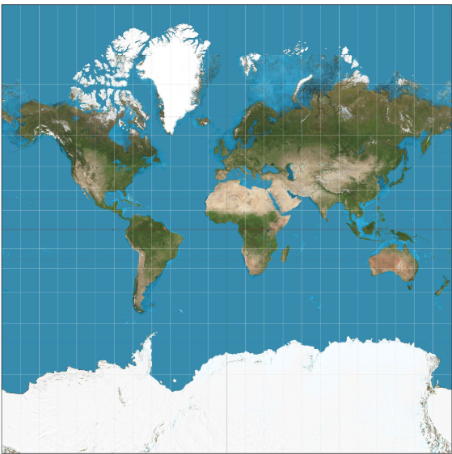
		- Developed by Gerardus Mercator in 1569
		- Lines of constant bearing are straight lines on a map
		- Revolutionary for naval navigation at the time
			- Easily plots a course of constant bearing between 2 locations
				- Constant Bearing
					- Maintaining a constant angle between the direction of navigation and *true* North
					- A **rhumb line** is a course of constant bearing since it will cross lines of longitude at the same angle and spiral into the pole
			- Maintains a heading using a compass
			- Avoids repeated course corrections to new heading
		- Poor for the task of *comparing* relative areas
			- Africa is 14 times larger than Greenland
			- Areas farther from the equator appear larger
			- Circles on the indicatrix show *relative* distortion
				- 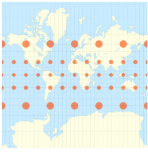
- Perspective Projection
	- 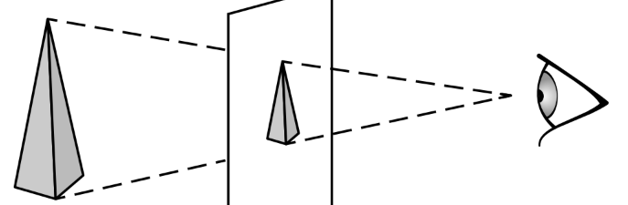
	- Perspective Distortion
		- Distance objects appear smaller than the same object close up
		- Objects closer to the image plane and away from the center of projection (CoP) will look elongated
- Orthographic Projection
	- 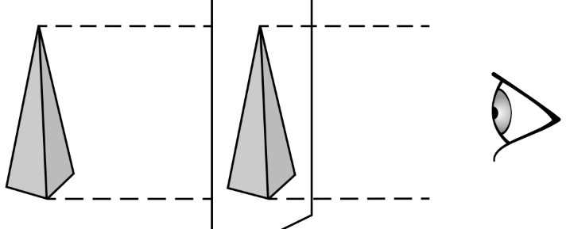
	- An object has same apparent size regardless of distance from the eye
	- Foreshortening can *still occur* if the object is angled away from the eye
- Projections & Distortion (Part 2)
	- 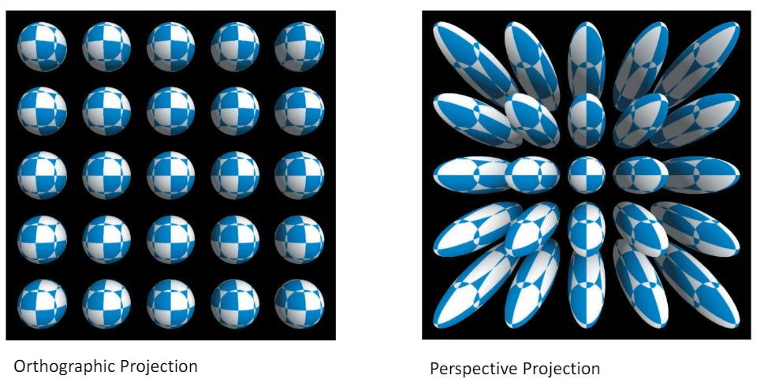
- Orthographic Projection for Engineering
	- If comparing lengths is *important* for application, consider orthographic
		- 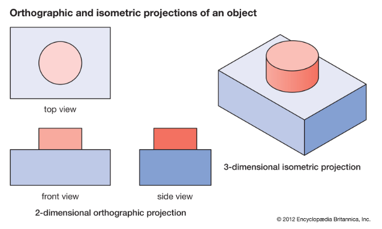
- Isometric Projection
	- Commonly used in technical drawings and some computer game graphics
	- Three axes appear $120\degree$ from each other and are equally foreshortened
	- Achieved by:
		- Rotating an object $45\degree$ around the vertical axis $Y$
		- Rotating ~$35.3\degree$ through the horizontal axis $X$
		- Projecting orthographically onto the XY plane
	- 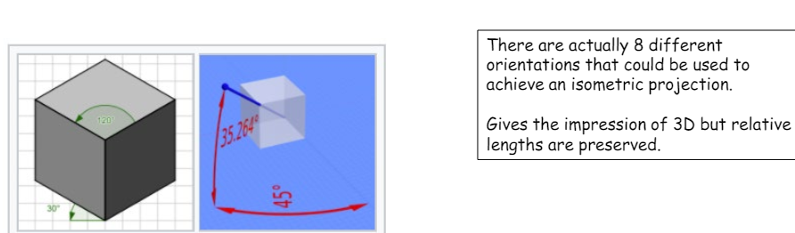
- Isometric Projection in Art
	- 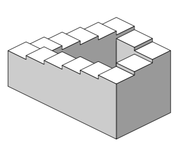
		- Isometric projection can be used to generate optical illusions
		- It's difficult to judge distance effectively since objects' different depths project to the same size
- Shading & Visualization
	- Shading is an important 3D visual cue
		- Especially diffuse shading in Blinn- Phong
	- Need to determine if non- white light was used
		- This can change the rendered color of the surface
	- Too much ambient light can wash away details
		- Too little can leave structures too dark, which makes it difficult to discern details as well
- Hidden Surface Removal & Z- Fighting
	- Can occur when 2 surfaces are co- planar or close to co- planar
		- "Z" refers to depth, the distance from the camera
		- The rendering engine inconsistently determines which surface is closest
	- Each fragment has a z- value (positive depth from camera)
		- Hidden surface removal compares the z- values of fragments at the same screen location
		- Only the fragment that has the smallest z- value is retained
		- 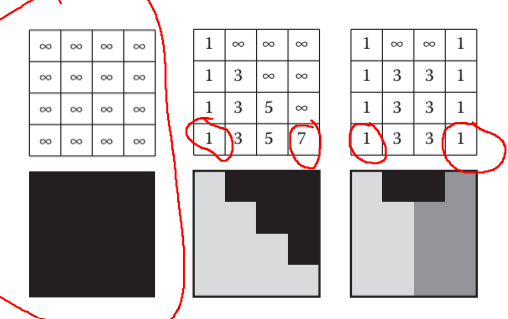
	- Depths from the camera lie in the range $[n, f]$
		- $n$ : positive distances to the near clipping plane
		- $f$ : positive distance to the far clipping plane
		- 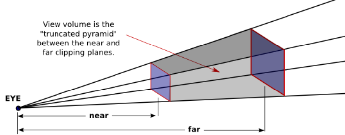
	- Assume depths are positive integers $\{0, 1, ... B - 1\}$
		- Map $n$ to $0$ and $f$ to $B - 1$
			- Each integer in the range corresponds to a *bucket* of depth $\Delta z = \frac{f - n}{B}$
	- If you render a scene in which surfaces have a separation of $1 m$, if the $\Delta z < 1$, there should be **no** z- fighting
		- If the separation is less than the bucket depth, you *can* have z- fighting
			- Cannot determine which surface is closest
			- Rounding errors may switch which surface is chose as the closest in different parts of the scene
	- Fixes for z- fighting:
		- Move the near and far planes closer together 
		- Move surfaces apart (increasing the depth buffer precision or offsetting the surfaces)
	- Bucket sizes will vary by depth due to perspective projection
		- Ability to perform hidden surface removal degrades with distance

## Scalar Fields

### Colormaps

- What is a Scalar Field?
	- Scalars are a single quantity or number
	- A scalar field assigns a scalar to every point in a give space
- For a 2D space, a scalar field is often visualized using color
	- Render a representation of domain and assign a color to each pixel
	- In order to do so, we need to construct a colormap
- Coloring Continuous Data
	- Coloring to denote *continuous* data is called **pseudo- coloring**
		- Such a mapping from value to color is called a choropleth
	- Questions
		- Standard weather map colors?
			- Blue, Cyan, Green, Yellow, Orange, Red
		- Elevation in geography?
			- Blue, Green, Brown, White
		- Most used colormap?
			- Rainbow
		- Is it useful?
			- Not really
- Designing a Colormap: Two Options
	- Color Table
		- Precompute colors and store them
		- 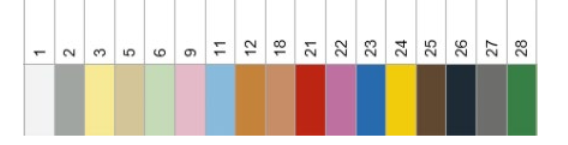
	- Transfer Function
		- 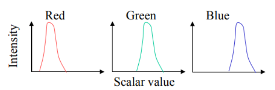
- Designing a Colormap: Generate a Color Table
	- Map each scalar value $x \in R$ to a point to a color via a table lookup
		- Assume that we know $x \in [x_{min}, x_{max})$
	- Color Tables
		- Precompute colors and save results into a table of colors $\{c_1 ... c_N\}$
		- Index table by mapping ranges to integers
	- Suppose that we have $N$ colors in a table and we index them into $[0, N-1]$
		- Typically, a color mapping function might generate an index $i$:
			- $i = min([\frac{x - x_{min}}{\frac{x_{max}-x_{min}}{N}}], N-1)$
- Transfer Functions
	- Defines colors at certain scalar values
		- Points are referred to as knots
	- Interpolation is then used to define colors for values in between the knots
	- Example
		- Consider a function with a range of $[0, 100]$
		- $c(0) = (0, 0, 0)$ and $c(100) = (1, 1, 1)$
			- Use linear interpolation in between
			- 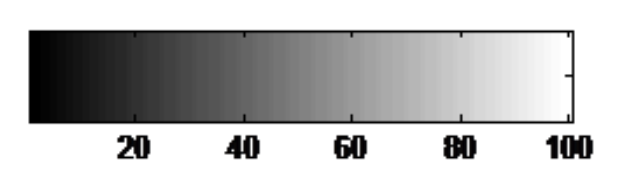
- Perceptually Linearized Greyscale
	- 
- Rainbow Colormap
	- 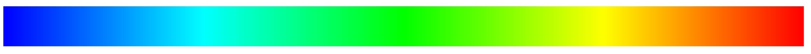
	- Most infamous colormap in visualization
		- "Cold" Colors `-->` Low Values
		- "Warm" Colors `-->` High Values
	- Studies show that this colormap is not as useful as people think it is
- Example: Implementing the Rainbow Colormap
	- 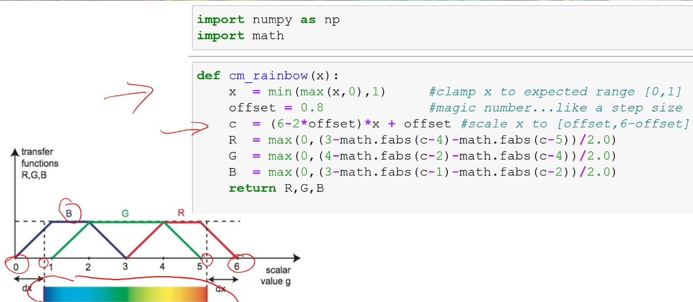
- Criticism
	- User is **conceptually** mapping a *linear* scale in hue onto a *scalar* variable
		- **Perceptually**, this scale does *not* appear linear
		- Equal steps in the scale do not correspond to equal steps in color
		- Colors appear to change *much* faster in the yellow region than the green region
	- This gives the impression that the data is organized into discrete regions
		- This can lead the user to infer structure which is not present in the data
		- This may also lead to people missing details that lie completely within a single color region
	- Rainbow colormaps are sensitive to deficiencies in vision
		- Roughly 5% of the population has deficiencies in distinguishing these colors
- Alternatives to the Rainbow
	- 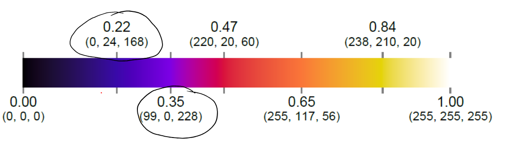
	- Perceptually Linear Colormap
		- Change in the underlying metric is matched by a similar perceptual change in color
	- [Analysis by Kenneth Moreland](https://www.kennethmoreland.com/color-advice/)
- Kindlmann Colormap
	- 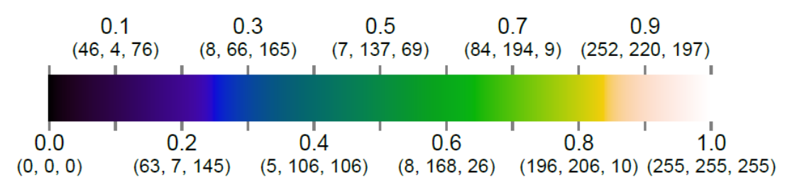
		- *Close* to perceptually linear
- Black Body Colormap
	- 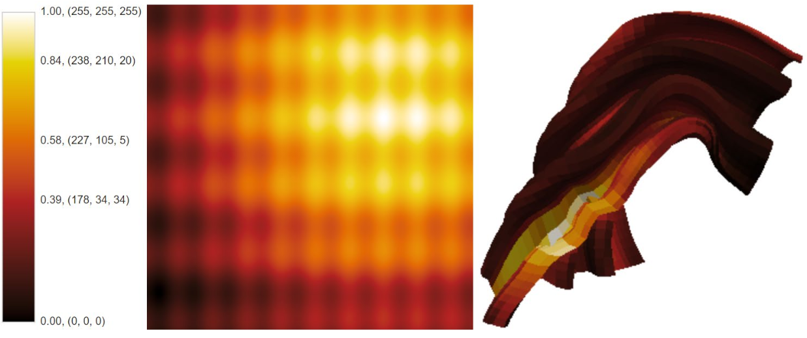
		- Based on colors from black body radiation
		- Designed to have a constant increase in brightness throughout
- Diverging Colormap
	- 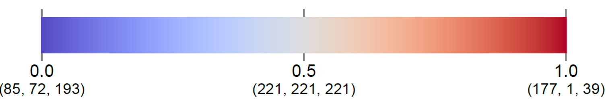
	- Underlying data can inform your choice
		- Is there a critical value the viewer should be aware of?
		- A **diverging colormap** would be appropriate
	- Change in lightness and possibly saturation of two different colors that meet in the middle at an *unsaturated* color
		- Should be used when information being plotted has a critical *middle* value, such as topography or when the data deviates around zero
- Colormaps for 3D Surfaces
	- Ideally, colormaps should use changes in luminance to display changes in value
		- In 3D scenes, shading cues are vital to understanding shapes
	- We need to find a way to avoid colormaps and shading from interfering with one another
		- To achieve this, we limit the colormap to bright colors only, thereby reducing the total range of brightness in the colormap
	- 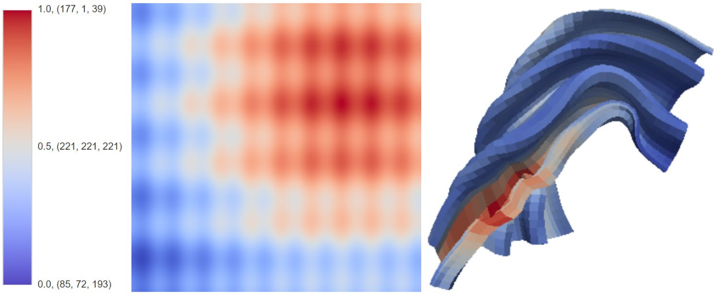
- Keyed Lookup Tasks
	- Keyed Lookup
		- User wants to estimate specific data values from color
	- Some colormaps are better than others for this particular task
		- Banded colormaps like the rainbow colormap *are* technically better than linear maps such as greyscale
			- Rainbow colormaps are still bad
	- 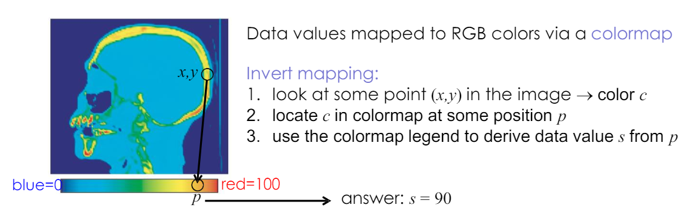
	- Contours will also help with estimating the specific value
- Prefer Interpolating Values to Interpolating Colors
	- You should apply to colormap per- pixel, as it will achieve better results than per- vertex colormap
	- 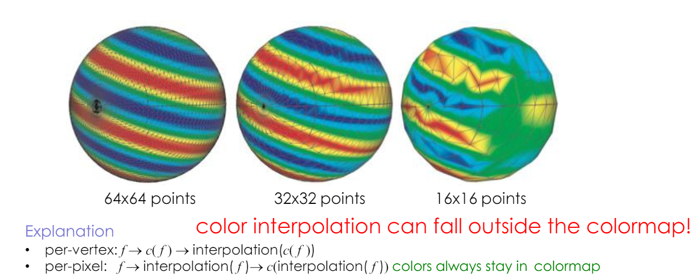
- Colormap Design Advice
	- Design for accessibility
		- Minimally, don't depend on red- green differentiation
	- Use your knowledge of the dataset 
		- "Is there a critical value?"
		- "Is there a standard in the field audiences are expecting?"
	- Often, a perceptually uniform colormap is the best choice
		- Equal steps in data are perceived as equal steps in the color space
	- Humans perceive changes in **lightness** as changes in the data pretty well
		- Not so much with changes in **hue**
	- Use colormaps with monotonically increasing lightness