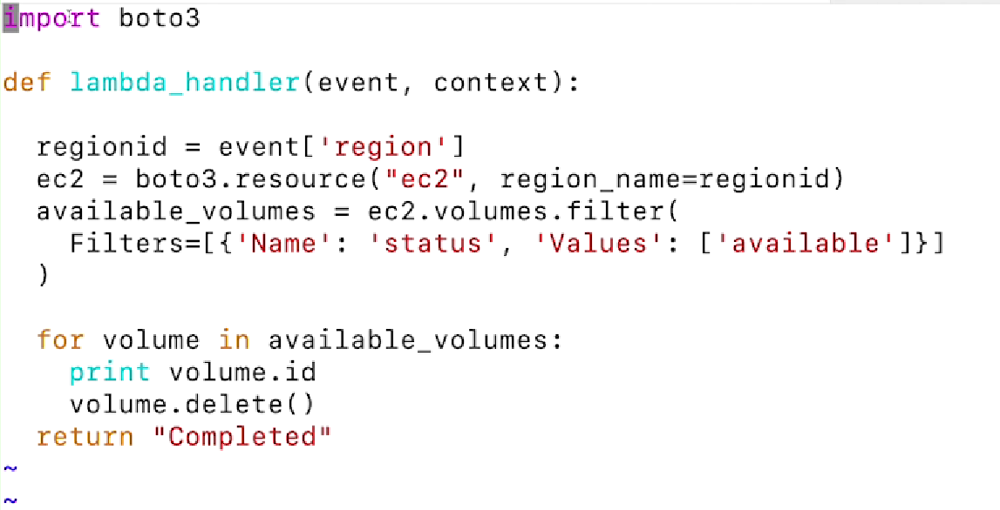
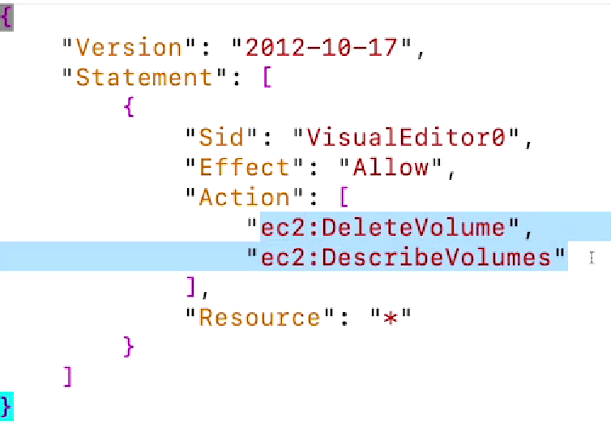

#cloud_computing #aws 

## Modules (Relevant only to [CS498W3Notes](../../Coursera/CS498-%20Cloud%20Computing%20Applications/W3/CS498W3Notes.md) and MP3)

- Note:
	- Only lessons & modules pertaining to MP3 of CS498 CCA were utilized.
	- Additional supplements for AWS Cognito and [AWS Lex](../Building%20Bots%20with%20Amazon%20Lex/README.md) needed as it is not covered in this course.
- Table of Contents:
	- Lesson 11: Other Compute Services (Lambda)
	- Lesson 15: AWS NoSQL Database Services (DynamoDB)
	- Lesson 18: Other High Availability Options (API Gateway)

## Lesson 11: Other Compute Services

### Module 11.1: AWS Lambda

- Lambda Basics
	- Region Scope
	- Serverless Functions
	- Supported Runtimes
	- Custom Runtimes
- Lambda Features
	- Triggers
		- Ability to invoke a function based on an event, action or time schedule
	- Concurrency
		- When you have multiple triggers running at the same time, they can invoke multiple parallel copies
		- This gives it the ability to scale in relation to the load
		- Can configure the number of functions that can be invoked concurrently
	- Automated Scaling
		- When compared to EC2 or container- based scaling, the scaling features offered by Lambda is is very quick
	- VPC Connectivity
		- Does need to have a specific endpoint as it will timeout after 15 minutes
- Lambda Runtimes
	- Supported Languages
		- e.g. Node.js, Python, Ruby, Java
	- Custom
- Lambda Resource Creation
	- Required
		- Function Code
		- Permissions
			- Lambda function will create one off of a default template for you if one is not specified
			- This is an IAM role that can be unique per function
		- Compute Resources
	- Optional
		- Triggers
			- Functions can be invoked through the AWS CLI, not just through triggers
		- Tags
		- Network (Placing)
		- Debugging/ Error Handling
		- Concurrency

### Module 11.2: Deploy a Lambda Function (Console)

- Demo
	- 
		- The Lambda function (based on a region), describe the volumes for EBS that are in that region that have a status of "available" and delete them.
			- Note that Python isn't explicitly defined in the Python file itself and the entire function is wrapped in a handler, which is required by Lambda.
		- In order for a Lambda function to execute the above code, we need permissions.
			- 
				- Ability to describe and delete volumes with a resource of "\*" is given within the permissions ```lambda_permission.json```.
				- If a volume is attached to an instance, any "delete" will automatically fail.
					- Create a policy directly from the code
						- Go to IAM in the AWS Console
						- Under "Policies", click "Create"
						- Paste the JSON instead of the Visual Editor
						- Skip tags, go to "Review"
						- Name the policy and create
					- **<span style="background:#fff88f">In this demo, we will not associate the created policy directly with the function created afterwards.</span>**
						- Create the function --> Function will create an IAM role unique to the function --> Attach above policy to the role.
						- When you create the Lambda function, under "Change default execution role", allow AWS to create a new role with basic Lambda permissions.
						- Once the Lambda function has been created, replace the placeholder code with the ```lambda_function.py``` file shown above.
						- Save and deploy changes.
					- Under "Configurations", you can adjust the timeout to 10 seconds.
						- You will also see the name of the unique role that has been created for the Lambda function.
						- In "IAM" --> "Roles", search for the unique role and attach policies.
						- Attach the policy created above.

## Lesson 15: AWS NoSQL Database Services

### Module 15.1: Amazon DynamoDB Basics

- DynamoDB Basics
	- Region Scoped
	- Managed NoSQL
	- Designed for Key/ Value Data
	- Serverless
- DynamoDB Data Durability
	- Data written into a DynamoDB is spread across multiple AZ
	- Any table can sustain the entire loss of one AZ
- DynamoDB SLA (Service Level Agreement)
	- For each region, the service API endpoint is designed for ~ 99.99% availability
	- If you extend the table to become a global table, the global table increases the availability to ~ 99.999% availability
	- This demonstrates how the SLA for the service API and for the individual resources in the service are the same number.
	- This is different from other services, which have separate SLAs for the services and SLAs for the resources themselves.

### Module 15.2: Amazon DynamoDB Features

- DynamoDB Features
	- ACID Support
		- Atomicity, Consistency, Isolation, Duration (ACID)
		- Strongly consistent writes or updates to the table achieve the ACID support through the use of transactions
	- GSI (Global Secondary Indexes)/ LSI (Local Secondary Indexes)
		- Enhances performances of the table
	- DAX (DynamoDB Accelerator)
		- Can be used as an in- memory cache fronting the table
	- Global Tables
		- Can extend the table to include one or more regions
		- Each region has a unique write endpoint 
			- Any changes to any region are replicated/ reflected upon other regions
	- DynamoDB Streams
		- Treated as a transaction log that prevents the need to scan the table over and over
		- Will not affect the provisioned performance of the table since it is separate 
	- Provisioned Capacity
	- Auto Scaling

### Module 15.3: Deploy a DynamoDB Table (Console)

- Demo
	- Go to "DynamoDB" in the AWS Console
	- Click "Create Table"
		- Name the table
		- Every table in DynamoDB requires a partition key
			- e.g. "username" in String format since it exhibits high cardinality (large range of values with a relatively even distribution)
			- Since usernames are presumed to be unique, a sort key is not required
		- Choose a table class between "DynamoDB Standard" and "DynamoDB Standard-IA (Infrequent Access)"
		- Under "Read/ Write Capacity Settings", you have the option of provisioning the table or allowing it to be on- demand
			- If provisioning is selected, you can also allow it to be scaled
			- If auto scaling is off, provisioned capacity is static
			- If auto scaling is on, a minimum & maximum capacity units can be configured as well as a target utilization
			- On- demand will simply allow AWS to make the choice of scaling according to the load
		- The data *in* the table will cost you, but the table itself does not cost anything
	- Table can be created and launched similar to an EC2 instance

### Module 15.4: DynamoDB Table Resilience (Console)

- Demo

## Lesson 18: Other High Availability Options

### Module 18.1: API Gateway

- 