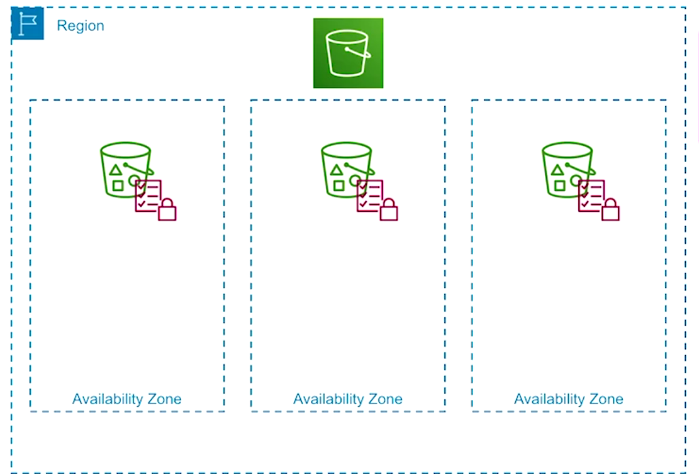

#cloud_computing #aws 

## Modules (Relevant only to [CS498W7Notes](../../Coursera/CS498-%20Cloud%20Computing%20Applications/W7/CS498W7Notes.md) and MP6)

- Note:
	- Only lessons & modules pertaining to MP6 of CS498 CCA were utilized.
	- Additional supplements for AWS ElastiCache needed as it is not covered in this course
- Table of Contents:
	- Lesson 13: Amazon S3
	- Lesson 14: Amazon RDS and Aurora

## Lesson 13: Amazon S3

### Module 13.1: Amazon S3 Basics

- S3 Basics
	- Simple Storage Service
	- Region Scoped
	- Object Storage
		- Buckets
		- Objects
	- Designed for Durability
		- Can only overwrite preexisting data, can't edit objects in line
		- WORM (Write Once, Read Many)
- S3 Storage Architecture
	- 
	- Object that's being stored on S3 consists of data & metadata and is replicated in multiple AZ's within the same region
- Storage Classes
	- S3 is efficient from a cost perspective because it offers a number of different storage classes
	- Types
		- Standard
			- Highest availability (uptime)
			- 3+ AZ's
			- Milliseconds to access first byte
			- No minimum time for object to exist in storage class
		- Standard Infrequent Access (S3IA)
			- High availability (uptime)
			- 3+ AZ's
			- Milliseconds to access first byte
			- Minimum of 30 days required
			- Cheaper than standard
		- One Zone Infrequent Access (Z-IA)
			- High availability
			- 1 AZ
			- Milliseconds to access first byte
			- Minimum of 30 days required
			- Cheaper than S3IA
		- Glacier Instant Retrieval
			- High availability
			- 3+ AZ's
			- Low latency (higher than S3 classes)
			- Minimum of 90 days required
		- Glacier Flexible Retrieval
			- Highest availability
			- 3+ AZ's
			- Minutes ~ Hours
			- Minimum of 90 days required
		- Glacier Deep Archive
			- High availability
			- 3+ AZ's 
			- Hours
			- Minimum of 180 days required
	- Cost to *store* data decreases, but cost to *access* data increases
	- S3 Intelligent Tiering
		- Moves objects to cost- optimized tier according to access patterns as long as moving it is cost effective
		- Includes:
			- Standard
			- S3IA
			- Glacier Instant Retrieval
			- Glacier Deep Archive

### Module 13.2: Amazon S3 Features

- S3 Security Features
	- Bucket Policy
		- Resource- based access control
	- Block Public Access
	- Bucket/ Object ACLs (Access Control List)
	- Object Encryption
- S3 Object Management Features
	- Lifecycle Rules
	- S3 Versioning 
	- Replication
- S3 Lifecycle Rules: Options
	- Transition current versions
		- Can also transition into other storage classes, only left to right not right to left
	- Transition previous versions
	- Expire current versions
	- Delete expired delete markers
	- Delete incomplete multi- part uploads
- S3 Versioning
	- Default is un- versioned
		- Once versioning is enabled, you can suspend versioning, which stops new versions from being created
		- Cannot return back to un- versioned state once versioned
	- Version enabled buckets will attach a version ID to each version of an object
	- Deleting an object will attach a delete marker to object, it won't actually delete the data associated with the object
	- Versioning is necessary for preventing accidental deletions
- Glacier Vault Lock
	- Permission Policy
		- Glacier vaults provide a policy similar to S3's bucket policy, it also has a secondary policy called a vault log
			- Used to *deny* deletes
			- Enforce lifecycle rules
			- Have 24 hours to verify, once verification has been complete it will be locked forever
- S3 Object URLs
	- Data is private by default
	- Static website option
	- Redirect option
	- Pre- signed URLs
- Static Website Hosting Basics
	- Bucket name **must** match DNS CNAME
	- Configure index document
	- Configure error pages
	- Configure redirects
	- Configure access logs
	- **No custom TLS**

### Module 13.3: S3 Bucket Creation (Console)

- Demo
	- Click "Create bucket"
	- Name bucket
	- Choose AWS region (e.g. us-east-1)
	- For most use cases, you can disable ACLs
		- **Disable for MP6**
	- Block all public access
	- Turn off bucket versioning
	- Choose encryption type
	- Disable object lock
		- **Need to overwrite objects for the purposes of MP6**

### Module 13.5: S3 Permissions (Console)

- Demo
	- Block Public Access
		- In "Buckets", choose your bucket and click "Permissions"
	- These settings are the same settings you see when you first create the bucket
		- Need to modify permissions so that you can create a custom bucket policy, will need to re- check the button in block public access afterwards 

## Lesson 14: Amazon RDS and Aurora 

### Module 14.1: Introduction to Databases in AWS

- AWS Database Services
	- Relational Database Services
		- Redshift (Data Warehouse Service)
		- Aurora (Transactional RDS)
		- RDS (Transactional RDS)
	- NoSQL Database Services
		- KeySpaces (Key/ Value NoSQL Service)
			- Apache Cassandra
			- Wide value, key/ value store
		- DynamoDB (Key/ Value NoSQL Service)
			- Small values under 400K
		- Neptune (Graph NoSQL Service)
		- DocumentDB (Document NoSQL Service)
		- Timestream (Time Series NoSQL Service)
		- ElastiCache (In- Memory NoSQL Service)
			- Memcached, which is volatile but highly performing memory cache
			- Redis, which makes all writes pass through the same entry point

### Module 14.2: Amazon RDS Basics

- RDS Basics
	- Relational Database Service
	- AZ Scoped
	- Third- party database engines
	- Platform is almost entirely managed by AWS
- RDS Engines
	- MySQL
	- Microsoft SQL Server
	- Oracle DB
	- PostgreSQL
	- MariaDB
	- Custom
		- Oracle/ SQL Server but AWS allows access to underlying OS

### Module 14.3: Amazon RDS Features

- RDS Instance Replacement
	- If a single underlying RDS instance becomes unavailable, AWS will replace it
- RDS Multi- AZ Failover
	- Multi- AZ provisions 2 database instances in an active/ passive infrastructure with automated failover
	- This reduces the amount of time needed for the RDS instance to be replaced
- RDS Automated Backup
	- Backup
		- Up to 35 day retention
		- Retrained for retention period after DB is deleted
		- Backups contain databases and transaction logs
	- Restore
		- Restores to any second in the retention period
		- Creates new DB instance
- RDS Manual Snapshot
	- Backup
		- Kept until deleted
		- Retained after DB is deleted
		- Shared with remote account
	- Restore
		- Restores to snapshot time only
		- Creates a new DB instance
		- Restores encrypted DB snapshot cross- account directly
		- Encrypted DB cluster snapshot cross- account requires a copy first
- RDS Snapshot Export to S3
	- Backup
		- MariaDB 
		- MySQL
		- PostgreSQL
	- Restore
		- Restores to data export time
		- Does **not** require creating a new DB instance for restoration
- RDS Instance Resizing
	- Vertical
		- Storage can be resized on demand or automatically based on disk usage (auto scaling)
- RDS Read Replicas
	- Horizontal
		- RDS supports asynchronous replicas in the same region or in a remote region
- RDS Network Security
	- VPC security features are available to you and enable increased RDS database security
- RDS Encryption in Transit
	- Database instances support TLS by default and can be enforced via GRANTs
- RDS Encryption at Rest
	- RDS storage encryption uses EBS's volume encryption and can be enabled at the provisioning step
- CloudWatch Metrics/ Alarms
	- All metrics are gathered from the hypervisor or software perspective
		- CPU & Memory
		- Disk Metrics
		- Network Traffic
		- DB Connections
	- These metrics can be compiled into a CloudWatch dashboard or sent to be created as SNS topics 
- Enhanced Monitoring
	- Fine- grained, real- time metrics are gathered from the OS perspective and are stored in CloudWatch logs
	- OS metrics are different for SQL server instances than for other engines
- Database Logs
	- Can stream the logs to CloudWatch logs directly for easier viewing and integration with CloudWatch
	- Each database engine has its own logs and some CloudWatch log streams may be enable by default

### Module 14.4: Deploy RDS Database (Console)

- Demo
	- Need to create a subnet group first prior to creating a RDS database
	- Create a subnet group and associate subnet group with a VPC
		- Default VPC has more than 1 AZ, you need more than 1 for Aurora
		- **Pertains to MP6**
	- Create the database
		- "Standard Create"
		- Choose engine type
		- Choose template (e.g. Free tier)
			- **Check MP6 requirements**
		- Choose DB instance class
			- ARM64 Graviton processors recommended if available (e.g. `m6g.large`)
		- Choose storage type and enable storage autoscaling
		- Choose VPC and subnet group
		- Configure public access
		- Choose security group
		- Choose starting AZ
		- Select database authentication options

### Module 14.6: Amazon Aurora Features

- Aurora Basics
	- AZ Scoped Endpoints
	- Region Scoped Endpoints
	- Feature for enabling 2 write endpoints
	- Serverless Option
	- Global DB Option
- Aurora Engines
	- MySQL
	- PostgreSQL
- Aurora Storage Architecture
	- Aurora uses six 10GB blocks called protection groups
	- Data in each protection group is replicated 6 times in 3 different AZ's
	- Data is continuously backed up to S3 for eleven 9's of durability
	- Writes require 4 out of 6 storage nodes to ack (acknowledge)
	- Reads find closest storage node for performance optimization (same AZ)
	- Scaling is performed by provisioning more protection groups
- Aurora Serverless Architecture
	- When clients connect directly to the DB, horizontal scaling is difficult
	- Aurora Serverless allows you to specify (up to 488 GB) aggregate memory
	- Changes endpoint to a proxy for database capacity pool
	- Capacity pool scales according to load by adding discrete units
- Aurora Failover Conditions
	- Aurora has no concept of multiple AZ's, only readers and writers
	- Replicas
		- If the writer fails, AWS does a DNS cutover to a reader instance
			- Failover with existing replica flips DNS CNAME 
		- If multiple replicas are present, customer can set replica priority and promotion tiers
	- Aurora Serverless
		- Failover results in Aurora Serverless launching a replacement in a new AZ
	- Neither (No Replicas, No Aurora Serverless)
		- Aurora attempts to create a new DB instance in the same AZ as the primary DB on a best- effort basis
