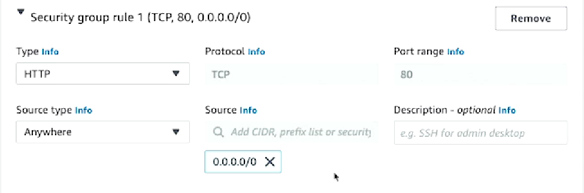

#cloud_computing #aws

# [Amazon Web Services (AWS), 3rd Edition](https://learning.oreilly.com/course/amazon-web-services/9780137928521/)

## Overview

Amazon Web Services (AWS) LiveLessons is a full-featured video course meant to teach you AWS from the ground up. With over 18 hours of video training, this in-depth course uses foundational training, hands-on demos, and thorough analysis to first introduce you to Amazon’s many AWS services and then provide in-depth examples for how to use those services. This title is a great way to start your AWS journey.

Amazon Web Services (AWS) LiveLessons starts with an overview of AWS, including AWS compute services, AWS database services, AWS Analytics services, and AWS monitoring and automation services among others and going in depth about the basics, concepts, practices, and theories of AWS to become a full-fledged AWS practitioner. The course also covers the prerequisites and skills required to be a successful candidate for AWS certification exams, including AWS Cloud Practitioner and AWS Solutions Architect exams.

This all-new video course is taught by experienced trainer Chad Smith and is full of hands-on demonstrations using both the AWS Console and the AWS Command Line Interface (CLI), giving you the opportunity to test out the skills and practice your knowledge as you work your way through the course.

## Instructor

- [Chad Smith](https://www.linkedin.com/in/chadsmith1973/)

## Modules (Relevant only to [W2Notes](../../Coursera/CS498-%20Cloud%20Computing%20Applications/W2/W2Notes.md) and MP2)

- Note:
	- Only lessons & modules pertaining to MP2 of CS498 CCA were utilized.
- Table of Contents:
	- Lesson 9: AWS Elastic Compute Cloud (EC2)
	- Lesson 16: Elastic Load Balancing  --> **Relevant to Section 1 of MP2**
	- Lesson 17: EC2 Auto Scaling --> **Relevant to Section 2 of MP2**
	- Lesson 24: AWS CloudWatch

## Lesson 9: AWS Elastic Compute Cloud (EC2)

### Module 9.1: Introduction to Computing in AWS

- EC2
	- Virtual Machines
- ECS & EKS
	- Docker and/ or Windows Containers
- Lambda
	- Serverless Functions
- Batch
	- Batch Container Processes
- Beanstalk & LightSail
	- Website Platforms

### Module 9.2: AWS EC2 Basics

- Elastic Compute Cloud
	- Numeronym
	- AZ Scope
	- Virtual Machines
	- Flexibility
		- Resources
		- OS
		- Cost
- EC2 Resources: Processor & Memory
	- CPU Architecture
		- Flexible choices of processor, architecture and generation. 
	- vCPU is roughly equivalent to a thread on a processor core.
		- Higher numbers equate to more computing capacity.
		- Choosing architectures with more vCPU also raises the memory ceiling.
- EC2 Resources: Storage
	- Elastic Block Store (EBS)
		- Reached via network instead of hardware, but presented as a local block storage (not a NAS).
		- Primary OS volume and data storage located here.
- EC2 Resources: Network
	- A primary network interface is given when you launch an EC2 instance.
- EC2 Instance Properties
	- Required
		- Block Device(s)
		- Image ID
		- Instance Type
		- Security Group(s)
		- Subnet
		- Network Interface(s)
	- Optional
		- Keypair
		- User Data
		- Instance Profile
		- Acceleration
		- Tags

### Module 9.3: Amazon Machine Images (AMIs)

- Amazon Machine Image
	- Region Scope
	- 1+ EBS Snapshots
	- Launch Permissions
	- Block device mappings for non- root volumes
- AMI Sources
	- Community
	- Marketplace
	- Personal/ Shared
- AMI Creation
	- From an existing EC2 instance
		- AWS Console
		- CLI
		- SDK
		- AWS Backup
	- Customize via bootstraping
		- EC2 Image Builder
		- Packer

### Module 9.4: EC2 Key Pairs

- Key Pair 
	- Region Scope
	- Public and Private Keys
		- RSA or ED25519
- Key Pair Usage (Linux)
	- SSH to specific privileged user
	- Can create in AWS
	- Can create locally and upload
- Key Pair Usage (Windows)
	- Use to decrypt the administrator password
	- RSA only for Windows

### Module 9.5: Creating Key Pairs (Console)

- Demo
	- "Key Pairs" under "Network & Security" in AWS EC2 management dashboard.
	- **RSA for Windows**
		- Private Key Format
			- ".pem" for OpenSSH
			- **".ppk" for PuTTY**

### Module 9.7: EC2 Metadata and User Data

- Instance Metadata
	- Dedicated IP Address
		- 169.254.169.254
	- Instance Properties
	- Visible from guest OS
	- Share bootstrap customization via user data script
- Types
	- V1 vs. V2
		- V1 does not require token access, making it less secure.
		- V2 is more secure as a result in comparison.
- User Data
	- Custom parameters to the guest OS
	- Linux/ PowerShell Script
	- Executed once upon instance launch
	- Supports Cloud Init directives (Linux Only)

### Module 9.8: Launching EC2 Instances (Console)

- Demo
	- Can launch instances in "Instances" tab in EC2 dashboard or on dashboard main page.
	- Name the instance.
	- Choose the AMI (e.g. AMI Linux).
	- Choose the architecture (e.g. 64 bit x86).
	- Choose the instance type (e.g. t2.micro).
	- Choose the key pair.
		- **RSA only for Windows**
	- Network Settings (**Check MP2 instructions**)
		- By default, your instance will be placed in the default VPC.
		- Uncheck "Allow SSH from anywhere".
		- Choose a VPC.
		- Choose a subnet.
		- Firewall
			- Create a security group.
			- Add a security group rule.
	- Configure storage.
	- Launch instance.
	- View instance.

### Module 9.10: EC2 Operations

- Shared Responsibility Model
	- User owns the AWS EC2 instance and is responsible for the OS tasks.
	- Therefore, an AWS administrator cannot just access your EC2 instance and debug things for you, it is your responsibility.
- EC2 OS Tasks
	- User account maintenance
	- Disk space maintenance
	- Software package maintenance
	- Security/ OS updates
- EC2 Resource Management
	- Instance resize
	- Instance recovery
	- Add/ remove EBS storage
	- Add/ remove network interface

### Module 9.11: EC2 Operations (Console)

- Demo
	- Upsizing the instance
		- Stop instance
			- Note that if you use an instance store volumes (attached to hardware), you will lose that ephemeral data.
		- Change instance type
			- "Actions" --> "Instance Settings" --> "Change Instance Type"
			- You cannot change CPU architectures when you do a resize
		- Start instance

## Lesson 16: Elastic Load Balancing

### Module 16.1: Elastic Load Balancer Basics

- Traditional 3 Tier Architecture
	- Web Tier (ELB works here)
	- Application Tier
	- Database Tier
- Elastic Load Balancer Basics
	- AZ Scoped
	- Multi- AZ Support
	- Managed load balancing service
	- Distribute traffic to backend services
- Load Balancer Architecture
	- e.g. Client Resource --> Load Balancer --> EC2 Instances
- Health Check
	- To determine if backend resources are functional, we need to do health checks.
	- Network Load Balancer (NLB)
		- Only supports TCP health checks.
		- TCP ping to check if listener is running.
	- Application Load Balancer (ALB)
		- Supports both HTTP (unencrypted transport health checks) and HTTPS (encrypted with TLS).
	- Gateway Load Balancer (GWLB)
		- Only supports Geneve health checks.

### Module 16.2: Application Load Balancer

- ALB Basics
	- Located at Layer 7 of the OSI Model (Application Layer)
	- Accepts inbound traffic
	- Internet- facing or internal only
	- Can accept multiple TLS certifications
	- Path based routing
	- Redirect support (301/ 302)
	- Web Application Firewall (WAF) support
- ALB Use Cases
	- Stateless web applications
	- Stateful application servers
		- *Does* support stickiness
	- Anything using HTTP or HTTPS
- TLS Certificate Smart Selection
- ALB Listener Rules
	- Condition Type
		- Host Header
		- HTTP Header
		- Path Pattern
	- Action Types
		- Return a static response
		- Authenticate against AWS Cognito
		- Authenticate against OIDC compatible identity provider
		- Issue a 301 or 302
		- Forward to a target group
		- Forward to multiple *weighted* target groups

### Module 16.3: Deploy an ALB (Console)

- Demo
	- Go to EC2 instance management dashboard
	- Go to "Load Balancing" tab and click "Load Balancers"
	- "Create Load Balancer"
	- Choose load balancer type
		- "Application Load Balancer" for this demo
	- Name the load balancer
	- Select VPC
	- Mappings
		- You can launch to all 6 if you want
	- Listeners & Routing
		- Difference between CLI and console appears here since you can create a listener with no restrictions in the CLI
	- Create target group
		- Create empty target group if not created yet
		- Specify protocol and port
		- You can specify the success code (e.g. 404 can be specified as a "success" when you just issue a / command)
	- Select target group
	- Create load balancer

### Module 16.5: Network Load Balancer

- Network Load Balancer Basics
	- Located at Layer 4 of the OSI Model (TCP and UDP)
	- Accepts inbound traffic
	- Internet- facing or internal only
	- Can accept 1 TLS certification only
	- TCP and UDP
	- No security group (straight pass through)
- NLB Use Cases
	- Non- web application (TCP socket)
	- TCP/ UDP combo listeners
	- High performance
	- Low latency
- NLB Listener Protocol Configuration
	- Array of different listener protocols, but will limit the backend type that you can choose.
		- Example:
			- TCP --> EC2 instances or IP
			- TLS --> EC2 instances or IP
			- UDP --> EC2 instances ONLY
			- TCP_UDP --> EC2 instances ONLY
		- TCP listener protocol is the only true end to end encryption listed above.

### Module 16.6: Gateway Load Balancer

-  Gateway Load Balancer Basics
	- Located at Layer 3 of the OSI Model (IP Layer)
	- No listeners
	- Forward entire traffic to load balancer
	- Outbound traffic
	- Geneve protocol
	- Offerings for:
		- Deploying, managing & scaling virtual appliances
- GWLB Use Cases
	- Outbound web proxy
	- Data Loss Prevention (DLP)
	- Network intrusion 
	- Network prevention
	- Deep packet inspection
- GWLB Architecture
	- Aggregates outbound traffic to an auto scaling group and delivers it to the final destination

## Lesson 17: EC2 Auto Scaling

### Module 17.1: Auto Scaling Basics

- Auto Scaling Basics
	- AZ Scoped
	- Multi- AZ Support
	- Horizontal EC2 Scaling
- What Is Horizontal Scaling?
	- Vertical Scaling
		- Adding or removing resources from a EC2 instance (eg. resizing), which will cause an outage.
	- Horizontal Scaling
		- Adding or removing discrete instances because they're all performing similar tasks.
			- Adding EC2 resources into the fleet, scaling capacity to match load (reducing to tolerant level).
			- Removing EC2 instances from the fleet, scaling capacity to match load (cost optimization).
- Scaling Plan
	- Scaling Strategy
		- Availability - Cost Optimization Problem
	- Customer
		- Implements rules and limits for scaling EC2 resources.
	- AWS
		- Combines dynamic and predictive scaling.
- Auto Scaling Architecture
	- L:aunch Template
		- Set of default values to launch EC2 instances
	- Scaling Policies
		- Defines when to scale according to metrics
	- Scheduled Actions
		- Defines when to scale according to time

### Module 17.2: Auto Scaling Features

- Auto Scaling Types
	- Dynamic
		- Scales when traffic hits a threshold.
	- Predictive
		- Builds a machine learning model of your traffic over time and learn when your regular spikes happen.
		- Scales in advance.
- Auto Scaling Group Flexibility
	- Attribute- based instance type selection
		- Architecture types
		- vCPU count
		- Minimum memory
		- Instance generation
	- Multiple Purchase Options
		- Multiple launch templates
		- Prioritize savings plans
		- On- demand and spot (cost optimization)
		- Capacity rebalancing
	- Multiple AZ
	- "Warm Pools"
		- Decrease response time to traffic spikes.
	- Scale- In Protection
		- Reduce impact of misconfigured health checks.
	- Lifecycle Hooks
		- Allow for manual actions required for scaling.
- Auto Scaling Use Cases
	- Stateless web appliccations
	- Unpredictable traffic
	- Steady state groups
	- Message consumer apps
- Auto Scaling Anti- Use Cases
	- Singleton instances
	- Applications with fixed IP
	- Applications with many manual deploy steps
	- Applications with short, large, random traffic spikes

### Module 17.3: Deploy an Auto Scaling Group (Console)

- Demo
	- Navigate to EC2 management dashboard
	- In the "Auto Scaling" section, click "Auto Scaling Groups"
	- "Create Auto Scaling Group"
	- Name the auto scaling group
	- Create a launch template
		- Name launch template
		- Description --> "initial"
		- Leave "Auto Scaling Guidance" **on**
		- Choose AMI & architecture
			- Choosing Arm architecture allows you to choose Graviton processor instances (end with letter G), which are cost effective and cost up to 80% less power than Intel processor instances.
		- Choose key pair
		- Create security group
			- **Allow inbound port 80**
			- 
		-  In "User Data" you can put a Bash script to automatically install dependencies.
	- Launch the launch template
	- Specify other auto scaling group factors
	- Deal with load balancing
		- Check if EC2 instance is available using health checks
	- Specify group size
	- Configure scaling policies
	- Review auto scaling group information
	- Create and launch the auto scaling group

## Lesson 24: AWS CloudWatch

### Module 24.1: CloudWatch Basics

- X

### Module 24.2: CloudWatch Features

- X

### Module 24.3: CloudWatch Metrics (Console)

- Demo

### Module 24.5: CloudWatch Logs Insights (Console)

- Demo

### Module 24.6: CloudWatch Logs Metric Filters (Console)

- X
