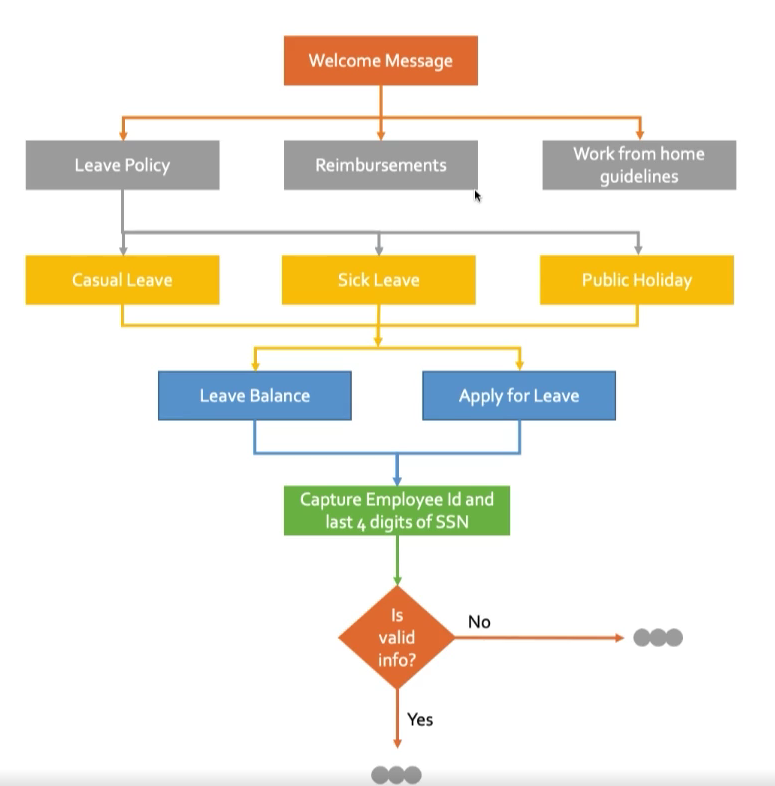

#cloud_computing #aws 

## Modules (Relevant only to [CS498W3Notes](../../Coursera/CS498-%20Cloud%20Computing%20Applications/W3/CS498W3Notes.md) and MP3)

- Note:
	- Additional supplement for AWS Lex.
- Table of Contents:
	- Part 1: Analyze, Design, Develop, Test and Deploy Bots
	- Part 2: Applying Chatbot Concepts
	- Part 3: Extending Chatbot Functionality

## Part 1: Analyze, Design, Develop, Test and Deploy Bots

### Introduction

- What is a Chatbot?
	- AI software that can indulge in a conversation with the user in natural language
- History of Chatbots
	- 1966
		- MIT builds Eliza, a program based on pattern matching & substitution methodology 
	- 1995
		- A.L.I.C.E. (Artificial Linguistic Internet Computer Entity), a program that used heuristic pattern matching
		- Considered as the first ever online chatbot
		- Different from Eliza in that A.L.I.C.E. used Artificial Intelligence Markup Language (AIML)
	- 2001
		- SmarterChild, a product that was powered by AI
		- Precursor to Siri
	- 2010
		- Siri, a voice activated digital assistant released by Apple
	- 2012
		- Google Now, released by Google and was later replaced by Google Assistant
	- 2015
		- Cortana, a voice activated digital assistant released by Microsoft
		- Alexa, a voice activated digital assistant released by Amazon

### What is a Chatbot?

- Chatbot Components
	- User Interaction
		- Voice Input
		- Text Input
	- Text Input
		- Processed by Natural Language Understanding (NLU) component
		- Once *intent* has been determined, a dialog management component receives the intent
			- Dialog Modeling
				- Keeps track of dialog state between user and bot
			- Dialog Control
				- Helps in making decisions about the next bot action
		- Once a decision has been made, it will passed to the Natural Language Generator, which creates content in either written/ spoken language so that the user receives a response that they understand
	- Voice Input
		- Chatbots require the ability to convert speech to text, which is achieved by the Automatic Speech Recognizer (ASR) component
			- Follows the same pattern as the text input afterwards
			- After the Natural Language Generator state, the generated output is fed into a Text-to-Speech Synthesizer that is narrated back to the user
- Amazon Lex
	- Fully managed AI service with advanced natural language models to design, build, test and deploy conversational interfaces
		- v1 was released by Amazon in 2017
		- **v2 was released by Amazon in 2021**
	- Supports 10+ languages

### Use Case Details

- Example
	- Fictitious insurance company: "Company A"
	- Company A is profitable but employee satisfaction is low
		- Main reason identified is "scattered HR policies"
		- Company A decides to build a chatbot for their employees to access HR policies in an efficient manner
	- Chatbot team will take a phased approach to building the chatbot in question
		- Bot will be trained to answer queries related to leaves & vacations
	- Employees should be able to:
		- Authenticate themselves
		- Check for their leave balance
		- Apply for leaves

### Conversation Flow

- Decision tree that describes the possible list of outcomes based on events or decisions at any point in the conversation
- Visual representation of the user journey
	- Depicts different paths through which the interaction between the user and the bot can traverse
	- Build in collaboration with the business users (customers)
- 

### Conversation Flow Demo

- Demo at [Botsociety](app.botsociety.io)

### Terminology of a Chatbot

- Vocabulary
	- Intent
		- Particular goal that the user wants to achieve
	- Utterances
		- Phrases that invoke the intent
	- Prompts
		- Questions that will ask user to input data
	- Slots
		- Data the user provides to fulfill intent
	- Confirmation Prompts
		- To clarify whether the user wants to fulfill the intent
	- Fulfillment
		- Business logic required to fulfill the user intent

### Summary

- X

## Part 2: Applying Chatbot Concepts

### Introduction

- X

### Creating an Amazon Lex Bot

### Creating Intents

### Creating Utterances

### Creating Prompts, Slot & SlotTypes

### Creating Dynamic Prompts & Utterances 

### Creating Custom SlotTypes

### Creating Context

### Creating a Follow Up Intent

### Miscellaneous Settings

### Summary

- X

## Part 3: Extending Chatbot Functionality

### Introduction

- X

### Introduction to AWS Lambda

### Overview on JSON Format of Lex

### Validating & Initializing Slots

### Fulfillment in Lex

### Publishing the Bot

### Testing for Voice and Text Inputs

### Channels for Consuming the Bot

### Further Steps

### Summary

- X